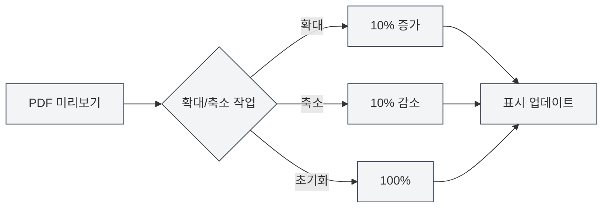

# PDF 미리보기 기능

## 개요

PDF 미리보기 기능은 LaTeX 문서를 편집하면서 컴파일된 PDF 결과를 실시간으로 확인할 수 있게 합니다. 미리보기 패널은 확대/축소, 페이지 넘기기, 위치 찾기 등 다양한 상호작용 기능을 제공하여 LaTeX 문서를 효율적으로 편집하고 디버깅할 수 있습니다.

PDF 미리보기는 LaTeX 컴파일이 성공하면 자동으로 표시되며, 코드 편집기와의 양방향 위치 찾기를 지원하여 PDF와 코드 사이를 빠르게 전환할 수 있습니다.

<PdfPreviewPanel mode="demo" pdfUrl="" />

## PDF 미리보기 소개

### 미리보기 패널

PDF 미리보기 패널은 LaTeX 편집기의 오른쪽 또는 아래쪽에 표시되며 다음을 포함합니다:

- **PDF 내용 영역**: PDF 페이지 내용을 표시합니다.
- **도구 모음**: 확대/축소, 페이지 넘기기, 새로 고침 등의 작업 버튼을 제공합니다.
- **페이지 정보**: 현재 페이지 번호와 총 페이지 수를 표시합니다.

PDF 미리보기 패널 인터페이스는 다음과 같습니다:

<PdfPreviewPanel mode="demo" pdfUrl="" />

<LaTeXCompilerPanel mode="demo" />

### 자동 표시

PDF 미리보기는 다음 상황에서 자동으로 표시됩니다:

- **컴파일 성공**: LaTeX 컴파일이 성공하면 자동으로 PDF 미리보기가 표시됩니다.
- **문서 열기**: 기존 PDF가 있는 LaTeX 문서를 열 때 자동으로 미리보기가 표시됩니다.
- **수동 열기**: 도구 모음의 "미리보기" 버튼을 클릭하여 수동으로 미리보기를 엽니다.

<PdfPreviewPanel mode="demo" pdfUrl="" />

## PDF 확대/축소

### PDF 확대

PDF 미리보기를 확대합니다:

- **도구 모음 버튼**: 도구 모음의 "확대" 버튼(+ 아이콘)을 클릭합니다.
- **마우스 휠**: `Ctrl` 키를 누른 상태에서 마우스 휠을 위로 굴립니다.
- **단축키**: `Ctrl+=` (구성된 경우)

확대할 때마다 10%씩 확대 비율이 증가합니다.

<LaTeXEditorDemo mode="demo" />

### PDF 축소

PDF 미리보기를 축소합니다:

- **도구 모음 버튼**: 도구 모음의 "축소" 버튼(- 아이콘)을 클릭합니다.
- **마우스 휠**: `Ctrl` 키를 누른 상태에서 마우스 휠을 아래로 굴립니다.
- **단축키**: `Ctrl+-` (구성된 경우)

축소할 때마다 10%씩 확대 비율이 감소합니다.

### 확대/축소 초기화

PDF 확대/축소를 100%로 초기화합니다:

- **도구 모음 버튼**: 도구 모음의 "확대/축소 초기화" 버튼을 클릭합니다.
- **단축키**: `Ctrl+0` (구성된 경우)

### 확대/축소 범위

PDF 확대/축소가 지원하는 범위:

- **최소값**: 20% (0.2배)
- **최대값**: 500% (5배)
- **기본값**: 100% (1배)

확대 비율은 유효한 범위 내에서 자동으로 제한됩니다.

<PdfPreviewPanel mode="demo" pdfUrl="" />

## PDF 새로 고침

### 수동 새로 고침

PDF 미리보기를 수동으로 새로 고침합니다:

- **도구 모음 버튼**: 도구 모음의 "새로 고침" 버튼을 클릭합니다.
- **단축키**: `F5` (구성된 경우)

새로 고침하면 PDF 파일을 다시 로드하여 최신 컴파일 결과를 표시합니다.

### 자동 새로 고침

PDF 미리보기는 다음 상황에서 자동으로 새로 고침됩니다:

- **컴파일 성공**: LaTeX 컴파일이 성공하면 자동으로 미리보기가 새로 고침됩니다.
- **PDF 파일 업데이트**: PDF 파일이 업데이트된 것을 감지하면 자동으로 새로 고침됩니다.

### 새로 고침 시점

다음 상황에서 PDF를 새로 고침하는 것이 좋습니다:

- **코드 수정 후**: LaTeX 코드를 수정하고 다시 컴파일한 후
- **미리보기 이상 시**: PDF 미리보기 표시가 이상하거나 내용이 올바르지 않을 때
- **장시간 편집 후**: 장시간 편집 후 최신 효과를 확인해야 할 때

<LaTeXEditorDemo mode="demo" />

## PDF에서 코드로 위치 찾기

### PDF에서 코드로 위치 찾기

PDF 미리보기에서 특정 위치를 클릭하면 편집기가 해당 LaTeX 코드 위치로 자동으로 이동합니다:

1. **PDF 위치 클릭**: PDF 미리보기에서 확인하려는 위치를 클릭합니다.
2. **자동 이동**: 편집기가 해당 LaTeX 코드로 자동으로 이동합니다.
3. **강조 표시**: 해당 코드 줄이 강조 표시됩니다.

이 기능을 사용하면 PDF 효과에서 소스 코드로 빠르게 위치를 찾아 디버깅과 수정을 편리하게 할 수 있습니다.

<PdfPreviewPanel mode="demo" pdfUrl="" />

### 코드에서 PDF로 위치 찾기

LaTeX 편집기에서 다음을 수행할 수 있습니다:

1. **코드 선택**: 확인하려는 LaTeX 코드를 선택합니다.
2. **마우스 오른쪽 버튼 메뉴**: 마우스 오른쪽 버튼을 클릭하고 "PDF로 위치 찾기"를 선택합니다.
3. **미리보기 이동**: PDF 미리보기가 해당 위치로 자동으로 이동합니다.

### 양방향 위치 찾기

PDF와 코드 간의 양방향 위치 찾기 기능:

- **PDF → 코드**: PDF 위치를 클릭하여 코드로 이동합니다.
- **코드 → PDF**: 코드를 선택하여 PDF 위치로 이동합니다.
- **동기화 스크롤**: PDF와 코드의 동기화 스크롤을 지원합니다.

<ConsoleTerminal mode="demo" consoleKey="demo" :history='[{"content": "PDF 페이지 탐색...", "type": "out"}]' />

## PDF 페이지 탐색

### 페이지 넘기기 작업

PDF 미리보기는 다음 페이지 넘기기 작업을 지원합니다:

- **이전 페이지**: 도구 모음의 "이전 페이지" 버튼을 클릭하거나 방향키를 사용합니다.
- **다음 페이지**: 도구 모음의 "다음 페이지" 버튼을 클릭하거나 방향키를 사용합니다.
- **페이지로 이동**: 페이지 번호 입력란에 페이지 번호를 입력하고 Enter 키를 누릅니다.

### 페이지 정보

PDF 미리보기는 다음 페이지 정보를 표시합니다:

- **현재 페이지 번호**: 현재 보고 있는 페이지 번호를 표시합니다.
- **총 페이지 수**: PDF의 총 페이지 수를 표시합니다.
- **페이지 번호 입력란**: 직접 페이지 번호를 입력하여 이동할 수 있습니다.

### 다중 페이지 표시

PDF 미리보기는 다중 페이지 표시 모드를 지원합니다:

- **단일 페이지 모드**: 한 번에 한 페이지를 표시합니다.
- **다중 페이지 모드**: 한 번에 여러 페이지를 표시합니다(홈페이지 미리보기에서).

다중 페이지 모드는 전체 문서를 빠르게 훑어보기에 적합합니다.

<PdfPreviewPanel mode="demo" pdfUrl="" />

## PDF 저장

### PDF 저장

현재 PDF 파일을 저장합니다:

- **도구 모음 버튼**: 도구 모음의 "저장" 버튼을 클릭합니다.
- **메뉴**: "파일" → "PDF 저장"을 클릭합니다.
- **단축키**: `Ctrl+S` (PDF가 현재 활성 문서인 경우)

PDF를 저장하면 PDF 파일이 문서와 같은 디렉토리에 저장됩니다.

### PDF 디렉토리 열기

PDF 파일이 있는 디렉토리를 엽니다:

- **도구 모음 버튼**: 도구 모음의 "디렉토리 열기" 버튼을 클릭합니다.
- **메뉴**: "파일" → "PDF 디렉토리 열기"를 클릭합니다.

디렉토리를 연 후 파일 관리자에서 PDF 파일을 확인하고 관리할 수 있습니다.

<LaTeXEditorDemo mode="demo" />

## PDF 상호작용 모드

### 포인터 모드

포인터 모드는 기본 상호작용 모드입니다:

- **텍스트 선택**: PDF 내의 텍스트를 선택할 수 있습니다.
- **텍스트 복사**: 선택한 텍스트를 복사할 수 있습니다.
- **클릭 위치 찾기**: PDF 위치를 클릭하여 코드로 위치를 찾을 수 있습니다.

### 손 모양 모드

손 모양 모드는 PDF를 끌어서 이동하는 데 사용됩니다:

- **PDF 끌기**: 마우스 왼쪽 버튼을 누른 상태에서 PDF 내용을 끕니다.
- **뷰 이동**: PDF 뷰 위치를 이동합니다.
- **대형 PDF에 적합**: 대형 크기의 PDF를 확인하는 데 적합합니다.

모드 전환:

- **도구 모음 버튼**: 도구 모음의 모드 전환 버튼을 클릭합니다.
- **단축키**: `H` 키로 손 모양 모드를 전환합니다.

## 사용 팁

### 효율적인 미리보기

1. **확대/축소 사용**: 내용에 따라 적절한 확대 비율을 조정합니다.
2. **위치 찾기 사용**: 위치 찾기 기능을 사용하여 코드와 PDF를 빠르게 전환합니다.
3. **새로 고침 사용**: 코드를 수정한 후 즉시 새로 고침하여 효과를 확인합니다.

### 디버깅 팁

1. **오류 위치 찾기**: PDF에서 코드로 위치를 찾아 문제 위치를 빠르게 찾습니다.
2. **효과 비교**: PDF 효과와 코드를 비교하여 형식이 올바른지 확인합니다.
3. **다중 페이지 탐색**: 다중 페이지 모드를 사용하여 전체 문서를 빠르게 훑어봅니다.

### 성능 최적화

1. **적절한 확대/축소**: 너무 큰 확대 비율을 사용하지 않습니다.
2. **미리보기 닫기**: 필요하지 않을 때는 미리보기 패널을 닫아 리소스를 절약합니다.
3. **새로 고침 전략**: 필요에 따라 자동 또는 수동 새로 고침을 선택합니다.

## 자주 묻는 질문

### Q: PDF 미리보기가 표시되지 않나요?

A: LaTeX 문서가 성공적으로 컴파일되었는지 확인하세요. 컴파일이 실패하면 PDF 미리보기가 표시되지 않습니다. 콘솔 출력의 오류 메시지를 확인하세요.

### Q: PDF 미리보기가 업데이트되지 않나요?

A: "새로 고침" 버튼을 클릭하여 미리보기를 수동으로 새로 고침하거나 LaTeX 문서를 다시 컴파일하세요. PDF 파일이 성공적으로 생성되었는지 확인하세요.

### Q: PDF에서 코드로 어떻게 위치를 찾나요?

A: PDF 미리보기에서 확인하려는 위치를 클릭하면 편집기가 해당 LaTeX 코드로 자동으로 이동합니다.

### Q: 코드에서 PDF로 어떻게 위치를 찾나요?

A: LaTeX 코드를 선택하고 마우스 오른쪽 버튼을 클릭한 후 "PDF로 위치 찾기"를 선택하면 PDF 미리보기가 해당 위치로 자동으로 이동합니다.

### Q: PDF 확대/축소가 적용되지 않나요?

A: PDF 미리보기 패널이 로드 완료되었는지 확인하세요. 문제가 지속되면 PDF 미리보기를 새로 고침해 보세요.

## 관련 문서

- [[latex.compilation|LaTeX 컴파일 및 미리보기]]
- [[latex.editor|LaTeX 편집기 사용 가이드]]
- [[latex.console|콘솔 출력]]

<LaTeXCompilerPanel mode="demo" />

<LaTeXEditorDemo mode="demo" />

<ConsoleTerminal mode="demo" consoleKey="demo" :history='[{"content": "컴파일 로그...", "type": "out"}]' />
