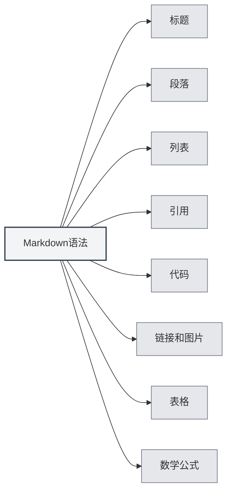

# 마크다운 문법

## 개요

마크다운은 가벼운 마크업 언어로, 읽고 쓰기 쉬운 일반 텍스트 형식으로 문서를 작성할 수 있게 해줍니다. MetaDoc은 완전한 마크다운 편집 및 미리보기 기능을 제공합니다.

<ViewMenuItemsDemo mode="demo" :items='["outline", "preview"]' />

## 기본 문법

### 제목

`#` 기호를 사용하여 제목을 생성하며, `#`의 개수는 제목의 수준을 나타냅니다:

```markdown
# 제목 1

## 제목 2

### 제목 3
```



### 단락

단락 사이는 빈 줄로 구분합니다.

### 목록

**순서 없는 목록**은 `-`, `*` 또는 `+`를 사용합니다:

```markdown
- 항목 1
- 항목 2
- 항목 3
```

**순서 있는 목록**은 숫자를 사용합니다:

```markdown
1. 첫 번째 항목
2. 두 번째 항목
3. 세 번째 항목
```

### 인용

`>`를 사용하여 인용문을 생성합니다:

```markdown
> 이것은 인용문입니다.
```

### 코드

**인라인 코드**는 백틱을 사용합니다:

```markdown
`console.log()`를 사용하여 내용을 출력합니다.
```

**코드 블록**은 세 개의 백틱을 사용합니다:

````markdown
```javascript
function hello() {
  console.log('Hello, World!')
}
```
````

### 링크와 이미지

**링크**:

```markdown
[링크 텍스트](https://example.com)
```

**이미지**:

```markdown

```

### 표

```markdown
| 열1   | 열2   | 열3   |
| ----- | ----- | ----- |
| 데이터1 | 데이터2 | 데이터3 |
```

## 수학 공식

### 인라인 공식

`$`로 감쌉니다:

```markdown
이것은 인라인 공식입니다: $E = mc^2$
```

### 블록 수준 공식

`$$`로 감쌉니다:

```markdown
$$
\int_{-\infty}^{\infty} e^{-x^2} dx = \sqrt{\pi}
$$
```

## 고급 기능

### LaTeX 공식 변환

MetaDoc은 마크다운 내의 수학 공식을 LaTeX 형식으로 변환하는 것을 지원합니다. 자세한 내용은 [[latex.basics|LaTeX 문법]]을 참조하세요.

### 차트 지원

MetaDoc은 다양한 차트 형식을 지원합니다:

- [[charts.mermaid|Mermaid 차트]]
- [[charts.plantuml|PlantUML 차트]]
- [[charts.echarts|ECharts 차트]]

## 관련 문서

- [[markdown.editor|마크다운 에디터 사용 가이드]]
- [[markdown.advanced|마크다운 고급 기능]]
- [[markdown.features|마크다운 에디터 기능]]
- [[core.editor-basics|에디터 기본 조작]]

<LaTeXEditorDemo mode="demo" />

<Outline mode="demo" />

<ViewMenuItemsDemo mode="demo" :items='["outline"]' />

<MenuItemsDemo mode="demo" :items='[{"id": "file", "items": ["new", "open", "save"]}]' />

<TitleMenu mode="demo" title="Markdown 문서 예시" path="1" :tree='{}' />

<ViewMenuItemsDemo mode="demo" :items='["editor", "preview"]' />