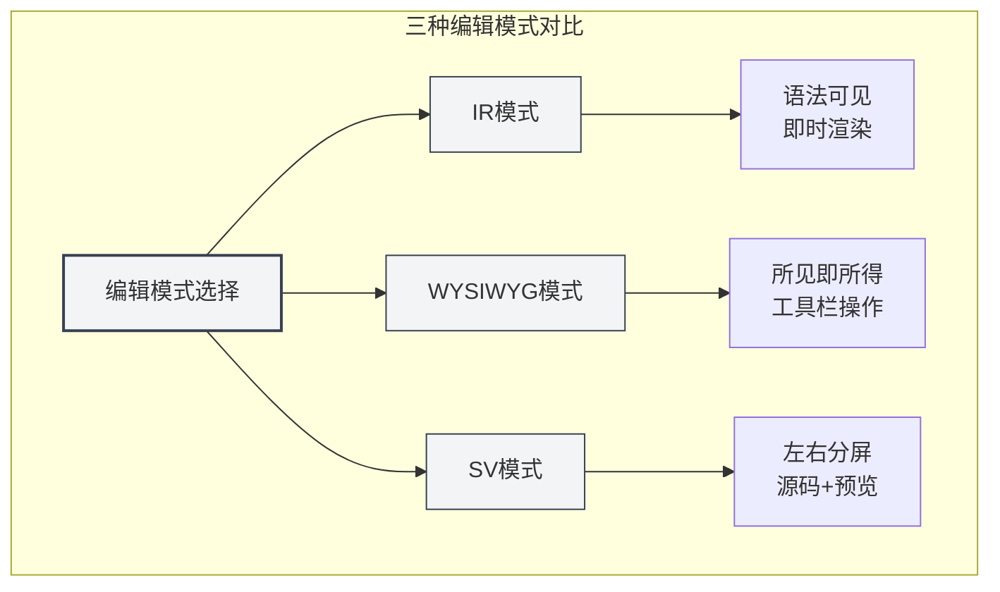
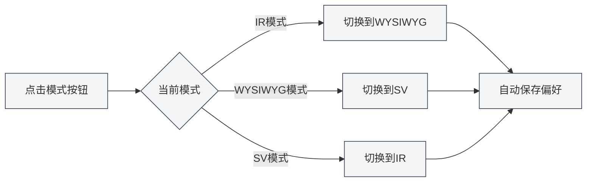
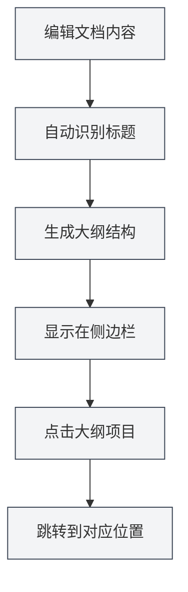
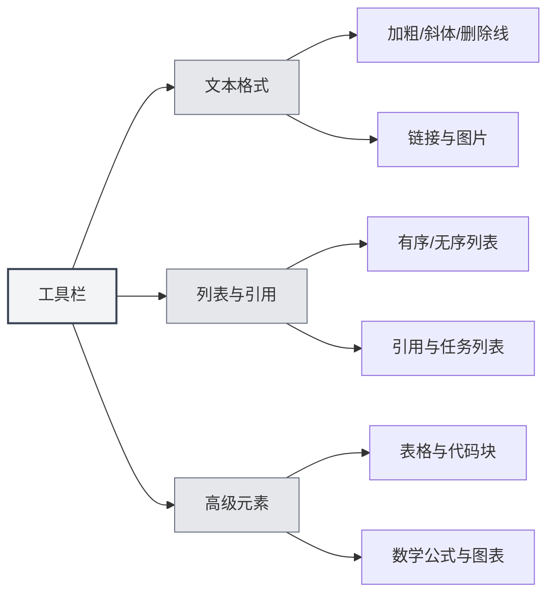

# 마크다운 에디터 사용 가이드

## 개요

MetaDoc의 마크다운 에디터는 전문적이고 우아한 글쓰기 환경을 제공합니다. 이는 단순한 텍스트 입력 상자가 아닌, 깊이 최적화된 창작 공간으로 세 가지 유연한 편집 모드, 실시간 콘텐츠 미리보기, 풍부한 서식 도구를 지원하여 형식에 신경 쓰지 않고 콘텐츠 자체에 집중할 수 있게 합니다.

기술 블로그를 작성하든, 학습 노트를 정리하든, 프로젝트 문서를 작성하든, 이 에디터는 모든 요구를 충족시킬 수 있습니다. 특히 깊이 통합된 AI 능력은 글쓰기 중에 지능형 자동 완성과 제안을 제공하여 창작을 더욱 매끄럽게 만들어 줍니다.

<TitleMenu mode="demo" title="Markdown编辑器示例" path="1" :tree='{}' />

<SectionOptimizer mode="demo" title="段落优化示例" path="1" :tree='{}' language="markdown" :adapter='null' />

<QuickStartMarkdown mode="demo" />

## 세 가지 편집 모드

MetaDoc는 다른 사용자마다 다른 편집 습관이 있음을 이해하여, 선택할 수 있는 세 가지 편집 모드를 제공합니다:

### IR 모드 (즉시 렌더링)

이것은 기본 편집 모드이며, 대부분의 마크다운 사용자들이 선호하는 방식입니다. 이 모드에서는:

- **즉각적인 피드백**: 마크다운 구문을 입력하는 동시에 콘텐츠가 즉시 서식이 적용된 모습으로 표시됩니다.
- **구문 가시성**: 마크다운 마크업 기호(예: `#`, ` **`)가 여전히 보여 정확한 형식 제어가 용이합니다.
- **원활한 편집**: 렌더링 속도가 빨라 긴 문서를 편집해도 버벅임이 느껴지지 않습니다.
- **학습 친화적**: 마크다운 구문을 배우는 사용자에게 구문과 효과의 대응 관계를 즉시 확인할 수 있습니다.

**적합한 시나리오**:

- 마크다운 구문에 익숙한 사용자
- 문서 형식을 정밀하게 제어해야 하는 상황
- 긴 기술 문서나 블로그 글을 편집할 때

### WYSIWYG 모드 (What You See Is What You Get)

Word와 같은 편집 경험에 더 익숙하다면, 이 모드가 친숙하게 느껴질 것입니다:

- **직접 편집**: 보이는 것이 최종 결과물이며, 직접 클릭하여 편집할 수 있습니다.
- **구문 암기 불필요**: 도구 모음 버튼을 통해 굵게, 제목, 목록 등 작업을 완료합니다.
- **직관적인 조작**: 텍스트를 선택한 후 버튼을 클릭하면 형식이 적용됩니다.
- **진입 장벽 낮춤**: 마크다운 구문에 익숙하지 않은 사용자도 빠르게 시작할 수 있습니다.

**적합한 시나리오**:

- 마크다운을 처음 접하는 사용자
- 빠른 서식 지정이 필요하고, 내부 구문에 관심이 없는 상황
- 시각적 편집에 더 익숙한 사용자

### SV 모드 (분할 화면 미리보기)

이 모드는 편집 영역을 양분합니다:

- **좌우 대조**: 왼쪽에 마크다운 소스 코드를 표시하고, 오른쪽에 렌더링 효과를 표시합니다.
- **실시간 동기화**: 왼쪽에서 편집할 때 오른쪽이 즉시 미리보기를 업데이트합니다.
- **학습 도구**: 구문과 최종 효과를 동시에 볼 수 있어 마크다운 이해를 심화시킵니다.
- **정밀 교정**: 복잡한 형식(예: 표, 중첩 목록)이 올바른지 확인하기 편리합니다.

**적합한 시나리오**:

- 마크다운 구문을 배우는 사용자
- 소스 코드와 효과를 동시에 보고 교정해야 할 때
- 복잡한 형식을 포함한 문서를 편집할 때



### 모드 전환 방법

편집 모드를 전환하는 것은 매우 간단합니다:

1. **도구 모음 버튼**: 에디터 상단의 도구 모음에서 모드 전환 버튼을 찾습니다.
2. **순환 전환**: 버튼을 클릭하면 세 가지 모드 사이를 순환하며 전환됩니다.
3. **선호도 기억**: 시스템은 마지막으로 사용한 모드를 기억하여 다음에 문서를 열 때 자동으로 복원합니다.



## 실시간 미리보기

MetaDoc의 실시간 미리보기 기능은 글쓰기를 즐거움으로 만듭니다:

- **자동 렌더링**: 왼쪽에서 내용을 입력하면 오른쪽(또는 아래쪽)에 즉시 렌더링 효과가 표시됩니다.
- **완전 지원**: 기본적인 제목, 목록부터 복잡한 수학 공식, 차트까지 올바르게 렌더링됩니다.
- **코드 하이라이트**: 코드 블록은 언어 유형에 따라 자동으로 구문 강조되어 코드를 더 읽기 쉽게 합니다.
- **수학 공식**: LaTeX 구문의 수학 공식을 지원하며, 인라인 공식 `$E=mc^2$`이든 독립 공식 블록이든 완벽하게 표시됩니다.
- **이미지 자동 조정**: 삽입된 이미지는 에디터 너비에 자동으로 맞추어지며, 클릭하면 확대하여 볼 수 있습니다.

## 개요 동기화

긴 문서에서 탐색하는 것이 이렇게 쉬운 적은 없었습니다:

- **자동 추출**: 에디터는 문서의 제목을 자동으로 인식하여 계층 구조가 분명한 개요를 생성합니다.
- **실시간 업데이트**: 제목을 추가, 수정 또는 삭제할 때 개요가 동기화되어 업데이트됩니다.
- **원클릭 이동**: 개요에서 아무 제목이나 클릭하면 에디터가 해당 위치로 즉시 이동합니다.
- **구조 미리보기**: 개요를 통해 전체 문서의 구조 프레임워크를 빠르게 파악할 수 있습니다.

사이드바를 통해 개요 뷰에 접근할 수 있습니다:

<ViewMenuItemsDemo mode="demo" :items='["editor", "outline"]' />



개요 기능에 대한 자세한 소개는 [[outline.basics|개요 뷰 기능]]을 확인하세요.

## 도구 모음 기능

에디터 상단의 도구 모음은 가장 자주 사용되는 서식 기능을 모아 놓았습니다:



### 텍스트 서식 지정

- **굵게** (`Ctrl+B`): 중요한 내용을 더 눈에 띄게 합니다.
- **기울임꼴** (`Ctrl+I`): 강조하거나 특별한 의미를 나타내는 데 사용합니다.
- **취소선**: 폐기되거나 수정된 내용을 나타냅니다.
- **인라인 코드**: 코드 조각이나 기술 용어를 표시합니다.
- **링크** (`Ctrl+K`): 클릭 가능한 하이퍼링크를 삽입합니다.
- **이미지**: 로컬 이미지나 네트워크 이미지를 삽입합니다.

### 목록과 인용

- **순서 없는 목록**: 글머리 기호로 내용을 나열합니다.
- **순서 있는 목록**: 숫자 번호로 내용을 나열합니다.
- **인용 블록**: 타인의 관점이나 중요한 팁을 인용합니다.
- **작업 목록**: 체크박스가 있는 할 일 목록입니다.

### 고급 요소

- **표**: 구조화된 데이터 표를 생성하며, 정렬과 중첩을 지원합니다.
- **코드 블록**: 여러 줄의 코드를 삽입하며, 수십 가지 프로그래밍 언어의 구문 강조를 지원합니다.
- **수학 공식**: LaTeX 구문을 사용하여 수학 공식을 삽입합니다.
- **차트**: Mermaid, PlantUML, ECharts 등의 차트를 삽입합니다.

## 단축키

단축키를 능숙하게 사용하면 글쓰기 효율을 크게 향상시킬 수 있습니다:

### 서식 지정 단축키

| 작업     | Windows/Linux  | macOS         |
| -------- | -------------- | ------------- |
| 굵게     | `Ctrl+B`       | `Cmd+B`       |
| 기울임꼴 | `Ctrl+I`       | `Cmd+I`       |
| 링크 삽입 | `Ctrl+K`       | `Cmd+K`       |
| 코드 삽입 | `Ctrl+Shift+K` | `Cmd+Shift+K` |

### 편집 단축키

| 작업 | Windows/Linux | macOS         |
| ---- | ------------- | ------------- |
| 실행 취소 | `Ctrl+Z`      | `Cmd+Z`       |
| 다시 실행 | `Ctrl+Y`      | `Cmd+Shift+Z` |
| 모두 선택 | `Ctrl+A`      | `Cmd+A`       |
| 찾기 | `Ctrl+F`      | `Cmd+F`       |

## 사용 팁

### 빠른 입력

1. **빠른 제목 생성**: `#`을 입력한 후 스페이스바를 누르면 자동으로 제목 형식으로 변환됩니다.
2. **빠른 목록 생성**: `-` 또는 `*`를 입력한 후 스페이스바를 누르면 자동으로 목록 항목으로 변환됩니다.
3. **빠른 코드 블록 삽입**: 세 개의 백틱 ` ``` `을 입력한 후 엔터를 누릅니다.
4. **빠른 구분선 삽입**: 세 개의 하이픈 `---`을 입력한 후 엔터를 누릅니다.

### 서식 지정 팁

1. **텍스트 선택 후 서식 지정**: 먼저 텍스트를 선택한 후 도구 모음 버튼을 클릭하거나 단축키를 사용합니다.
2. **일괄 교체**: 찾기 및 바꾸기 기능(`Ctrl+H`)을 사용하여 형식을 일괄 수정합니다.
3. **코드 하이라이트**: 코드 블록의 첫 번째 줄에 언어를 지정합니다. 예: ````python`

### 미리보기 팁

1. **모드 전환 미리보기**: SV 모드에서는 소스 코드와 효과를 동시에 볼 수 있습니다.
2. **수학 공식 미리보기**: `$`로 공식을 감싸 입력하면 실시간으로 렌더링 효과를 확인할 수 있습니다.
3. **차트 실시간 렌더링**: Mermaid 차트는 편집이 완료된 후 자동으로 렌더링됩니다.

## 자주 묻는 질문

### Q: 이미지를 어떻게 삽입하나요?

A: 세 가지 방법이 있습니다:

1. 도구 모음의 이미지 버튼을 클릭합니다.
2. 단축키 `Ctrl+Shift+I`를 사용합니다.
3. 클립보드의 이미지를 직접 붙여넣습니다.

이미지는 로컬 문서 디렉토리에 저장하거나 이미지 호스팅 서비스에 업로드할 수 있습니다.

### Q: 표는 어떻게 생성하나요?

A: 도구 모음의 표 버튼을 사용하여 시각적으로 표를 생성하는 것을 권장합니다. 마크다운 표 구문을 수동으로 입력할 수도 있습니다:

```markdown
| 열1  | 열2  | 열3  |
| ---- | ---- | ---- |
| 내용 | 내용 | 내용 |
```

### Q: 수학 공식이 표시되지 않으면 어떻게 하나요?

A: 구문이 올바른지 확인하세요:

- 인라인 공식: 단일 `$`로 감쌉니다. 예: `$E=mc^2$`
- 독립 공식: 두 개의 `$$`로 감싸 한 줄을 차지합니다.

### Q: 문서 개요는 어떻게 확인하나요?

A: 사이드바의 "개요" 아이콘을 클릭하거나 단축키를 사용하여 개요 뷰로 전환합니다. 문서의 제목이 자동으로 개요로 추출됩니다.

### Q: 편집 모드를 전환하면 내용이 손실되나요?

A: 아닙니다. 세 가지 모드는 동일한 문서 내용을 공유하며, 모드를 전환하는 것은 표시 및 편집 방식만 변경하는 것이므로 내용은 완전히 보존됩니다.

## 관련 문서

- [[markdown.basics|마크다운 구문]] - 마크다운 기본 구문 학습
- [[markdown.features|마크다운 에디터 기능]] - 더 많은 고급 기능 알아보기
- [[core.editor-basics|에디터 기본 조작]] - 일반적인 편집 기술
- [[core.editor-settings|에디터 설정]] - 개인화 구성
- [[outline.basics|개요 뷰 기능]] - 개요 기능 깊이 알아보기

<LaTeXEditorDemo mode="demo" />

<Outline mode="demo" />

<MenuItemsDemo mode="demo" :items='[{"id": "file", "items": ["new", "open", "save"]}]' />

<TitleMenu mode="demo" title="Markdown编辑器示例" path="1" :tree='{}' />

<SectionOptimizer mode="demo" title="段落优化示例" path="1" :tree='{}' language="markdown" :adapter='null' />