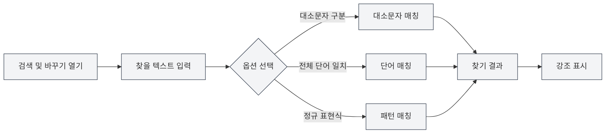
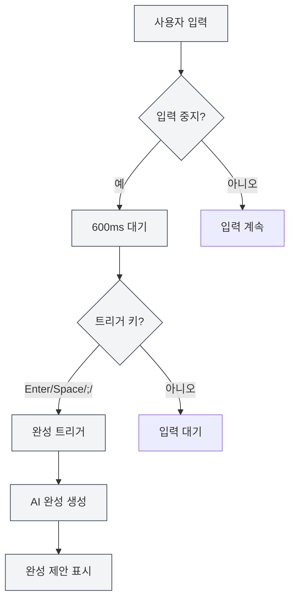

# 마크다운 편집기 기능

## 개요

마크다운 편집기는 검색 및 바꾸기, 우클릭 메뉴, AI 자동 완성, 지식 베이스 통합 등 풍부한 기능을 제공합니다. 이러한 기능들은 편집 효율성과 문서 품질을 크게 향상시킬 수 있습니다.

본 문서는 마크다운 편집기의 각종 기능과 사용 방법을 소개합니다.

## 검색 및 바꾸기

### 검색 및 바꾸기 열기

검색 및 바꾸기 기능을 여는 방법은 여러 가지가 있습니다:

- **단축키**: `Ctrl+F`로 찾기 열기, `Ctrl+H`로 찾기 및 바꾸기 열기
- **메뉴**: "편집" → "찾기" 또는 "찾기 및 바꾸기" 클릭
- **도구 모음**: 도구 모음의 검색 아이콘 클릭

상단 메뉴 바의 파일 메뉴를 통해 파일 작업에 접근하고, 편집 메뉴를 통해 편집 기능에 접근할 수 있습니다:

<MenuItemsDemo mode="demo" :items='[{"id": "file", "items": ["new", "open", "save"]}]' />

### 찾기 기능

찾기 기능은 다음 옵션들을 지원합니다:

- **대소문자 구분**: 대소문자가 정확히 일치하는 텍스트만 매칭
- **전체 단어 일치**: 완전한 단어만 매칭 (단어의 일부는 매칭하지 않음)
- **정규 표현식**: 정규 표현식을 사용한 패턴 매칭
- **대소문자 유지**: 바꿀 때 원본 텍스트의 대소문자 형식 유지

검색 및 바꾸기 메뉴 인터페이스는 다음과 같습니다:

<SearchReplaceMenu mode="demo" :adapter='null' />

### 바꾸기 기능

바꾸기 기능은 다음을 지원합니다:

- **단일 바꾸기**: 매칭된 텍스트를 하나씩 바꾸기
- **모두 바꾸기**: 모든 매칭된 텍스트를 한 번에 바꾸기
- **바꾸기 미리보기**: 바꾸기 전에 결과 미리보기

### 매칭 목록

검색 및 바꾸기 패널에는 매칭 목록이 표시됩니다:

- **위치 표시**: 각 매칭 항목의 줄 번호와 열 번호 표시
- **컨텍스트 미리보기**: 매칭 항목의 주변 내용 표시
- **빠른 이동**: 매칭 항목 클릭 시 해당 위치로 빠르게 이동

### 사용 팁

1. **정규 표현식**: 정규 표현식을 사용하여 복잡한 찾기 및 바꾸기 패턴 구현 가능
2. **일괄 바꾸기**: "모두 바꾸기"를 사용하여 문서를 빠르게 일괄 수정
3. **형식 유지**: "대소문자 유지" 옵션을 사용하여 원본 텍스트의 대소문자 형식 유지

## 우클릭 메뉴

### 기본 편집 작업

우클릭 메뉴는 다음 기본 편집 작업을 제공합니다:

- **잘라내기**: `Ctrl+X` 또는 우클릭 후 "잘라내기" 선택
- **복사**: `Ctrl+C` 또는 우클릭 후 "복사" 선택
- **붙여넣기**: `Ctrl+V` 또는 우클릭 후 "붙여넣기" 선택
- **모두 선택**: `Ctrl+A` 또는 우클릭 후 "모두 선택" 선택

### AI 기능

우클릭 메뉴는 다음 AI 기능을 제공합니다:

- **AI 분석**: 현재 문서 내용 분석, AI 대화 창 열기
- **문단 최적화**: 현재 문단 내용 최적화
- **차트 삽입**: AI를 사용하여 차트 코드 생성 및 문서 삽입

### 기능 스위치

우클릭 메뉴를 통해 다음 기능을 빠르게 켜거나 끌 수 있습니다:

- **AI 자동 완성**: AI 자동 완성 기능 활성화/비활성화
- **지식 베이스 통합**: 지식 베이스 통합 기능 활성화/비활성화

### 수동 완성 트리거

우클릭 메뉴는 "수동 완성 트리거" 옵션을 제공합니다:

- **단축키**: `Shift+Tab`
- **우클릭 메뉴**: 우클릭 후 "수동 완성 트리거" 선택

수동 완성 트리거는 자동 트리거를 기다리지 않고 즉시 AI 완성을 시작합니다.

## AI 자동 완성

### 활성화/비활성화

AI 자동 완성 기능은 다음 위치에서 활성화하거나 비활성화할 수 있습니다:

- **우클릭 메뉴**: 우클릭 후 "AI 자동 완성 활성화/비활성화" 선택
- **설정 페이지**: 설정에서 AI 자동 완성 옵션 구성

### 자동 트리거

AI 자동 완성은 다음 상황에서 자동으로 트리거됩니다:

- **입력 중지**: 입력을 중지한 후 600ms 후 자동 트리거
- **트리거 키**: 특정 키 입력 후 트리거 (Enter, Space, `;`, `,`)

### 수동 트리거

수동 완성 트리거 방법:

- **단축키**: `Shift+Tab`
- **우클릭 메뉴**: 우클릭 후 "수동 완성 트리거" 선택

수동 트리거는 자동 트리거의 지연을 건너뛰고 즉시 완성을 시작합니다.

### 완성 모드

AI 자동 완성은 두 가지 모드를 지원합니다:

- **완전 생성**: 완전한 완성 내용 생성
- **부분 생성**: 일부 내용만 생성 (설정에 따라)

완성 모드는 설정에서 구성할 수 있습니다.

### 트리거 키 설정

완성 트리거 키는 설정에서 구성할 수 있습니다:

- **Enter**: 엔터 키 트리거
- **Space**: 스페이스 바 트리거
- **;**: 세미콜론 트리거
- **,**: 쉼표 트리거

여러 트리거 키를 동시에 활성화할 수 있습니다.

### 완성 최대 토큰 수

완성 최대 토큰 수는 설정에서 구성할 수 있습니다:

- **최소값**: 20 토큰
- **최대값**: 제한 없음 (0으로 설정 시 제한 없음)
- **기본값**: 50 토큰

토큰 수가 클수록 완성 내용이 많아지지만, 생성 시간도 더 길어집니다.

### 완성 수락

완성 제안이 표시된 후 다음을 할 수 있습니다:

- **Tab 키**: 완성 제안 수락
- **Esc 키**: 완성 제안 취소
- **계속 입력**: 완성 취소하고 계속 입력

<TitleMenu mode="demo" title="마크다운 편집기 예시" path="1" :tree='{}' />

<SectionOptimizer mode="demo" title="문단 최적화 예시" path="1" :tree='{}' language="markdown" :adapter='null' />

<QuickStartMarkdown mode="demo" />

<ViewMenuItemsDemo mode="demo" :items='["editor", "outline", "agent"]' />

## 지식 베이스 통합

### 활성화/비활성화

지식 베이스 통합 기능은 다음 위치에서 활성화하거나 비활성화할 수 있습니다:

- **우클릭 메뉴**: 우클릭 후 "지식 베이스 활성화/비활성화" 선택
- **설정 페이지**: 설정에서 지식 베이스 옵션 구성

### 컨텍스트 검색

지식 베이스 통합이 활성화되면, AI 기능은 자동으로 지식 베이스의 관련 내용을 검색합니다:

- **AI 완성**: 완성 시 지식 베이스의 관련 내용 참조
- **AI 분석**: 문서 분석 시 지식 베이스의 지식 사용
- **문단 최적화**: 문단 최적화 시 지식 베이스의 내용 참조

### 검색 원리

지식 베이스 검색은 벡터 검색 기술을 사용합니다:

- **의미 매칭**: 의미적 유사도에 따라 관련 내용 매칭
- **키워드 매칭**: 정확도 향상을 위해 키워드 매칭 동시 사용
- **혼합 검색**: 벡터 검색과 키워드 매칭 결합

### 신뢰도 임계값

지식 베이스 검색은 신뢰도 임계값 설정을 지원합니다:

- **임계값 범위**: 0.0 - 1.0
- **기본값**: 0.5
- **작용**: 임계값보다 유사도가 높은 내용만 반환

신뢰도 임계값은 설정에서 구성할 수 있으며, 자세한 내용은 [[knowledge-base.config|지식 베이스 구성]]을 참조하세요.

## 기능 조합 사용

### 검색 및 바꾸기 + AI 완성

검색 및 바꾸기와 AI 완성을 함께 사용:

1. 검색 및 바꾸기를 사용하여 수정할 내용 찾기
2. AI 완성을 사용하여 새로운 내용 생성
3. 바꾸기 기능을 사용하여 일괄 업데이트

### 우클릭 메뉴 + 지식 베이스

우클릭 메뉴와 지식 베이스를 함께 사용:

1. 지식 베이스 통합 활성화
2. 우클릭 메뉴의 AI 기능 사용
3. AI 기능이 자동으로 지식 베이스의 내용 사용

### AI 분석 + 문단 최적화

AI 분석과 문단 최적화를 함께 사용:

1. AI 분석을 사용하여 문서 내용 이해
2. 문단 최적화를 사용하여 특정 문단 개선
3. AI 분석의 제안에 따라 최적화

## 사용 팁

### 완성 품질 향상

1. **지식 베이스 활성화**: 지식 베이스 통합 활성화로 완성 품질 향상
2. **토큰 수 조정**: 필요에 따라 완성 최대 토큰 수 조정
3. **수동 트리거**: 필요 시 수동 트리거 사용으로 더 나은 완성 효과 얻기

### 효율적인 검색 및 바꾸기

1. **정규 표현식 사용**: 복잡한 패턴에는 정규 표현식 사용
2. **바꾸기 미리보기**: 바꾸기 전에 결과 미리보기
3. **일괄 작업**: "모두 바꾸기" 사용으로 빠른 일괄 수정

### 지식 베이스 사용

1. **관련 문서 추가**: 관련 문서를 지식 베이스에 추가
2. **신뢰도 조정**: 필요에 따라 신뢰도 임계값 조정
3. **정기적 업데이트**: 지식 베이스 내용 정기적으로 업데이트

## 자주 묻는 질문

### Q: AI 완성이 표시되지 않나요?

A: AI 자동 완성이 활성화되어 있는지 확인하고, LLM 구성이 올바른지 확인하세요. 수동 완성 트리거(`Shift+Tab`)를 시도해 보세요.

### Q: 검색 및 바꾸기에서 내용을 찾을 수 없나요?

A: "대소문자 구분" 또는 "전체 단어 일치" 옵션이 활성화되어 있는지 확인하세요. 정규 표현식을 사용하는 경우 표현식이 올바른지 확인하세요.

### Q: 지식 베이스 통합이 작동하지 않나요?

A: 지식 베이스가 활성화되어 있는지 확인하고, 지식 베이스에 관련 문서가 있는지 확인하세요. 신뢰도 임계값을 조정하면 더 많은 내용을 검색하는 데 도움이 될 수 있습니다.

### Q: AI 완성을 어떻게 끄나요?

A: 우클릭 메뉴에서 "AI 자동 완성 끄기"를 선택하거나, 설정에서 AI 자동 완성 옵션을 끄세요.

### Q: 완성 내용이 정확하지 않나요?

A: 지식 베이스 통합을 활성화하거나, 완성 최대 토큰 수를 조정하거나, 수동 트리거를 사용하여 더 나은 효과를 얻어보세요.

## 관련 문서

- [[markdown.editor|마크다운 편집기 사용 가이드]]
- [[markdown.basics|마크다운 문법]]
- [[ai.completion|AI 자동 완성]]
- [[knowledge-base.usage|지식 베이스 사용]]
- [[core.editor-basics|편집기 기본 작업]]

<LaTeXEditorDemo mode="demo" />

<Outline mode="demo" />

<MenuItemsDemo mode="demo" :items='[{"id": "file", "items": ["new", "open", "save"]}]' />

<TitleMenu mode="demo" title="마크다운 편집기 기능 예시" path="1" :tree='{}' />

<SearchReplaceMenu mode="demo" :adapter='null' />

<ViewMenuItemsDemo mode="demo" :items='["editor", "outline", "agent"]' />

<QuickStartMarkdown mode="demo" />

<MenuItemsDemo mode="demo" :items='[{"id": "edit", "items": ["find", "replace"]}]' />