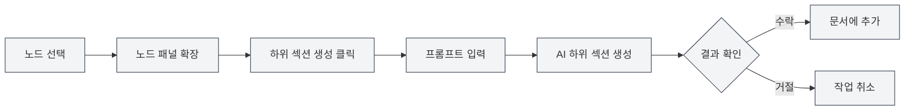
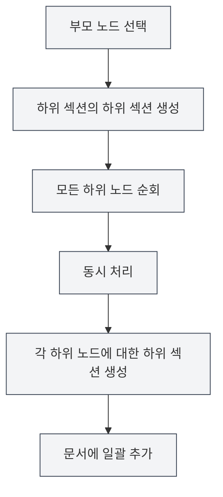

# 아웃라인 AI 기능

## 개요

아웃라인 AI 기능은 AI 기술을 활용하여 문서 구조를 빠르게 생성하고 최적화하는 데 도움을 줍니다. AI 기능을 통해 하위 섹션 생성, 섹션 내용 생성, 아웃라인 구조 최적화 등을 수행할 수 있어 문서 작성 효율을 크게 향상시킵니다.

<Outline mode="demo" />

아웃라인 AI 기능은 단일 노드 작업과 일괄 작업을 포함한 다양한 작업 모드를 지원하여 AI를 활용한 문서 작성에 유연하게 대응할 수 있습니다.

<Outline mode="demo" />

## 하위 섹션 생성

### 노드에 대한 하위 섹션 생성

지정된 노드에 대한 하위 섹션을 생성합니다:

<OutlineAiToolbar mode="demo" />

1. **노드 선택**: 아웃라인 뷰에서 하위 섹션을 생성할 노드를 선택합니다.
2. **노드 확장**: 노드를 클릭하여 상세 패널을 확장합니다.
3. **하위 섹션 생성**: "하위 섹션 생성" 버튼을 클릭합니다.
4. **프롬프트 입력**: AI 생성을 안내하는 프롬프트를 선택적으로 입력합니다.
5. **생성 대기**: AI가 노드 제목과 내용을 기반으로 하위 섹션을 생성합니다.
6. **수락 확인**: 생성된 결과를 확인한 후 수락합니다.

사이드바를 통해 아웃라인 뷰에 접근할 수 있습니다:

<ViewMenuItemsDemo mode="demo" :items='["outline"]' />

생성된 하위 섹션은 자동으로 문서에 추가되고 아웃라인 구조가 업데이트됩니다.

### 생성 원리

<OutlineTreeDisplay mode="demo" />

AI가 하위 섹션을 생성할 때 고려하는 사항:

- **노드 제목**: 노드 제목을 기반으로 섹션 주제를 이해합니다.
- **문서 구조**: 문서의 전체 구조를 고려합니다.
- **사용자 프롬프트**: 사용자 프롬프트에 따라 생성 내용을 조정합니다.
- **형식 요구사항**: 문서 형식(Markdown/LaTeX)에 맞는 올바른 제목 형식을 생성합니다.

### 사용 팁

1. **명확한 프롬프트 제공**: 요구사항에 맞는 하위 섹션을 생성하도록 AI를 안내하는 명확한 프롬프트를 입력합니다.
2. **기존 구조 참조**: AI는 문서의 기존 구조를 참조하여 스타일을 일관되게 유지합니다.
3. **여러 번 생성**: 만족스럽지 않다면 여러 번 생성하여 최상의 결과를 선택합니다.

## 섹션 내용 생성

<Outline mode="demo" />

### 노드에 대한 내용 생성

지정된 노드에 대한 본문 내용을 생성합니다:

1. **노드 선택**: 아웃라인 뷰에서 내용을 생성할 노드를 선택합니다.
2. **노드 확장**: 노드를 클릭하여 상세 패널을 확장합니다.
3. **내용 생성**: "내용 생성" 버튼을 클릭합니다.
4. **프롬프트 입력**: AI 생성을 안내하는 프롬프트를 선택적으로 입력합니다.
5. **단어 수 설정**: 목표 단어 수를 선택적으로 설정합니다.
6. **생성 대기**: AI가 노드 제목과 문서 구조를 기반으로 내용을 생성합니다.
7. **수락 확인**: 생성된 결과를 확인한 후 수락합니다.

생성된 내용은 자동으로 문서의 해당 섹션에 추가됩니다.

### 내용 생성 모드

<OutlineAiToolbar mode="demo" />

내용 생성은 다음 모드를 지원합니다:

- **완전 생성**: 완전한 섹션 내용을 생성합니다.
- **부분 생성**: 설정에 따라 일부 내용만 생성합니다.
- **내용 추가**: 기존 내용에 기반하여 새로운 내용을 추가합니다.

### 단어 수 제어

내용 생성 시 목표 단어 수를 설정할 수 있습니다:

- **단어 수 설정**: 생성 대화 상자에 목표 단어 수를 입력합니다.
- **AI 조정**: AI는 단어 수 요구사항에 따라 생성 내용의 상세도를 조정합니다.
- **유연한 제어**: 섹션 중요도에 따라 다른 단어 수를 설정할 수 있습니다.

<OutlineTreeDisplay mode="demo" />

## 하위 섹션의 하위 섹션 생성

### 일괄 하위 섹션 생성

지정된 노드의 모든 하위 노드에 대해 일괄적으로 하위 섹션을 생성합니다:

1. **노드 선택**: 일괄 작업을 수행할 노드를 선택합니다.
2. **노드 확장**: 노드를 클릭하여 상세 패널을 확장합니다.
3. **하위 섹션의 하위 섹션 생성**: "하위 섹션의 하위 섹션 생성" 버튼을 클릭합니다.
4. **프롬프트 입력**: AI 생성을 안내하는 프롬프트를 입력합니다.
5. **생성 대기**: AI는 모든 하위 노드를 동시에 처리하여 각 하위 노드에 대한 하위 섹션을 생성합니다.
6. **수락 확인**: 생성된 결과를 확인한 후 수락합니다.

이 기능은 동시 처리 메커니즘을 사용하여 여러 섹션에 대해 빠르게 일괄적으로 하위 섹션을 생성할 수 있습니다.

### 동시 처리의 장점

<OutlineAiToolbar mode="demo" />

일괄 생성은 동시 처리 메커니즘을 사용합니다:

- **효율적 처리**: 여러 노드를 동시에 처리하여 속도가 수십 배 향상됩니다.
- **자동 동기화**: 생성 완료 후 자동으로 문서에 동기화됩니다.
- **진행률 표시**: 각 노드의 생성 진행률을 표시합니다.

### 사용 시나리오

다음 시나리오에 적합합니다:

- **대규모 생성**: 여러 섹션에 대한 하위 섹션을 생성해야 할 때
- **일괄 작업**: 모든 섹션에 대해 한 번의 클릭으로 하위 섹션 생성
- **구조화된 생성**: 아웃라인 구조에 따라 내용을 일괄 생성

## 하위 섹션 내용 생성

### 일괄 내용 생성

지정된 노드의 모든 하위 노드에 대해 일괄적으로 내용을 생성합니다:

1. **노드 선택**: 일괄 작업을 수행할 노드를 선택합니다.
2. **노드 확장**: 노드를 클릭하여 상세 패널을 확장합니다.
3. **하위 섹션 내용 생성**: "하위 섹션 내용 생성" 버튼을 클릭합니다.
4. **프롬프트 입력**: AI 생성을 안내하는 프롬프트를 입력합니다.
5. **단어 수 설정**: 목표 단어 수를 선택적으로 설정합니다.
6. **생성 대기**: AI는 모든 하위 노드를 동시에 처리하여 각 하위 노드에 대한 내용을 생성합니다.
7. **수락 확인**: 생성된 결과를 확인한 후 수락합니다.

이 기능을 사용하면 전체 문서의 모든 섹션에 대한 내용을 빠르게 생성할 수 있습니다.

### 재귀적 생성

하위 섹션 내용 생성은 재귀적으로 처리됩니다:

- **모든 하위 노드 순회**: 모든 하위 노드를 재귀적으로 순회합니다.
- **내용 생성**: 각 하위 노드에 대한 내용을 생성합니다.
- **구조 유지**: 문서의 계층 구조를 유지합니다.

### 진행률 추적

일괄 생성 시 진행률이 표시됩니다:

- **노드 진행률**: 현재 처리 중인 노드를 표시합니다.
- **전체 진행률**: 전체 생성 진행률을 표시합니다.
- **실시간 업데이트**: 생성 내용을 실시간으로 업데이트합니다.

<Outline mode="demo" />

## 아웃라인 최적화

### 최적화 기능

아웃라인 최적화 기능은 다음을 도와줍니다:

- **구조 조정**: 문서의 구조와 계층을 최적화합니다.
- **제목 최적화**: 제목의 명명과 형식을 최적화합니다.
- **구조 재구성**: 문서 구조를 재구성합니다.

### 최적화 작업

아웃라인 최적화는 다음 작업을 지원합니다:

- **노드 이동**: 노드를 새로운 위치로 이동합니다.
- **노드 삭제**: 불필요한 노드를 삭제합니다.
- **계층 조정**: 노드의 계층 관계를 조정합니다.
- **노드 병합**: 유사한 노드를 병합합니다.

### 최적화 사용

<OutlineTreeDisplay mode="demo" />

1. **구조 분석**: AI가 현재 문서 구조를 분석합니다.
2. **제안 제공**: 최적화 제안을 제공합니다.
3. **최적화 적용**: 확인 후 최적화 결과를 적용합니다.

## AI 기능 구성

### 온도 설정

AI 생성 시 온도 매개변수를 설정할 수 있습니다:

- **온도 범위**: 0.0 - 1.0
- **기본값**: 구성에 따라 다름
- **작용**: AI 생성의 창의성을 제어합니다(온도가 높을수록 더 창의적입니다).

### 프롬프트 설정

각 작업에 대해 프롬프트를 설정할 수 있습니다:

- **일반 프롬프트**: 일반적인 프롬프트를 설정합니다.
- **작업별 프롬프트**: 각 작업에 대해 특정 프롬프트를 설정합니다.
- **단어 수 요구사항**: 프롬프트에 단어 수 요구사항을 포함시킵니다.

### 형식 인식

AI는 자동으로 문서 형식을 인식합니다:

- **Markdown 형식**: Markdown 형식의 제목과 내용을 생성합니다.
- **LaTeX 형식**: LaTeX 형식의 제목과 내용을 생성합니다.
- **자동 적응**: 문서 형식에 따라 생성 내용을 자동으로 조정합니다.

## 사용 팁

### 효율적 생성

1. **일괄 작업 사용**: 대량의 내용을 생성해야 할 때 일괄 작업을 사용하여 효율성을 높입니다.
2. **명확한 프롬프트 제공**: 더 나은 생성 결과를 얻기 위해 명확한 프롬프트를 입력합니다.
3. **단계별 생성**: 먼저 구조를 생성한 후 내용을 생성하여 문서를 점진적으로 완성합니다.

### 품질 관리

1. **생성 결과 확인**: 생성 후 결과를 주의 깊게 확인하여 요구사항을 충족하는지 확인합니다.
2. **여러 번 생성**: 만족스럽지 않다면 여러 번 생성하여 최상의 결과를 선택합니다.
3. **수동 조정**: 생성 후 내용을 수동으로 조정하고 완성할 수 있습니다.

### 구조 계획

1. **먼저 구조 계획**: AI를 사용하여 하위 섹션을 생성하여 문서 구조를 계획합니다.
2. **그 다음 내용 생성**: 구조가 확정된 후 구체적인 내용을 생성합니다.
3. **점진적 완성**: 모든 내용을 한 번에 생성하지 말고 점진적으로 문서를 완성합니다.

## 자주 묻는 질문

### Q: AI가 생성한 내용이 정확하지 않나요?

A: AI가 생성한 내용은 참고용이며, 생성 후 확인하고 조정하는 것이 좋습니다. 더 자세한 프롬프트를 제공하면 더 나은 결과를 얻을 수 있습니다.

### Q: 일괄 생성이 매우 느린가요?

A: 일괄 생성은 동시 처리를 사용하여 이미 매우 빠릅니다. 그래도 느리다면 네트워크 문제나 AI 서비스 응답 지연일 수 있습니다.

### Q: 생성을 어떻게 취소하나요?

A: 생성 과정에서 "취소" 버튼을 클릭하여 작업을 취소할 수 있습니다. 이미 생성된 내용은 손실되지 않습니다.

### Q: 생성된 내용의 형식이 올바르지 않나요?

A: AI는 자동으로 문서 형식을 인식합니다. 형식이 올바르지 않다면 문서 형식 설정을 확인하거나 생성된 내용을 수동으로 조정하세요.

### Q: 생성된 내용을 수정할 수 있나요?

A: 예, 가능합니다. 생성된 내용은 언제든지 편집하고 수정할 수 있습니다. 생성은 보조적인 창작 도구일 뿐이며, 최종 내용은 사용자가 결정합니다.

## 관련 문서

- [[outline.basics|아웃라인 뷰 기능]]
- [[ai.llm-config|LLM 구성]]
- [[markdown.editor|Markdown 편집기 사용 가이드]]
- [[latex.editor|LaTeX 편집기 사용 가이드]]

<Outline mode="demo" />

<OutlineAiToolbar mode="demo" />

<ViewMenuItemsDemo mode="demo" :items='["ai"]' />
