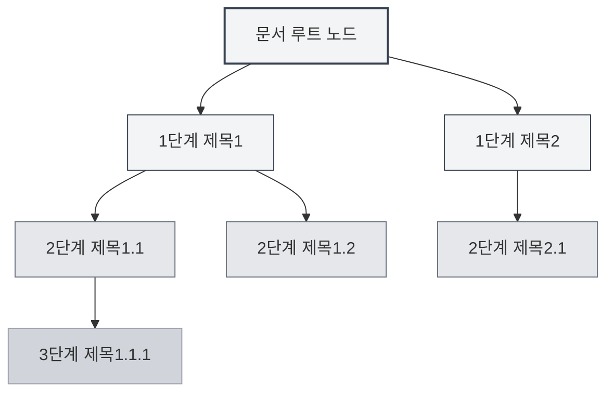
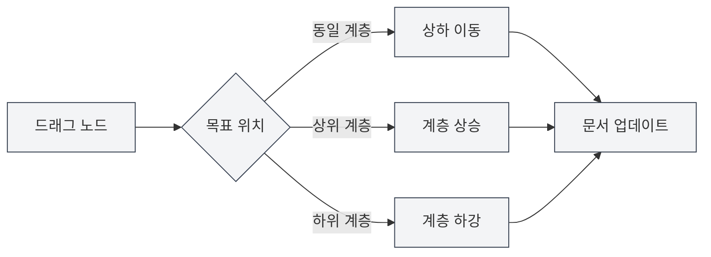

# 개요 보기 기능

## 개요

개요 보기는 문서의 제목 계층을 트리 구조로 표시하여 문서 구조를 빠르게 탐색하고 편집할 수 있도록 도와줍니다. 개요 보기를 통해 문서의 임의의 위치로 빠르게 이동하고, 문서 구조를 편집하며, AI 기능을 사용하여 콘텐츠를 생성할 수 있습니다.

MetaDoc의 개요 보기는 자동 추출, 수동 편집, 드래그 앤 드롭 정렬, AI 생성 등의 기능을 지원하여 문서 구조를 효율적으로 구성하고 관리할 수 있게 합니다.

## 개요 보기 소개

### 보기 위치

개요 보기는 일반적으로 편집기 왼쪽 또는 오른쪽의 사이드바에 표시됩니다:

- **사이드바**: 개요 보기가 사이드바의 일부로 표시됨
- **독립 패널**: 개요 보기를 독립적으로 표시하거나 숨길 수 있음
- **너비 조정**: 개요 보기의 너비를 조정할 수 있음

사이드바를 통해 개요 보기에 접근할 수 있으며, 사이드바는 편집기, 개요 등의 보기 전환을 제공합니다:

<ViewMenuItemsDemo mode="demo" :items='["editor", "outline"]' />

### 인터페이스 미리보기

개요 보기는 문서 제목 계층을 트리 구조로 표시하며, 드래그 앤 드롭 정렬 및 노드 편집을 지원합니다:

<Outline mode="demo" />

<ViewMenuItemsDemo mode="demo" :items='["outline"]" />

### 개요 구조

개요 보기는 문서의 제목 계층을 트리 구조로 표시합니다:

- **루트 노드**: 문서의 루트 노드 (일반적으로 표시되지 않음)
- **1단계 제목**: 문서의 1단계 제목 (H1)
- **2단계 제목**: 문서의 2단계 제목 (H2)
- **다단계 중첩**: 다단계 제목의 중첩 표시를 지원

### 자동 추출

개요 보기는 문서에서 자동으로 제목 구조를 추출합니다:

- **Markdown 문서**: Markdown 제목(`#`, `##` 등)에서 추출
- **LaTeX 문서**: LaTeX 장 명령(`\section`, `\subsection` 등)에서 추출
- **실시간 업데이트**: 문서 편집 시 개요 구조가 자동으로 업데이트됨

## 개요 노드 작업

### 하위 노드 추가

개요에 새로운 하위 노드를 추가합니다:

1. **노드 선택**: 하위 노드를 추가할 노드를 클릭
2. **추가 버튼**: 노드 옆의 "하위 노드 추가" 버튼(+ 아이콘) 클릭
3. **제목 입력**: 새 노드의 제목 입력
4. **생성 확인**: 확인 후 새 노드 생성

새 노드는 문서의 해당 위치에 추가되고 문서 내용이 자동으로 업데이트됩니다.

<Outline mode="demo" />

### 노드 편집

개요 노드의 제목을 편집합니다:

1. **노드 선택**: 편집할 노드를 클릭
2. **편집 버튼**: 노드 옆의 "편집" 버튼 클릭
3. **제목 수정**: 노드 제목 수정
4. **저장 확인**: 확인 후 변경 사항 저장

노드 제목 편집은 문서에서 해당하는 제목을 자동으로 업데이트합니다.

<TitleMenu mode="demo" title="예시 제목" path="1" :tree='{}' />

<ViewMenuItemsDemo mode="demo" :items='["outline"]' />

### 노드 삭제

개요 노드를 삭제합니다:

1. **노드 선택**: 삭제할 노드를 클릭
2. **삭제 버튼**: 노드 옆의 "삭제" 버튼 클릭
3. **삭제 확인**: 확인 후 노드 삭제

노드 삭제는 문서에서 해당하는 제목과 내용을 함께 삭제합니다(구성된 경우).

<SectionOptimizer mode="demo" title="개요 노드 최적화 예시" path="1" :tree='{}' language="markdown" :adapter='null' />

<OutlineTreeDisplay mode="demo" />

### 노드 이동

개요 노드의 위치를 이동합니다:

- **상하 이동**: "위로 이동" 및 "아래로 이동" 버튼을 사용하여 노드 순서 변경
- **좌우 이동**: "왼쪽으로 이동" 및 "오른쪽으로 이동" 버튼을 사용하여 노드 계층 변경
- **드래그 이동**: 노드를 직접 드래그하여 목표 위치로 이동

노드 이동은 문서 구조를 자동으로 업데이트합니다.

<OutlineTreeDisplay mode="demo" />

## 개요 노드 드래그 앤 드롭

### 드래그 앤 드롭 작업

개요 보기는 드래그 앤 드롭 작업을 지원하여 문서 구조를 재구성합니다:

1. **마우스 누름**: 노드에서 마우스 왼쪽 버튼을 누름
2. **노드 드래그**: 노드를 목표 위치로 드래그
3. **마우스 놓기**: 마우스를 놓아 이동 완료

드래그 시 노드의 목표 위치를 표시하는 시각적 피드백이 제공됩니다.

### 드래그 앤 드롭 모드

드래그 앤 드롭은 다음 모드를 지원합니다:

- **상하 이동**: 동일 계층 내에서 노드를 위아래로 이동
- **좌우 이동**: 노드의 계층 변경 (상승 또는 하강)
- **계층 간 이동**: 노드를 다른 계층으로 이동

### 드래그 앤 드롭 제한

드래그 앤 드롭 작업에는 다음과 같은 제한이 있습니다:

- **루트 노드**: 루트 노드는 드래그할 수 없음
- **자기 포함**: 노드를 자신의 하위 노드로 드래그할 수 없음 (순환 방지)
- **계층 제한**: 일부 작업은 계층 제한을 받을 수 있음

<Outline mode="demo" />

## 개요 확장/축소

### 노드 확장

노드를 확장하여 하위 노드를 확인합니다:

- **노드 클릭**: 노드 제목을 클릭하여 확장 또는 축소
- **확장 아이콘**: 노드 앞의 확장 아이콘 클릭
- **모두 확장**: "모두 확장" 기능을 사용하여 모든 노드 확장

### 노드 축소

노드를 축소하여 하위 노드를 숨깁니다:

- **노드 클릭**: 이미 확장된 노드를 다시 클릭하여 축소
- **축소 아이콘**: 노드 앞의 축소 아이콘 클릭
- **모두 축소**: "모두 축소" 기능을 사용하여 모든 노드 축소

### 확장 상태

개요의 확장 상태가 저장됩니다:

- **자동 저장**: 확장 상태가 자동으로 저장됨
- **상태 복원**: 다음에 문서를 열 때 확장 상태가 복원됨
- **독립 상태**: 각 문서의 확장 상태가 독립적으로 저장됨

## 개요 너비 조정

### 너비 조정

개요 보기의 너비를 조정할 수 있습니다:

1. **경계 드래그**: 개요 보기의 경계에 마우스를 이동
2. **누르고 드래그**: 마우스 왼쪽 버튼을 누른 채 드래그하여 너비 조정
3. **마우스 놓기**: 마우스를 놓아 조정 완료

### 너비 제한

개요 너비에는 다음과 같은 제한이 있습니다:

- **최소 너비**: 최소 너비보다 작을 수 없음 (일반적으로 150px)
- **최대 너비**: 최대 너비보다 클 수 없음 (일반적으로 화면 너비의 50%)
- **자동 조정**: 너비가 내용에 따라 자동으로 조정됨

<ResizableDivider mode="demo" />

## 빠른 이동

### 클릭 이동

개요 노드를 클릭하여 문서의 해당 위치로 빠르게 이동할 수 있습니다:

- **노드 클릭**: 노드 제목을 클릭하여 해당 위치로 이동
- **강조 표시**: 이동 후 해당 제목이 강조 표시됨
- **스크롤 위치 지정**: 편집기가 해당 위치로 자동 스크롤됨

### 동기화 스크롤

개요 보기는 편집기와의 동기화 스크롤을 지원합니다:

- **편집 시 동기화**: 문서 편집 시 개요가 현재 편집 위치를 자동으로 강조 표시
- **스크롤 시 동기화**: 편집기 스크롤 시 개요가 보이는 제목을 자동으로 강조 표시
- **양방향 동기화**: 개요와 편집기 양방향 동기화

## 노드 정보 표시

### 노드 제목

개요 노드는 다음 정보를 표시합니다:

- **제목 텍스트**: 제목의 텍스트 내용 표시
- **제목 계층**: 들여쓰기를 통해 제목의 계층 표시
- **노드 상태**: 노드의 상태 표시 (확장/축소)

### 노드 작업

각 노드는 다음 작업 버튼을 제공합니다:

- **하위 노드 추가**: 현재 노드 아래에 하위 노드 추가
- **편집**: 노드 제목 편집
- **삭제**: 노드 삭제
- **이동**: 노드를 위, 아래, 왼쪽, 오른쪽으로 이동

작업 버튼은 마우스 오버 또는 노드 선택 시 표시됩니다.

<OutlineTreeDisplay mode="demo" />

<ViewMenuItemsDemo mode="demo" :items='["editor", "outline"]' />

## 사용 팁

### 문서 구조 구성

1. **개요로 계획**: 먼저 개요에서 문서 구조를 계획한 후 내용 채우기
2. **계층 조정**: 드래그 앤 드롭을 사용하여 제목 계층 빠르게 조정
3. **일괄 작업**: 개요 보기를 사용하여 여러 제목 일괄 관리

### 빠른 탐색

1. **이동 사용**: 개요 노드 클릭하여 문서 위치로 빠르게 이동
2. **검색 사용**: 개요에서 제목 검색하여 빠르게 위치 파악
3. **축소 사용**: 확인할 필요 없는 부분을 축소하여 현재 내용에 집중

### 편집 효율성

1. **드래그 앤 드롭 정렬**: 드래그 앤 드롭을 사용하여 문서 구조 빠르게 조정
2. **일괄 편집**: 개요에서 여러 제목 일괄 편집
3. **구조 미리보기**: 개요를 사용하여 전체 문서 구조 미리보기

<OutlineTreeDisplay mode="demo" />

## 자주 묻는 질문

### Q: 개요가 업데이트되지 않나요?

A: 개요는 자동으로 업데이트됩니다. 업데이트되지 않으면 보기 전환 또는 문서 새로고침을 시도해 보세요. 문서에 올바른 제목 형식이 있는지 확인하세요.

### Q: 여러 제목을 빠르게 추가하는 방법은?

A: "하위 노드 추가" 기능을 사용하여 제목을 빠르게 추가하거나, 편집기에서 직접 제목을 입력하면 개요가 자동으로 업데이트됩니다.

### Q: 노드 드래그 앤 드롭이 실패하나요?

A: 노드를 자신의 하위 노드로 드래그했는지 확인하세요 (순환을 유발함). 목표 위치가 유효한지 확인하세요.

### Q: 개요가 올바르게 표시되지 않나요?

A: 문서의 제목 형식이 올바른지 확인하세요. Markdown은 `#`을, LaTeX는 `\section` 등의 명령을 사용합니다.

### Q: 개요를 재설정하는 방법은?

A: 개요는 문서에서 자동으로 추출됩니다. 재설정이 필요하면 문서를 다시 열거나 문서 구조를 수동으로 편집하세요.

## 관련 문서

- [[outline.ai-features|개요 AI 기능]]
- [[markdown.editor|Markdown 편집기 사용 가이드]]
- [[latex.editor|LaTeX 편집기 사용 가이드]]
- [[core.editor-basics|편집기 기본 작업]]