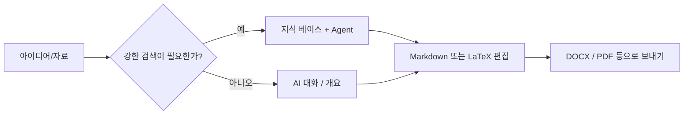

# 🚀 MetaDoc 모범 사례 안내

MetaDoc는 정해진 단일 워크플로만 있는 프로그램이 아닙니다.

글쓰기, 도표, 번역처럼 **같은 결과를 여러 경로로** 달성할 수 있는 **도구 묶음**에 가깝습니다.

👉 즉,

* 한 작업에도 **여러 방법**이 있을 수 있고
* **속도·비용·품질**의 균형이 경로마다 다르며
* 모든 기능을 외우는 것보다 **경로를 고르는 것**이 더 중요합니다.

이 문서는 기능 설명이 아니라, 실질적인 질문에 답합니다.

> 👉 **지금 상황에서는 어떤 방식이 가장 알맞을까?**

---

## 🧭 표기 읽는 법

| 표기       | 의미                               |
| ---------- | ---------------------------------- |
| ⭐⭐⭐⭐⭐ | 대부분의 경우 먼저 시도할 만함     |
| ⭐⭐⭐⭐   | 안정적이나 단계가 하나 더 필요할 수 있음 |
| ⭐⭐⭐     | 특정 상황에 유리                   |
| ⚠️       | 품질·규정·리스크에 유의            |
| 💰         | 토큰/API 비용이 더 들 수 있음      |

---

메인 창 탭 예시:

<MainTabs mode="demo" />

---

# 📝 1. 글쓰기: 아이디어에서 완성까지

글 한 편을 쓰는 대표 경로는 세 가지입니다. 목표에 맞는 하나만 골라도 됩니다.

---

## ⭐⭐⭐⭐⭐ 경로 1(기본 추천)

### AI 채팅으로 초안 → Markdown으로 다듬기 → 출력

**흐름**:
[[ai.chat|AI 대화]] → Markdown 편집 → [[core.export|보내기]]

**이럴 때 적합합니다:**

* 빨리 시작하고 싶을 때
* 수정을 여러 번 할 때
* 최종 결과물이 Word/PDF/LaTeX일 때

---

**추천 이유**

* Markdown은 **서식보다 내용**에 집중하기 쉽습니다
* 먼저 글과 구조를 잡고, 형식은 나중에
* 출력한 뒤 Word나 LaTeX에서 마무리할 수 있습니다

👉 **내용 먼저, 서식은 나중**으로 이해하면 됩니다

---

**주의**

* AI가 쓴 내용은 사실·인용 등 반드시 직접 확인하세요
* 출력한 뒤 레이아웃을 한 번 점검하세요

---

AI 대화 화면 예시:

<AIChat mode="demo" />

---

## ⭐⭐⭐⭐ 경로 2

### 지식 베이스를 활용한 글쓰기(전문·근거 중심)

**흐름**:
[[knowledge-base.usage|지식 베이스]] → [[agent.introduction|Agent]] → 편집기에서 통합

---

**이럴 때 적합합니다:**

* 논문·리뷰·보고서처럼 **근거**가 필요할 때
* PDF·문서·자료를 이미 가지고 있을 때

---

**장점**

* 업로드한 자료를 바탕으로 생성하기 쉽습니다
* **출처가 있는 글**로 맞추기 쉽습니다

---

**유의사항**

* ⚠️ 결과는 자료 품질·청킹에 따라 달라집니다
* 💰 여러 차례 대화하면 토큰 사용이 늘어납니다

---

👉 한 줄로:

> **근거 있는 글**이 필요하면 이 경로를 고려하세요

---

지식 베이스 화면 예시:

<KnowledgeBase mode="demo" />

---

## ⭐⭐⭐ 경로 3

### Agent가 LaTeX 프로젝트를 통째로 생성

**흐름**:
Agent → LaTeX 프로젝트 → PDF 컴파일

---

**이럴 때 적합합니다:**

* 일반적인 논문형 구조가 필요할 때
* LaTeX 사용이 확정되었을 때
* 시간이 촉박할 때

---

### ⚠️ 사용 전에 알아 두기

* 💰 짧은 대화나 작은 범위 작업보다 토큰을 많이 쓰는 편입니다
* 패키지·경로는 직접 손볼 수 있습니다
* 민감·규제가 큰 내용은 자동화만 맡기지 마세요

---

Agent 화면 예시:

<AgentView mode="demo" />

---

**프롬프트 예시(제목만 바꿔 사용)**

```text
당신은 LaTeX 기술 편집자입니다. 주제 「(논문/보고서 제목을 여기에)」에 대해 현재 작업 공간에서 바로 컴파일할 수 있는 LaTeX 프로젝트를 생성하세요.

요구사항:
1) article 또는 지정한 문서 클래스 사용. 메인 파일은 main.tex, 장은 여러 .tex로 나누고 \input으로 연결.
2) figures/, sections/, bib/ 등 디렉터리 구조를 명확히 하고, 예시 그림·참고문헌 항목을 포함.
3) 수식·그림·참고문헌은 표준 패키지(amsmath, graphicx, biblatex 또는 natbib 등) 사용, 추가 설치 패키지 명시.
4) 빌드 명령 제안(latexmk -pdf, 한글 Unicode는 XeLaTeX/LuaLaTeX 등).
5) 파일 내용을 생략하지 말고 경로를 일관되게 유지. 정보가 부족하면 가정을 먼저 적은 뒤 생성.
```

---

# 📊 2. 도표와 시각화

중요한 질문은 “버튼이 어디냐”가 아니라:

> 👉 **빠르게 갈지, 세밀하게 갈지**

---


| 경로 | 방법 | 추천 | 어울리는 때 |
| ---- | ---- | ---- | ----------- |
| A | AI 대화 또는 Agent로 Mermaid/PlantUML/ECharts 코드를 받아 Markdown에 붙이기 | ⭐⭐⭐⭐ | 본문 옆에서 빠르게 반복할 때 |
| B | 차트 창 사용([[charts.introduction|차트 기능]]) | ⭐⭐⭐⭐ | 코드보다 UI가 편할 때 |
| C | 텍스트 선택 → 오른쪽 클릭으로 도표 삽입 | ⭐⭐⭐⭐⭐ | 지금 문단과 가장 밀접할 때 |

관련: [[ai.chat|AI 대화]], [[agent.introduction|Agent]].

---

**간단 가이드**

* 일상적인 글 → 오른쪽 클릭이 가장 빠른 경우가 많음
* 복잡한 도표 → 차트 도구
* 여러 안을 시험 → AI로 코드 생성

---

차트 도구 화면 예시:

<GraphWindow mode="demo" />

---

# 🌐 3. 번역

한 줄 요약:

> 👉 **짧을수록 도구는 단순하게**

---


| 경로 | 추천 | 적합한 범위 |
| ---- | ---- | ----------- |
| 오른쪽 클릭 번역 | ⭐⭐⭐⭐⭐ | 문장·짧은 단락 |
| AI 대화 | ⭐⭐⭐⭐   | 여러 단락 |
| Agent | ⭐⭐⭐⭐   | 긴 문서 |

---

👉 기준:

* 짧음 → 오른쪽 클릭
* 긴 내용 → AI 대화 또는 Agent

---

드래그로 너비를 조절하는 구분선 예시:

<ResizableDivider mode="demo" />

---

# ✨ 4. 단락 다듬기

원고 전체를 한 번에 넣으면 느리고 비용도 커지기 쉽습니다.

더 나은 패턴:

---


| 경로 | 추천 | 이유 |
| ---- | ---- | ---- |
| 단락에서 오른쪽 클릭 최적화 | ⭐⭐⭐⭐⭐ | 범위가 작아 빠르고 저렴 |
| 개요 트리로 구간 단위 | ⭐⭐⭐⭐   | 구조 정리에 유리 |
| AI 대화/Agent | ⭐⭐⭐⭐   | 넓은 범위 수정 |

---

👉 핵심:

> **작은 덩어리로 나누어 처리하기**

---

개요 보기 화면 예시:

<Outline mode="demo" />

---

# 🎯 5. 상황별 선택

막막하면 이 절만 보셔도 됩니다.

---

## 🎒 강의 노트

**추천**

* ⭐⭐⭐⭐⭐ 수업 중 Markdown으로 빠르게 기록 → 수업 후 AI로 확장
* ⭐⭐⭐⭐ 강의 자료 PDF 업로드 → 복습 요약

👉 먼저 받아 적고, 나중에 정리

---

## 🧪 실험 보고서

**추천**

* ⭐⭐⭐⭐⭐ Markdown 작성 → DOCX로 보내기
* ⭐⭐⭐⭐ 분석 부분은 지식 베이스로 보조

⚠️ 측정 데이터는 반드시 본인이 확인

---

## 🛠️ 기술 문서

**추천**

* ⭐⭐⭐⭐⭐ Markdown + 오른쪽 클릭 국소 다듬기
* ⭐⭐⭐⭐ 구 문서와 맞추기는 Agent + 지식 베이스

👉 명확함과 일관성이 우선

---

## 💬 Q&A·블로그

**추천**

* ⭐⭐⭐⭐⭐ 먼저 개요 → 본문
* ⭐⭐⭐⭐ 긴 글은 개요로 구조 고정

👉 분량보다 구조

---

## 📱 뉴스레터·크리에이터

**추천**

* ⭐⭐⭐⭐⭐ Markdown 완성 → 보내기 → 플랫폼에서 디자인
* ⭐⭐⭐⭐ 제목·요약 변형은 AI

⚠️ 한 번에 전문 생성은 비용이 크고 톤 조절도 어렵습니다

---

# 🔁 전체 흐름



---

# 📚 더 보기

* [[quick-start.guide|빠른 시작]]
* [[core.export|보내기]]
* [[features.paragraph-optimization|단락 최적화]]
* [[charts.introduction|차트 기능 소개]]
