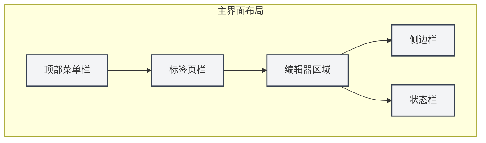
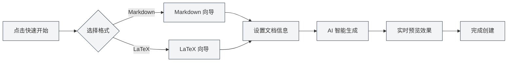

# 빠른 시작 가이드

## 개요

MetaDoc에 오신 것을 환영합니다! 이는 지식 근로자를 위한 지능형 문서 처리 도구입니다. 기술 블로그 작성, 학습 노트 정리, 학술 논문 준비 등 어떤 작업을 하시든 MetaDoc은 전문적이고 우아한 편집 경험을 제공합니다.

MetaDoc은 인공 지능 기능을 깊이 통합하여 Markdown과 LaTeX 두 가지 주요 문서 형식을 지원합니다. 단순한 텍스트 편집기가 아닌, 내장된 AI 대화, 자동 완성, 지능형 교정 등의 기능을 갖춘 스마트 글쓰기 도우미입니다. 이를 통해 문서 작성이 더욱 효율적이고 즐거워집니다.

## 처음 사용하기

### 애플리케이션 시작

MetaDoc을 시작하면 가장 먼저 홈 화면을 보게 됩니다. 이는 신속하게 작업을 시작할 수 있도록 설계된 출발점입니다:

- **빠른 시작**: 스마트 가이드가 문서 형식 선택 및 새 문서 생성을 안내합니다.
- **새 문서**: 필요한 형식을 선택하여 빈 문서를 직접 생성합니다.
- **파일 열기**: 기존 문서를 탐색하여 엽니다.
- **사용자 설명서**: 상세한 사용 가이드를 언제든지 참조할 수 있습니다.

### 인터페이스 소개

MetaDoc의 인터페이스는 현대적 편집기의 레이아웃 개념을 따르며, 명확하고 직관적입니다:

1. **상단 메뉴 바**

   창의 가장 상단에 위치하며, 파일, 편집, 보기 등의 핵심 기능을 모아놓았습니다. 새 문서 생성, 텍스트 찾기 및 바꾸기, 보기 모드 전환 등 필요한 모든 기능의 진입점을 여기서 찾을 수 있습니다. 메뉴 바는 사용자 정의를 지원하므로 사용 습관에 따라 메뉴 항목의 표시와 정렬을 조정할 수 있습니다.

2. **탭 바**

   메뉴 바 아래에 위치하며, 현재 열려 있는 모든 문서를 표시합니다. 각 문서는 하나의 탭에 해당하며, 클릭하여 전환할 수 있습니다. 탭은 드래그하여 순서를 조정하거나, 자주 사용하는 문서를 고정하여 실수로 닫히는 것을 방지할 수 있습니다. 탭이 많을 경우, 창을 넘나들며 문서를 구성할 수도 있습니다.

3. **편집기 영역**

   이곳이 주요 작업 공간입니다. MetaDoc은 다양한 유형의 문서에 맞춘 전용 편집 환경을 제공합니다:

   - **Markdown 편집기**: 실시간 미리보기, 수학 공식, 차트 등 풍부한 기능을 지원하는 WYSIWYG 편집 경험
   - **LaTeX 편집기**: 코드 하이라이트, 지능형 힌트, 컴파일 미리보기 등의 기능을 지원하는 전문 학술 작성 환경

4. **사이드바**

   편집기 왼쪽에 위치한 문서 네비게이션 센터입니다. 여기서 다음을 할 수 있습니다:

   - 편집기, 개요, Agent 등 다양한 뷰로 전환
   - 문서 구조 개요 확인
   - 지식 베이스 및 참조 자료 관리

5. **상태 바**

   창 하단에 위치하며, 현재 문서의 상태 정보(글자 수 통계, 저장 상태, 언어 설정 등)를 실시간으로 표시하여 작업 진행 상황을 한눈에 파악할 수 있게 합니다.

아래는 실제 인터페이스 컨트롤을 보여주어 조작 시 참고할 수 있도록 한 것입니다:

**상단 메뉴 바**

창의 가장 상단에 위치하며, 파일, 편집, 보기 등의 주 메뉴를 포함하여 애플리케이션 수준의 작업 진입점을 제공합니다. 메뉴 바를 통해 새로 만들기, 열기, 저장 등의 문서 작업과 다양한 편집 및 보기 기능에 접근할 수 있습니다.

<MenuItemsDemo mode="demo" :items='[{"id": "file", "items": ["new", "open", "save"]}, {"id": "edit", "items": ["undo", "redo", "find"]}, {"id": "view", "items": ["editor", "outline"]}]' />

**탭 바**

메뉴 바 아래에 위치하며, 현재 열려 있는 모든 문서 탭을 표시합니다. 탭을 클릭하여 문서를 전환하거나, 드래그하여 순서를 조정하거나, 탭을 우클릭하여 더 많은 작업(닫기, 고정, 새 창으로 이동 등)을 수행할 수 있습니다.

<MainTabs mode="demo" />

**사이드바**

편집기 왼쪽에 위치하며, 다양한 보조 기능 패널의 진입점을 제공합니다. 사이드바를 통해 편집기 뷰, 개요 뷰, Agent 뷰 등 사이를 빠르게 전환하여 문서 편집 효율을 높일 수 있습니다.

<ViewMenuItemsDemo mode="demo" :items='["editor", "outline", "home"]' />

## 빠른 문서 생성

### 방법 1: 빠른 시작 가이드 사용

MetaDoc의 빠른 시작 가이드는 세심한 설계입니다. 단순히 빈 문서를 생성하는 것이 아니라, 경험 많은 조수처럼 문서 생성의 모든 단계를 안내합니다:

1. 홈 화면에서 "빠른 시작" 버튼 클릭
2. 필요에 따라 문서 형식 선택:
   - **Markdown**: 블로그, 기술 문서, 회의록 또는 일상적인 텍스트 내용을 작성할 경우 가장 가벼운 선택입니다. Markdown 문법은 간단하고 직관적이면서도 풍부한 서식 요구를 충족시킵니다.
   - **LaTeX**: 학술 논문, 학위 논문 또는 정밀한 서식이 필요한 과학 기술 문서를 준비 중이라면 LaTeX이 학계에서 인정받는 표준입니다. MetaDoc은 복잡한 LaTeX 컴파일을 쉽고 이해하기 쉽게 만듭니다.
3. 가이드는 선택에 따라 적절한 템플릿과 AI 보조 기능을 제공합니다.

#### 형식 선택 인터페이스

가이드의 첫 단계는 문서 형식 선택입니다. MetaDoc은 사용 시나리오에 따라 적절한 옵션을 지능적으로 추천합니다:

#### Markdown 빠른 시작

Markdown을 선택하면 가이드는 다음을 제공합니다:

- **지능형 제목 제안**: AI가 초기 입력을 기반으로 적절한 문서 제목을 제안합니다.
- **구조화된 개요**: 문서 프레임워크를 자동 생성하여 아이디어를 구성하는 데 도움을 줍니다.
- **실시간 미리보기**: 작성하면서 동시에 최종 문서 모습을 즉시 확인할 수 있습니다.

#### LaTeX 빠른 시작

LaTeX을 선택하면 가이드는 다음을 제공합니다:

- **전문 템플릿**: 다양한 학술 시나리오에 최적화된 템플릿(논문, 보고서, 프레젠테이션 등)
- **구조 안내**: 표준 LaTeX 문서 구조를 자동 생성합니다.
- **지능형 완성**: AI가 LaTeX 코드 생성을 보조하여 학습 장벽을 낮춥니다.

#### 가이드의 핵심 가치

빠른 시작 가이드의 핵심은 **장벽을 낮추고 효율성을 높이는** 데 있습니다:

- **초보자 친화적**: 복잡한 문법을 기억할 필요 없이, 가이드가 단계별로 안내합니다.
- **전문가에게 효율적**: AI 보조 기능으로 문서 프레임워크를 빠르게 생성하여 반복 작업을 절약합니다.
- **컨텍스트 인식**: 이미 몇 가지 아이디어가 있다면 AI에 직접 알려주면 완전한 문서 구조로 확장해 줍니다.

#### 가이드 작업 흐름

### 방법 2: 직접 새 문서 생성

MetaDoc에 익숙하다면, 빈 문서를 직접 생성하여 작업을 시작할 수 있습니다:

1. 홈 화면의 "새 문서" 버튼을 클릭하거나 단축키 `Ctrl+N`을 누릅니다.
2. 문서 형식(Markdown / LaTeX / 일반 텍스트)을 선택합니다.
3. 문서가 즉시 편집기에서 열리며, 작성을 시작할 수 있습니다.

이 방법은 경험 많은 사용자나 명확한 작성 계획이 있는 시나리오에 적합합니다.

### 방법 3: 기존 파일 열기

이전 작업을 계속하는 것도 간단합니다:

1. 홈 화면의 "파일 열기" 버튼을 클릭하거나 `Ctrl+O`를 누릅니다.
2. 파일 탐색기에서 문서를 찾습니다.
3. 선택한 파일이 새 탭에서 열리며, 중단 없이 편집을 계속할 수 있습니다.

MetaDoc은 최근에 연 문서를 자동으로 기억하여 작업 상태로 빠르게 돌아갈 수 있도록 합니다.

## 기본 작업

### 문서 편집

MetaDoc의 편집 경험은 내용 자체에 집중할 수 있도록 세심하게 설계되었습니다:

- **부드러운 입력**: 빠르게 영감을 기록하거나 글을 세심하게 다듬을 때, 편집기가 생각의 흐름을 따라갈 수 있습니다.
- **지능형 서식**: Markdown 편집기는 WYSIWYG를 지원하고, LaTeX 편집기는 구문 강조와 지능형 힌트를 제공합니다.
- **풍부한 요소**: 이미지, 표, 코드 블록, 수학 공식 등의 요소를 쉽게 삽입하여 문서를 더욱 생동감 있고 전문적으로 만들 수 있습니다.
- **실시간 미리보기**: Markdown 문서는 작성하면서 동시에 최종 결과를 즉시 확인할 수 있습니다.

### 문서 저장

MetaDoc은 작업이 손실되지 않도록 여러 가지 저장 방식을 제공합니다:

- **즉시 저장**: `Ctrl+S`로 현재 문서를 빠르게 저장합니다. 가장 일반적으로 사용되는 작업입니다.
- **새 문서로 저장**: `Ctrl+Shift+S` 현재 문서를 사본으로 저장해야 할 때 사용합니다.
- **일괄 저장**: `Ctrl+K S` 열려 있는 모든 문서를 한 번에 저장합니다. 작업 정리 마무리에 적합합니다.

또한 설정에서 자동 저장 기능을 활성화하여 MetaDoc이 정기적으로 문서를 자동 저장하도록 할 수 있습니다.

### 뷰 전환

MetaDoc은 다양한 작업 단계의 요구를 충족시키기 위해 여러 뷰 모드를 제공합니다:

- **편집기 뷰**: 문서 편집의 주요 작업 공간으로, 완전한 편집 기능을 제공합니다.
- **개요 뷰**: 문서 제목 계층을 트리 구조로 표시하여 빠른 탐색 및 구조 조정에 적합합니다.
- **PDF 미리보기**: LaTeX 문서 컴파일 후의 미리보기로, 최종 서식 효과를 확인하기 편리합니다.

사이드바나 단축키를 통해 다양한 뷰 사이를 빠르게 전환할 수 있습니다.

## 도움말 얻기

MetaDoc은 상세한 사용자 설명서를 내장하고 있어 언제든지 질문에 답변해 드립니다:

1. `F1` 키를 누르거나 홈 화면의 "사용자 설명서" 버튼을 클릭합니다.
2. 설명서는 주제별로 분류되어 있으며, 기본 작업부터 고급 기능까지 모두 포함되어 있습니다.
3. 검색 기능을 사용하여 필요한 내용을 빠르게 찾을 수 있습니다.

설명서가 다루는 내용은 다음과 같습니다:

- 편집기 상세 사용 가이드
- 파일 및 프로젝트 관리 기술
- AI 기능 심층 튜토리얼
- Agent 프레임워크 작동 원리
- 개인화 설정 옵션

## 더 알아보기

빠른 시작을 완료하는 것은 첫걸음에 불과합니다. MetaDoc에는 탐험할 수 있는 더 많은 강력한 기능이 있습니다:

1. **편집 기술 숙달**: [[core.editor-basics|편집기 기본 작업]]을 이해하여 작성 효율성을 높입니다.
2. **파일 관리 숙련**: [[core.file-operations|파일 작업]]의 모범 사례를 학습합니다.
3. **편집기 기능 심화**:
   - Markdown 사용자: [[markdown.editor|Markdown 편집기 사용 가이드]]를 확인하세요.
   - LaTeX 사용자: [[latex.editor|LaTeX 편집기 사용 가이드]]를 확인하세요.
4. **AI 능력 체험**: [[ai.chat|AI 대화]] 및 [[ai.completion|AI 자동 완성]] 기능을 시도해 보세요.

MetaDoc의 설계 철학은 **기술을 보이지 않게 하고, 창작을 자유롭게 하는** 것입니다. 이 도구가 여러분의 지식 작업에 든든한 조수가 되길 바랍니다.

## 관련 문서

- [[core.file-operations|파일 작업]]
- [[core.editor-basics|편집기 기본 작업]]
- [[markdown.editor|Markdown 편집기 사용 가이드]]
- [[latex.editor|LaTeX 편집기 사용 가이드]]
- [[settings.basic|기본 설정]]
