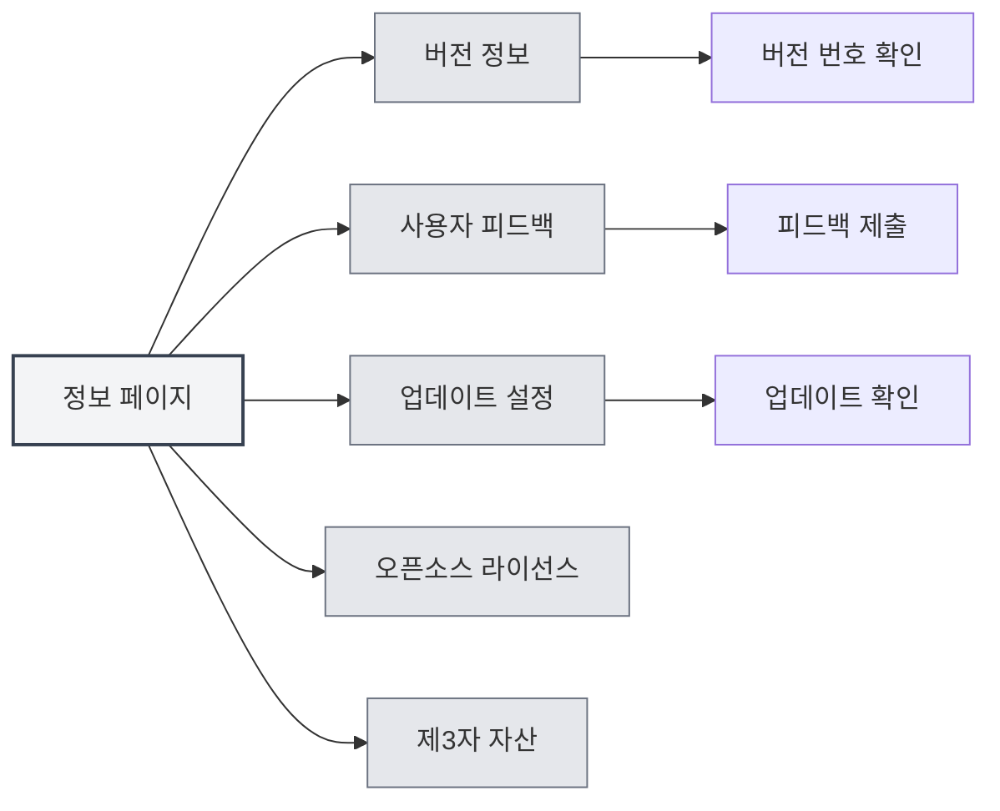
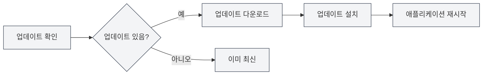

# 정보

## 개요

정보 페이지는 MetaDoc의 버전 정보, 업데이트 설정, 오픈소스 라이선스 및 제3자 자산 정보를 제공합니다. 이 페이지를 통해 애플리케이션 정보를 확인하고, 업데이트를 점검하며, 피드백을 제출하는 등의 작업을 할 수 있습니다.

## 버전 정보

### 버전 확인

정보 페이지에서 다음 정보를 확인할 수 있습니다:

- **애플리케이션 이름**: MetaDoc
- **버전 번호**: 현재 설치된 버전 번호
- **릴리스 날짜**: 현재 버전의 릴리스 날짜
- **빌드 환경**: 개발 버전 또는 릴리스 버전

상단 메뉴 바를 통해 정보 페이지에 접근할 수 있습니다:

<MenuItemsDemo mode="demo" :items='[{"id": "settings", "items": ["about"]}]' />



### 버전 형식

버전 번호는 시맨틱 버저닝 형식을 사용합니다:

```
주 버전.부 버전.수정 버전
```

예시: `0.12.1`

### 빌드 환경

- **개발 버전**: 개발 환경에서 빌드된 버전으로, 디버깅 정보가 포함될 수 있습니다.
- **릴리스 버전**: 공식적으로 릴리스된 버전으로, 테스트와 최적화를 거쳤습니다.

<SettingAboutSection mode="demo" />

## 사용자 피드백

### 피드백 제출

다음 방법으로 피드백을 제출할 수 있습니다:

1. 정보 페이지에서 "사용자 피드백" 버튼을 클릭합니다.
2. 피드백 페이지에서 피드백 내용을 작성합니다.
3. 피드백을 제출합니다.

### 피드백 내용

피드백 시 다음 정보를 포함할 수 있습니다:

- **문제 설명**: 발생한 문제를 상세히 설명합니다.
- **재현 단계**: 문제를 재현하는 방법을 설명합니다.
- **기대 동작**: 기대하는 동작을 설명합니다.
- **실제 동작**: 실제로 발생한 동작을 설명합니다.
- **환경 정보**: 운영체제, 버전 번호 등.

### 피드백 제안

- **상세 설명**: 가능한 한 자세히 문제를 설명합니다.
- **스크린샷 제공**: 필요한 경우 스크린샷이나 화면 녹화를 제공합니다.
- **버전 정보**: 버전 번호와 빌드 환경 정보를 포함합니다.
- **재현 단계**: 명확한 재현 단계를 제공합니다.

<UserFeedbackView mode="demo" />

## 공식 QQ 그룹

### QQ 그룹 가입

MetaDoc 공식 QQ 그룹: **1079841705**

QQ 그룹에 가입하면 다음을 할 수 있습니다:

- 최신 소식과 업데이트 알림을 받습니다.
- 다른 사용자와 사용 경험을 교류합니다.
- 기술 지원을 받습니다.
- 기능 논의에 참여합니다.

### 그룹 내 자료

QQ 그룹은 다음 자료를 제공합니다:

- **사용 튜토리얼**: 그룹 파일에 있는 사용 튜토리얼
- **문제 해결**: 그룹 구성원 간의 상호 도움
- **업데이트 알림**: 최초로 업데이트 정보를 받습니다.
- **기능 제안**: 기능 논의 및 제안에 참여합니다.

## 업데이트 설정

### 자동 업데이트 확인

"자동 업데이트 확인"을 활성화하면 MetaDoc은 시작 시 자동으로 새 버전이 있는지 확인합니다:

- **활성화**: 시작 시 자동으로 업데이트를 확인합니다.
- **비활성화**: 자동으로 업데이트를 확인하지 않습니다.

### 업데이트 채널

업데이트 채널을 선택할 수 있습니다:

- **정식 버전**: 공식적으로 릴리스된 버전을 사용합니다 (권장).
- **개발 버전**: 개발 버전을 사용합니다 (불안정할 수 있음).

<MainTabs mode="demo" />

### 수동 업데이트 확인

언제든지 수동으로 업데이트를 확인할 수 있습니다:

1. 정보 페이지의 "업데이트 설정" 탭에서
2. "업데이트 확인" 버튼을 클릭합니다.
3. 확인이 완료될 때까지 기다립니다.

### 업데이트 상태

업데이트 확인 후 다음 상태가 표시됩니다:

- **사용 가능한 업데이트 있음**: 새 버전 정보를 표시하며, 업데이트를 다운로드할 수 있습니다.
- **이미 최신 버전입니다**: 현재 버전이 최신입니다.
- **확인 실패**: 오류 메시지를 표시합니다.

### 업데이트 다운로드 및 설치

사용 가능한 업데이트가 있는 경우:

1. **업데이트 다운로드**: "업데이트 다운로드" 버튼을 클릭합니다.
2. **다운로드 대기**: 다운로드 진행 상황을 확인합니다.
3. **업데이트 설치**: 다운로드 완료 후 "설치 및 재시작" 버튼을 클릭합니다.
4. **자동 재시작**: 애플리케이션이 자동으로 재시작되어 업데이트를 설치합니다.



<QuickStartPanel mode="demo" />

## 오픈소스 라이선스

### 라이선스 확인

정보 페이지의 "오픈소스 라이선스" 탭에서 다음을 확인할 수 있습니다:

- **오픈소스 라이선스**: MetaDoc이 사용하는 오픈소스 라이선스
- **라이선스 내용**: 완전한 라이선스 텍스트

### 라이선스 정보

MetaDoc은 오픈소스 라이선스를 따르며, 다음을 할 수 있습니다:

- 라이선스 내용 확인
- 사용 약관 이해
- 권리와 의무 이해

## 제3자 자산

### 제3자 자산 확인

정보 페이지의 "제3자 자산" 탭에서 다음을 확인할 수 있습니다:

- **제3자 라이브러리**: MetaDoc이 사용하는 제3자 오픈소스 라이브러리
- **자산 정보**: 제3자 자산의 라이선스 및 출처 정보

### 자산 목록

제3자 자산 목록은 다음을 포함합니다:

- **라이브러리 이름**: 제3자 라이브러리의 이름
- **버전**: 사용 중인 버전 번호
- **라이선스**: 라이브러리의 라이선스 유형
- **출처**: 라이브러리의 출처 링크

## 모범 사례

1. **정기적 업데이트**: 자동 업데이트 확인을 활성화하여 새 버전을 적시에 받는 것이 좋습니다.
2. **문제 피드백**: 문제가 발생하면 즉시 피드백을 제출합니다.
3. **QQ 그룹 가입**: 공식 QQ 그룹에 가입하여 지원과 정보를 얻습니다.
4. **라이선스 확인**: 오픈소스 라이선스의 사용 약관을 이해합니다.
5. **업데이트 주시**: 업데이트 알림을 주시하여 새로운 기능과 수정 사항을 파악합니다.

## 주의 사항

1. **업데이트 전 백업**: 업데이트 전 중요한 데이터를 백업하는 것이 좋습니다.
2. **네트워크 연결**: 업데이트 확인에는 네트워크 연결이 필요합니다.
3. **버전 호환성**: 업데이트 후 일부 설정을 다시 구성해야 할 수 있습니다.
4. **피드백 정보**: 피드백 제출 시 개인정보 보호에 유의합니다.
5. **라이선스 준수**: MetaDoc 사용 시 오픈소스 라이선스를 준수합니다.

<ResizableDivider mode="demo" />

## 관련 문서

- [[settings.basic|기본 설정]]
- [[settings.logging|로그 구성]]
- [[quick-start.guide|빠른 시작 가이드]]

<SettingAboutSection mode="demo" />

<UserFeedbackView mode="demo" />

<MenuItemsDemo mode="demo" :items='[{"id": "settings", "items": ["about"]}]' />

<MainTabs mode="demo" />