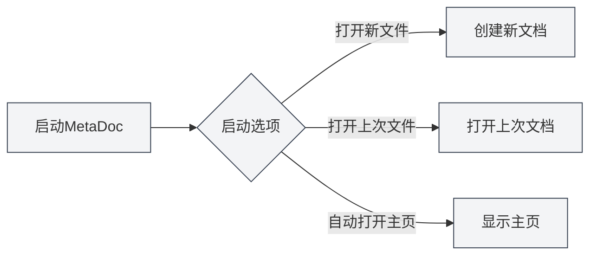
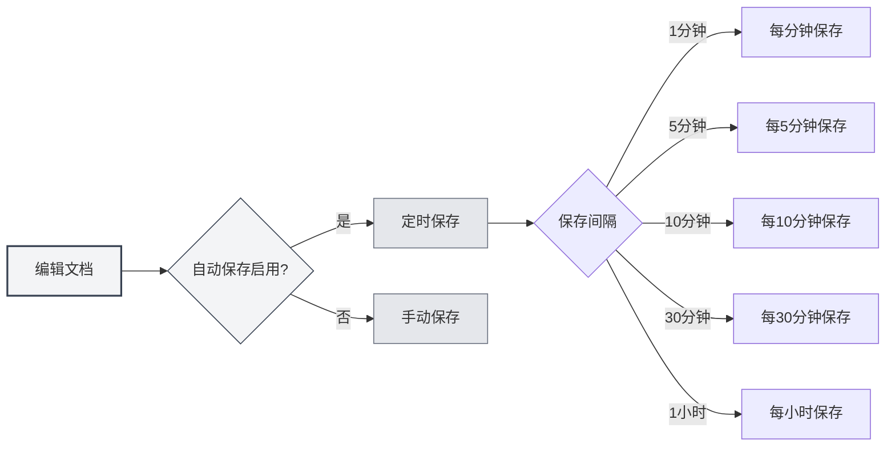
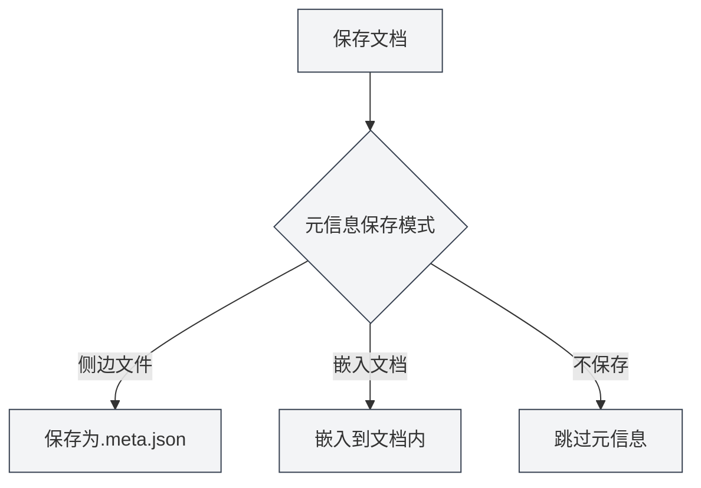

# 기본 설정

## 개요

기본 설정은 MetaDoc의 핵심 구성 옵션으로, 애플리케이션 시작 동작, 자동 저장, 문서 통계, 메타정보 관리 등 중요한 기능을 포함합니다. 이러한 옵션을 적절히 구성하면 사용 경험과 작업 효율성을 향상시킬 수 있습니다.

## 시작 옵션

### 시작 동작 설정

시작 옵션은 MetaDoc이 시작될 때의 기본 동작을 결정합니다:

- **새 파일 열기**: 매번 시작할 때 새로운 빈 문서를 생성합니다.
- **마지막으로 편집한 파일 열기**: 종료 시 편집 중이던 문서를 시작할 때 자동으로 엽니다.

사용 습관에 따라 적절한 시작 옵션을 선택할 수 있습니다. 이전 작업을 이어서 진행하는 경우가 많다면 "마지막으로 편집한 파일 열기"를 선택하는 것이 좋습니다.

상단 메뉴 바를 통해 설정에 접근할 수 있습니다:

<MenuItemsDemo mode="demo" :items='[{"id": "settings"}]' />

### 기본 설정 인터페이스

아래 그림은 기본 설정 페이지의 전체 인터페이스를 보여줍니다:

<SettingBasicSection mode="demo" />

기본 설정 인터페이스에는 다음과 같은 주요 구성 영역이 포함되어 있습니다:

- **시작 옵션**: 애플리케이션 시작 시 기본 동작 설정 (새 파일 열기/마지막으로 편집한 파일 열기)
- **자동 저장**: 데이터 손실을 방지하기 위한 자동 저장 시간 간격 구성
- **메타데이터 저장**: 메타데이터 저장 방식 선택 (문서 내/독립 파일)
- **참조 디렉토리**: 문서가 참조하는 외부 파일 저장 위치 관리
- **기타 옵션**: 코드 블록 처리, 이미지 임베딩, 수학 공식 등 고급 설정

### 시작 시 홈페이지 자동 열기

이 옵션을 활성화하면 MetaDoc 시작 시 홈페이지 탭이 자동으로 열립니다. 홈페이지는 빠른 시작, 최근 문서 목록 등의 기능을 제공하여 자주 사용하는 기능에 빠르게 접근할 수 있도록 합니다.

## 자동 저장

<SettingBasicSection mode="demo" />

### 자동 저장 구성

자동 저장 기능은 프로그램 충돌, 정전 등 예상치 못한 상황으로 인한 내용 손실을 방지할 수 있습니다. MetaDoc은 다음과 같은 자동 저장 간격을 지원합니다:

- **끄기**: 자동 저장하지 않으며, 수동으로 저장해야 합니다.
- **1분**: 1분마다 자동으로 저장합니다.
- **5분**: 5분마다 자동으로 저장합니다.
- **10분**: 10분마다 자동으로 저장합니다.
- **30분**: 30분마다 자동으로 저장합니다.
- **1시간**: 1시간마다 자동으로 저장합니다.

### 사용 권장사항

- **빈번한 편집**: 짧은 자동 저장 간격(1-5분)을 설정하여 내용이 제때 저장되도록 하는 것이 좋습니다.
- **장시간 작성**: 긴 간격(10-30분)을 설정하여 디스크 쓰기 빈도를 줄일 수 있습니다.
- **중요 문서**: 자동 저장을 활성화하고 수동 저장(`Ctrl+S`)과 함께 사용하여 데이터 안전을 보장하는 것이 좋습니다.

자동 저장은 백그라운드에서 자동으로 수행되며 편집 작업을 방해하지 않습니다.

## 문서 통계 설정

<SettingBasicSection mode="demo" />

### 코드 블록 통계 제외

이 옵션을 활성화하면 문서의 글자 수, 단어 빈도 등의 정보를 통계할 때 코드 블록 내의 내용을 제외합니다. 이는 기술 문서에 특히 유용합니다. 코드 블록 내의 내용은 일반적으로 문서의 텍스트 통계에 포함되지 않아야 하기 때문입니다.

**사용 시나리오**:

- 기술 문서에 많은 코드 예제가 포함된 경우
- 문서의 실제 텍스트 내용을 정확히 통계해야 하는 경우
- 코드가 단어 빈도 분석 결과에 영향을 주지 않도록 하려는 경우

## 이미지 처리 설정

<SettingBasicSection mode="demo" />

### 임베디드 이미지 파싱 (OCR 기능)

이 옵션을 활성화하면 MetaDoc은 문서에 임베디드된 이미지를 OCR(광학 문자 인식) 처리하여 이미지 내의 텍스트 내용을 추출합니다. 이는 이미지가 포함된 문서(예: PDF, Word 문서)를 처리할 때 특히 유용합니다.

**기능 설명**:

- 업로드된 DOCX, PPTX, PDF 파일 내의 이미지는 OCR 처리됩니다.
- 직접 업로드된 이미지 파일은 여전히 OCR 처리됩니다 (이 옵션의 영향을 받지 않음).
- OCR 결과는 지식 베이스 검색 및 AI 보조 기능에 사용될 수 있습니다.

**주의사항**:

- OCR 처리는 일정한 계산 자원이 필요하며, 문서 로딩 속도에 영향을 줄 수 있습니다.
- 이미지 내의 텍스트를 추출할 필요가 없다면 성능 향상을 위해 이 기능을 끌 수 있습니다.

### 수학 공식 인라인 숫자

이 옵션을 활성화하면 수학 공식 내의 숫자가 블록 수준 모드가 아닌 인라인 모드로 표시됩니다. 이렇게 하면 공식이 텍스트 흐름에 더 잘 통합되어 단락에 간단한 수학 표현식을 삽입하는 데 적합합니다.

## 메타정보 저장 모드

<SettingBasicSection mode="demo" />

### 저장 방식 설정

문서 메타정보(제목, 작성자, 설명, 키워드 등)는 세 가지 방식으로 저장할 수 있습니다:

- **사이드 파일**: 메타정보를 문서와 같은 디렉토리의 독립 파일(`.meta.json`)에 저장합니다.
  - 장점: 원본 문서 내용에 영향을 주지 않으며, 버전 관리에 용이합니다.
  - 단점: 두 개의 파일을 동시에 관리해야 합니다.
- **문서 내 임베딩**: 메타정보를 문서 파일 내부에 임베딩합니다.
  - 장점: 단일 파일 관리로 공유가 용이합니다.
  - 단점: 일부 형식은 임베딩을 지원하지 않을 수 있습니다.
- **저장 안 함**: 메타정보를 저장하지 않습니다.
  - 적용 시나리오: 임시 문서 또는 메타정보가 필요 없는 문서

### 선택 권장사항

- **기술 문서**: "사이드 파일" 모드를 권장합니다. Git과 같은 버전 관리 시스템으로 관리하기 쉽습니다.
- **개인 노트**: "문서 내 임베딩" 모드를 사용하여 단일 파일을 깔끔하게 유지할 수 있습니다.
- **임시 문서**: "저장 안 함" 모드를 선택할 수 있습니다.

## 참조 파일 디렉토리 관리

<SettingBasicSection mode="demo" />

### 디렉토리 정보 확인

참조 파일 디렉토리는 문서에서 참조하는 외부 파일(이미지, 첨부 파일 등)을 저장하는 데 사용됩니다. 기본 설정 페이지에서 다음을 수행할 수 있습니다:

- **디렉토리 크기 확인**: 참조 파일 디렉토리가 차지하는 디스크 공간을 표시합니다.
- **새로 고침**: 디렉토리 크기 정보를 업데이트합니다.
- **디렉토리 열기**: 파일 관리자에서 참조 파일 디렉토리를 엽니다.
- **디렉토리 비우기**: 디렉토리 내 모든 파일을 삭제합니다 (작업은 복구할 수 없음).

### 사용 시나리오

참조 파일 디렉토리는 일반적으로 다음 용도로 사용됩니다:

- 문서에 삽입된 이미지 저장
- 문서 첨부 파일 저장
- 문서 관련 리소스 파일 관리

**주의사항**:

- 디렉토리 비우기 작업은 복구할 수 없으므로 신중하게 수행하십시오.
- 비우기 전에 중요한 파일을 백업하는 것이 좋습니다.
- 문서에서 참조하는 파일이 증가함에 따라 디렉토리 크기도 커집니다.

## 주의사항

1. **시작 옵션**: 시작 옵션을 변경한 후에는 다음에 애플리케이션을 시작할 때 적용됩니다.
2. **자동 저장**: 자동 저장은 수동 저장 작업을 덮어쓰지 않으며, 두 가지를 함께 사용할 수 있습니다.
3. **메타정보 모드**: 메타정보 저장 모드를 변경한 후 새로 저장하는 문서는 새로운 모드를 사용하며, 기존 문서는 영향을 받지 않습니다.
4. **참조 디렉토리**: 참조 디렉토리를 비우기 전에 어떤 문서도 해당 파일을 사용하고 있지 않은지 확인하십시오.

## 관련 문서

- [[core.file-operations|파일 작업]]
- [[core.document-metadata|문서 메타정보]]
- [[settings.theme|테마 설정]]
- [[settings.image|이미지 설정]]

<MenuItemsDemo mode="demo" :items='[{"id": "settings", "items": ["basic"]}]' />