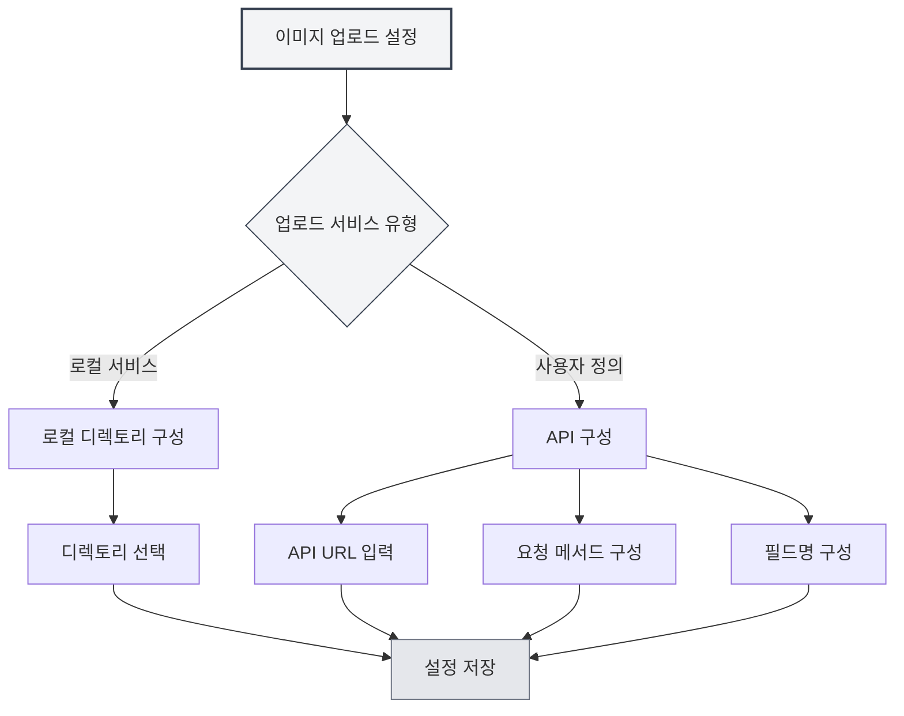

# 업로드 서비스 설정

## 개요

업로드 서비스 설정을 통해 이미지 업로드 대상 서비스를 구성할 수 있습니다. MetaDoc은 로컬 서비스와 사용자 정의 API 두 가지 업로드 방식을 지원하며, 필요에 따라 적절한 서비스를 선택할 수 있습니다.

## 업로드 서비스 유형

### 서비스 선택

이미지 설정 페이지에서 "이미지 삽입 동작"이 "업로드"로 설정된 경우, 업로드 서비스를 선택할 수 있습니다:

- **로컬 서비스**: 이미지를 로컬 디렉토리에 저장
- **사용자 정의**: 사용자 정의 API를 사용하여 이미지 업로드

상단 메뉴 바를 통해 이미지 업로드 설정에 접근할 수 있습니다:

<MenuItemsDemo mode="demo" :items='[{"id": "settings"}]' />



### 로컬 서비스

로컬 서비스는 이미지를 로컬 파일 시스템에 저장합니다:

- **장점**: 완전한 로컬 제어, 데이터 보안
- **단점**: 로컬 디렉토리 구성 필요
- **적용 시나리오**: 로컬 사용, 데이터 프라이버시 요구사항이 높은 경우

<SettingImageSection mode="demo" />

### 사용자 정의 서비스

사용자 정의 서비스는 외부 API를 사용하여 이미지를 업로드합니다:

- **장점**: 클라우드 스토리지, 이미지 호스팅 등에 업로드 가능
- **단점**: API 인터페이스 구성 필요
- **적용 시나리오**: 클라우드 스토리지, 이미지 CDN 등이 필요한 경우

<MainTabs mode="demo" />

## 로컬 이미지 디렉토리 구성

### 디렉토리 설정

로컬 서비스를 사용할 때는 이미지 저장 디렉토리를 구성해야 합니다:

1. 이미지 설정 페이지에서 "로컬 서비스" 선택
2. "찾아보기" 버튼을 클릭하여 디렉토리 선택
3. 또는 입력 상자에 직접 디렉토리 경로 입력
4. "열기" 버튼을 클릭하면 파일 관리자에서 디렉토리 열기

### 디렉토리 선택

이미지 디렉토리를 선택할 때:

- **찾아보기 버튼**: 디렉토리 선택 대화상자 열기
- **경로 입력**: 직접 디렉토리 경로 입력
- **열기 버튼**: 파일 관리자에서 설정된 디렉토리 열기

### 기본 디렉토리

로컬 이미지 디렉토리를 설정하지 않으면 시스템이 기본 디렉토리를 사용합니다:

- **Windows**: `%APPDATA%/MetaDoc/images`
- **macOS**: `~/Library/Application Support/MetaDoc/images`
- **Linux**: `~/.config/MetaDoc/images`


### 디렉토리 관리

- **디렉토리 보기**: "열기" 버튼을 클릭하여 디렉토리 내용 확인
- **디렉토리 변경**: "찾아보기" 버튼을 클릭하여 새 디렉토리 선택
- **디렉토리 요구사항**: 디렉토리가 존재하고 쓰기 권한이 있는지 확인

## 사용자 정의 업로드 API 구성

### API URL 구성

사용자 정의 서비스를 사용할 때는 API 주소를 구성해야 합니다:

1. 이미지 설정 페이지에서 "사용자 정의" 서비스 선택
2. "사용자 정의 업로드 API URL" 입력 상자에 API 주소 입력
3. 형식 예시: `https://api.example.com/upload`

### API 메서드 구성

API 요청 메서드를 구성합니다:

- **POST**: POST 메서드를 사용하여 업로드 (권장)
- **PUT**: PUT 메서드를 사용하여 업로드

대부분의 API는 POST 메서드를 사용하며, 일부 특수 API는 PUT 메서드를 사용할 수 있습니다.

### 필드명 구성

업로드 파일의 필드명을 구성합니다:

- **기본값**: `file`
- **사용자 정의**: API 요구사항에 따라 필드명 설정

다른 API는 `file`, `image`, `upload` 등 다른 필드명을 사용할 수 있습니다.

### API 구성 예시

**예시1: 표준 이미지 호스팅 API**

```
API URL: https://api.example.com/upload
메서드: POST
필드명: file
```

**예시2: 사용자 정의 필드명 API**

```
API URL: https://api.example.com/image
메서드: POST
필드명: image
```

**예시3: PUT 메서드 API**

```
API URL: https://api.example.com/upload
메서드: PUT
필드명: file
```

<ViewMenuItemsDemo mode="demo" :items='["home", "editor"]'
/>

## API 응답 형식

### 응답 요구사항

사용자 정의 API는 다음 형식의 JSON 응답을 반환해야 합니다:

```json
{
  "success": true,
  "imagePath": "https://example.com/image.png"
}
```

### 응답 필드

- **success**: 불리언 값, 업로드 성공 여부 표시
- **imagePath**: 문자열, 이미지의 URL 또는 경로 반환

### 오류 처리

업로드가 실패하면 API는 다음을 반환해야 합니다:

```json
{
  "success": false,
  "message": "오류 메시지"
}
```

<DialogDemo mode="demo" dialogType="api-config" />

## 구성 검증

### 구성 테스트

사용자 정의 API를 구성한 후에는 구성을 테스트하는 것이 좋습니다:

1. 문서에 이미지 삽입
2. 업로드 결과 확인
3. 실패할 경우 구성이 올바른지 확인

### 일반적인 문제

**연결 실패**:

- API URL이 올바른지 확인
- 네트워크 연결 확인
- API 서비스가 정상적으로 실행 중인지 확인

**업로드 실패**:

- API 메서드가 올바른지 확인
- 필드명이 올바른지 확인
- API 응답 형식이 요구사항을 충족하는지 확인

**권한 문제**:

- API에 인증이 필요한지 확인
- API Key 또는 Token이 올바른지 확인

<SettingBasicSection mode="demo" />

## 로컬 서비스 구성

### 디렉토리 권한

로컬 서비스를 사용할 때는 디렉토리에 쓰기 권한이 있는지 확인하세요:

- **Windows**: 폴더 권한 설정 확인
- **macOS/Linux**: 디렉토리 권한 확인 (chmod)

### 디렉토리 구조

로컬 서비스는 지정된 디렉토리에 이미지를 저장합니다:

- **파일 명명**: 타임스탬프 + 원본 파일명 사용
- **파일 형식**: 원본 형식 유지
- **디렉토리 구조**: 모든 이미지를 동일한 디렉토리에 저장

<OcrWindow mode="demo" />

### 이미지 접근

로컬 서비스의 이미지는 다음 방식으로 접근할 수 있습니다:

- **HTTP 서비스**: 런타임 서버의 `/images/` 경로를 통해 접근 (기본 주소는 애플리케이션 구성에 따름, 예: `http://127.0.0.1:52521/images/`)
- **파일 경로**: 파일 시스템 경로 직접 사용

## 모범 사례

1. **로컬 사용**: 로컬 사용 시 로컬 서비스 권장
2. **클라우드 스토리지**: 클라우드 스토리지가 필요할 때 사용자 정의 API 사용
3. **디렉토리 관리**: 정기적으로 이미지 디렉토리 정리하여 과도한 공간 점유 방지
4. **API 테스트**: 사용자 정의 API 구성 후 먼저 테스트
5. **백업 전략**: 중요한 이미지는 동시에 백업 권장

<MenuItemsDemo mode="demo" :items='[{"id": "file", "items": ["new", "open", "save"]}]' />

## 주의사항

1. **구성 적용**: 구성 변경 후 새로 삽입되는 이미지에만 새 구성 적용
2. **API 호환성**: 사용자 정의 API가 응답 형식 요구사항을 충족하는지 확인
3. **디렉토리 권한**: 로컬 디렉토리에 쓰기 권한이 있는지 확인
4. **네트워크 연결**: 사용자 정의 API는 네트워크 연결 필요
5. **저장 공간**: 로컬 서비스는 로컬 저장 공간을 차지함

## 관련 문서

- [[settings.image|이미지 업로드 구성]]
- [[settings.basic|기본 설정]]
- [[core.file-operations|파일 작업]]

<ResizableDivider mode="demo" />
