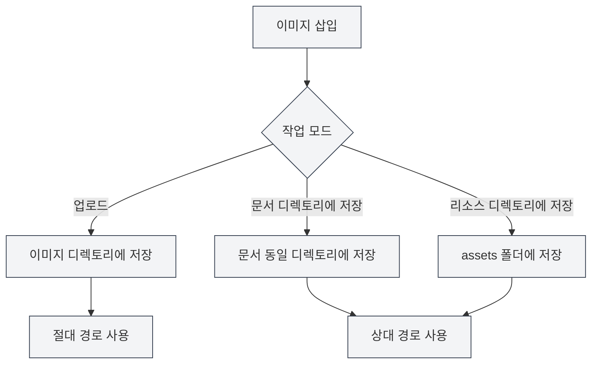

# 이미지 업로드 설정

## 개요

이미지 업로드 설정은 문서에 이미지를 삽입할 때의 처리 방식을 결정합니다. MetaDoc은 다양한 이미지 처리 모드를 지원하며, 필요에 따라 적절한 구성을 선택할 수 있습니다.

## 이미지 삽입 작업

### 작업 모드

이미지를 삽입할 때 다음 작업 모드 중 선택할 수 있습니다:

- **업로드**: 이미지를 지정된 이미지 디렉토리에 업로드
- **문서 디렉토리에 저장**: 이미지를 문서가 위치한 디렉토리에 저장
- **리소스 디렉토리에 저장**: 이미지를 문서 디렉토리 내 `assets` 폴더에 저장

상단 메뉴 바를 통해 이미지 설정에 접근할 수 있습니다:

<MenuItemsDemo mode="demo" :items='[{"id": "settings"}]' />

### 이미지 설정 인터페이스

아래 그림은 이미지 설정 페이지의 전체 인터페이스를 보여줍니다:

<SettingImageSection mode="demo" />

이미지 설정 인터페이스에는 다음 주요 구성 영역이 포함됩니다:

- **이미지 업로드 서비스**: 로컬 저장소 또는 제3자 이미지 호스팅 서비스 선택
- **로컬 저장 경로**: 이미지가 저장될 로컬 디렉토리 설정
- **네트워크 이미지 처리**: 원본 URL 유지 여부, 자동 저장 여부 등의 옵션 구성

### 업로드 모드

업로드 모드는 이미지를 구성된 로컬 이미지 디렉토리에 저장합니다:

- **장점**: 모든 이미지를 중앙 집중식으로 관리하여 백업 및 이동이 용이
- **단점**: 이미지와 문서가 분리되어 문서 이동 시 이미지도 함께 이동 필요
- **적용 시나리오**: 여러 문서가 이미지를 공유, 이미지 리소스 중앙 관리

<DialogDemo mode="demo" dialogType="image-upload" />

### 문서 디렉토리에 저장

이미지를 문서가 위치한 디렉토리에 저장합니다:

- **장점**: 이미지와 문서가 동일 디렉토리에 있어 관리가 용이
- **단점**: 각 문서 디렉토리에 이미지가 존재하여 중복 가능성 있음
- **적용 시나리오**: 단일 문서 프로젝트, 문서를 독립적으로 패키징해야 하는 경우

<DialogDemo mode="demo" dialogType="file-save" />

### 리소스 디렉토리에 저장

이미지를 문서 디렉토리 내 `assets` 폴더에 저장합니다:

- **장점**: 이미지가 `assets` 폴더에 통일되어 저장되어 구조가 명확
- **단점**: `assets` 폴더 생성 필요
- **적용 시나리오**: 명확한 파일 구조 필요, 문서를 내보내 공유해야 하는 경우

<DialogDemo mode="demo" dialogType="folder-select" />

## 네트워크 이미지 URL 유지

### 기능 설명

"네트워크 이미지 URL 유지"를 활성화하면 네트워크 이미지를 삽입할 때 이미지를 다운로드하지 않고 원본 URL을 직접 사용합니다:

- **활성화**: 네트워크 이미지의 원본 URL을 유지하고 로컬에 다운로드하지 않음
- **비활성화**: 네트워크 이미지를 로컬에 다운로드하여 로컬 경로 사용

### 사용 시나리오

- **활성화 시나리오**:

  - 이미지 리소스가 커서 로컬 백업이 필요하지 않은 경우
  - 이미지가 정기적으로 업데이트되어 최신 버전을 실시간으로 표시해야 하는 경우
  - 로컬 저장 공간 절약이 필요한 경우

- **비활성화 시나리오**:
  - 오프라인에서 이미지 접근이 필요한 경우
  - 이미지 리소스 백업이 필요한 경우
  - 네트워크 이미지가 유효하지 않을 수 있는 경우

### 주의사항

- 네트워크 URL을 유지할 경우, 이미지를 표시하려면 네트워크 연결이 필요합니다
- 네트워크 이미지가 유효하지 않게 되면 문서 내 이미지가 표시되지 않습니다
- 중요한 이미지의 경우 이 옵션을 비활성화하여 이미지 가용성을 보장하는 것이 좋습니다

## 이미지 URL 자동 이스케이프

### 기능 설명

"이미지 URL 자동 이스케이프"를 활성화하면 이미지 삽입 시 URL 내 특수 문자를 자동으로 이스케이프합니다:

- **활성화**: URL 내 특수 문자(공백, 한글 문자 등)를 자동 이스케이프
- **비활성화**: URL을 원본 그대로 유지하고 이스케이프하지 않음

### 이스케이프 규칙

시스템은 다음 문자를 자동으로 이스케이프합니다:

- **공백**: `%20`으로 변환
- **한글 문자**: URL 인코딩 수행
- **특수 문자**: URL 안전 형식으로 이스케이프

### 사용 권장사항

- **활성화**: 활성화를 권장하며, URL이 다양한 환경에서 올바르게 해석되도록 보장
- **비활성화**: URL 형식이 올바르고 이스케이프가 필요하지 않다고 확신할 때만 비활성화

## 경로 형식

### 절대 경로

업로드 모드를 사용할 때 이미지는 절대 경로를 사용합니다:

- **형식**: `/path/to/image.png`
- **장점**: 경로가 명확하며 문서 위치에 영향을 받지 않음
- **단점**: 문서 또는 이미지 이동 후 경로가 유효하지 않게 됨

### 상대 경로

문서 디렉토리 또는 리소스 디렉토리에 저장할 때 이미지는 상대 경로를 사용합니다:

- **형식**: `./image.png` 또는 `./assets/image.png`
- **장점**: 문서와 이미지를 함께 이동할 수 있음
- **단점**: 문서 위치 변경 후 경로 조정 필요

## 구성 적용

### 적용 시점

이미지 업로드 구성 변경은 다음 상황에서 적용됩니다:

- **새로 삽입된 이미지**: 즉시 새 구성 사용
- **열려 있는 문서**: 문서를 다시 열어야 적용됨
- **저장된 문서**: 이미 저장된 문서는 영향을 받지 않음

### 파일 다시 열기

일부 구성 변경은 파일을 다시 열어야 적용됩니다:

1. 이미지 업로드 구성 수정
2. 현재 문서 닫기
3. 문서 다시 열기
4. 새 구성 적용

## 모범 사례

1. **통합 관리**: 업로드 모드를 사용하여 이미지 중앙 관리
2. **문서 독립성**: 문서 독립성이 필요할 때 문서 디렉토리에 저장 모드 사용
3. **구조 명확성**: 리소스 디렉토리 모드를 사용하여 파일 구조 명확하게 유지
4. **네트워크 이미지**: 중요한 이미지는 URL 유지 옵션 비활성화 권장
5. **경로 이스케이프**: 자동 이스케이프 활성화 권장, 호환성 보장

## 주의사항

1. **구성 적용**: 일부 구성은 파일을 다시 열어야 적용됨
2. **경로 형식**: 절대 경로와 상대 경로의 차이점 주의
3. **네트워크 이미지**: 네트워크 URL 유지 시 네트워크 연결 필요
4. **이미지 백업**: 중요한 이미지는 URL 유지 비활성화 권장, 백업 보장
5. **저장 공간**: 업로드 모드는 로컬 저장 공간을 차지함

## 관련 문서

- [[settings.image-upload|업로드 서비스 설정]]
- [[settings.basic|기본 설정]]
- [[core.file-operations|파일 작업]]

<SettingImageSection mode="demo" />

<MenuItemsDemo mode="demo" :items='[{"id": "settings", "items": ["image"]}]' />

<DialogDemo mode="demo" dialogType="image-upload" />

<DialogDemo mode="demo" dialogType="file-save" />
