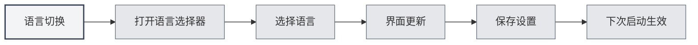

# 다국어 지원

## 개요

MetaDoc는 다국어 인터페이스를 지원하며, 사용자는 사용 습관에 따라 적절한 언어를 선택할 수 있습니다. 언어를 전환하면 인터페이스가 즉시 선택한 언어로 업데이트됩니다.

## 지원 언어

MetaDoc는 현재 다음 언어를 지원합니다:

- **中文简体** (zh_CN): 기본 언어
- **English** (en_US): 영어
- **日本語** (ja_JP): 일본어
- **한국어** (ko_KR): 한국어
- **Français** (fr_FR): 프랑스어
- **Deutsch** (de_DE): 독일어

## 언어 전환

### 언어 전환하기

1.  왼쪽 메뉴 하단의 언어 선택기를 클릭합니다.
2.  사용할 언어를 선택합니다.
3.  인터페이스가 즉시 선택한 언어로 업데이트됩니다.

상단 메뉴 바를 통해 언어 설정에 접근할 수 있습니다:

<MenuItemsDemo mode="demo" :items='[{"id": "settings"}]' />

<SettingBasicSection mode="demo" />

<SettingLlmSection mode="demo" />



### 언어 저장

선택한 언어는 자동으로 저장됩니다:

- **자동 저장**: 언어 선택 후 즉시 저장됩니다.
- **다음 시작 시**: 애플리케이션을 다음에 시작할 때 마지막으로 선택한 언어가 사용됩니다.
- **다중 창 동기화**: 모든 창의 언어 설정이 자동으로 동기화됩니다.

<SettingThemeSection mode="demo" />

## 인터페이스 현지화

### 현지화 범위

언어 전환은 다음 인터페이스 요소에 영향을 미칩니다:

- **메뉴 항목**: 모든 메뉴와 메뉴 항목
- **버튼 텍스트**: 모든 버튼의 텍스트
- **대화 상자**: 모든 대화 상자와 안내 메시지
- **설정 페이지**: 모든 설정 페이지의 레이블과 설명
- **오류 메시지**: 오류 및 경고 메시지

### 콘텐츠 언어

언어 설정은 인터페이스 언어에만 영향을 미치며, 다음에는 영향을 미치지 않습니다:

- **문서 콘텐츠**: 문서 내용은 원래 상태를 유지합니다.
- **파일 경로**: 파일 경로는 원래 상태를 유지합니다.
- **사용자 입력**: 사용자가 입력한 내용은 영향을 받지 않습니다.

<ViewMenuItemsDemo mode="demo" :items='["settings"]' />

## 언어 선택 권장 사항

### 사용 습관에 따라

- **중국어 사용자**: 중국어 간체를 사용하면 인터페이스가 더 친숙합니다.
- **영어 사용자**: English를 사용하면 사용 습관에 부합합니다.
- **기타 언어**: 개인 선호도에 따라 선택하세요.

### 문서 언어에 따라

- **중국어 문서**: 중국어 인터페이스를 사용할 수 있습니다.
- **영어 문서**: 영어 인터페이스를 사용할 수 있습니다.
- **다국어 문서**: 가장 자주 사용하는 언어를 선택하세요.

## 언어 전환 효과

### 즉시 적용

언어 전환은 즉시 적용됩니다:

- **인터페이스 업데이트**: 모든 인터페이스 요소가 즉시 업데이트됩니다.
- **재시작 불필요**: 애플리케이션을 재시작할 필요가 없습니다.
- **상태 유지**: 현재 편집 상태가 손실되지 않습니다.

<MainTabs mode="demo" />

### 다중 창 동기화

모든 창의 언어가 자동으로 동기화됩니다:

- **주 창**: 주 창의 언어가 전환됩니다.
- **보조 창**: 모든 보조 창이 동기화되어 업데이트됩니다.
- **새 창**: 새로 열린 창은 현재 언어를 사용합니다.

## 언어 파일

### 언어 파일 위치

언어 파일은 애플리케이션 디렉토리에 저장됩니다:

- **파일 형식**: JSON 형식
- **파일 위치**: `src/renderer/src/locales/`
- **파일 이름**: 언어 코드로 명명됩니다 (예: `zh_cn.json`)

### 언어 파일 구조

언어 파일은 키-값 쌍 구조를 사용합니다:

```json
{
  "common": {
    "confirm": "확인",
    "cancel": "취소"
  },
  "setting": {
    "basic": "기본 설정"
  }
}
```

## 주의 사항

1.  **언어 코드**: 언어 코드는 밑줄 형식을 사용합니다 (예: `zh_CN`).
2.  **번역 완성도**: 일부 새로운 기능은 일부 언어로만 번역되어 있을 수 있습니다.
3.  **대체 언어**: 번역이 누락된 경우 중국어 간체로 대체됩니다.
4.  **문서 콘텐츠**: 언어 설정은 문서 내용에 영향을 미치지 않습니다.
5.  **파일 경로**: 언어 설정은 파일 경로 표시에 영향을 미치지 않습니다.

## 관련 문서

- [[settings.basic|기본 설정]]
- [[quick-start.guide|빠른 시작 가이드]]

<ViewMenuItemsDemo mode="demo" :items='["settings"]' />
