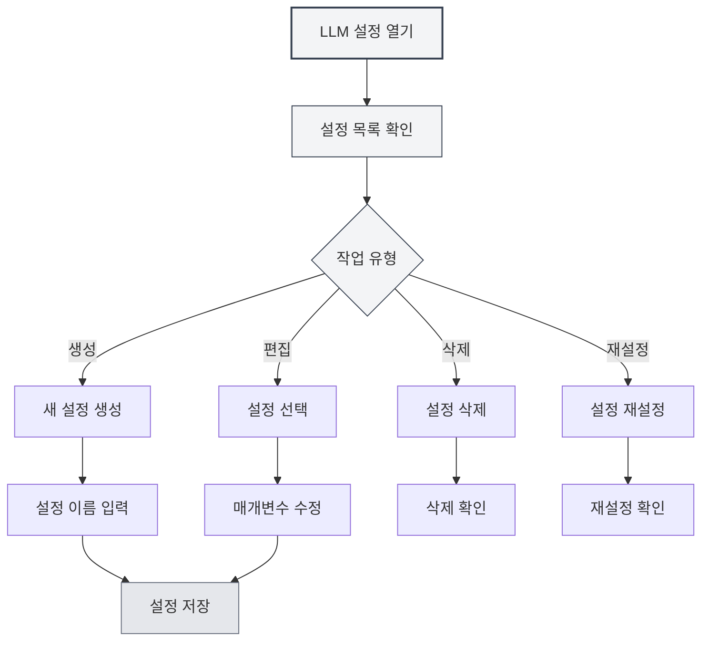

# LLM 설정 관리

## 개요

LLM 설정 관리를 통해 여러 LLM 구성을 생성, 편집, 삭제 및 관리할 수 있습니다. 설정 관리를 통해 다양한 사용 시나리오에 맞게 다른 LLM 서비스를 설정하고, 유연하게 전환하여 다양한 요구 사항을 충족할 수 있습니다.

## 설정 생성

### 새 설정 생성하기

1. LLM 설정 페이지에서 왼쪽 설정 목록 상단의 "새 설정" 버튼(+ 아이콘)을 클릭합니다.
2. 팝업되는 대화 상자에 설정 이름을 입력합니다.
3. 시스템이 현재 설정을 기반으로 새 구성을 생성합니다.
4. 생성이 성공하면 자동으로 새 구성으로 전환됩니다.

상단 메뉴 바를 통해 LLM 설정에 접근할 수 있습니다:

<MenuItemsDemo mode="demo" :items='[{"id": "settings"}]' />

### 설정 인터페이스 데모

아래 그림은 LLM 설정 관리 인터페이스의 주요 기능을 보여줍니다:

<SettingLlmSection mode="demo" />

**주의사항**:

- 설정 이름은 비워둘 수 없습니다.
- 설정 이름은 식별하기 쉬운 설명적인 이름이어야 합니다.
- 새로 생성된 설정은 현재의 모든 설정을 상속받습니다.
- 수동 설정 유형(manual)은 새 설정 생성을 지원하지 않습니다.



### 현재 설정에서 생성하기

새 설정을 생성할 때 시스템은 다음을 수행합니다:

- 현재 선택된 LLM 유형을 복사합니다.
- 현재의 모든 설정 매개변수(API URL, API 키, 모델 등)를 복사합니다.
- 새로운 설정 ID를 생성합니다.
- 새 설정을 설정 목록에 추가합니다.

기존 설정을 기반으로 새 구성을 생성한 후 매개변수를 수정하면 유사한 구성을 빠르게 만들 수 있습니다.

<DialogDemo mode="demo" dialogType="llm-config" />

## 설정 편집

### 설정 매개변수 수정하기

1. 설정 목록에서 편집할 설정을 선택합니다.
2. 오른쪽 양식에서 각 매개변수를 수정합니다.
3. 수정 후 시스템은 "저장되지 않은 변경사항"으로 표시합니다.
4. "변경사항 저장" 버튼을 클릭하여 수정 사항을 저장합니다.

<DialogDemo mode="demo" dialogType="api-config" />

### 설정 매개변수 설명

LLM 유형에 따라 설정 매개변수가 다릅니다:

- **MetaDoc API**: 모델 선택
- **Ollama**: API URL, 모델 선택, 최대 토큰 수
- **OpenAI 호환**: API URL, API 키, 모델 선택, 접미사 설정
- **OpenAI 공식**: API 키, 모델 선택
- **DeepSeek**: API 키, 모델 선택
- **Gemini**: API 키, 모델 선택

### 실시간 미리보기

설정 매개변수를 수정할 때 시스템은 실시간으로 변경 사항을 감지합니다:

- 저장되지 않은 변경사항이 있으면 경고 레이블이 표시됩니다.
- 언제든지 "변경사항 취소"를 클릭하여 원래 상태로 복원할 수 있습니다.
- 저장 후 변경사항이 즉시 적용됩니다.

<AIChat mode="demo" />

## 설정 삭제

### 설정 삭제하기

1. 설정 항목 오른쪽의 "더보기" 버튼(점 세 개 아이콘)을 클릭합니다.
2. "설정 삭제"를 선택합니다.
3. 삭제 작업을 확인합니다.

**제한 조건**:

- 최소 하나의 설정은 유지해야 하며, 마지막 설정은 삭제할 수 없습니다.
- 기본 설정(isDefault)은 삭제할 수 없으며 재설정만 가능합니다.
- 삭제 작업은 되돌릴 수 없으므로 주의해서 작업하십시오.

### 삭제 확인

설정을 삭제하기 전에 시스템은 확인을 요청합니다:

- 삭제를 확인하면 설정이 영구적으로 삭제됩니다.
- 현재 사용 중인 설정을 삭제하면 시스템이 자동으로 다른 설정으로 전환됩니다.
- 삭제 후에는 복구할 수 없으므로 해당 설정이 더 이상 필요하지 않은지 확인하십시오.

<DialogDemo mode="demo" dialogType="confirm-delete" />

## 설정 재설정

### 기본 설정 재설정하기

기본 설정(예: "Ollama (기본)")의 경우 초기값으로 재설정할 수 있습니다:

1. 설정 항목 오른쪽의 "더보기" 버튼을 클릭합니다.
2. "설정 재설정"을 선택합니다.
3. 재설정 작업을 확인합니다.

재설정 후 설정은 생성 시의 기본값으로 복원되며, 모든 사용자 정의 수정 사항은 지워집니다.

**적용 시나리오**:

- 설정이 실수로 수정되어 기본값으로 복원해야 할 때
- 설정 테스트 후 재설정이 필요할 때
- 불필요한 사용자 정의 설정을 정리할 때

## 설정 내보내기

### 단일 설정 내보내기

1. 설정 항목 오른쪽의 "더보기" 버튼을 클릭합니다.
2. "설정 내보내기"를 선택합니다.
3. 시스템이 JSON 형식의 설정 파일을 생성합니다.
4. 파일을 로컬에 저장합니다.

<DialogDemo mode="demo" dialogType="export-config" />

내보낸 설정 파일에는 다음이 포함됩니다:

- 설정 ID 및 이름
- LLM 유형
- 모든 설정 매개변수
- 생성 및 업데이트 시간

### 모든 설정 내보내기

1. 설정 목록 상단의 "모든 설정 내보내기" 버튼(다운로드 아이콘)을 클릭합니다.
2. 시스템이 모든 설정을 하나의 JSON 파일로 내보냅니다.
3. 파일을 로컬에 저장합니다.

모든 설정을 내보내는 것은 다음에 사용할 수 있습니다:

- 모든 설정 백업
- 다른 장치로 마이그레이션
- 다른 사용자와 설정 공유

## 설정 가져오기

### 설정 가져오기

1. 설정 목록 상단의 "설정 가져오기" 버튼(문서 복사 아이콘)을 클릭합니다.
2. 이전에 내보낸 설정 파일을 선택합니다.
3. 시스템이 설정을 분석하고 가져옵니다.
4. 가져온 설정이 설정 목록에 추가됩니다.

<DialogDemo mode="demo" dialogType="import-config" />

**가져오기 규칙**:

- 단일 설정 또는 설정 배열 가져오기를 지원합니다.
- 가져오는 설정 ID가 이미 존재하는 경우 충돌을 피하기 위해 새 ID가 생성됩니다.
- 가져온 후에는 새 설정으로 수동 전환해야 합니다.

### 가져오기 형식

설정 파일은 JSON 형식이어야 하며, 다음 구조를 지원합니다:

```json
{
  "id": "config-xxx",
  "name": "설정 이름",
  "type": "ollama",
  "ollama": {
    "apiUrl": "http://localhost:11434/api",
    "selectedModel": "llama2"
  }
}
```

또는 설정 배열:

```json
[
  { "id": "config-1", ... },
  { "id": "config-2", ... }
]
```

## 설정 정렬

### 드래그 앤 드롭 정렬

설정 목록은 드래그 앤 드롭 정렬을 지원합니다:

1. 설정 항목을 클릭하고 길게 누릅니다.
2. 목표 위치로 드래그합니다.
3. 마우스를 놓아 정렬을 완료합니다.

정렬된 순서는 저장되며, 다음에 설정 페이지를 열 때 유지됩니다.

**사용 시나리오**:

- 자주 사용하는 설정을 상단에 배치
- 사용 빈도별 정렬
- LLM 유형별 그룹화

## 설정 상태

### 현재 설정

현재 사용 중인 설정은 다음을 수행합니다:

- 목록에서 강조 표시됩니다.
- "저장되지 않은 변경사항" 레이블이 표시됩니다(저장되지 않은 수정 사항이 있는 경우).
- 모든 AI 기능은 이 설정의 LLM 서비스를 사용합니다.

### 설정 전환

설정을 전환할 때:

- 시스템은 현재 설정에 저장되지 않은 변경사항이 있는지 확인합니다.
- 저장되지 않은 변경사항이 있으면 먼저 저장하거나 취소할 것을 권장합니다.
- 전환 후 즉시 적용되며, 모든 AI 기능은 새 설정을 사용합니다.

## 모범 사례

1. **명명 규칙**: "작업-Ollama", "실험-OpenAI"와 같이 명확한 설정 이름을 사용하십시오.
2. **정기 백업**: 중요한 설정은 정기적으로 내보내 백업하십시오.
3. **설정 테스트**: 새 설정 생성 후 먼저 테스트하고, 사용 가능한지 확인한 후 사용하십시오.
4. **불필요한 설정 정리**: 더 이상 사용하지 않는 설정은 정기적으로 삭제하여 목록을 깔끔하게 유지하십시오.
5. **문서 기록**: 복잡한 설정에는 메모나 설명 문서를 추가하십시오.

## 주의사항

1. **설정 보안**: API 키가 포함된 설정은 안전하게 보관하고 공유하지 마십시오.
2. **설정 충돌**: 설정을 가져올 때 ID 충돌 문제에 주의하십시오.
3. **기본 설정**: 기본 설정은 삭제할 수 없으며 재설정만 가능합니다.
4. **설정 의존성**: 일부 기능은 특정 설정에 의존할 수 있으므로 삭제 전 확인하십시오.
5. **다중 창 동기화**: 설정 수정은 모든 창 간에 동기화됩니다.

## 관련 문서

- [[settings.llm|LLM 설정]]
- [[settings.llm-types|LLM 유형 설정]]
- [[ai.chat|AI 대화 기능]]
- [[agent.config|Agent 설정 관리]]

<QuickStartPanel mode="demo" />

<MainTabs mode="demo" />