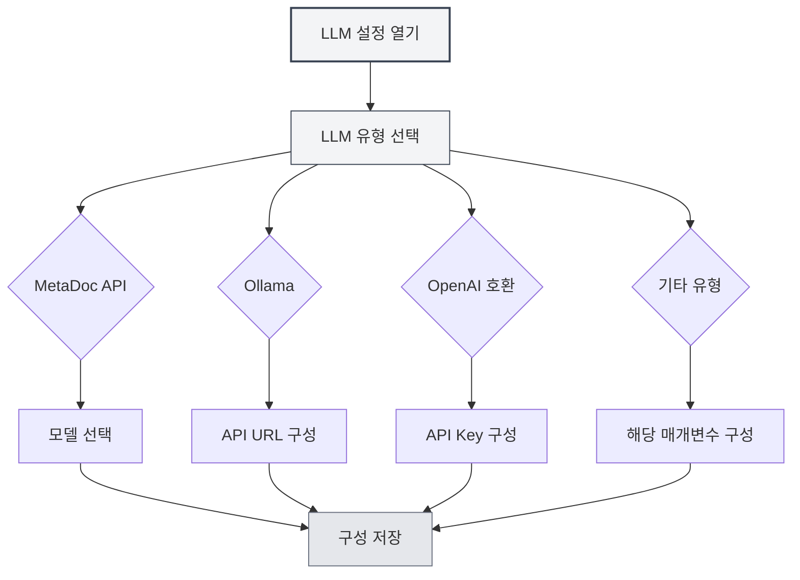

# LLM 유형 구성

## 개요

MetaDoc은 다양한 LLM 서비스 제공업체를 지원하며, 각 유형마다 다른 구성 요구사항이 있습니다. 이 문서에서는 MetaDoc API, Ollama, OpenAI, DeepSeek 및 Gemini를 포함한 다양한 LLM 유형을 구성하는 방법을 설명합니다.

## MetaDoc API

### 구성 설명

MetaDoc API는 MetaDoc에서 공식 제공하는 LLM 서비스로, 사용이 간단하며 API 키 구성이 필요하지 않습니다.

### 구성 단계

1. LLM 유형 드롭다운 메뉴에서 "MetaDoc" 선택
2. "모델 선택" 드롭다운 메뉴에서 사용 가능한 모델 선택
3. 최대 토큰 수 구성 (선택 사항)

상단 메뉴 바를 통해 LLM 설정에 접근할 수 있습니다:

<MenuItemsDemo mode="demo" :items='[{"id": "settings"}]' />

### LLM 구성 인터페이스 데모

아래 그림은 LLM 구성 페이지의 주요 기능 영역을 보여줍니다:

<SettingLlmSection mode="demo" />

### 구성 요구사항

- **로그인 계정**: 사용하려면 MetaDoc 계정에 로그인해야 함
- **모델 선택**: 사용 가능한 모델 목록에서 선택
- **최대 토큰 수**: 선택 사항, 단일 요청의 최대 토큰 수 제한

<MainTabs mode="demo" />

### 적용 시나리오

- AI 기능을 빠르게 시작
- 외부 서비스 구성 불필요
- MetaDoc 공식 서비스 사용

<DialogDemo mode="demo" dialogType="llm-config" />

## Ollama

### 구성 설명

Ollama는 로컬 LLM 실행 환경으로, 네트워크 연결 없이 로컬에서 대규모 언어 모델을 실행할 수 있습니다.

### 구성 단계

1. LLM 유형 드롭다운 메뉴에서 "Ollama" 선택
2. API 기본 URL 구성 (기본값: `http://localhost:11434/api`)
3. "모델 선택" 드롭다운 메뉴 클릭, 시스템이 자동으로 로컬에서 사용 가능한 모델 목록을 가져옴
4. 사용할 모델 선택
5. 최대 토큰 수 구성 (선택 사항)

### 구성 요구사항

- **Ollama 설치**: Ollama를 먼저 설치하고 서비스를 시작해야 함
- **API URL**: 기본값은 `http://localhost:11434/api`이며, Ollama가 다른 주소에서 실행 중인 경우 수정 필요
- **모델 다운로드**: 먼저 Ollama를 사용하여 모델을 다운로드해야 함 (예: `ollama pull llama2`)

### 모델 목록 가져오기

"모델 선택" 드롭다운 메뉴를 클릭하면 MetaDoc이 자동으로 Ollama 서비스에 연결하여 사용 가능한 모델 목록을 가져옵니다. 연결에 실패하면 다음을 확인하세요:

- Ollama 서비스가 실행 중인지
- API URL이 올바른지
- 네트워크 연결이 정상인지

### 적용 시나리오

- 로컬에서 LLM 실행, 데이터 프라이버시 보호
- 네트워크 연결 불필요
- 충분한 컴퓨팅 리소스 보유 (GPU 권장)

<DialogDemo mode="demo" dialogType="api-config" />

## OpenAI 호환

### 구성 설명

OpenAI 호환 API는 OpenAI 공식 API 및 타사 호환 서비스를 포함하여 OpenAI API 형식과 호환되는 모든 서비스를 지원합니다.

### 구성 단계

1. LLM 유형 드롭다운 메뉴에서 "OpenAI 호환" 선택
2. API 기본 URL 구성 (기본값: `https://api.openai.com/v1`)
3. API Key 입력
4. "모델 선택" 드롭다운 메뉴 클릭하여 사용 가능한 모델 목록 가져오기
5. 사용할 모델 선택
6. Completion 접미사 및 Chat 접미사 구성 (선택 사항, 사용자 정의 API 경로용)
7. 최대 토큰 수 구성 (선택 사항)

### 구성 요구사항

- **API URL**: OpenAI 공식 API 또는 호환 서비스의 API 주소
- **API Key**: 서비스 제공업체에서 얻은 API 키
- **모델 목록**: 시스템이 자동으로 사용 가능한 모델 목록을 가져옴

### API 접미사 구성

일부 호환 서비스는 사용자 정의 API 경로가 필요할 수 있습니다:

- **Completion 접미사**: Completion API용 사용자 정의 경로 접미사
- **Chat 접미사**: Chat API용 사용자 정의 경로 접미사

대부분의 경우 구성이 필요 없으며 기본값을 사용하면 됩니다.

### 적용 시나리오

- OpenAI 공식 API 사용
- OpenAI API와 호환되는 타사 서비스 사용
- 사용자 정의 API 경로가 필요한 서비스

<QuickStartPanel mode="demo" />

<MainTabs mode="demo" />

## OpenAI 공식

### 구성 설명

OpenAI 공식 구성은 OpenAI 공식 API 전용으로, 구성이 더 간단하며 API URL이 고정되어 있습니다.

### 구성 단계

1. LLM 유형 드롭다운 메뉴에서 "OpenAI 공식" 선택
2. OpenAI API Key 입력
3. "모델 선택" 드롭다운 메뉴 클릭하여 사용 가능한 모델 목록 가져오기
4. 사용할 모델 선택
5. 최대 토큰 수 구성 (선택 사항)

### 구성 요구사항

- **API Key**: OpenAI 공식 웹사이트에서 얻은 API 키
- **API URL**: `https://api.openai.com/v1`로 고정, 수정 불가

### API Key 가져오기

1. [OpenAI 공식 웹사이트](https://platform.openai.com/) 방문
2. 계정 등록 또는 로그인
3. API Keys 페이지로 이동
4. 새 API Key 생성
5. API Key 복사하여 MetaDoc 구성에 붙여넣기

<ResizableDivider mode="demo" />

### 적용 시나리오

- OpenAI 공식 GPT 모델 사용
- 안정적인 공식 서비스 필요
- OpenAI 계정 및 API 할당량 보유

## DeepSeek

### 구성 설명

DeepSeek은 강력한 중국어 이해 능력을 제공하는 고성능 LLM 서비스 제공업체입니다.

### 구성 단계

1. LLM 유형 드롭다운 메뉴에서 "DeepSeek" 선택
2. DeepSeek API Key 입력
3. 모델 선택 (deepseek-chat 또는 deepseek-reasoner)
4. 최대 토큰 수 구성 (선택 사항)

### 구성 요구사항

- **API Key**: DeepSeek 공식 웹사이트에서 얻은 API 키
- **모델 선택**:
  - `deepseek-chat`: 일반 대화 모델
  - `deepseek-reasoner`: 추론 모델

### API Key 가져오기

1. [DeepSeek 공식 웹사이트](https://www.deepseek.com/) 방문
2. 계정 등록 또는 로그인
3. API Keys 페이지로 이동
4. 새 API Key 생성
5. API Key 복사하여 MetaDoc 구성에 붙여넣기

### 적용 시나리오

- 강력한 중국어 이해 능력 필요
- 추론 능력 필요 (deepseek-reasoner 사용)
- 가성비 높은 LLM 서비스

<SettingKnowledgeBaseSection mode="demo" />

<CompletionSettingsPanel mode="demo" />

## Gemini

### 구성 설명

Gemini는 Google에서 제공하는 LLM 서비스로, 멀티모달 능력을 지원합니다.

### 구성 단계

1. LLM 유형 드롭다운 메뉴에서 "Gemini" 선택
2. Gemini API Key 입력
3. "모델 선택" 드롭다운 메뉴 클릭하여 사용 가능한 모델 목록 가져오기
4. 사용할 모델 선택
5. 최대 토큰 수 구성 (선택 사항)

### 구성 요구사항

- **API Key**: Google AI Studio에서 얻은 API 키
- **모델 선택**: 시스템이 자동으로 사용 가능한 모델 목록을 가져옴

### API Key 가져오기

1. [Google AI Studio](https://makersuite.google.com/app/apikey) 방문
2. Google 계정으로 로그인
3. 새 API Key 생성
4. API Key 복사하여 MetaDoc 구성에 붙여넣기

### 적용 시나리오

- Google의 LLM 서비스 사용
- 멀티모달 능력 필요
- Google 계정 보유

<AgentView mode="demo" />

## 최대 토큰 수 구성

### 기능 설명

최대 토큰 수는 단일 요청으로 생성할 수 있는 최대 토큰 수를 제한합니다. 이 기능을 활성화하면 다음이 가능합니다:

- 생성 내용의 길이 제어
- API 비용 절약
- 너무 긴 내용 생성 방지

### 구성 방법

1. "최대 토큰 수" 스위치 활성화
2. 토큰 수량 설정 (범위: 1-32768)
3. 구성 저장

### 사용 권장사항

- **짧은 텍스트 생성**: 100-500 토큰
- **중간 길이**: 500-2000 토큰
- **긴 텍스트 생성**: 2000-8000 토큰
- **제한 없음**: 이 옵션 비활성화

## 구성 검증

### 구성 테스트

구성 완료 후, 구성이 정상인지 테스트하는 것이 좋습니다:

1. 구성 저장
2. LLM 기능 활성화
3. AI 대화 기능 사용 시도
4. 오류 발생 시 구성이 올바른지 확인

### 자주 묻는 질문

**연결 실패**:

- API URL이 올바른지 확인
- 네트워크 연결 확인
- 서비스가 정상적으로 실행 중인지 확인

**인증 실패**:

- API Key가 올바른지 확인
- API Key가 만료되지 않았는지 확인
- 계정에 충분한 할당량이 있는지 확인

**모델 사용 불가**:

- 모델 이름이 올바른지 확인
- 계정에 해당 모델 사용 권한이 있는지 확인
- 서비스가 해당 모델을 지원하는지 확인

## 주의사항

1. **API 키 보안**: API 키를 안전하게 보관하고 타인과 공유하지 마세요
2. **비용 제어**: 외부 API 사용 시 비용이 발생할 수 있으므로 사용량에 주의하세요
3. **네트워크 요구사항**: 외부 API 사용 시 안정적인 네트워크 연결이 필요합니다
4. **서비스 가용성**: 서비스마다 가용성과 안정성이 다를 수 있습니다
5. **모델 선택**: 모델마다 다른 능력과 제한이 있으므로 요구사항에 따라 선택하세요

## 관련 문서

- [[settings.llm|LLM 구성]]
- [[settings.llm-management|LLM 구성 관리]]
- [[ai.chat|AI 대화 기능]]
- [[ai.completion|AI 자동 완성]]

<MenuItemsDemo mode="demo" :items='[{"id": "file"}]' />

<ViewMenuItemsDemo mode="demo" :items='["settings"]' />

<SettingLlmSection mode="demo" />

<DialogDemo mode="demo" dialogType="llm-config" />

<MainTabs mode="demo" />