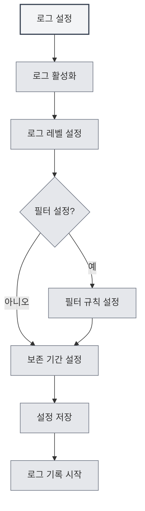

# 로그 설정

## 개요

로그 설정을 통해 MetaDoc의 로깅 기능을 관리할 수 있습니다. 로그를 설정하면 애플리케이션의 실행 상태를 기록하여 문제 해결 및 성능 분석에 도움이 됩니다.

<Demo component="SettingLoggerSection" mode="demo" />

## 로그 활성화

### 로그 기능 켜기

로그 설정 페이지에서 먼저 로그 기능을 활성화해야 합니다:

1. "로그 활성화" 스위치를 찾습니다.
2. 스위치를 "활성화" 상태로 전환합니다.
3. 로그가 파일에 기록되기 시작합니다.

상단 메뉴 바를 통해 로그 설정에 접근할 수 있습니다:

<MenuItemsDemo mode="demo" :items='[{"id": "settings"}]' />

로그를 활성화하면 시스템은 다음을 포함한 애플리케이션 실행 정보를 기록합니다:

- 작업 기록
- 오류 정보
- 경고 정보
- 디버그 정보 (활성화된 경우)



**주의사항**:

- 로그는 일정량의 디스크 공간을 차지합니다.
- 문제 해결이 필요할 때 활성화하는 것이 좋습니다.
- 리소스 사용을 줄이기 위해 프로덕션 환경에서는 끌 수 있습니다.

## 로그 레벨

### 레벨 설명

로그 레벨은 어떤 레벨의 로그를 기록할지 결정합니다:

<ConsoleTerminal mode="demo" consoleKey="log-levels" :history='[{"content": "[INFO] 应用启动完成", "type": "out"}, {"content": "[DEBUG] 加载配置文件", "type": "out"}, {"content": "[WARN] 配置项缺失，使用默认值", "type": "warn"}, {"content": "[ERROR] 连接失败，正在重试...", "type": "error"}]' />

- **DEBUG**: 상세한 디버그 정보, 모든 작업 세부 사항 포함
- **INFO**: 일반 정보, 중요한 작업 및 상태 기록
- **WARN**: 경고 정보, 가능한 문제 기록
- **ERROR**: 오류 정보, 오류 및 예외 기록

### 레벨 우선순위

로그 레벨에는 우선순위 관계가 있습니다:

```
DEBUG < INFO < WARN < ERROR
```

특정 레벨을 선택하면 해당 레벨 및 더 높은 레벨의 로그가 기록됩니다. 예를 들어:

- INFO 선택: INFO, WARN, ERROR 기록
- WARN 선택: WARN, ERROR만 기록
- ERROR 선택: ERROR만 기록

### 레벨 선택 권장사항

- **개발/디버깅**: DEBUG 레벨 사용, 상세 정보 획득
- **일상 사용**: INFO 레벨 사용, 중요한 작업 기록
- **문제 해결**: WARN 레벨 사용, 경고 및 오류에 집중
- **프로덕션 환경**: ERROR 레벨 사용, 오류만 기록

<SettingLoggerSection mode="demo" />

## 로그 필터링

### 필터 기능

로그 필터링을 통해 특정 범위의 로그만 기록할 수 있습니다:

- **스코프별 필터링**: 특정 모듈의 로그만 기록
- **접두사 매칭**: "ai-graph"와 같이 "ai-graph"로 시작하는 모든 스코프를 매칭하는 접두사 매칭 지원
- **정확한 매칭**: "[ai-graph][WorkflowTool]"과 같은 정확한 매칭 지원

### 필터 규칙

필터 규칙은 다음 형식을 지원합니다:

- **단순 매칭**: `ai-graph` - "ai-graph"를 포함하는 모든 스코프 매칭
- **접두사 매칭**: `ai-` - "ai-"로 시작하는 모든 스코프 매칭
- **정확한 매칭**: `[ai-graph][WorkflowTool]` - 해당 스코프 정확히 매칭

### 사용 시나리오

- **특정 모듈 디버깅**: 특정 모듈의 로그만 기록
- **로그 양 감소**: 관심 없는 로그 필터링
- **문제 위치 파악**: 특정 기능의 로그에 집중

<SettingDebugSection mode="demo" />

### 필터 예시

**예시1: AI 관련 로그만 기록**

```
필터 조건: ai-
```

**예시2: 워크플로우 로그만 기록**

```
필터 조건: workflow
```

**예시3: 특정 도구의 로그만 기록**

```
필터 조건: [ai-graph][WorkflowTool]
```

## 로그 보존 기간

### 보존 기간 설정

로그 보존 기간은 로그 파일을 보관할 기간을 결정합니다:

- **보존 안 함**: 로그를 자동으로 정리하지 않음
- **1일**: 1일 동안의 로그 보존
- **3일**: 3일 동안의 로그 보존
- **7일**: 7일 동안의 로그 보존
- **1개월**: 1개월 동안의 로그 보존
- **3개월**: 3개월 동안의 로그 보존
- **6개월**: 6개월 동안의 로그 보존
- **1년**: 1년 동안의 로그 보존
- **영구**: 로그를 영구적으로 보존

### 자동 정리

보존 기간을 설정하면 시스템이 만료된 로그 파일을 자동으로 정리합니다:

- **정리 시점**: 보존 기간 변경 시 즉시 정리 실행
- **정리 규칙**: 보존 기간을 초과한 로그 파일 삭제
- **정리 범위**: 로그 디렉토리 내 파일만 정리

<ConsoleTerminal mode="demo" consoleKey="cleanup" :history='[{"content": "[INFO] 开始清理过期日志文件...", "type": "out"}, {"content": "[INFO] 删除: 2026-02-10 10-30-45.log (超过保留期限)", "type": "out"}, {"content": "[INFO] 删除: 2026-02-11 14-20-30.log (超过保留期限)", "type": "out"}, {"content": "[INFO] 清理完成，共删除 2 个文件", "type": "out"}]' />

### 선택 권장사항

- **개발 환경**: 짧은 보존 기간 사용 (1-3일)
- **프로덕션 환경**: 중간 보존 기간 사용 (7일-1개월)
- **중요 프로젝트**: 긴 보존 기간 사용 (3-6개월)
- **감사 요구사항**: 영구 보존 사용

## 로그 파일 경로

### 로그 경로 확인

로그 설정 페이지에서 다음을 확인할 수 있습니다:

- **로그 파일 경로**: 현재 로그 파일의 전체 경로
- **로그 디렉토리 경로**: 로그 파일이 위치한 디렉토리 경로

### 로그 파일 열기

1. 로그 설정 페이지에서 "로그 파일 경로"를 찾습니다.
2. "로그 파일 열기" 버튼을 클릭합니다.
3. 시스템이 기본 텍스트 편집기로 로그 파일을 엽니다.

### 로그 디렉토리 열기

1. 로그 설정 페이지에서 "로그 디렉토리"를 찾습니다.
2. "로그 디렉토리 열기" 버튼을 클릭합니다.
3. 시스템이 파일 관리자에서 로그 디렉토리를 엽니다.

<ViewMenuItemsDemo mode="demo" :items='["home", "editor"]'
/>

## 로그 콘솔

### 실시간 로그 확인

로그 설정 페이지는 로그 콘솔을 제공하여 실시간으로 로그를 확인할 수 있습니다:

- **실시간 표시**: 최신 로그 항목 표시
- **기록**: 최근 로그 기록 표시 (최대 500개)
- **로그 레벨**: 다른 레벨의 로그는 다른 색상으로 표시

<ConsoleTerminal mode="demo" consoleKey="realtime-logs" :history='[{"content": "[2026-02-24 10:30:15] [INFO] [main][App] 应用启动完成", "type": "out"}, {"content": "[2026-02-24 10:30:16] [DEBUG] [renderer][Editor] 编辑器初始化", "type": "out"}, {"content": "[2026-02-24 10:30:18] [INFO] [renderer][Workspace] 加载工作目录", "type": "out"}]' />

### 콘솔 기능

- **로그 확인**: 애플리케이션 로그 실시간 확인
- **필터 표시**: 로그 레벨에 따라 표시 필터링
- **로그 검색**: 콘솔에서 로그 내용 검색

## 로그 파일 형식

### 파일 이름 지정

로그 파일은 다음 이름 지정 형식을 사용합니다:

```
YYYY-MM-DD HH-mm-ss.log
```

예: `2026-02-19 14-30-45.log`

### 로그 형식

각 로그 항목은 다음 정보를 포함합니다:

- **타임스탬프**: 로그가 기록된 시간
- **레벨**: 로그 레벨 (DEBUG/INFO/WARN/ERROR)
- **프로세스 유형**: main (메인 프로세스) 또는 renderer (렌더러 프로세스)
- **스코프**: 로그 출처 모듈 또는 컴포넌트
- **메시지**: 로그 메시지 내용

### 로그 예시

```
[2026-02-19 14:30:45] [INFO] [main][Logger] 日志配置更新: enabled=true, level=info
[2026-02-19 14:30:46] [DEBUG] [renderer][Editor] 文档已保存
[2026-02-19 14:30:47] [WARN] [main][RAG] 知识库文件未找到
[2026-02-19 14:30:48] [ERROR] [renderer][LLM] API调用失败
```

<ConsoleTerminal mode="demo" consoleKey="log-examples" :history='[{"content": "[2026-02-19 14:30:45] [INFO] [main][Logger] 日志配置更新: enabled=true, level=info", "type": "out"}, {"content": "[2026-02-19 14:30:46] [DEBUG] [renderer][Editor] 文档已保存", "type": "out"}, {"content": "[2026-02-19 14:30:47] [WARN] [main][RAG] 知识库文件未找到", "type": "warn"}, {"content": "[2026-02-19 14:30:48] [ERROR] [renderer][LLM] API调用失败", "type": "error"}]' />

## 모범 사례

1. **적절한 레벨 설정**: 사용 시나리오에 맞는 적절한 로그 레벨 선택
2. **필터 사용**: 필터 기능을 사용하여 로그 양 줄이기
3. **정기적 정리**: 적절한 보존 기간 설정, 과도한 공간 점유 방지
4. **문제 해결**: 문제 발생 시, 일시적으로 로그 레벨을 높여 상세 정보 획득
5. **로그 백업**: 중요한 로그는 백업하여 보관 권장

<MainTabs mode="demo" />

## 주의사항

1. **디스크 공간**: 로그는 디스크 공간을 차지하므로 정기적으로 정리하세요.
2. **성능 영향**: DEBUG 레벨은 성능에 영향을 줄 수 있으므로 디버깅 시에만 사용 권장
3. **개인정보 보안**: 로그에 민감한 정보가 포함될 수 있으므로 로그 파일 보호에 주의
4. **파일 권한**: 로그 디렉토리에 쓰기 권한이 있는지 확인
5. **로그 위치**: 로그 파일 위치는 시스템이 자동으로 관리하므로 수동 수정은 권장하지 않음

## 관련 문서

- [[settings.basic|기본 설정]]
- [[settings.about|정보]]


<ResizableDivider mode="demo" />
