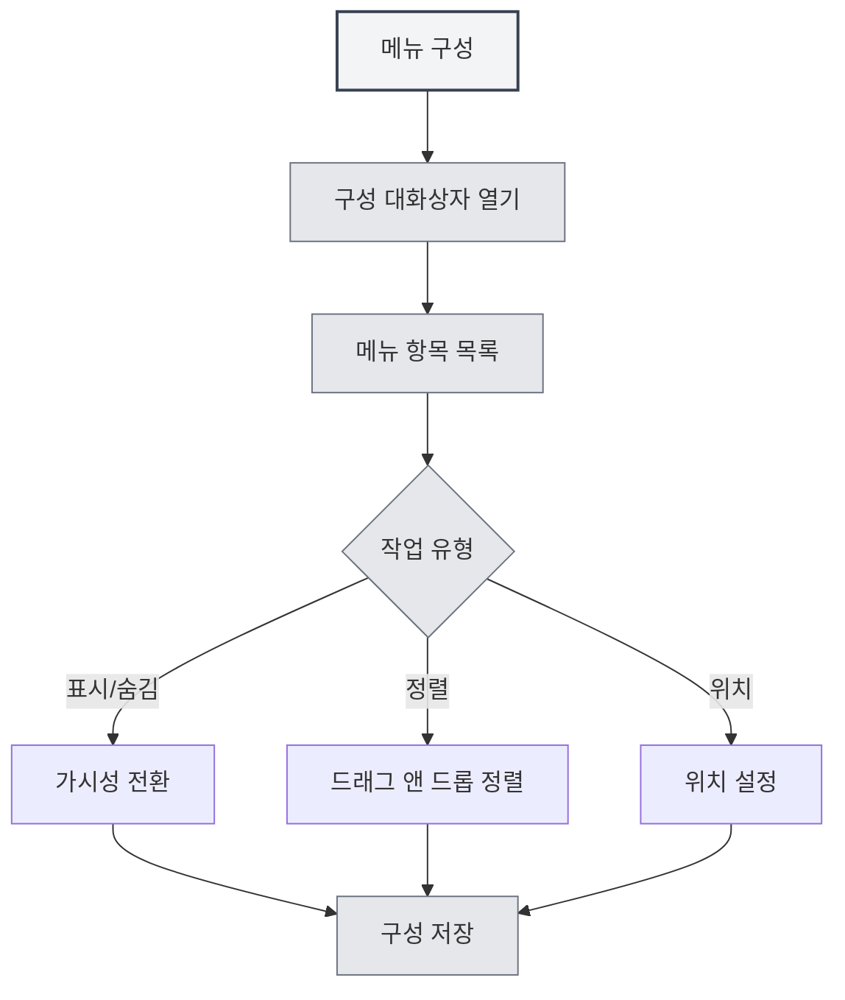

# 메뉴 구성

## 개요

메뉴 구성 기능을 통해 왼쪽 메뉴의 표시와 순서를 사용자 정의할 수 있습니다. 메뉴 구성을 통해 필요하지 않은 메뉴 항목을 숨기고, 메뉴 순서를 조정하며, 메뉴 위치를 설정하여 개인화된 인터페이스 레이아웃을 만들 수 있습니다.

## 메뉴 구성 열기

### 접근 방법

다음 방법으로 메뉴 구성을 열 수 있습니다:

- **설정 페이지**: 설정 페이지 내에 메뉴 구성 진입점이 있을 수 있습니다.
- **메뉴 옵션**: 왼쪽 메뉴의 "더 많은 기능" 내에 메뉴 구성 옵션이 있을 수 있습니다.
- **마우스 오른쪽 버튼 메뉴**: 일부 메뉴 항목에 구성 옵션이 있을 수 있습니다.

상단 메뉴 바를 통해 메뉴 구성에 접근할 수 있습니다:

<MenuItemsDemo mode="demo" :items='[{"id": "settings"}]' />

## 메뉴 항목 관리

### 메뉴 항목 목록

메뉴 구성 페이지에는 구성 가능한 모든 메뉴 항목이 표시됩니다:

- **메뉴 항목 이름**: 메뉴 항목의 이름을 표시합니다.
- **가시성**: 메뉴 항목이 표시되는지 여부를 나타냅니다.
- **위치**: 메뉴 항목의 위치(상단/하단)를 표시합니다.
- **핵심 식별자**: 핵심 메뉴 항목(숨길 수 없음)을 식별합니다.

### 메뉴 항목 유형

메뉴 항목은 두 가지 유형으로 나뉩니다:

- **핵심 메뉴 항목**: 반드시 표시되어야 하며 숨길 수 없는 메뉴 항목입니다.
  - 홈
  - 파일
  - 설정
  - 더 많은 기능
  - 종료
- **일반 메뉴 항목**: 숨길 수 있는 메뉴 항목입니다.
  - AI 어시스턴트
  - 최근 파일
  - 지식 베이스
  - 작업 디렉토리
  - 사용자 설명서
  - 사용자 피드백
  - LLM 통계
  - 디버그 도구(개발 환경)

## 메뉴 항목 표시/숨기기

### 메뉴 항목 숨기기

필요하지 않은 메뉴 항목을 숨길 수 있습니다:

1. **구성 열기**: 메뉴 구성 대화상자를 엽니다.
2. **메뉴 항목 찾기**: 숨기려는 메뉴 항목을 찾습니다.
3. **가시성 전환**: 메뉴 항목의 가시성 스위치를 전환합니다.
4. **구성 저장**: "저장" 버튼을 클릭하여 구성을 저장합니다.

<DialogDemo mode="demo" dialogType="menu-config" />

### 메뉴 항목 표시하기

숨겨진 메뉴 항목을 다시 표시할 수 있습니다:

1. **구성 열기**: 메뉴 구성 대화상자를 엽니다.
2. **메뉴 항목 찾기**: 표시하려는 메뉴 항목을 찾습니다.
3. **가시성 전환**: 메뉴 항목의 가시성 스위치를 전환합니다.
4. **구성 저장**: "저장" 버튼을 클릭하여 구성을 저장합니다.

### 핵심 메뉴 항목 제한

핵심 메뉴 항목은 숨길 수 없습니다:

- **강제 표시**: 핵심 메뉴 항목은 항상 표시됩니다.
- **숨기기 불가**: 핵심 메뉴 항목의 가시성 스위치는 비활성화됩니다.
- **자동 복원**: 핵심 메뉴 항목을 숨기려고 시도하면 자동으로 표시 상태로 복원됩니다.

## 메뉴 항목 정렬

### 드래그 앤 드롭 정렬

드래그를 통해 메뉴 항목 순서를 조정할 수 있습니다:

1. **구성 열기**: 메뉴 구성 대화상자를 엽니다.
2. **메뉴 항목 드래그**: 메뉴 항목의 드래그 핸들을 클릭하고 드래그합니다.
3. **위치 조정**: 메뉴 항목을 목표 위치로 드래그합니다.
4. **구성 저장**: "저장" 버튼을 클릭하여 구성을 저장합니다.

### 정렬 규칙

메뉴 항목 정렬은 다음 규칙을 따릅니다:

- **위치 그룹화**: 상단 메뉴 항목과 하단 메뉴 항목은 별도로 정렬됩니다.
- **구분선**: 상단과 하단 사이에 구분선이 표시됩니다.
- **자동 조정**: 다른 위치로 드래그하면 위치 속성이 자동으로 조정됩니다.

## 메뉴 위치 설정

### 위치 유형

메뉴 항목은 두 가지 위치로 설정할 수 있습니다:

- **상단**: 메뉴 바의 상단 영역에 표시됩니다.
- **하단**: 메뉴 바의 하단 영역에 표시됩니다.

### 위치 설정하기

메뉴 항목의 위치를 설정할 수 있습니다:

1. **구성 열기**: 메뉴 구성 대화상자를 엽니다.
2. **위치로 드래그**: 메뉴 항목을 상단 또는 하단 영역으로 드래그합니다.
3. **자동 조정**: 시스템이 위치 속성을 자동으로 조정합니다.
4. **구성 저장**: "저장" 버튼을 클릭하여 구성을 저장합니다.

<LeftMenu mode="demo" />

### 위치 구분선

상단과 하단 사이에는 구분선이 있습니다:

- **자동 표시**: 상단과 하단 메뉴 항목이 모두 있으면 구분선이 자동으로 표시됩니다.
- **드래그 불가**: 구분선은 드래그할 수 없으며 시각적 구분을 위해 사용됩니다.
- **자동 숨김**: 상단 또는 하단 메뉴 항목만 있는 경우 구분선은 자동으로 숨겨집니다.

## 구성 저장

### 자동 저장

일부 작업은 자동으로 구성이 저장됩니다:

- **가시성 전환**: 메뉴 항목 가시성을 전환할 때 자동 저장됩니다.
- **위치 조정**: 메뉴 위치를 조정할 때 자동 저장됩니다.

### 수동 저장

수동으로 구성을 저장할 수도 있습니다:

1. **구성 조정**: 메뉴 항목의 순서와 가시성을 조정합니다.
2. **저장 클릭**: "저장" 버튼을 클릭합니다.
3. **구성 적용**: 구성이 즉시 적용됩니다.

### 구성 초기화

메뉴 구성을 초기화할 수 있습니다:

1. **구성 열기**: 메뉴 구성 대화상자를 엽니다.
2. **초기화 클릭**: "초기화" 버튼을 클릭합니다.
3. **초기화 확인**: 초기화 작업을 확인합니다.
4. **기본값 복원**: 구성이 기본 상태로 복원됩니다.

**주의사항**:

- 초기화 작업은 되돌릴 수 없습니다.
- 초기화 후에도 핵심 메뉴 항목은 계속 표시 상태를 유지합니다.

<DialogDemo mode="demo" dialogType="confirm-reset" />

## 구성 지속성

### 구성 저장소

메뉴 구성은 로컬에 저장됩니다:

- **로컬 저장소**: 구성은 로컬 설정에 저장됩니다.
- **자동 로드**: 애플리케이션을 다음에 시작할 때 자동으로 구성이 로드됩니다.
- **다중 창 동기화**: 구성은 모든 창 간에 동기화됩니다.

### 구성 마이그레이션

이전 버전의 구성은 자동으로 마이그레이션됩니다:

- **위치 마이그레이션**: 이전 버전의 "middle" 위치는 자동으로 "bottom"으로 마이그레이션됩니다.
- **호환성 처리**: 시스템이 이전 버전의 구성 형식을 자동으로 처리합니다.
- **원활한 업그레이드**: 업그레이드 후 구성이 새 버전에 자동으로 적응됩니다.

## 모범 사례

1. **메뉴 간소화**: 자주 사용하지 않는 메뉴 항목을 숨겨 인터페이스를 깔끔하게 유지합니다.
2. **합리적 정렬**: 자주 사용하는 메뉴 항목을 앞쪽에 배치하여 접근성을 높입니다.
3. **위치 그룹화**: 관련된 메뉴 항목을 동일한 위치 영역에 배치합니다.
4. **정기적 조정**: 사용 습관에 따라 정기적으로 메뉴 구성을 조정합니다.
5. **구성 백업**: 중요한 구성은 백업하여 복원에 대비합니다.

## 주의사항

1. **핵심 메뉴 항목**: 핵심 메뉴 항목은 숨길 수 없으며 반드시 표시되어야 합니다.
2. **구성 저장**: 일부 작업은 자동 저장되며, 일부는 수동 저장이 필요합니다.
3. **초기화 작업**: 초기화 작업은 되돌릴 수 없으므로 신중하게 사용하십시오.
4. **다중 창 동기화**: 구성은 모든 창 간에 동기화됩니다.
5. **개발 도구**: 디버그 도구는 개발 환경에서만 표시됩니다.

## 관련 문서

- [[settings.basic|기본 설정]]
- [[core.multi-tab|다중 탭 관리]]

<MainTabs mode="demo" />

<LeftMenu mode="demo" />

<MenuItemsDemo mode="demo" :items='[{"id": "settings"}]' />

<DialogDemo mode="demo" dialogType="menu-config" />

<MenuItemsDemo mode="demo" :items='[{"id": "file", "items": ["new", "open"]}]' />

<DialogDemo mode="demo" dialogType="confirm-reset" />
