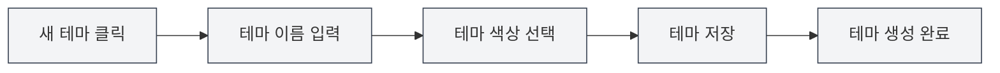

# 사용자 정의 테마 관리

## 개요

사용자 정의 테마 관리를 통해 사용자 정의 테마를 생성, 편집, 삭제 및 복사할 수 있습니다. 사용자 정의 테마를 통해 개인의 취향에 맞는 인터페이스 외관을 만들어 사용 경험을 향상시킬 수 있습니다.

## 새 사용자 정의 테마 만들기

### 새 테마 생성

1. 테마 설정 페이지에서 "새 테마" 카드(+ 아이콘)를 클릭합니다.
2. 나타나는 대화 상자에서:
   - 테마 이름을 입력합니다(선택 사항, 기본값은 색상 값 사용).
   - 테마 색상을 선택합니다(색상 선택기 사용).
3. "저장" 버튼을 클릭합니다.

상단 메뉴 바를 통해 테마 설정에 접근할 수 있습니다:

<MenuItemsDemo mode="demo" :items='[{"id": "settings"}]' />

### 테마 색상 선택

색상 선택기는 다음 기능을 제공합니다:

- **색상 선택**: 색상 영역을 클릭하여 색상을 선택합니다.
- **사전 설정 색상**: 사전 설정 색상 목록에서 선택합니다.
- **투명도 조정**: 색상의 투명도(알파 채널)를 조정합니다.
- **색상 값 입력**: HEX 색상 값을 직접 입력합니다.

### 테마 이름 지정

- **자동 이름 지정**: 이름을 입력하지 않으면 시스템이 색상 값을 이름으로 사용합니다.
- **사용자 정의 이름**: 식별 및 관리가 용이하도록 의미 있는 이름을 입력합니다.
- **이름 지정 제안**: "작업 테마", "야간 모드" 등과 같이 설명적인 이름을 사용합니다.

<SettingThemeSection mode="demo" />

## 사용자 정의 테마 편집

### 테마 수정

1. 테마 목록에서 편집할 사용자 정의 테마를 찾습니다.
2. 테마 카드의 "더보기" 버튼(점 세 개 아이콘)을 클릭합니다.
3. "편집"을 선택합니다.
4. 대화 상자에서 테마 이름이나 색상을 수정합니다.
5. "저장" 버튼을 클릭합니다.

<DialogDemo mode="demo" dialogType="theme-edit" />

### 빠른 색상 편집

테마 카드에서 직접 색상을 편집할 수도 있습니다:

1. 테마 카드의 색상 선택기를 클릭합니다.
2. 새 색상을 선택합니다.
3. 색상이 즉시 적용됩니다.

**주의사항**:

- 사전 설정 테마는 편집할 수 없습니다.
- 사용자 정의 테마만 편집할 수 있습니다.
- 편집 후 저장해야 영구적으로 적용됩니다.

## 사용자 정의 테마 삭제

### 테마 삭제

1. 테마 목록에서 삭제할 사용자 정의 테마를 찾습니다.
2. 테마 카드의 "더보기" 버튼을 클릭합니다.
3. "삭제"를 선택합니다.
4. 삭제 작업을 확인합니다.

**주의사항**:

- 삭제 작업은 되돌릴 수 없습니다.
- 현재 사용 중인 테마를 삭제하면 시스템이 기본 테마로 자동 전환됩니다.
- 사전 설정 테마는 삭제할 수 없습니다.

## 테마 복사

### 기존 테마 복사

1. 테마 목록에서 복사할 테마를 찾습니다.
2. 테마 카드의 "더보기" 버튼을 클릭합니다.
3. "복사"를 선택합니다.
4. 시스템이 이름 뒤에 "복사본"을 추가한 사본을 생성합니다.
5. 사본을 편집하여 새 테마를 만들 수 있습니다.

### 사용 시나리오

- **기존 테마를 기반으로 새 테마 생성**: 복사 후 색상 수정.
- **테마 변형 생성**: 유사하지만 약간 다른 테마 생성.
- **테마 백업**: 백업으로 복사.

## 테마 색상 설정

### 색상 선택기 기능

색상 선택기는 풍부한 색상 선택 기능을 제공합니다:

- **색상 패널**: 클릭하여 색상을 선택합니다.
- **사전 설정 색상**: 자주 사용하는 색상을 빠르게 선택합니다.
- **색상 값 입력**: HEX, RGB, HSL 등 형식을 직접 입력합니다.
- **투명도 조정**: 색상의 투명도를 조정합니다.

<DialogDemo mode="demo" dialogType="color-picker" />

### 사전 설정 색상

MetaDoc은 다양한 사전 설정 색상을 제공합니다:

- **기본 색상**: 빨강, 주황, 노랑, 초록, 청록, 파랑, 보라, 회색.
- **밝은 색상 계열**: 밝은 빨강, 밝은 주황, 밝은 노랑 등.
- **어두운 색상 계열**: 어두운 빨강, 어두운 주황, 어두운 노랑 등.

### 색상 형식

지원하는 색상 형식:

- **HEX**: `#FF5733` (가장 일반적).
- **RGB**: `rgb(255, 87, 51)`.
- **HSL**: `hsl(9, 100%, 60%)`.

## 테마 적용

### 사용자 정의 테마 적용

1. 테마 목록에서 사용할 사용자 정의 테마 카드를 클릭합니다.
2. 테마가 즉시 적용됩니다.
3. 인터페이스 색상이 테마 색상을 기반으로 자동 생성됩니다.

### 테마 색상 영향

테마 색상은 다음 인터페이스 요소에 영향을 미칩니다:

- **배경색**: 주 배경 및 보조 배경.
- **텍스트 색상**: 주요 텍스트 및 보조 텍스트.
- **사이드바**: 사이드바 배경 및 텍스트.
- **편집기**: 편집기 배경 및 도구 모음.
- **기타 요소**: 버튼, 테두리, 강조 표시 등.

### 자동 색상 구성

MetaDoc은 테마 색상을 기반으로 자동으로 색상 구성을 생성합니다:

- **밝은 테마**: 테마 색상이 밝을 때 밝은 색상 구성을 생성합니다.
- **어두운 테마**: 테마 색상이 어두울 때 어두운 색상 구성을 생성합니다.
- **색상 구성 알고리즘**: 색상 혼합 및 채도 조정을 사용합니다.

## 테마 관리

### 테마 목록

테마 설정 페이지는 사용 가능한 모든 테마를 표시합니다:

- **사전 설정 테마**: 시스템에 내장된 테마.
- **사용자 정의 테마**: 사용자가 생성한 테마.
- **현재 테마**: 선택 표시를 보여줍니다.

### 테마 정렬

테마는 다음 순서로 표시됩니다:

1. 시스템 동기화 테마(시스템을 따름).
2. 밝은/어두운 사전 설정 테마.
3. 사용자 정의 테마(생성 시간순).

### 테마 상태

각 테마 카드는 다음을 표시합니다:

- **테마 색상 미리보기**: 테마의 주요 색상을 표시합니다.
- **테마 이름**: 테마의 이름을 표시합니다.
- **색상 값**: 색상의 HEX 값을 표시합니다.
- **선택 표시**: 현재 사용 중인 테마.

## 모범 사례

1. **테마 이름 지정**: 식별이 용이하도록 의미 있는 이름을 사용합니다.
2. **색상 선택**: 눈에 편안한 색상을 선택하고 지나치게 선명한 색상을 피합니다.
3. **테마 백업**: 중요한 테마는 복사하여 백업하는 것이 좋습니다.
4. **정기 정리**: 더 이상 사용하지 않는 테마를 삭제하여 목록을 깔끔하게 유지합니다.
5. **효과 테스트**: 테마 생성 후 실제 효과를 테스트하고 사용 경험에 따라 조정합니다.

## 주의사항

1. **사전 설정 테마**: 사전 설정 테마는 편집하거나 삭제할 수 없습니다.
2. **테마 호환성**: 일부 테마는 다른 환경에서 표시 효과가 다를 수 있습니다.
3. **색상 선택**: 가독성을 보장하기 위해 대비가 적절한 색상을 선택하는 것이 좋습니다.
4. **테마 수**: 너무 많은 테마를 생성하지 않고 목록을 간결하게 유지하는 것이 좋습니다.
5. **테마 동기화**: 테마 변경 사항은 모든 창 간에 동기화됩니다.

## 관련 문서

- [[settings.theme|테마 구성]]
- [[settings.basic|기본 설정]]
- [[core.editor-settings|편집기 설정]]

<ResizableDivider mode="demo" />

<SettingThemeSection mode="demo" />

<MenuItemsDemo mode="demo" :items='[{"id": "settings", "items": ["theme"]}]' />

<DialogDemo mode="demo" dialogType="color-picker" />

<DialogDemo mode="demo" dialogType="theme-edit" />

<MenuItemsDemo mode="demo" :items='[{"id": "settings"}]' />
