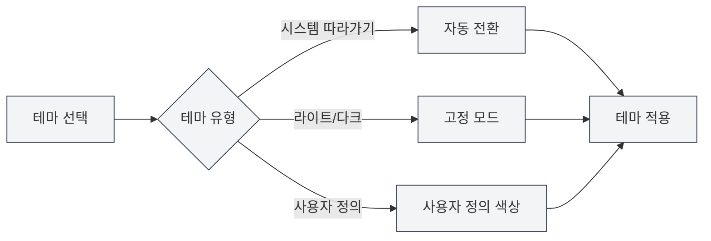

# 테마 설정

## 개요

테마 설정을 통해 MetaDoc의 외관을 사용자 정의할 수 있으며, 전역 테마, 콘텐츠 테마, 코드 테마 등을 포함합니다. 적절한 테마 설정은 사용 경험을 향상시키고 시각적 피로를 줄일 수 있습니다.

## 전역 테마

### 테마 유형

MetaDoc는 다음과 같은 전역 테마 유형을 지원합니다:

- **시스템 라이트/다크 모드 따라가기**: 운영 체제의 라이트/다크 모드를 자동으로 따릅니다.
- **시스템 색상 따라가기**: 운영 체제의 테마 색상을 따릅니다 (Windows 11).
- **라이트**: 라이트 테마를 고정 사용합니다.
- **다크**: 다크 테마를 고정 사용합니다.
- **사용자 정의**: 사용자 정의 테마 색상을 사용합니다.

### 테마 선택

1. 테마 설정 페이지에서 테마 카드를 확인합니다.
2. 사용하려는 테마 카드를 클릭합니다.
3. 테마가 즉시 적용됩니다.

상단 메뉴 바를 통해 테마 설정에 접근할 수 있습니다:

<MenuItemsDemo mode="demo" :items='[{"id": "settings"}]' />

### 라이트 테마 미리보기

<SettingThemeSection mode="demo" theme="light" />

### 다크 테마 미리보기

<SettingThemeSection mode="demo" theme="dark" />

### 테마 설정 인터페이스

아래 그림은 테마 설정 페이지의 전체 인터페이스를 보여줍니다:

<SettingThemeSection mode="demo" />

<ViewMenuItemsDemo mode="demo" :items='["editor", "outline"]' />

테마 설정 인터페이스에는 다음과 같은 주요 기능 영역이 포함되어 있습니다:

- **전역 테마**: 라이트, 다크, 시스템 따라가기 또는 사용자 정의 테마를 선택합니다.
- **콘텐츠 테마**: 에디터 영역의 표시 테마를 설정합니다.
- **코드 테마**: 코드 블록의 구문 강조 테마를 선택합니다.
- **줄 번호 표시**: 코드 블록에 줄 번호를 표시할지 여부를 제어합니다.
- **사용자 정의 테마**: 사용자 정의 색상 테마를 생성하고 관리합니다.

### 테마 미리보기

각 테마 카드에는 다음이 표시됩니다:

- **테마 색상 미리보기**: 테마의 주요 색상을 표시합니다.
- **테마 이름**: 테마의 이름을 표시합니다.
- **선택 표시**: 현재 사용 중인 테마는 선택 표시가 나타납니다.

## 콘텐츠 테마

<SettingThemeSection mode="demo" />

### 콘텐츠 테마 설정

콘텐츠 테마는 문서 편집 영역의 표시 테마를 제어합니다:

- **자동**: 전역 테마를 따릅니다.
- **라이트**: 라이트 콘텐츠 테마를 고정 사용합니다.
- **다크**: 다크 콘텐츠 테마를 고정 사용합니다.

### 사용 시나리오

- **전역 다크, 콘텐츠 라이트**: 어두운 환경에서 라이트 문서를 편집하는 데 적합합니다.
- **전역 라이트, 콘텐츠 다크**: 밝은 환경에서 다크 문서를 편집하는 데 적합합니다.
- **자동 모드**: 콘텐츠 테마가 전역 테마를 자동으로 따릅니다.

## 코드 테마

<SettingThemeSection mode="demo" />

### 코드 테마 설정

코드 테마는 코드 블록의 구문 강조 테마를 제어합니다:

- **자동**: 전역 테마에 따라 자동 선택됩니다.
- **사용자 정의**: 코드 테마 목록에서 선택합니다.

### 코드 테마 목록

MetaDoc는 다양한 코드 테마를 지원합니다:

- **라이트 테마**: GitHub, VS, OneLight 등
- **다크 테마**: Monokai, Dracula, OneDark 등

### 선택 제안

- **라이트 문서**: 라이트 코드 테마를 사용하세요.
- **다크 문서**: 다크 코드 테마를 사용하세요.
- **자동 모드**: 시스템이 자동으로 선택하여 일관성을 유지하도록 하세요.

## 줄 번호 표시

<SettingThemeSection mode="demo" />

### 줄 번호 표시

"코드 상자에 줄 번호 표시"를 활성화하면 코드 블록에 줄 번호가 표시됩니다:

- **활성화**: 코드 블록 왼쪽에 줄 번호가 표시됩니다.
- **비활성화**: 줄 번호가 표시되지 않습니다.

### 사용 시나리오

- **코드 디버깅**: 줄 번호는 코드 위치를 파악하는 데 도움이 됩니다.
- **코드 공유**: 줄 번호는 특정 줄을 참조하기 쉽게 합니다.
- **코드 읽기**: 줄 번호는 코드 구조를 이해하는 데 도움이 됩니다.

## 테마 전환

<SettingThemeSection mode="demo" />

<ViewMenuItemsDemo mode="demo" :items='["editor", "outline"]' />

### 실시간 전환

테마 전환은 즉시 적용됩니다:

1. 새 테마를 선택합니다.
2. 인터페이스가 즉시 업데이트됩니다.
3. 모든 창에 동기화되어 적용됩니다.

### 테마 동기화

- **다중 창 동기화**: 모든 창이 자동으로 테마를 동기화합니다.
- **설정 저장**: 테마 선택은 자동으로 저장됩니다.
- **다음 시작**: 다음 시작 시 마지막으로 선택한 테마가 사용됩니다.

## 사전 설정된 테마

<SettingThemeSection mode="demo" />

### 내장 테마

MetaDoc는 다양한 사전 설정된 테마를 제공합니다:

- **라이트 테마**: 밝은 환경에 적합합니다.
- **다크 테마**: 어두운 환경에 적합합니다.
- **시스템 동기화**: 시스템 설정을 자동으로 따릅니다.

### 사전 설정된 테마 특징

- **최적화된 색상 구성**: 신중하게 설계된 색상 구성표입니다.
- **눈 보호 설계**: 시각적 피로를 줄입니다.
- **일관성**: 인터페이스 요소의 일관성을 보장합니다.

## 모범 사례

1. **환경 적응**: 사용 환경에 따라 테마를 선택하세요.
2. **콘텐츠 일치**: 콘텐츠 테마를 문서 유형과 일치시키세요.
3. **코드 가독성**: 코드 가독성이 높은 코드 테마를 선택하세요.
4. **정기적 조정**: 사용 경험에 따라 테마 설정을 조정하세요.

## 주의사항

1. **시스템 호환성**: 시스템 테마 따라가기는 운영 체제 지원이 필요합니다.
2. **테마 일관성**: 전역 테마와 콘텐츠 테마의 일관성을 유지하는 것이 좋습니다.
3. **코드 테마**: 코드 테마는 코드의 가독성에 영향을 미칩니다.
4. **사용자 정의 테마**: 사용자 정의 테마는 수동으로 생성하고 관리해야 합니다.

## 관련 문서

- [[settings.theme-custom|사용자 정의 테마 관리]]
- [[settings.basic|기본 설정]]
- [[core.editor-settings|에디터 설정]]
