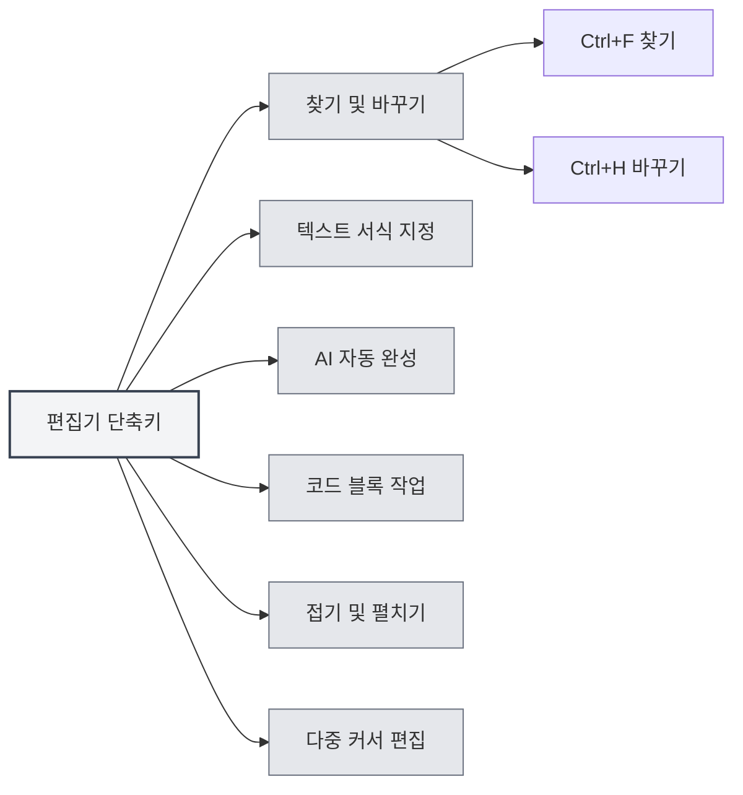

# 편집기 단축키

## 개요

편집기 단축키는 편집기 인터페이스에서 사용하는 단축키로, 텍스트 편집, 찾기 및 바꾸기, 서식 지정 등의 기능을 포함합니다. 이러한 단축키를 숙달하면 편집 효율성을 높일 수 있습니다.

<MenuItemsDemo mode="demo" :items='[{"id": "edit"}]' />

<ViewMenuItemsDemo mode="demo" :items='["editor", "outline"]' />

**설명**: 찾기/바꾸기(Ctrl+F, Ctrl+H)는 애플리케이션 전역에서 구현됩니다. 굵게/기울임꼴/링크/코드 블록 등은 기본 편집기(Markdown은 Vditor, LaTeX는 Monaco 사용)에서 제공하며, 작동하지 않을 경우 실제 편집기 동작을 기준으로 하세요.

## 찾기 및 바꾸기

### 찾기

- **단축키**: `Ctrl+F` (Windows/Linux) 또는 `Cmd+F` (macOS)
- **기능**: 찾기 대화상자 열기
- **사용 시나리오**: 문서에서 특정 텍스트 찾기

### 찾기 및 바꾸기

- **단축키**: `Ctrl+H` (Windows/Linux) 또는 `Cmd+H` (macOS)
- **기능**: 찾기 및 바꾸기 대화상자 열기
- **사용 시나리오**: 텍스트를 찾아서 바꾸기

### 찾기 기능

찾기 대화상자는 다음 기능을 지원합니다:

- **텍스트 찾기**: 찾을 텍스트 입력
- **텍스트 바꾸기**: 바꿀 텍스트 입력
- **정규 표현식**: 정규 표현식 검색 지원
- **대소문자 구분**: 대소문자 구분
- **전체 단어 일치**: 완전한 단어 일치

찾기 및 바꾸기 메뉴 인터페이스는 다음과 같습니다:

<SearchReplaceMenu mode="demo" :position='{"top": 100, "left": 200}' :adapter='null' />

<SearchReplaceMenu mode="demo" :position='{"top": 150, "left": 200}' :adapter='null' />

## 텍스트 서식 지정

<TextFormatToolbar mode="demo" />

### 굵게

- **단축키**: `Ctrl+B` (Windows/Linux) 또는 `Cmd+B` (macOS)
- **기능**: 선택한 텍스트를 굵게 설정
- **사용 시나리오**: 중요한 내용 강조

### 기울임꼴

- **단축키**: `Ctrl+I` (Windows/Linux) 또는 `Cmd+I` (macOS)
- **기능**: 선택한 텍스트를 기울임꼴로 설정
- **사용 시나리오**: 인용 또는 강조 표시

### 링크 삽입

- **단축키**: `Ctrl+K` (Windows/Linux) 또는 `Cmd+K` (macOS)
- **기능**: 링크 삽입
- **사용 시나리오**: 하이퍼링크 추가

**주의사항**: 이 단축키는 모두 저장(Ctrl+K S)과 충돌할 수 있으므로, 동시에 누르지 말고 먼저 Ctrl+K를 누른 후 K를 누르세요.

## AI 자동 완성

<AISuggestionGhost mode="demo" />

<CompletionSettingsPanel mode="demo" />

### 수동 완성 트리거

- **단축키**: `Shift+Tab`
- **기능**: AI 자동 완성을 수동으로 트리거
- **사용 시나리오**: AI 완성이 필요할 때 수동으로 트리거

### 완성 트리거 키

AI 자동 완성은 다음 키를 통해 자동으로 트리거될 수도 있습니다:

- **Enter**: Enter 키로 트리거
- **Space**: 스페이스바로 트리거
- **세미콜론**: 세미콜론(;)으로 트리거
- **슬래시**: 슬래시(/)로 트리거

이러한 트리거 키는 [[settings.llm|LLM 구성]]에서 설정할 수 있습니다.

## 코드 블록 작업

### 코드 블록 삽입

- **단축키**: `Ctrl+Shift+K` (Markdown 편집기)
- **기능**: 코드 블록 삽입
- **사용 시나리오**: 코드 예제 추가

## 접기 및 펼치기

### 코드 블록 접기

- **단축키**: `Ctrl+Shift+[` (Windows/Linux) 또는 `Cmd+Option+[` (macOS)
- **기능**: 현재 코드 블록 또는 환경 접기
- **사용 시나리오**: 볼 필요가 없는 코드 숨기기

### 코드 블록 펼치기

- **단축키**: `Ctrl+Shift+]` (Windows/Linux) 또는 `Cmd+Option+]` (macOS)
- **기능**: 접힌 코드 블록 또는 환경 펼치기
- **사용 시나리오**: 접힌 내용 보기

## 다중 커서 편집

### 동일한 단어 모두 선택

- **단축키**: `Ctrl+Shift+L` (Windows/Linux) 또는 `Cmd+Shift+L` (macOS)
- **기능**: 문서에서 동일한 모든 단어를 선택하고 커서 추가
- **사용 시나리오**: 동일한 텍스트 일괄 편집

## 실행 취소 및 다시 실행

### 실행 취소

- **단축키**: `Ctrl+Z` (Windows/Linux) 또는 `Cmd+Z` (macOS)
- **기능**: 마지막 작업 실행 취소
- **사용 시나리오**: 실수한 작업 취소

### 다시 실행

- **단축키**: `Ctrl+Y` 또는 `Ctrl+Shift+Z` (Windows/Linux) 또는 `Cmd+Shift+Z` (macOS)
- **기능**: 취소된 작업 다시 실행
- **사용 시나리오**: 취소한 작업 복원

## 선택 작업

### 모두 선택

- **단축키**: `Ctrl+A` (Windows/Linux) 또는 `Cmd+A` (macOS)
- **기능**: 모든 텍스트 선택
- **사용 시나리오**: 복사 또는 삭제를 위해 전체 내용 선택

### 복사

- **단축키**: `Ctrl+C` (Windows/Linux) 또는 `Cmd+C` (macOS)
- **기능**: 선택한 텍스트 복사
- **사용 시나리오**: 내용을 클립보드에 복사

### 붙여넣기

- **단축키**: `Ctrl+V` (Windows/Linux) 또는 `Cmd+V` (macOS)
- **기능**: 클립보드 내용 붙여넣기
- **사용 시나리오**: 복사한 내용 붙여넣기

### 잘라내기

- **단축키**: `Ctrl+X` (Windows/Linux) 또는 `Cmd+X` (macOS)
- **기능**: 선택한 텍스트 잘라내기
- **사용 시나리오**: 텍스트 내용 이동

## 편집기 단축키 목록

### Windows/Linux 단축키

| 기능             | 단축키                     |
| ---------------- | -------------------------- |
| 찾기             | `Ctrl+F`                   |
| 찾기 및 바꾸기   | `Ctrl+H`                   |
| 굵게             | `Ctrl+B`                   |
| 기울임꼴         | `Ctrl+I`                   |
| 링크 삽입       | `Ctrl+K`                   |
| 코드 블록 삽입   | `Ctrl+Shift+K`             |
| 접기             | `Ctrl+Shift+[`             |
| 펼치기           | `Ctrl+Shift+]`             |
| 동일한 단어 모두 선택 | `Ctrl+Shift+L`             |
| 실행 취소       | `Ctrl+Z`                   |
| 다시 실행       | `Ctrl+Y` 또는 `Ctrl+Shift+Z` |
| 모두 선택       | `Ctrl+A`                   |
| 복사             | `Ctrl+C`                   |
| 붙여넣기         | `Ctrl+V`                   |
| 잘라내기         | `Ctrl+X`                   |
| AI 자동 완성     | `Shift+Tab`                |

### macOS 단축키

| 기능             | 단축키         |
| ---------------- | -------------- |
| 찾기             | `Cmd+F`        |
| 찾기 및 바꾸기   | `Cmd+H`        |
| 굵게             | `Cmd+B`        |
| 기울임꼴         | `Cmd+I`        |
| 링크 삽입       | `Cmd+K`        |
| 코드 블록 삽입   | `Cmd+Shift+K`  |
| 접기             | `Cmd+Option+[` |
| 펼치기           | `Cmd+Option+]` |
| 동일한 단어 모두 선택 | `Cmd+Shift+L`  |
| 실행 취소       | `Cmd+Z`        |
| 다시 실행       | `Cmd+Shift+Z`  |
| 모두 선택       | `Cmd+A`        |
| 복사             | `Cmd+C`        |
| 붙여넣기         | `Cmd+V`        |
| 잘라내기         | `Cmd+X`        |
| AI 자동 완성     | `Shift+Tab`    |

## Markdown 편집기 전용 단축키

<LaTeXEditorDemo mode="demo" />

### Vditor 단축키

Markdown 편집기는 Vditor를 기반으로 하며, 다음 단축키를 지원합니다:

- **굵게**: `Ctrl+B`
- **기울임꼴**: `Ctrl+I`
- **링크 삽입**: `Ctrl+K`
- **코드 블록 삽입**: `Ctrl+Shift+K`

## LaTeX 편집기 전용 단축키

<LaTeXEditorDemo mode="demo" />

### Monaco 편집기 단축키

LaTeX 편집기는 Monaco Editor를 기반으로 하며, 다음 단축키를 지원합니다:

- **접기**: `Ctrl+Shift+[`
- **펼치기**: `Ctrl+Shift+]`
- **동일한 단어 모두 선택**: `Ctrl+Shift+L`
- **다중 커서 편집**: `Alt+Click`으로 커서 추가

## 단축키 사용 팁

<LaTeXEditorDemo mode="demo" />

<Outline mode="demo" />

### 조합 사용

여러 단축키를 조합하여 사용할 수 있습니다:

1. **찾기 및 바꾸기**: `Ctrl+H`로 찾기 및 바꾸기 열기, Tab 키로 입력 상자 전환
2. **텍스트 서식 지정**: 텍스트 선택 후 `Ctrl+B` 또는 `Ctrl+I`로 서식 지정
3. **일괄 편집**: `Ctrl+Shift+L`로 동일한 모든 단어 선택 후 통일 편집

### 단축키 기억법

- **서식 지정**: B(Bold), I(Italic)는 굵게와 기울임꼴에 대응
- **찾기**: F(Find), H(Hunt/찾기 및 바꾸기)
- **접기**: `[`와 `]`는 접기와 펼치기에 대응

## 모범 사례

<MainTabs mode="demo" />

1. **숙달 사용**: 자주 사용하는 편집 단축키 숙달
2. **조합 작업**: 여러 단축키를 결합하여 복잡한 편집 수행
3. **일괄 편집**: 다중 커서 기능을 사용한 일괄 편집
4. **빠른 서식 지정**: 단축키를 사용한 빠른 텍스트 서식 지정
5. **찾기 및 바꾸기**: 찾기 및 바꾸기 기능으로 효율성 향상

## 주의사항

1. **플랫폼 차이**: Windows/Linux는 Ctrl, macOS는 Cmd 사용
2. **단축키 충돌**: 일부 단축키는 편집기 기능과 충돌할 수 있음
3. **컨텍스트 의존성**: 일부 단축키는 특정 컨텍스트에서만 유효
4. **편집기 차이**: Markdown과 LaTeX 편집기가 지원하는 단축키가 다를 수 있음
5. **AI 자동 완성**: Shift+Tab은 수동 트리거, 자동 트리거는 트리거 키 구성 필요

## 관련 문서

- [[shortcuts.global|전역 단축키]]
- [[core.editor-basics|편집기 기본 작업]]
- [[markdown.features|Markdown 편집기 기능]]
- [[ai.completion|AI 자동 완성]]

<MenuItemsDemo mode="demo" :items='[{"id": "file"}]' />

<ViewMenuItemsDemo mode="demo" :items='["editor"]' />

<AISuggestionGhost mode="demo" />

<CompletionSettingsPanel mode="demo" />

<LaTeXEditorDemo mode="demo" />