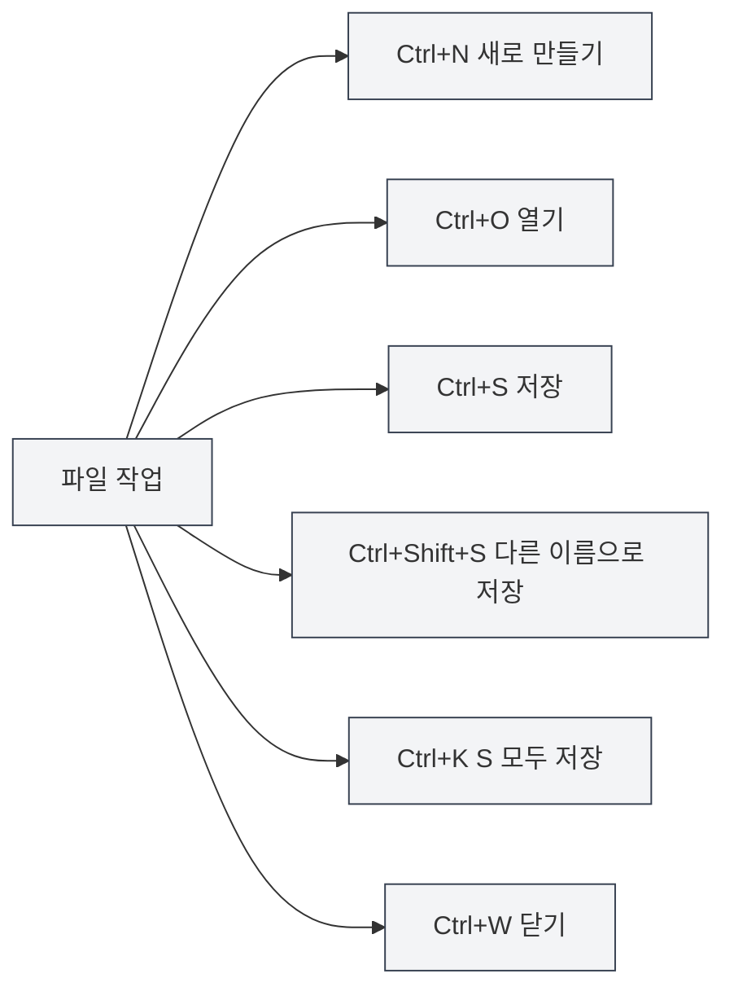

# 전역 단축키

## 개요

전역 단축키는 MetaDoc에서 어떤 인터페이스에서든 사용할 수 있는 단축키입니다. 이러한 단축키를 숙달하면 작업 효율을 크게 향상시킬 수 있습니다.

**설명**: 이 문서의 단축키는 현재 코드 구현과 대조되었으며, 모두 메인 프로세스 또는 렌더러 프로세스에서 구현되어 사용 가능합니다.

## 파일 작업

### 새 문서 만들기

- **단축키**: `Ctrl+N` (Windows/Linux) 또는 `Cmd+N` (macOS)
- **기능**: 새로운 빈 문서 생성
- **사용 시나리오**: 빠르게 새 문서 편집 시작

### 문서 열기

- **단축키**: `Ctrl+O` (Windows/Linux) 또는 `Cmd+O` (macOS)
- **기능**: 파일 선택 대화상자 열기
- **사용 시나리오**: 기존 문서 열기

### 문서 저장

- **단축키**: `Ctrl+S` (Windows/Linux) 또는 `Cmd+S` (macOS)
- **기능**: 현재 문서 저장
- **사용 시나리오**: 편집 내용 저장, 손실 방지

### 다른 이름으로 저장

- **단축키**: `Ctrl+Shift+S` (Windows/Linux) 또는 `Cmd+Shift+S` (macOS)
- **기능**: 현재 문서를 새 파일로 저장
- **사용 시나리오**: 문서 복사본 생성 또는 저장 위치 변경

### 모든 문서 저장

- **단축키**: `Ctrl+K S` (Windows/Linux) 또는 `Cmd+K S` (macOS)
- **기능**: 열려 있는 모든 문서 저장
- **사용 설명**: 먼저 `Ctrl+K` (또는 `Cmd+K`)를 누른 다음 `S`를 누름
- **사용 시나리오**: 모든 문서를 한 번에 저장

<MenuItemsDemo mode="demo" :items='[{"id": "file", "items": ["save-all"]}]' />

### 파일 닫기

- **단축키**: `Ctrl+W` (Windows/Linux) 또는 `Cmd+W` (macOS)
- **기능**: 현재 탭 닫기
- **사용 시나리오**: 필요 없는 문서 닫기

## 탭 작업

탭 바는 열려 있는 모든 문서를 표시하며, 새로 만들기, 전환, 닫기 등의 작업을 지원합니다:

<MainTabs mode="demo" />

<ViewMenuItemsDemo mode="demo" :items='["editor", "outline"]' />

### 새 탭 만들기

- **단축키**: `Ctrl+T` (Windows/Linux) 또는 `Cmd+T` (macOS)
- **기능**: 새 탭 생성
- **사용 시나리오**: 빠르게 새 문서 생성

### 탭 전환

#### 다음 탭

- **단축키**: `Ctrl+Tab` (Windows/Linux) 또는 `Cmd+Tab` (macOS)
- **기능**: 다음 탭으로 전환
- **사용 설명**: `Ctrl+Tab`을 누르고 있으면 탭 전환 오버레이가 표시되며, 계속 Tab 키를 눌러 선택하거나 직접 클릭할 수 있음
- **사용 시나리오**: 여러 문서 간 빠르게 전환

<TabSwitcherOverlay mode="demo" />

#### 이전 탭

- **단축키**: `Ctrl+Shift+Tab` (Windows/Linux) 또는 `Cmd+Shift+Tab` (macOS)
- **기능**: 이전 탭으로 전환
- **사용 시나리오**: 탭을 역방향으로 전환

### 닫힌 탭 다시 열기

- **단축키**: `Ctrl+Shift+T` (Windows/Linux) 또는 `Cmd+Shift+T` (macOS)
- **기능**: 최근에 닫은 탭 다시 열기
- **사용 설명**: 연속해서 사용 가능하며, 최근에 닫은 탭을 순서대로 복원함 (최대 20개 복원)
- **사용 시나리오**: 실수로 탭을 닫은 후 빠르게 복원

<MainTabs mode="demo" />

## 기타 단축키

### 사용자 설명서 열기

- **단축키**: `F1`
- **기능**: 사용자 설명서 페이지 열기
- **사용 시나리오**: 도움말 문서를 확인해야 할 때

<MenuItemsDemo mode="demo" :items='[{"id": "help"}]' />

## 단축키 목록

### Windows/Linux 단축키

| 기능           | 단축키           |
| -------------- | ---------------- |
| 새 문서 만들기 | `Ctrl+N`         |
| 문서 열기      | `Ctrl+O`         |
| 문서 저장      | `Ctrl+S`         |
| 다른 이름으로 저장 | `Ctrl+Shift+S`   |
| 모두 저장      | `Ctrl+K S`       |
| 탭 닫기        | `Ctrl+W`         |
| 새 탭 만들기   | `Ctrl+T`         |
| 다음 탭        | `Ctrl+Tab`       |
| 이전 탭        | `Ctrl+Shift+Tab` |
| 닫힌 탭 다시 열기 | `Ctrl+Shift+T`   |
| 사용자 설명서 열기 | `F1`             |

### macOS 단축키

| 기능           | 단축키          |
| -------------- | --------------- |
| 새 문서 만들기 | `Cmd+N`         |
| 문서 열기      | `Cmd+O`         |
| 문서 저장      | `Cmd+S`         |
| 다른 이름으로 저장 | `Cmd+Shift+S`   |
| 모두 저장      | `Cmd+K S`       |
| 탭 닫기        | `Cmd+W`         |
| 새 탭 만들기   | `Cmd+T`         |
| 다음 탭        | `Cmd+Tab`       |
| 이전 탭        | `Cmd+Shift+Tab` |
| 닫힌 탭 다시 열기 | `Cmd+Shift+T`   |
| 사용자 설명서 열기 | `F1`            |

## 단축키 사용 팁

### 조합키 순서

일부 단축키는 순서대로 눌러야 합니다:

- **모두 저장**: 먼저 `Ctrl+K`를 누른 다음 `S`를 누름 (동시에 누르지 않음)
- **탭 전환**: `Ctrl+Tab`을 누르고 있으면 오버레이가 표시된 후 계속 Tab 키를 눌러 선택

### 사용자 정의 단축키

**설정 → 단축키**에서 전역 단축키를 관리할 수 있습니다:

- **키 설정**: 프로그램은 Windows, Linux, macOS용 세 가지 기본 설정을 제공하며, 처음 시작 시 현재 시스템에 따라 자동 선택됨
- **새로 만들기/설정 편집**: 사용자 정의 설정을 생성하고 각 동작의 키를 수정할 수 있음
- **가져오기/내보내기**: 설정을 JSON 파일로 내보내거나 파일에서 설정을 가져올 수 있음
- **기본값 복원**: 각 키 항목이 기본 설정과 다를 경우 '기본값 복원'을 클릭하여 복원 가능

설정 변경 후 하단의 '저장'을 클릭해야 적용됩니다.

### 단축키 충돌

단축키가 시스템 또는 다른 소프트웨어와 충돌하는 경우:

- **시스템 단축키**: 일부 시스템 단축키가 우선할 수 있음
- **다른 소프트웨어**: 충돌하는 소프트웨어를 닫거나 해당 단축키를 수정
- **사용자 정의 단축키**: **설정 → 단축키**에서 다른 키로 수정 가능

### 기억 요령

- **파일 작업**: 표준 파일 작업 단축키 사용 (Ctrl+N/O/S)
- **탭 작업**: Tab 키 관련 조합 사용
- **모두 저장**: 명령 접두사로 Ctrl+K 사용

## 모범 사례

1. **숙달 사용**: 자주 사용하는 단축키를 숙달하여 효율 향상
2. **조합 사용**: 여러 단축키를 결합하여 복잡한 작업 수행
3. **탭 전환**: Ctrl+Tab을 사용하여 빠르게 전환, 마우스 작업 피하기
4. **정기적 저장**: Ctrl+S를 사용하여 정기적으로 저장하는 습관 기르기
5. **빠른 복원**: 실수로 탭을 닫았을 때 Ctrl+Shift+T를 사용하여 빠르게 복원

## 주의 사항

1. **플랫폼 차이**: Windows/Linux는 Ctrl 사용, macOS는 Cmd 사용
2. **단축키 충돌**: 다른 소프트웨어와의 단축키 충돌 주의
3. **조합키 순서**: 일부 단축키는 순서대로 눌러야 함
4. **탭 전환**: Ctrl+Tab을 누르면 오버레이가 표시되며 계속 선택 가능
5. **모두 저장**: Ctrl+K S는 먼저 Ctrl+K를 누른 다음 S를 누름

## 관련 문서

- [[shortcuts.editor|에디터 단축키]]
- [[core.file-operations|파일 작업]]
- [[core.multi-tab|다중 탭 관리]]

<MenuItemsDemo mode="demo" :items='[{"id": "file"}]' />

<MainTabs mode="demo" />

<ViewMenuItemsDemo mode="demo" :items='["editor", "outline", "agent"]' />

