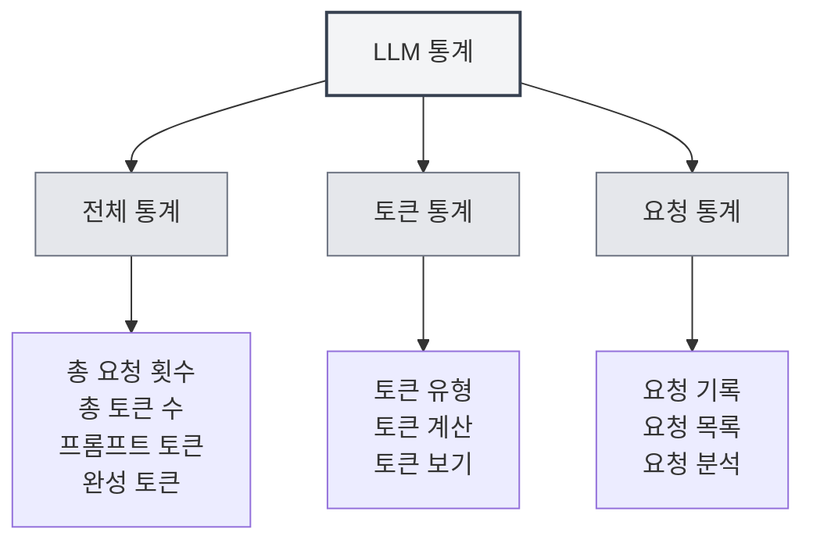

# LLM 통계

## 개요

LLM 통계 기능은 LLM API 사용 현황을 추적하고 확인하는 데 사용되며, 토큰 사용량, 요청 횟수, 비용 통계 등의 정보를 포함합니다. 이러한 통계 데이터는 LLM 사용 현황을 파악하고 사용 전략을 최적화하는 데 도움이 됩니다.

## LLM 통계 열기

### 접근 방법

다음 방법으로 LLM 통계 페이지를 열 수 있습니다:

- **설정 페이지**: 설정 페이지에 LLM 통계 진입점이 있을 수 있습니다.
- **메뉴 옵션**: 일부 메뉴에 LLM 통계 옵션이 있을 수 있습니다.
- **단축키**: 일부 경우 단축키가 있을 수 있습니다(향후 지원 가능성 있음).

<SettingLlmSection mode="demo" />

## 통계 정보

<LlmStatisticsView mode="demo" />

<LlmStatisticsContent mode="demo" />

### 전체 통계

LLM 통계 페이지는 다음 전체 통계 정보를 표시합니다:

- **총 요청 횟수**: 모든 LLM 요청의 총 횟수
- **총 토큰 수**: 모든 요청에서 사용된 총 토큰 수
- **프롬프트 토큰**: 모든 요청의 프롬프트 토큰 총합
- **완성 토큰**: 모든 요청의 완성 토큰 총합

### 시간 범위 필터링

다음 시간 범위로 통계 데이터를 필터링할 수 있습니다:

- **전체 기간**: 모든 기간의 통계 데이터 보기
- **오늘**: 오늘의 통계 데이터 보기
- **이번 주**: 이번 주의 통계 데이터 보기
- **이번 달**: 이번 달의 통계 데이터 보기
- **사용자 지정 범위**: 사용자 지정 시작 및 종료 날짜 선택

### 통계 차트

<ChartGenerationDisplay mode="demo" />

통계 페이지에는 다음 차트가 포함될 수 있습니다:

- **토큰 사용 추이**: 시간에 따른 토큰 사용량 변화 추이 표시
- **요청 횟수 추이**: 시간에 따른 요청 횟수 변화 추이 표시
- **모델 사용 분포**: 다양한 모델의 사용 현황 표시
- **요청 유형 분포**: 다양한 유형의 요청 분포 표시

## 토큰 통계

<DataAnalysisDisplay mode="demo" />

### 토큰 유형

토큰 통계에는 다음 유형이 포함됩니다:

- **프롬프트 토큰**: 입력 프롬프트의 토큰 수
- **완성 토큰**: 생성된 콘텐츠의 토큰 수
- **총 토큰 수**: 총 토큰 수 (프롬프트 + 완성)

### 토큰 계산

토큰 계산 방식:

- **자동 기록**: 각 LLM 요청 후 토큰 사용량 자동 기록
- **실시간 업데이트**: 통계 데이터 실시간 업데이트
- **누적 통계**: 통계 데이터 누적 계산

### 토큰 보기

다음 토큰 정보를 확인할 수 있습니다:

- **총 토큰 수**: 모든 요청의 총 토큰 수
- **평균 토큰 수**: 요청당 평균 토큰 수
- **최대 토큰 수**: 단일 요청의 최대 토큰 수
- **최소 토큰 수**: 단일 요청의 최소 토큰 수

## 요청 통계

<LlmStatisticsContent mode="demo" />

### 요청 기록

각 LLM 요청마다 다음 정보가 기록됩니다:

- **타임스탬프**: 요청 시간
- **모델 이름**: 사용된 모델 이름
- **요청 유형**: 요청 유형 (채팅/완성)
- **토큰 사용량**: 해당 요청의 토큰 사용량

### 요청 목록

요청 목록을 확인할 수 있습니다:

- **시간 정렬**: 시간 역순으로 정렬
- **상세 정보**: 각 요청의 상세 정보 확인
- **필터 기능**: 모델, 유형 등으로 요청 필터링

### 요청 분석

요청을 분석할 수 있습니다:

- **요청 빈도**: 요청 빈도 분석
- **모델 사용**: 다양한 모델 사용 현황 분석
- **유형 분포**: 다양한 유형의 요청 분포 분석

## 비용 통계

<LlmStatisticsView mode="demo" />

### 비용 계산

비용 통계는 다음 정보를 기반으로 합니다:

- **토큰 사용량**: 토큰 사용량에 따른 비용 계산
- **모델 가격 책정**: 모델마다 다른 가격 책정
- **비용 추정**: 비용 추정치 제공(지원되는 경우)

### 비용 보기

다음 비용 정보를 확인할 수 있습니다:

- **총 비용**: 모든 요청의 총 비용
- **일평균 비용**: 평균 일일 비용
- **모델별 비용**: 다양한 모델의 비용 분포
- **비용 추이**: 시간에 따른 비용 변화 추이

**주의사항**: 비용 통계는 참고용이며, 실제 비용은 API 제공업체의 청구서를 기준으로 합니다.

## 데이터 내보내기

<DataAnalysisDisplay mode="demo" />

### 내보내기 기능

통계 데이터를 내보낼 수 있습니다:

- **내보내기 형식**: 여러 형식 지원 가능 (JSON, CSV 등)
- **내보내기 범위**: 전체 또는 필터링된 데이터 선택 내보내기
- **내보내기 내용**: 어떤 통계 정보를 내보낼지 선택

### 데이터 백업

통계 데이터는 자동으로 저장됩니다:

- **로컬 저장**: 통계 데이터는 로컬에 저장됩니다.
- **자동 저장**: 각 요청 후 자동 저장
- **데이터 지속성**: 애플리케이션 재시작 후에도 데이터 유지

## 통계 초기화

### 초기화 작업

통계 데이터를 초기화할 수 있습니다:

1. LLM 통계 페이지 열기
2. 통계 초기화 버튼 찾기
3. 초기화 작업 확인
4. 통계 데이터가 초기화됨

**주의사항**:

- 초기화 작업은 되돌릴 수 없습니다.
- 초기화 전 데이터 백업 내보내기 권장
- 초기화 후 모든 통계 데이터가 손실됩니다.

## 통계 설정

### 통계 스위치

통계 기능을 제어할 수 있습니다:

- **통계 활성화**: LLM 사용 통계 활성화
- **통계 비활성화**: 통계 기능 비활성화 (데이터 기록 안 함)

### 통계 정밀도

통계 정밀도를 설정할 수 있습니다:

- **상세 기록**: 각 요청의 상세 정보 기록
- **간소 기록**: 전체 통계 정보만 기록

## 모범 사례

1. **정기적 확인**: LLM 사용 통계를 정기적으로 확인하여 사용 현황 파악
2. **비용 관리**: 비용 통계에 따라 사용량 관리
3. **전략 최적화**: 통계 데이터에 따라 사용 전략 최적화
4. **데이터 백업**: 통계 데이터 백업 정기적으로 내보내기
5. **합리적 사용**: 통계 정보에 따라 LLM 기능 합리적으로 사용

## 주의사항

1. **통계 정확성**: 통계 데이터는 API가 반환한 토큰 정보를 기반으로 합니다.
2. **비용 추정**: 비용 통계는 참고용이며, 실제 비용은 청구서를 기준으로 합니다.
3. **데이터 저장**: 통계 데이터는 로컬에 저장되며, 업로드되지 않습니다.
4. **개인정보 보호**: 통계 데이터는 구체적인 내용을 포함하지 않으며, 사용량 정보만 포함합니다.
5. **성능 영향**: 통계 기능은 성능에 미치는 영향이 매우 적어 안심하고 사용할 수 있습니다.

## 관련 문서

- [[settings.llm|LLM 구성]]
- [[ai.chat|AI 대화 기능]]
- [[ai.completion|AI 자동 완성]]

<LlmStatisticsView mode="demo" />

<LlmStatisticsContent mode="demo" />
