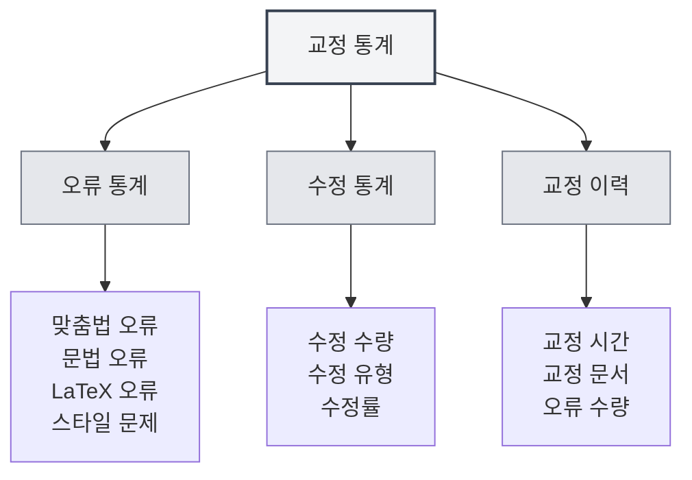

# 교정 도구 통계

## 개요

교정 도구 통계 기능은 문서 교정 사용 현황을 추적하고 확인하는 데 사용되며, 맞춤법 검사, 문법 검사 등의 통계 정보를 포함합니다. 이 통계 데이터는 교정 기능의 사용 상황을 파악하고 교정 전략을 최적화하는 데 도움이 됩니다.

<ProofreadView mode="demo" />

<ProofreadDisplay mode="demo" />

<DataAnalysisDisplay mode="demo" />

## 교정 통계 소개

### 교정 통계란?

교정 통계는 문서 교정 과정에서의 관련 정보를 기록합니다:

- **오류 통계**: 감지된 오류의 수와 유형을 기록
- **수정 통계**: 수정된 오류의 수를 기록
- **교정 이력**: 교정 작업의 이력을 기록

### 통계 유형

교정 통계에는 다음 유형이 포함됩니다:

- **맞춤법 오류**: 맞춤법 검사에서 발견된 오류
- **문법 오류**: 문법 검사에서 발견된 오류
- **LaTeX 오류**: LaTeX 문법 검사에서 발견된 오류
- **스타일 문제**: 스타일 검사에서 발견된 문제
- **기타 오류**: 다른 유형의 오류

## 오류 통계

<DataAnalysisDisplay mode="demo" />

<ChartGenerationDisplay mode="demo" />

### 오류 분류

교정 도구는 오류를 분류하여 통계를 내줍니다:

- **맞춤법 오류**: 단어 맞춤법 오류의 수
- **문법 오류**: 문법 오류의 수
- **LaTeX 오류**: LaTeX 문법 오류의 수
- **스타일 문제**: 글쓰기 스타일 문제의 수
- **기타 오류**: 다른 유형 오류의 수

### 오류 카운트

매번 교정 시 오류를 통계냅니다:

- **총 오류 수**: 모든 오류의 총합
- **각 유형별 오류 수**: 각 유형별 오류의 수
- **오류 분포**: 오류 유형의 분포 상황

## 수정 통계

### 수정 기록

오류 수정 상황을 기록합니다:

- **수정 수량**: 수정된 오류의 수
- **수정 유형**: 수정된 오류의 유형
- **수정률**: 수정된 오류의 비율

### 수정 이력

수정 이력을 확인할 수 있습니다:

- **수정 시간**: 오류가 수정된 시간
- **수정 내용**: 수정된 구체적인 내용
- **수정 방식**: 수정 방식 (수동/자동)

## 교정 이력

### 이력 기록

교정 작업의 이력을 기록합니다:

- **교정 시간**: 교정 작업이 수행된 시간
- **교정 문서**: 교정된 문서
- **오류 수량**: 발견된 오류의 수
- **수정 수량**: 수정된 오류의 수

### 이력 확인

교정 이력을 확인할 수 있습니다:

- **이력 목록**: 모든 교정 이력 기록을 표시
- **상세 정보**: 매번 교정의 상세 정보 확인
- **통계 분석**: 이력 데이터에 대한 통계 분석

## 통계 뷰

<ProofreadView mode="demo" />

### 통합 뷰

통합 뷰는 모든 오류를 표시합니다:

- **오류 목록**: 순서대로 모든 오류 표시
- **오류 상세**: 각 오류의 상세 정보 표시
- **오류 위치 지정**: 오류 위치로 이동 가능

<DataAnalysisDisplay mode="demo" />

### 분류 뷰

분류 뷰는 유형별로 오류를 표시합니다:

- **유형별 그룹화**: 오류를 유형별로 그룹화하여 표시
- **유형 통계**: 각 유형별 오류 수량 표시
- **유형 필터링**: 특정 유형의 오류만 필터링 가능

## 통계 내보내기

### 내보내기 기능

교정 통계를 내보낼 수 있습니다:

- **내보내기 형식**: 여러 형식(JSON, CSV 등)을 지원할 수 있음
- **내보내기 범위**: 전체 또는 필터링된 데이터 중 선택하여 내보내기 가능
- **내보내기 내용**: 어떤 통계 정보를 내보낼지 선택 가능

<ChartGenerationDisplay mode="demo" />

## 모범 사례

1. **정기적 교정**: 정기적으로 교정 기능을 사용하여 문서 점검
2. **통계 주시**: 오류 통계를 주시하여 문서 품질 파악
3. **신속한 수정**: 발견된 오류는 신속히 수정
4. **추세 분석**: 오류 추세를 분석하여 글쓰기 습관 개선
5. **이력 활용**: 이력 기록을 활용하여 문서 개선 상황 추적

## 주의사항

1. **통계 정확성**: 통계 데이터는 교정 도구의 감지 결과를 기반으로 함
2. **오탐 처리**: 일부 감지는 오탐일 수 있으므로 수동 판단 필요
3. **데이터 저장**: 통계 데이터는 로컬에 저장되며 업로드되지 않음
4. **개인정보 보호**: 통계 데이터는 구체적인 내용을 포함하지 않고 통계 정보만 포함
5. **성능 영향**: 통계 기능은 성능에 미치는 영향이 매우 적어 안심하고 사용 가능

## 관련 문서

- [[ai.proofread|AI 교정 기능]]
- [[statistics.llm|LLM 통계]]
