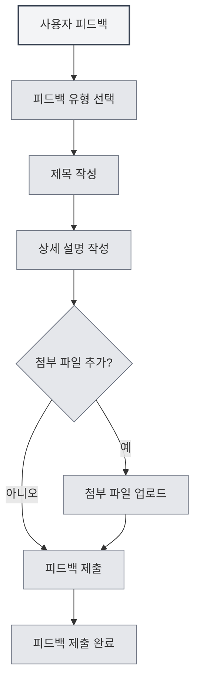

# 사용자 피드백

## 개요

사용자 피드백 기능을 통해 MetaDoc 팀에 문제 보고, 기능 제안 또는 기타 피드백을 제출할 수 있습니다. 귀하의 피드백은 제품 개선에 매우 중요합니다.

## 사용자 피드백 열기

### 접근 방법

다음 방법으로 사용자 피드백 페이지를 열 수 있습니다:

- **설정 페이지**: "정보" 설정 페이지에서 "사용자 피드백" 버튼 클릭
- **메뉴 옵션**: 일부 메뉴에 사용자 피드백 옵션이 있을 수 있음
- **단축키**: 일부 경우 단축키가 있을 수 있음 (향후 지원 가능성 있음)

<SettingAboutSection mode="demo" />

## 피드백 유형

### 피드백 유형 선택

피드백 제출 시 피드백 유형을 선택해야 합니다:

- **버그 피드백**: 소프트웨어 오류 또는 문제 보고
- **기능 제안**: 새로운 기능 또는 개선 사항 제안
- **보안성 피드백**: 보안 문제 보고
- **기타**: 기타 유형의 피드백

<DialogDemo mode="demo" dialogType="feedback" />

### 유형 설명

- **버그 피드백**: 소프트웨어 버그, 충돌, 비정상 동작 등의 문제 보고 시 사용
- **기능 제안**: 새로운 기능 요구사항 또는 기존 기능 개선 제안 시 사용
- **보안성 피드백**: 보안 취약점 또는 보안 문제 보고 시 사용
- **기타**: 사용 문제, 문서 문제 등 기타 유형의 피드백 시 사용

## 피드백 내용

### 제목

피드백 제목은 다음과 같아야 합니다:

- **간결 명료**: 문제 또는 제안을 간략히 설명
- **구체적 명확**: 모호한 제목 사용 피함
- **필수 항목**: 제목은 필수 항목입니다

### 상세 설명

상세 설명은 다음을 포함해야 합니다:

- **문제 설명**: 발생한 문제를 명확히 설명
- **기대 결과**: 기대하는 결과 설명
- **기타 정보**: 진단에 도움이 되는 기타 정보 제공
- **연락처**: 선택 사항의 연락처, 추후 진행에 편의 제공

### 피드백 템플릿

시스템은 다음 부분을 포함하는 피드백 템플릿을 제공합니다:

- **시스템 정보**: 자동으로 채워지는 시스템 정보
- **문제 설명**: 문제를 설명하는 영역
- **기대 결과**: 기대 결과 영역
- **기타 정보**: 기타 정보 영역
- **연락처**: 선택 사항의 연락처

<MenuItemsDemo mode="demo" :items='[{"id": "settings"}]' />

## 첨부 파일 업로드

### 첨부 파일 지원

문제 설명을 보조하기 위해 첨부 파일을 업로드할 수 있습니다:

- **파일 유형**: 모든 유형의 파일 지원
- **파일 크기**: 단일 파일 10MB 이하
- **총 크기**: 모든 첨부 파일 총 크기 50MB 이하
- **파일 수량**: 최대 5개 첨부 파일 업로드

<SettingImageSection mode="demo" />

### 첨부 파일 용도

첨부 파일은 다음에 사용될 수 있습니다:

- **스크린샷**: 문제 스크린샷 제공
- **로그 파일**: 오류 로그 제공
- **예시 파일**: 문제 예시 파일 제공
- **기타 파일**: 기타 관련 파일 제공

### 첨부 파일 규칙

- **단일 파일 제한**: 단일 파일 10MB 이하
- **총 크기 제한**: 모든 첨부 파일 총 크기 50MB 이하
- **수량 제한**: 최대 5개 첨부 파일
- **유형 제한**: 파일 유형 제한 없음, Gist 기능에 따름

## 피드백 제출

### 제출 단계

1. **유형 선택**: 피드백 유형 선택
2. **제목 작성**: 피드백 제목 작성
3. **설명 작성**: 상세 설명 작성
4. **첨부 파일 추가**: 선택 사항, 첨부 파일 추가
5. **피드백 제출**: "피드백 제출" 버튼 클릭

설정 페이지를 통해 사용자 피드백에 접근할 수 있습니다:

<MenuItemsDemo mode="demo" :items='[{"id": "settings"}]' />

### 제출 검증

제출 전 검증이 이루어집니다:

- **제목 검증**: 제목이 비어 있지 않은지 확인
- **설명 검증**: 설명이 비어 있지 않은지 확인
- **첨부 파일 검증**: 첨부 파일이 규칙에 맞는지 확인

<DialogDemo mode="demo" dialogType="submit-confirm" />

### 제출 결과

제출 후 결과가 표시됩니다:

- **제출 성공**: 성공 메시지 표시
- **제출 실패**: 오류 메시지 및 원인 표시

## 기타 연락 방법

### 이메일 피드백

이메일을 통해서도 피드백이 가능합니다:

- **이메일 주소**: 피드백 페이지 하단에 표시
- **이메일 복사**: 이메일 주소 복사 가능
- **이메일 제목**: 명확한 제목 사용 권장

<ViewMenuItemsDemo mode="demo" :items='["settings"]' />

### QQ 그룹

공식 QQ 그룹에 가입할 수 있습니다:

- **QQ 그룹 번호**: 피드백 페이지 하단에 표시
- **그룹 번호 복사**: QQ 그룹 번호 복사 가능
- **그룹 가입**: 그룹 가입 후 실시간 피드백 가능

## 피드백 처리

### 피드백 절차

피드백 제출 후 처리 절차:

1. **피드백 수신**: 시스템이 귀하의 피드백을 수신
2. **분류 처리**: 피드백 유형에 따라 분류
3. **문제 분석**: 문제 또는 제안 분석
4. **후속 처리**: 상황에 따라 후속 처리
5. **피드백 답변**: 이메일 또는 QQ 그룹을 통해 답변 가능

### 피드백 우선순위

피드백은 유형과 심각도에 따라 우선순위가 설정됩니다:

- **보안성 피드백**: 최고 우선순위
- **심각한 버그**: 높은 우선순위
- **기능 제안**: 중간 우선순위
- **기타 피드백**: 일반 우선순위

<MainTabs mode="demo" />

## 모범 사례

1. **상세 설명**: 문제 또는 제안을 가능한 한 상세히 설명
2. **스크린샷 제공**: 가능하다면 문제 스크린샷 제공
3. **로그 제공**: 오류 발생 시 오류 로그 제공
4. **예시 제공**: 가능하다면 문제 예시 파일 제공
5. **연락처**: 후속 진행을 위해 연락처 제공

## 주의사항

1. **피드백 형식**: 템플릿 형식에 따라 피드백 작성
2. **첨부 파일 크기**: 첨부 파일 크기 제한 주의
3. **연락처**: 후속 진행을 위해 연락처 제공
4. **피드백 유형**: 올바른 피드백 유형 선택
5. **시스템 정보**: 시스템 정보는 자동으로 채워지며 삭제하지 마세요

## 관련 문서

- [[settings.about|정보]]
- [[user.profile|사용자 프로필]]

<AIChat mode="demo" />
