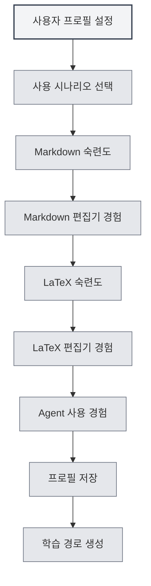

# 사용자 프로필

## 개요

사용자 프로필 기능을 통해 개인 정보와 사용 선호도를 설정할 수 있으며, MetaDoc이 사용자의 요구를 더 잘 이해하고 맞춤형 사용 경험과 학습 경로를 제공하는 데 도움이 됩니다.

## 사용자 프로필 설정

### 사용자 프로필 열기

다음 방법으로 사용자 프로필 대화 상자를 열 수 있습니다:

- **홈페이지 안내**: 처음 사용 시, 홈페이지에서 사용자 프로필 설정을 안내할 수 있습니다.
- **사용자 매뉴얼**: 사용자 매뉴얼에서 사용자 프로필 설정에 접근할 수 있습니다.
- **메뉴 옵션**: 일부 메뉴에 사용자 프로필 옵션이 있을 수 있습니다.

### 사용자 프로필 인터페이스

사용자 프로필 인터페이스는 다음 주요 부분을 포함합니다:

<UserProfileView mode="demo" />

### 프로필 설정 마법사

사용자 프로필 설정은 단계별 마법사 형식으로 진행됩니다:

1. **사용 시나리오**: 주요 사용 시나리오 선택
2. **Markdown 숙련도**: Markdown 구문에 대한 친숙도 평가
3. **Markdown 편집기 경험**: 사용해 본 Markdown 편집기 유형 선택
4. **LaTeX 숙련도**: LaTeX 구문에 대한 친숙도 평가
5. **LaTeX 편집기 경험**: 사용해 본 LaTeX 편집기 유형 선택
6. **Agent 사용 경험**: Agent 프레임워크 사용 경험 평가

## 사용 시나리오 선택

### 시나리오 유형

다음 사용 시나리오를 선택할 수 있습니다:

- **학생**: 학생 사용자에 적합하며, 기본 편집 및 Markdown 기능 학습에 중점을 둡니다.
- **연구자**: 연구자에 적합하며, LaTeX 및 학술 문서 작성 기능 학습에 중점을 둡니다.
- **IT 종사자**: IT 종사자에 적합하며, Agent 프레임워크 및 고급 기능 학습에 중점을 둡니다.
- **사무직 사용자**: 사무직 사용자에 적합하며, 기본 기능 및 내보내기 학습에 중점을 둡니다.
- **기타**: 기타 사용 시나리오

### 시나리오 영향

선택한 시나리오는 다음에 영향을 미칩니다:

- **학습 경로**: 시스템이 해당 학습 경로를 추천합니다.
- **기능 추천**: 관련 기능을 우선적으로 추천합니다.
- **AI 이해**: AI가 사용자의 요구를 더 잘 이해하는 데 도움이 됩니다.

## 기술 평가

### Markdown 숙련도

Markdown 구문에 대한 친숙도를 평가합니다:

- **경험 없음**: Markdown을 사용해 본 적이 없습니다.
- **기초**: 기본 구문(제목, 목록, 링크 등)을 이해합니다.
- **중급**: 일반적인 구문과 확장 기능에 익숙합니다.
- **고급**: Markdown에 능숙하며 다양한 확장 구문을 이해합니다.

### LaTeX 숙련도

LaTeX 구문에 대한 친숙도를 평가합니다:

- **경험 없음**: LaTeX을 사용해 본 적이 없습니다.
- **기초**: 기본 구문과 문서 구조를 이해합니다.
- **중급**: 일반적인 환경과 명령어에 익숙합니다.
- **고급**: LaTeX에 능숙하며 복잡한 문서를 작성할 수 있습니다.

<MenuItemsDemo mode="demo" :items='[{"id": "file"}]' />

### Agent 사용 경험

Agent 프레임워크 사용 경험을 평가합니다:

- **경험 없음**: Agent 기능을 사용해 본 적이 없습니다.
- **기초**: 기본 개념을 이해하고 간단한 기능을 사용해 봤습니다.
- **중급**: 도구 세트와 워크플로에 익숙합니다.
- **고급**: 복잡한 Agent 구성 및 워크플로를 생성할 수 있습니다.

<AgentView mode="demo" />

## 편집기 경험

### Markdown 편집기 경험

사용해 본 Markdown 편집기 유형을 선택합니다:

- **WYSIWYG 편집기**: WYSIWYG(What You See Is What You Get) 편집기를 사용해 봤습니다.
- **기타 Markdown 편집기**: 다른 Markdown 편집기를 사용해 봤습니다.

### LaTeX 편집기 경험

사용해 본 LaTeX 편집기 유형을 선택합니다:

- **온라인 LaTeX 편집기**: 온라인 LaTeX 편집기를 사용해 봤습니다.
- **로컬 LaTeX 편집기**: 로컬 LaTeX 편집기를 사용해 봤습니다.

## 사용 선호도 설정

### 편집 선호도

편집 관련 선호도를 설정할 수 있습니다:

- **편집 모드**: 선호하는 편집 모드
- **미리보기 방식**: 선호하는 미리보기 방식
- **자동 저장**: 자동 저장 선호도

<MainTabs mode="demo" />

### 기능 선호도

기능 관련 선호도를 설정할 수 있습니다:

- **자주 사용하는 기능**: 자주 사용하는 기능 표시
- **기능 우선순위**: 기능의 우선순위 설정
- **인터페이스 레이아웃**: 선호하는 인터페이스 레이아웃

<ViewMenuItemsDemo mode="demo" :items='["settings"]' />

## 사용자 프로필 설정

### 프로필 생성

사용자의 설정을 기반으로 시스템이 사용자 프로필을 생성합니다:

- **기술 수준**: 각 기술 수준 평가
- **사용 시나리오**: 주요 사용 시나리오 식별
- **학습 요구**: 학습 요구 분석

### 프로필 적용

사용자 프로필은 다음에 적용됩니다:

- **학습 경로**: 맞춤형 학습 경로 추천
- **기능 추천**: 관련 기능 우선 추천
- **AI 지원**: AI가 요구를 더 잘 이해하는 데 도움

## 학습 경로 추천

### 경로 유형

사용자 프로필에 따라 시스템이 해당 학습 경로를 추천합니다:

- **학생 경로**: 학생 사용자에 적합한 학습 경로
- **연구자 경로**: 연구자에 적합한 학습 경로
- **IT 종사자 경로**: IT 종사자에 적합한 학습 경로
- **사무직 사용자 경로**: 사무직 사용자에 적합한 학습 경로

<AIChat mode="demo" />

### 경로 내용

학습 경로는 다음을 포함합니다:

- **문서 목록**: 순서대로 정렬된 학습 문서
- **학습 목표**: 각 문서의 학습 목표
- **예상 시간**: 학습 완료 예상 소요 시간

## 프로필 업데이트

### 프로필 수정

언제든지 사용자 프로필을 수정할 수 있습니다:

1. 사용자 프로필 대화 상자 열기
2. 각 설정 수정
3. 변경 사항 저장

### 프로필 동기화

사용자 프로필은 다음을 수행합니다:

- **로컬 저장**: 로컬에 저장됩니다.
- **다중 창 동기화**: 모든 창 간에 동기화됩니다.
- **지속성**: 다음 시작 시에도 유효합니다.

## 모범 사례

1. **성실하게 작성**: 각 정보를 성실하게 작성하여 더 정확한 추천을 받으세요.
2. **정기적 업데이트**: 기술이 향상됨에 따라 프로필을 정기적으로 업데이트하세요.
3. **시나리오 선택**: 실제 사용 상황과 가장 일치하는 시나리오를 선택하세요.
4. **기술 평가**: 자신의 기술 수준을 객관적으로 평가하세요.
5. **추천 활용**: 시스템이 추천하는 학습 경로를 충분히 활용하세요.

## 주의 사항

1. **프로필 개인정보**: 사용자 프로필은 로컬에만 저장되며 업로드되지 않습니다.
2. **프로필 선택 사항**: 사용자 프로필 설정은 선택 사항이며, 설정하지 않을 수 있습니다.
3. **추천 참고**: 학습 경로 추천은 참고용이며, 필요에 따라 조정할 수 있습니다.
4. **기술 변화**: 기술 수준은 변화하므로 정기적인 업데이트를 권장합니다.
5. **다중 시나리오**: 여러 시나리오를 사용하는 경우 가장 주요한 시나리오를 선택하세요.

## 관련 문서

- [[home.features|홈페이지 기능]]
- [[user.feedback|사용자 피드백]]
- [[quick-start.guide|빠른 시작 가이드]]

<MenuItemsDemo mode="demo" :items='[{"id": "settings"}]' />

<MainTabs mode="demo" />
