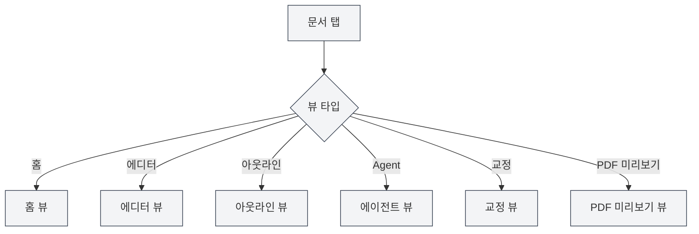

# 뷰 타입

## 개요

MetaDoc는 다양한 뷰 타입을 지원하며, 각 뷰는 서로 다른 기능과 인터페이스를 제공합니다. 필요에 따라 다른 뷰로 전환하여 다양한 작업을 수행할 수 있습니다.

## 뷰 타입 소개

### 홈 뷰

홈 뷰는 MetaDoc의 진입 인터페이스로, 빠른 시작과 최근 문서 기능을 제공합니다.

**주요 기능**:

- **빠른 시작**: 문서 형식을 선택하여 새 문서를 빠르게 생성
- **최근 문서**: 최근에 연 문서 목록 표시
- **사용자 설명서**: 사용자 설명서에 빠르게 접근
- **사용자 프로필**: 사용자 프로필 설정에 접근

**사용 시나리오**:

- 애플리케이션 시작 후 초기 화면
- 새 문서를 빠르게 생성해야 할 때
- 최근 사용한 문서를 확인할 때

사이드바를 통해 다른 뷰로 전환할 수 있습니다.

### 에디터 뷰

에디터 뷰는 문서 편집의 주요 인터페이스로, Markdown, LaTeX 및 일반 텍스트 편집을 지원합니다.

<LaTeXEditor mode="demo" />

**주요 기능**:

- **Markdown 편집**: Vditor 에디터를 사용하여 Markdown 문서 편집
- **LaTeX 편집**: Monaco 에디터를 사용하여 LaTeX 문서 편집
- **일반 텍스트 편집**: Monaco 에디터를 사용하여 일반 텍스트 편집
- **실시간 미리보기**: Markdown 에디터는 실시간 미리보기를 지원

**사용 시나리오**:

- 문서 내용 편집
- 기술 문서 작성
- 학술 논문 작성

### 아웃라인 뷰

아웃라인 뷰는 문서의 구조화된 아웃라인을 표시하여 문서 구조를 쉽게 확인하고 편집할 수 있도록 합니다.

<Outline mode="demo" />

**주요 기능**:

- **아웃라인 표시**: 트리 구조로 문서 제목 표시
- **노드 작업**: 노드 추가, 편집, 삭제, 이동
- **드래그 앤 드롭 정렬**: 노드를 드래그하여 순서 조정
- **AI 기능**: 하위 섹션 생성, 내용 생성, 아웃라인 최적화

**사용 시나리오**:

- 문서 구조 확인
- 특정 섹션으로 빠르게 이동
- 문서 아웃라인 편집
- AI를 사용하여 내용 생성

### 에이전트 뷰

에이전트 뷰는 에이전트 프레임워크의 상호작용 인터페이스를 제공하여 에이전트 세션을 생성하고 관리하는 데 사용됩니다.

<AgentView mode="demo" />

**주요 기능**:

- **세션 관리**: 에이전트 세션 생성, 편집, 삭제
- **도구 구성**: 에이전트가 사용하는 도구 세트 구성
- **워크플로**: 워크플로 생성 및 실행
- **메시지 상호작용**: 에이전트와 대화

**사용 시나리오**:

- 에이전트를 사용하여 복잡한 작업 완료
- 문서 처리 자동화
- 문서 일괄 작업

### 교정 뷰

교정 뷰는 AI 교정 기능을 제공하여 문서의 오류를 검사하고 수정 제안을 합니다.

<ProofreadView mode="demo" />

**주요 기능**:

- **오류 감지**: 맞춤법, 문법, LaTeX 구문 오류 감지
- **오류 목록**: 감지된 모든 오류 표시
- **오류 수정**: 개별 수정 또는 한 번에 모두 수정
- **사전 관리**: 단어를 사전에 추가

**사용 시나리오**:

- 문서 오류 확인
- 문서 품질 향상
- 맞춤법 및 문법 오류 수정

### PDF 미리보기 뷰

PDF 미리보기 뷰는 LaTeX 문서 컴파일 후의 PDF 미리보기를 표시합니다(LaTeX 문서만 해당).

<PdfPreviewPanel mode="demo" pdfUrl="" />

**주요 기능**:

- **PDF 표시**: 컴파일된 PDF 내용 표시
- **확대/축소 제어**: PDF 확대, 축소
- **PDF 새로 고침**: 다시 컴파일하여 PDF 새로 고침
- **코드로 이동**: PDF 위치에서 LaTeX 코드로 이동

**사용 시나리오**:

- LaTeX 문서 효과 미리보기
- PDF 형식 확인
- PDF 내 문제 위치 파악

## 뷰 전환

### 전환 방법

다음 방법으로 뷰를 전환할 수 있습니다:

<MainTabs mode="demo" />

<ViewMenuItemsDemo mode="demo" :items='["editor", "outline", "agent"]' />

1. **뷰 메뉴**: 왼쪽의 뷰 메뉴 버튼 클릭
2. **뷰 선택기**: 뷰 메뉴에서 전환할 뷰 선택
3. **단축키**: 일부 뷰는 단축키가 있을 수 있음(향후 지원 가능성 있음)

### 뷰 메뉴

뷰 메뉴는 왼쪽 사이드바에 표시됩니다:

- **홈**: 홈 뷰로 전환
- **에디터**: 에디터 뷰로 전환
- **아웃라인**: 아웃라인 뷰로 전환
- **Agent**: 에이전트 뷰로 전환
- **교정**: 교정 뷰로 전환
- **PDF 미리보기**: PDF 미리보기 뷰로 전환(LaTeX 문서만 해당)

### 뷰 상태

각 문서 탭은 독립적인 뷰 상태를 가집니다:

- **뷰 기억**: 뷰 전환 후, 뷰 상태가 저장됨
- **다음에 열기**: 다음에 문서를 열면 이전 뷰로 복원됨
- **다중 탭**: 다른 탭은 다른 뷰를 사용할 수 있음

## 뷰 특성

### 뷰 독립성

각 뷰는 독립적입니다:

- **상태 독립**: 각 뷰는 독립적인 상태를 가짐
- **데이터 동기화**: 뷰 간 데이터는 자동 동기화됨
- **빠른 전환**: 뷰 전환이 매우 빠르며, 다시 로드할 필요 없음

### 뷰 조합

일부 뷰는 조합하여 사용할 수 있습니다:

- **에디터+아웃라인**: 에디터와 아웃라인을 동시에 확인
- **에디터+PDF 미리보기**: LaTeX 에디터는 코드와 PDF를 동시에 표시할 수 있음
- **에디터+교정**: 편집 중에 교정 가능

## 뷰 사용 권장사항

### 문서 편집

- **에디터 뷰**: 주로 에디터 뷰를 사용하여 편집
- **아웃라인 뷰**: 구조를 확인해야 할 때 아웃라인 뷰로 전환
- **PDF 미리보기**: LaTeX 문서 편집 시 PDF 미리보기로 효과 확인

### 문서 교정

- **교정 뷰**: 문서 교정 전용
- **에디터 뷰**: 교정 후 에디터 뷰로 돌아가 계속 편집

### 에이전트 작업

- **에이전트 뷰**: 에이전트 세션 생성 및 관리
- **에디터 뷰**: 에이전트 처리 후 문서 확인

## 주의사항

1. **뷰 전환**: 뷰 전환 시 현재 상태가 저장됨
2. **PDF 미리보기**: LaTeX 문서만 PDF 미리보기 뷰 지원
3. **뷰 상태**: 각 탭의 뷰 상태는 독립적으로 저장됨
4. **데이터 동기화**: 뷰 간 데이터는 자동 동기화됨
5. **성능 고려**: 일부 뷰는 많은 리소스를 사용할 수 있음

## 관련 문서

- [[core.multi-tab|다중 탭 관리]]
- [[outline.basics|아웃라인 뷰 기능]]
- [[agent.session|에이전트 세션 관리]]
- [[ai.proofread|AI 교정 기능]]
- [[latex.pdf-preview|PDF 미리보기 기능]]
