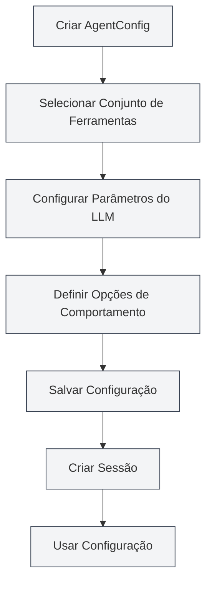

# Gerenciamento de Configuração do Agente

## Visão Geral

A configuração do Agente (AgentConfig) é um componente central do framework de Agente, usado para definir a identidade e o escopo de capacidades do Agente. Cada AgentConfig está associado a um conjunto de ferramentas, determinando quais ferramentas o Agente pode usar, e permite configurar parâmetros do LLM e opções de comportamento.

O AgentConfig controla flexivelmente o escopo de capacidades do Agente através do mecanismo de interseção de conjuntos de ferramentas, permitindo que você crie configurações de Agente especializadas para diferentes cenários.

<AgentView mode="demo" />

## Conceitos Centrais

### Estrutura do AgentConfig

O AgentConfig contém as seguintes partes principais:

- **Informações Básicas**: ID, nome, descrição, número da versão
- **Associação de Conjuntos de Ferramentas**: Lista de IDs de conjuntos de ferramentas associados (interseção)
- **Configuração do LLM**: Modelo, temperatura, número máximo de tokens, prompt do sistema, etc.
- **Configuração de Comportamento**: Se permite chamadas de ferramentas, número máximo de chamadas, etc.
- **Tipo de Cenário**: outline, editor, analysis, visualization, custom

### Interseção de Conjuntos de Ferramentas

Quando um AgentConfig está associado a múltiplos conjuntos de ferramentas, as ferramentas disponíveis são a interseção de todos os conjuntos:

- Conjunto de Ferramentas A contém: `[tool1, tool2, tool3]`
- Conjunto de Ferramentas B contém: `[tool2, tool3, tool4]`
- Ferramentas disponíveis para o AgentConfig: `[tool2, tool3]`

Este mecanismo permite que você controle com precisão o escopo de capacidades do Agente.

<AgentConfigManager mode="demo" />

## Criar um AgentConfig

### Criar Nova Configuração

Passos para criar um AgentConfig:

1. **Abrir Gerenciamento de Agentes**: Na visualização do Agente, clique em "Gerenciar" → "Configuração do Agente"
2. **Criar Configuração**: Clique no botão "Nova Configuração"
3. **Preencher Informações Básicas**:
   - Nome: Nome da configuração (suporte a multilíngue)
   - Descrição: Descrição da configuração (suporte a multilíngue)
4. **Selecionar Conjunto de Ferramentas**: Selecione um ou mais conjuntos de ferramentas na lista suspensa
5. **Configurar LLM** (Opcional):
   - Prompt do Sistema: Prompt do sistema personalizado
   - Injetar Timestamp: Se deve injetar o horário atual no prompt do sistema
6. **Definir Comportamento** (Opcional):
   - Número Máximo de Chamadas de Ferramenta: Limita o número de chamadas de ferramentas do Agente (null significa ilimitado)
7. **Salvar Configuração**: Clique no botão "Salvar"

<AgentView mode="demo" />

Você pode acessar a visualização do Agente através da barra lateral:

### Configuração Padrão

O sistema fornece um AgentConfig padrão (`default-agent-config`), que inclui todas as ferramentas integradas. Não pode ser excluído, mas pode ser copiado.

## Editar um AgentConfig

### Operação de Edição

Editar um AgentConfig existente:

1. **Abrir Interface de Gerenciamento**: Na interface de gerenciamento de configuração do Agente, encontre a configuração a ser editada
2. **Clicar em Editar**: Clique no botão "Editar" no cartão da configuração
3. **Modificar Configuração**: Altere o nome, descrição, conjuntos de ferramentas, configuração do LLM ou configuração de comportamento
4. **Salvar Alterações**: Clique no botão "Salvar"

**Atenção**: A configuração padrão (`default-agent-config`) não permite edição, mas pode ser copiada e então editada.

<AgentConfigManager mode="demo" />

## Excluir um AgentConfig

### Operação de Exclusão

Excluir um AgentConfig não necessário:

1. **Abrir Interface de Gerenciamento**: Na interface de gerenciamento de configuração do Agente, encontre a configuração a ser excluída
2. **Clicar em Excluir**: Clique no botão "Excluir" no cartão da configuração
3. **Confirmar Exclusão**: Confirme a exclusão na caixa de diálogo de confirmação que aparece

<AgentConfigManager mode="demo" />

**Atenção**:

- A configuração padrão (`default-agent-config`) não pode ser excluída
- Excluir uma configuração não afeta sessões já criadas, mas novas sessões não poderão usar essa configuração
- Se a configuração estiver sendo usada por uma sessão, um aviso será exibido antes da exclusão

## Copiar um AgentConfig

### Operação de Cópia

Copiar um AgentConfig existente:

1. **Abrir Interface de Gerenciamento**: Na interface de gerenciamento de configuração do Agente, encontre a configuração a ser copiada
2. **Clicar em Copiar**: Clique no botão "Copiar" no cartão da configuração
3. **Editar a Cópia**: O sistema criará uma cópia, com o nome automaticamente adicionando o sufixo " (Cópia)"
4. **Salvar Modificações**: Modifique a cópia conforme necessário e salve

<AgentView mode="demo" />

Copiar uma configuração duplica todas as configurações, incluindo associação de conjuntos de ferramentas, configuração do LLM e configuração de comportamento.

## Importar/Exportar AgentConfig

### Exportar Configuração

Exportar um AgentConfig para um arquivo JSON:

1. **Abrir Interface de Gerenciamento**: Na interface de gerenciamento de configuração do Agente, encontre a configuração a ser exportada
2. **Clicar em Exportar**: Clique no botão "Exportar" no cartão da configuração
3. **Selecionar Local**: Escolha o local de salvamento e o nome do arquivo
4. **Salvar Arquivo**: Clique em salvar para exportar a configuração

O arquivo JSON exportado contém todas as informações da configuração e pode ser usado para backup ou compartilhamento.

<AgentConfigManager mode="demo" />

### Importar Configuração

Importar um AgentConfig de um arquivo JSON:

1. **Abrir Interface de Gerenciamento**: Na interface de gerenciamento de configuração do Agente
2. **Clicar em Importar**: Clique no botão "Importar Configuração"
3. **Selecionar Arquivo**: Escolha o arquivo JSON a ser importado
4. **Validar Dados**: O sistema valida o formato e o conteúdo do arquivo
5. **Importar Configuração**: Após a importação bem-sucedida, uma nova configuração é criada

A configuração importada recebe um novo ID e não substitui configurações existentes (a menos que o modo de sobrescrita seja usado).

## Configuração do LLM

### Prompt do Sistema

O AgentConfig pode configurar um prompt do sistema personalizado:

- **Prompt Padrão**: Se não definido, usa o prompt do sistema padrão do framework de Agente
- **Prompt Personalizado**: Pode definir um prompt do sistema específico, definindo o papel e comportamento do Agente
- **Injeção de Timestamp**: Pode escolher se injeta o horário atual no prompt do sistema

### Parâmetros do LLM

O AgentConfig pode substituir a configuração global do LLM:

- **Modelo**: Especifica o modelo LLM a ser usado
- **Temperatura**: Controla a aleatoriedade da saída (0-2)
- **Número Máximo de Tokens**: Limita o número máximo de tokens por chamada

**Atenção**: Se o AgentConfig não definir parâmetros do LLM, a configuração global do LLM será usada.

<AgentConfigManager mode="demo" />

## Configuração de Comportamento

### Controle de Chamadas de Ferramentas

O AgentConfig pode controlar o comportamento de chamadas de ferramentas:

- **Permitir Chamadas de Ferramentas**: Se o Agente pode chamar ferramentas (permitido por padrão)
- **Número Máximo de Chamadas de Ferramentas**: Limita o número máximo de chamadas de ferramentas por tarefa (null significa ilimitado)
- **Permitir Chamadas de Fluxo de Trabalho**: Se o Agente pode chamar fluxos de trabalho (permitido por padrão)

### Cenários de Uso

Diferentes configurações de comportamento são adequadas para diferentes cenários:

- **Cenário de Puro Diálogo**: Desabilita chamadas de ferramentas, apenas diálogo
- **Cenário de Ferramentas Limitadas**: Limita o número de chamadas de ferramentas, evitando uso excessivo
- **Cenário de Funcionalidade Completa**: Permite todas as chamadas de ferramentas, sem limitações

<AgentConfigManager mode="demo" />

## Tipos de Cenário

O AgentConfig pode definir um tipo de cenário, usado para classificação e gerenciamento:

- **outline**: Cenário de esboço, para tarefas relacionadas à estrutura de documentos
- **editor**: Cenário de editor, para tarefas de edição de documentos
- **analysis**: Cenário de análise, para tarefas de análise de documentos
- **visualization**: Cenário de visualização, para tarefas de geração de gráficos
- **custom**: Cenário personalizado

O tipo de cenário é usado principalmente para classificação e não afeta o comportamento real do Agente.

## Dicas de Uso

### Organização de Configurações

1. **Padrão de Nomenclatura**: Use nomes claros, como "Agente de Análise de Dados", "Agente de Edição de Documentos"
2. **Classificação por Cenário**: Use tipos de cenário para gerenciamento por categoria
3. **Seleção de Conjuntos de Ferramentas**: Escolha combinações de conjuntos de ferramentas adequadas às necessidades da tarefa

<AgentConfigManager mode="demo" />

### Interseção de Conjuntos de Ferramentas

1. **Controle Preciso**: Use a interseção de múltiplos conjuntos de ferramentas para controlar com precisão as capacidades do Agente
2. **Design de Conjuntos de Ferramentas**: Projete conjuntos de ferramentas especializados e combine-os através da interseção
3. **Teste e Validação**: Após criar uma configuração, teste se a interseção dos conjuntos de ferramentas está correta

<AgentConfigManager mode="demo" />

### Configuração do LLM

1. **Prompt do Sistema**: Escreva prompts do sistema específicos para diferentes cenários
2. **Ajuste de Parâmetros**: Ajuste a temperatura e o número máximo de tokens de acordo com as características da tarefa
3. **Injeção de Timestamp**: Para tarefas que requerem percepção de tempo, ative a injeção de timestamp

## Perguntas Frequentes

### Q: Como criar uma configuração de Agente especializada?

A: Crie uma nova configuração, selecione conjuntos de ferramentas especializados, defina um prompt do sistema personalizado e configuração de comportamento. Por exemplo, crie um "Agente de Análise de Dados", associe conjuntos de ferramentas de análise de dados e defina um prompt do sistema específico.

### Q: O que significa interseção de conjuntos de ferramentas?

A: Quando um AgentConfig está associado a múltiplos conjuntos de ferramentas, as ferramentas disponíveis são a interseção de todos os conjuntos. Por exemplo, se o Conjunto A contém `[tool1, tool2, tool3]` e o Conjunto B contém `[tool2, tool3, tool4]`, as ferramentas disponíveis para o AgentConfig serão `[tool2, tool3]`.

### Q: Posso modificar a configuração padrão?

A: A configuração padrão (`default-agent-config`) não permite edição, mas pode ser copiada e então editada. Copie a configuração padrão e modifique a cópia.

### Q: Qual a relação entre a configuração do LLM e a configuração global?

A: Se o AgentConfig definir parâmetros do LLM, as configurações do AgentConfig serão usadas; caso contrário, a configuração global do LLM será usada. As configurações do AgentConfig têm prioridade mais alta.

### Q: Como limitar o número de chamadas de ferramentas do Agente?

A: Na configuração de comportamento do AgentConfig, defina o "Número Máximo de Chamadas de Ferramentas". Defina um número específico (ex: 10) para limitar as chamadas, ou defina como null para ilimitado.

### Q: Excluir uma configuração afeta sessões existentes?

A: Excluir uma configuração não afeta sessões já criadas, mas novas sessões não poderão usar essa configuração. Se a configuração estiver sendo usada por uma sessão, um aviso será exibido antes da exclusão.

<AgentView mode="demo" />

## Documentação Relacionada

- [[agent.introduction|Visão Geral do Framework de Agente]]
- [[agent.tools|Gerenciamento de Conjuntos de Ferramentas]]
- [[agent.session|Gerenciamento de Sessões do Agente]]
- [[agent.engine|Gerenciamento do Motor do Agente]]