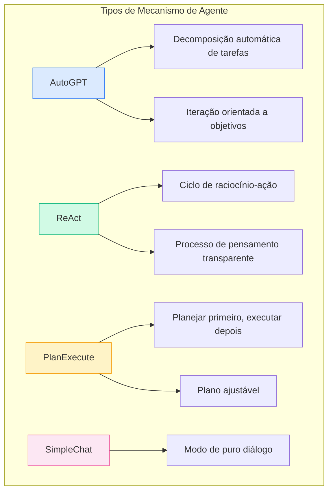
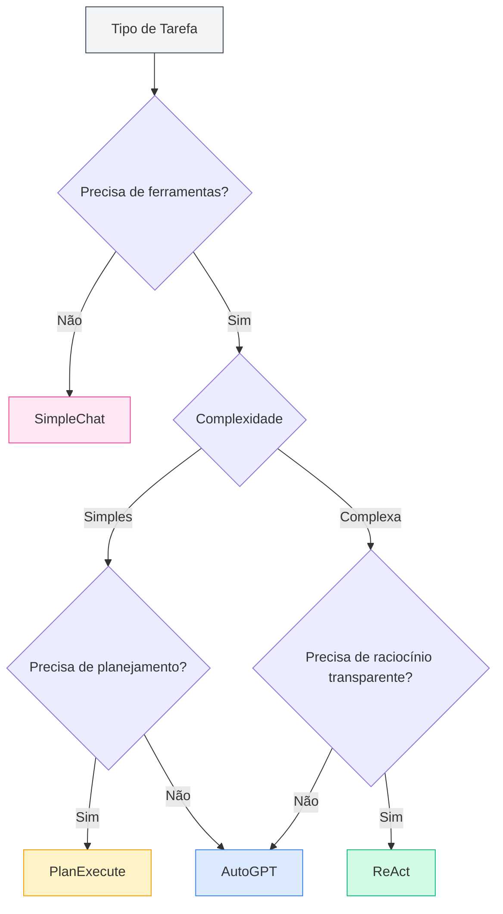
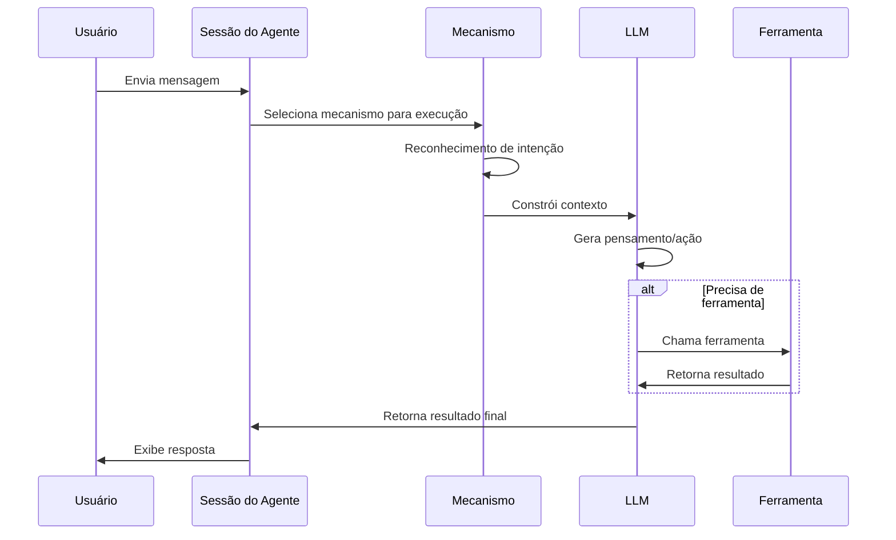

# Gerenciamento de Mecanismo de Agente

## Visão Geral

O mecanismo do agente define a estratégia de execução e o modo de comportamento do Agente. O MetaDoc oferece vários mecanismos integrados, cada um adotando um paradigma de execução de IA diferente, adequado para diferentes cenários de tarefas. Ao escolher o mecanismo apropriado, você pode permitir que o Agente execute tarefas específicas da maneira mais adequada.

<AgentView mode="demo" />

## Tipos de Mecanismo

O MetaDoc suporta os seguintes mecanismos de Agente:

| Nome do Mecanismo | Características                             | Cenário de Aplicação       |
| ----------------- | ------------------------------------------- | -------------------------- |
| **AutoGPT**       | Decomposição automática de tarefas, iteração orientada a objetivos | Tarefas complexas com múltiplas etapas |
| **ReAct**         | Ciclo de raciocínio-ação, processo de pensamento transparente | Tarefas que requerem raciocínio detalhado |
| **PlanExecute**   | Planejar primeiro, executar depois, plano ajustável | Tarefas estruturadas       |
| **SimpleChat**    | Puro diálogo, sem chamar ferramentas        | Perguntas e respostas simples |



## Detalhamento dos Mecanismos

### Mecanismo AutoGPT

**Características**:

- **Decomposição automática de tarefas**: Decompõe tarefas complexas automaticamente em subtarefas
- **Orientado a objetivos**: Executa iterações focadas no objetivo final
- **Tomada de decisão autônoma**: O Agente decide autonomamente a próxima ação

<AgentView mode="demo" />
<AgentEngineManager mode="demo" />

**Cenário de Aplicação**:

- Pesquisa e coleta de informações
- Processamento de documentos com múltiplas etapas
- Tarefas de criação abertas

**Exemplo**:

```
Usuário: Ajude-me a escrever um artigo de revisão sobre inteligência artificial
Agente: [Decompõe automaticamente em: 1. Coletar materiais 2. Organizar esboço 3. Escrever conteúdo 4. Polir e revisar]
```

### Mecanismo ReAct

**Características**:

- **Ciclo de raciocínio-ação**: Exibe explicitamente o processo de pensamento (Reasoning) e a ação (Action)
- **Rastreável**: Cada etapa tem uma base de raciocínio clara
- **Transparente e controlável**: O usuário pode ver a lógica de pensamento do Agente

<AgentView mode="demo" />
<AgentEngineManager mode="demo" />

**Cenário de Aplicação**:

- Tarefas que exigem explicação do processo de raciocínio
- Tarefas de análise lógica
- Cenários de demonstração didática

**Exemplo**:

```
Pensando: O usuário precisa que eu explique a funcionalidade deste código
Ação: Chamar a ferramenta de análise de código
Observação: [Resultado retornado pela ferramenta]
Pensando: Com base no resultado da análise, posso explicar...
```

### Mecanismo PlanExecute

**Características**:

- **Planejar primeiro, executar depois**: Primeiro cria um plano completo, depois executa conforme o plano
- **Plano ajustável**: O plano pode ser modificado durante a execução
- **Saída estruturada**: Formato de saída padronizado, fácil de entender

<AgentView mode="demo" />
<AgentEngineManager mode="demo" />

**Cenário de Aplicação**:

- Tarefas de gerenciamento de projetos
- Geração de documentos estruturados
- Trabalho processual

**Exemplo**:

```
Plano:
1. Analisar requisitos
2. Projetar solução
3. Implementar funcionalidade
4. Testar e verificar

Execução: Completar cada fase passo a passo
```

### Mecanismo SimpleChat

**Características**:

- **Modo de puro diálogo**: Apenas realiza conversação, não chama nenhuma ferramenta
- **Resposta rápida**: Não precisa aguardar execução de ferramentas
- **Simples e direto**: Adequado para perguntas e respostas simples

**Cenário de Aplicação**:

- Perguntas e respostas gerais
- Explicação de conceitos
- Diálogo simples

**Atenção**: Este mecanismo não chama ferramentas, portanto, não pode executar funções como operações de arquivo, análise de dados, etc.

<AgentEngineManager mode="demo" />

## Escolhendo o Mecanismo

### Como escolher o mecanismo adequado

Escolha o mecanismo com base nas características da tarefa:



<AgentView mode="demo" />

### Sugestões de Escolha

| Cenário de Tarefa | Mecanismo Recomendado       |
| ----------------- | --------------------------- |
| Perguntas e respostas do dia a dia | SimpleChat           |
| Edição de documentos | AutoGPT ou ReAct     |
| Análise de dados   | ReAct ou PlanExecute |
| Escrita de código  | ReAct                |
| Pesquisa e investigação | AutoGPT              |
| Gerenciamento de projetos | PlanExecute          |

<AgentView mode="demo" />

## Configurando o Mecanismo

### Escolhendo o mecanismo na configuração do Agente

1. Acesse [[agent.introduction|Gerenciamento de Configuração do Agente]]
2. Crie ou edite uma configuração de Agente
3. Na opção "Mecanismo", selecione o tipo de mecanismo desejado
4. Salve a configuração

### Configuração de parâmetros do mecanismo

Diferentes mecanismos podem ter configurações de parâmetros específicas:

**Parâmetros Gerais**:

- **Número máximo de iterações**: Limita o número de ciclos de pensamento e ação do Agente
- **Tempo limite**: Tempo máximo de espera para uma única chamada
- **Temperatura**: Controla o grau de criatividade da saída

**Parâmetros Específicos do Mecanismo**:

- **AutoGPT**: Profundidade de decomposição de objetivos
- **ReAct**: Opções de exibição do processo de pensamento
- **PlanExecute**: Permissões de ajuste do plano

## Fluxo de Execução do Mecanismo

### Fluxo de execução geral



### Características de execução de diferentes mecanismos

**Características de execução do AutoGPT**:

1. Analisa o objetivo do usuário
2. Decompõe automaticamente em subtarefas
3. Executa subtarefas uma a uma
4. Consolida e retorna os resultados

**Características de execução do ReAct**:

1. Gera o processo de pensamento
2. Determina a próxima ação
3. Executa a ação (chama ferramenta ou gera resposta)
4. Observa o resultado
5. Cicla até completar a tarefa

**Características de execução do PlanExecute**:

1. Analisa requisitos
2. Cria um plano completo
3. Executa passo a passo
4. Retorna resultado estruturado

## Mecanismo Personalizado

### Personalização da configuração do mecanismo

Para usuários avançados, é possível personalizar o comportamento do mecanismo:

1. **Modificar prompt do sistema**: Ajustar o papel e comportamento do Agente
2. **Definir preferências de ferramentas**: Especificar ferramentas a serem usadas prioritariamente
3. **Ajustar parâmetros de raciocínio**: Temperatura, número máximo de tokens, etc.

### Criando um mecanismo personalizado (Avançado)

Desenvolvedores podem criar novos tipos de mecanismo:

1. Herdar a interface do mecanismo base
2. Implementar lógica de execução específica
3. Registrar no gerenciador de mecanismos
4. Selecionar para uso na configuração

## Melhores Práticas

### Princípios para escolha do mecanismo

1. **Comece pelo simples**: Em caso de dúvida, teste primeiro com SimpleChat
2. **Escolha com base na complexidade**: Use AutoGPT ou ReAct para tarefas complexas
3. **Considere a explicabilidade**: Use ReAct quando precisar de explicações

### Otimizando o efeito do mecanismo

1. **Descreva requisitos claramente**: O efeito do mecanismo depende muito da clareza da entrada
2. **Use ferramentas adequadamente**: Configure um conjunto de ferramentas apropriado para o Agente
3. **Defina limites razoáveis**: Controle custos através de parâmetros como número máximo de iterações
4. **Forneça feedback oportuno**: Dê feedback às respostas do Agente para ajudar na melhoria

## Perguntas Frequentes

### P: Por que o Agente não executou conforme o esperado?

R: Possíveis razões:

- Mecanismo escolhido inadequado
- Configuração do conjunto de ferramentas insuficiente
- Descrição da tarefa não clara
- Limite máximo de iterações atingido

### P: É possível trocar de mecanismo durante uma conversa?

R: Atualmente, não é suportado trocar de mecanismo em uma única conversa. Se precisar trocar o mecanismo, é recomendado:

1. Encerrar a sessão atual
2. Criar uma nova sessão
3. Escolher uma configuração de Agente que use um mecanismo diferente

### P: Qual mecanismo é mais adequado para iniciantes?

R: Sugestão:

- Primeiro use SimpleChat para se familiarizar com a funcionalidade de diálogo
- Depois tente ReAct para observar o processo de raciocínio
- Após estar familiarizado, use AutoGPT para lidar com tarefas complexas

### P: O mecanismo afeta a qualidade da resposta?

R: Sim. Diferentes mecanismos têm modos de pensamento e estratégias de execução diferentes:

- A mesma tarefa pode gerar respostas diferentes em mecanismos diferentes
- Escolher o mecanismo adequado pode melhorar significativamente o efeito
- Recomenda-se configurar Agentes diferentes para diferentes tipos de tarefas

## Documentação Relacionada

- [[agent.introduction|Visão Geral da Estrutura do Agente]]
- [[agent.introduction|Gerenciamento de Configuração do Agente]]
- [[agent.session|Gerenciamento de Sessão do Agente]]
- [[agent.tools|Gerenciamento de Conjunto de Ferramentas]]
