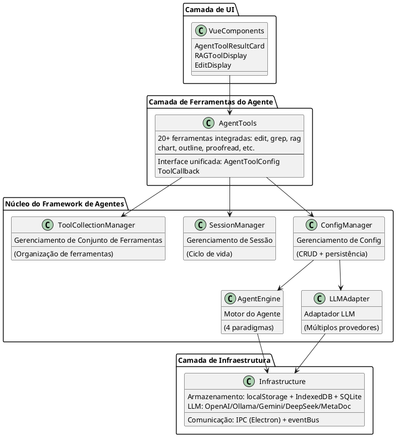
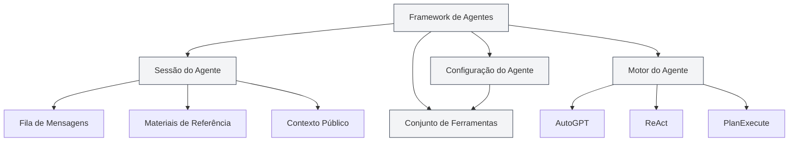
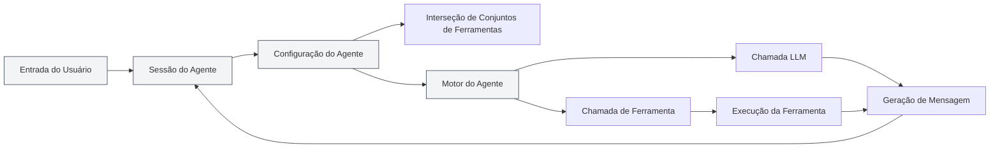
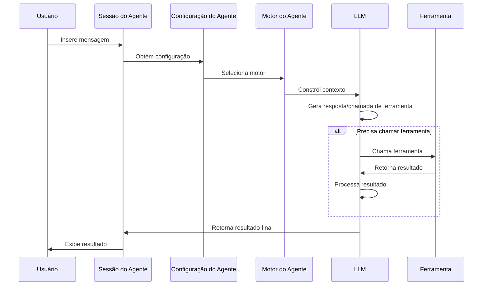

# Visão Geral do Framework de Agentes

## Visão Geral

O framework de Agentes é o núcleo do MetaDoc para construir e gerenciar sistemas de Agentes inteligentes, adotando um **design de arquitetura em camadas**. Ele fornece gerenciamento completo do ciclo de vida do Agente, incluindo funcionalidades como gerenciamento de sessões, gerenciamento de configurações, gerenciamento de conjuntos de ferramentas e gerenciamento de motores.

O framework de Agentes é construído sobre o sistema de Ferramentas existente. Através de componentes centrais como configuração do Agente (AgentConfig), conjunto de ferramentas (ToolCollection) e sessão do Agente (AgentSession), ele implementa um sistema de Agentes flexível e extensível.

<AgentSessionManager mode="demo" />

## Prévia da Interface

O framework de Agentes fornece uma interface intuitiva para gerenciar sessões e ferramentas do Agente:

<AgentView mode="demo" />

## Arquitetura Técnica

### Camadas da Arquitetura



### Caminhos dos Arquivos Principais

| Categoria          | Caminho do Arquivo                                                       | Descrição                                  |
| ------------------ | ------------------------------------------------------------------------ | ------------------------------------------ |
| **Definições de Tipo** | `src/renderer/src/types/agent-framework.ts`                              | Definições de tipo do núcleo do framework de Agentes |
| **Definições de Tipo** | `src/renderer/src/types/agent-tool.ts`                                   | Definições de tipo de ferramentas do Agente      |
| **Gerenciamento de Configuração** | `src/renderer/src/utils/agent-framework/agent-config-manager.ts`         | CRUD e persistência do AgentConfig         |
| **Gerenciamento de Sessão** | `src/renderer/src/utils/agent-framework/agent-session-manager.ts`        | Gerenciamento do ciclo de vida do AgentSession |
| **Gerenciamento de Conjunto de Ferramentas** | `src/renderer/src/utils/agent-framework/tool-collection-manager.ts`      | Organização e gerenciamento de conjuntos de ferramentas |
| **Gerenciamento de Motor** | `src/renderer/src/utils/agent-framework/agent-engine-manager.ts`         | Gerenciamento de configuração do motor do Agente |
| **Execução do Motor** | `src/renderer/src/utils/agent-framework/agent-engine-executor.ts`        | Implementação dos 4 paradigmas de execução |
| **Execução de Ferramentas** | `src/renderer/src/utils/agent-framework/tool-runner.ts`                  | Ponto de entrada unificado para chamada de ferramentas |
| **Adaptação LLM**  | `src/renderer/src/utils/agent-framework/llm-adapter.ts`                  | Adaptação para múltiplos provedores LLM    |



## Conceitos Principais

### Sessão do Agente (AgentSession)

<AgentView mode="demo" />

A sessão do Agente é uma instância do AgentConfig, representando um ambiente de execução de Agente independente e contextualizado. Implementada com base em `agent-session-manager.ts`, cada sessão mantém seu próprio histórico de mensagens, materiais de referência, espaço de contexto público e suporta funcionalidades avançadas como fila de mensagens, repetição, Duplicate, etc.

**Definição de Tipo** (`types/agent-framework.ts` linhas 387-424):

```typescript
export interface AgentSession {
  entityType: 'agent-session'
  id: string
  title: string
  agentConfigId: string // AgentConfig associado
  messages: AgentMessage[] // Histórico de mensagens
  messageQueue: QueuedMessage[] // Fila de mensagens
  referenceStore: Reference[] // Materiais de referência
  publicContext: PublicContext // Contexto público
  executionNodes: ExecutionNode[] // Nós de execução (para repetição)
  status: AgentSessionStatus // Status da sessão
}
```

**Máquina de Estados da Sessão**:

```
idle → thinking → generating → tool-calling → waiting-input → error
```

Veja detalhes em [[agent.session|Gerenciamento de Sessões do Agente]].

### Configuração do Agente (AgentConfig)

<CompletionSettingsPanel mode="demo" />

O AgentConfig define a identidade e o escopo de capacidades do Agente, implementado com base em `agent-config-manager.ts`.

**Definição de Tipo** (`types/agent-framework.ts` linhas 242-289):

```typescript
export interface AgentConfig {
  entityType: 'agent-config'
  id: string
  name: LocalizedText // Nome com suporte a i18n
  description: LocalizedText // Descrição com suporte a i18n
  toolCollectionIds: string[] // IDs de conjuntos de ferramentas associados (interseção)
  maxToolCalls?: number | null // Número máximo de chamadas de ferramentas
  llmConfig?: {
    model?: string
    temperature?: number
    systemPrompt?: string // Prompt do sistema
    injectTimestamp?: boolean
  }
  behavior?: {
    allowToolCalls?: boolean
  }
  scenario?: 'outline' | 'editor' | 'analysis' | 'visualization' | 'custom'
}
```

**Funcionalidades Principais**:

- **Configuração Padrão**: `default-agent-config` (integrada, não pode ser excluída)
- **Interseção de Conjuntos de Ferramentas**: Ao associar múltiplos conjuntos de ferramentas, as ferramentas disponíveis são a interseção de todos os conjuntos
- **Substituição de Parâmetros LLM**: Pode substituir a configuração global do LLM
- **Persistência**: Armazenada em `localStorage`, chave `'agent-configs'`

Veja detalhes em [[agent.config|Gerenciamento de Configuração do Agente]].

### Conjunto de Ferramentas (ToolCollection)

<DataAnalysisDisplay mode="demo" />

Um conjunto de ferramentas é um grupo de ferramentas do Agente, usado para organizar e gerenciar as ferramentas disponíveis para o Agente. Um AgentConfig pode associar múltiplos conjuntos de ferramentas, e as ferramentas disponíveis são a interseção de todos os conjuntos associados.

Veja detalhes em [[agent.tools|Gerenciamento de Conjuntos de Ferramentas]].

### Materiais de Referência (Reference)

<RAGToolDisplay mode="demo" />

Materiais de referência são documentos e arquivos referenciados em uma sessão do Agente. O Agente pode perceber esse conteúdo e raciocinar/operar com base nele. Suporta vários tipos de referências, como arquivos, URLs, bases de conhecimento, etc.

Veja detalhes em [[agent.references|Gerenciamento de Materiais de Referência]].

### Motor do Agente (AgentEngine)

<DiffDisplay mode="demo" />

O motor do Agente define a estratégia de execução e o modo de comportamento do Agente, incluindo vários paradigmas como AutoGPT, ReAct, PlanExecute. Diferentes motores são adequados para diferentes cenários de tarefas.

Veja detalhes em [[agent.engine|Gerenciamento do Motor do Agente]].

## Arquitetura do Sistema

A arquitetura do sistema do framework de Agentes é a seguinte:



## Fluxo de Execução

O fluxo de execução básico do Agente:

1.  **Entrada do Usuário**: O usuário insere uma mensagem na sessão do Agente.
2.  **Reconhecimento de Intenção**: O sistema reconhece a intenção do usuário e atualiza a descrição das ferramentas disponíveis.
3.  **Seleção do Motor**: Seleciona o motor de execução com base na configuração do Agente.
4.  **Construção do Contexto**: Constrói um contexto contendo histórico de mensagens, materiais de referência, descrições de ferramentas.
5.  **Chamada LLM**: Chama o LLM para gerar uma resposta ou uma chamada de ferramenta.
6.  **Execução da Ferramenta**: Se o LLM decide chamar uma ferramenta, executa a ferramenta correspondente.
7.  **Processamento do Resultado**: Retorna o resultado da execução da ferramenta como uma Observação (Observation) para o LLM.
8.  **Loop de Iteração**: Dependendo do tipo de motor, pode realizar múltiplas iterações até concluir a tarefa.
9.  **Saída do Resultado**: Apresenta o resultado final ao usuário.



## Características Funcionais

### Funcionalidades Principais

-   **Gerenciamento de Sessões**: Criar, excluir, copiar, exportar/importar sessões.
-   **Gerenciamento de Configurações**: Configuração flexível do Agente, com suporte a interseção de múltiplos conjuntos de ferramentas.
-   **Gerenciamento de Conjuntos de Ferramentas**: Organizar e gerenciar ferramentas do Agente.
-   **Gerenciamento de Materiais de Referência**: Gerenciar documentos e arquivos de referência na sessão.
-   **Gerenciamento de Motores**: Suporte a múltiplos paradigmas de execução, motores personalizáveis.

### Funcionalidades Avançadas

-   **Fila de Mensagens**: Inserir mensagens durante a execução do Agente.
-   **Mecanismo de Repetição**: Suporte para repetir nós de execução que falharam.
-   **Funcionalidade Duplicate**: Copiar sessões ou nós de execução.
-   **Contexto Público**: Espaço de contexto compartilhado no nível da sessão.
-   **Rastreamento de Nós de Execução**: Registrar o status e resultado de cada nó de execução.

## Cenários de Uso

O framework de Agentes é adequado para os seguintes cenários:

-   **Edição de Documentos**: Usar ferramentas do Agente para editar e otimizar documentos.
-   **Análise de Dados**: Usar ferramentas de análise de dados para processamento e visualização de dados.
-   **Geração de Conteúdo**: Usar o motor do Agente com conjuntos de ferramentas para gerar conteúdo estruturado.
-   **Recuperação de Conhecimento**: Realizar pesquisa e análise inteligente combinada com bases de conhecimento.
-   **Tarefas de Automação**: Implementar tarefas de múltiplas etapas através do Agente e conjuntos de ferramentas.

## Início Rápido

Para começar a usar o framework de Agentes, é recomendado aprender na seguinte ordem:

1.  [[agent.introduction|Visão Geral do Framework de Agentes]] (este documento)
2.  [[agent.config|Gerenciamento de Configuração do Agente]]: Aprenda como configurar um Agente.
3.  [[agent.tools|Gerenciamento de Conjuntos de Ferramentas]]: Aprenda como gerenciar conjuntos de ferramentas.
4.  [[agent.session|Gerenciamento de Sessões do Agente]]: Crie e gerencie sessões.
5.  [[agent.references|Gerenciamento de Materiais de Referência]]: Gerencie materiais de referência.
6.  [[agent.engine|Gerenciamento do Motor do Agente]]: Selecione e configure motores.

## Perguntas Frequentes

### Q: Qual a diferença entre o framework de Agentes e o bate-papo com IA?

R: O bate-papo com IA é uma funcionalidade de conversa simples, enquanto o framework de Agentes fornece um sistema completo de Agentes, incluindo funcionalidades avançadas como chamada de ferramentas, gerenciamento de materiais de referência, etc. O framework de Agentes pode executar tarefas complexas, não apenas conversar.

### Q: Como escolher o motor do Agente adequado?

R:

-   **Motor AutoGPT**: Adequado para a maioria das tarefas inteligentes, forte capacidade de tomada de decisão autônoma.
-   **Motor ReAct**: Adequado para tarefas que requerem etapas de raciocínio detalhadas, processo de pensamento explícito.
-   **Motor PlanExecute**: Adequado para tarefas que requerem execução estruturada, planejar primeiro, depois executar.
-   **Motor SimpleChat**: Adequado para tarefas de pura conversação, não chama ferramentas.

### Q: O que significa interseção de conjuntos de ferramentas?

R: Quando um AgentConfig associa múltiplos conjuntos de ferramentas, as ferramentas disponíveis são a interseção de todos os conjuntos. Por exemplo, se o conjunto A contém `[tool1, tool2, tool3]` e o conjunto B contém `[tool2, tool3, tool4]`, então as ferramentas disponíveis para o AgentConfig são `[tool2, tool3]`.

## Documentação Relacionada

-   [[agent.session|Gerenciamento de Sessões do Agente]]
-   [[agent.config|Gerenciamento de Configuração do Agente]]
-   [[agent.tools|Gerenciamento de Conjuntos de Ferramentas]]
-   [[agent.references|Gerenciamento de Materiais de Referência]]
-   [[agent.engine|Geren