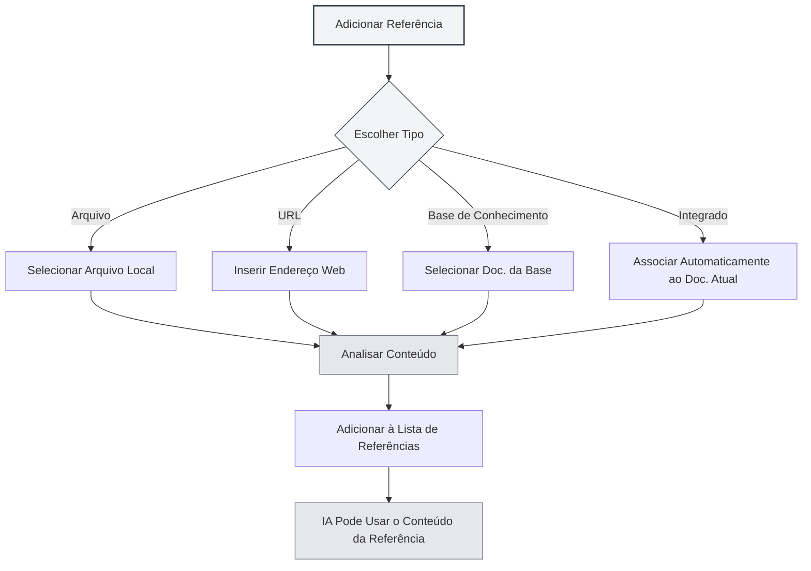

# Gerenciamento de Materiais de Referência

## Visão Geral

Os materiais de referência são uma funcionalidade importante nas sessões do Agent, permitindo que você introduza conteúdos como documentos externos, páginas da web, arquivos, etc., na conversa. O Agent pode raciocinar e responder com base nesses materiais de referência, tornando as respostas da IA mais precisas e relevantes.

Com os materiais de referência, você pode:

- Fazer a IA consultar o conteúdo de documentos específicos
- Discutir com base em informações de páginas da web
- Analisar o conteúdo de arquivos locais
- Realizar perguntas e respostas aprofundadas combinando com a base de conhecimento

## Abrindo o Gerenciamento de Referências

Na interface da sessão do Agent, clique na aba "Referências" para abrir o painel de gerenciamento de materiais de referência.

O painel de referências exibe todos os materiais de referência já adicionados na sessão atual, incluindo:

- Nome do arquivo ou URL
- Tipo de referência (Arquivo/URL/Base de Conhecimento/Documento Integrado)
- Status de ativação
- Prévia do conteúdo

Você pode acessar a visualização do Agent através da barra lateral:

<ReferenceManager mode="demo" />
<ReferenceDisplay mode="demo" />

## Adicionando Referências

### Adicionando Referência de Arquivo

Adicione um arquivo local como material de referência:

1. No painel de referências, clique no botão "Adicionar Referência"
2. Selecione o tipo "Arquivo"
3. No seletor de arquivos, escolha o arquivo a ser referenciado
4. Confirme a adição

**Formatos de arquivo suportados**:

- Documentos Markdown (.md)
- Documentos LaTeX (.tex)
- Arquivos PDF (.pdf)
- Documentos Word (.docx)
- Arquivos de texto puro (.txt)
- Arquivos de imagem (.png, .jpg)

<ReferenceManager mode="demo" />

### Adicionando Referência de URL

Referencie o conteúdo de uma página da web:

1. No painel de referências, clique no botão "Adicionar Referência"
2. Selecione o tipo "URL"
3. Insira o endereço da página da web a ser referenciada
4. Clique em confirmar

O MetaDoc irá capturar automaticamente o conteúdo da página da web e adicioná-lo às referências.

<ReferenceManager mode="demo" />
<ReferenceDisplay mode="demo" />

### Adicionando Referência da Base de Conhecimento

Referencie documentos da base de conhecimento:

1. No painel de referências, clique no botão "Adicionar Referência"
2. Selecione o tipo "Base de Conhecimento"
3. Na lista da base de conhecimento, selecione o documento a ser referenciado
4. Confirme a adição

<ReferenceDisplay mode="demo" />

### Referência de Documento Integrado

Cada sessão do Agent tem a "Referência de Documento Integrado" (referência nº 0) ativada por padrão, que obtém dinamicamente o conteúdo do documento atualmente aberto como material de referência.



## Gerenciando Referências

### Ativando/Desativando Referências

Cada material de referência pode ter seu status de ativação controlado independentemente:

- **Ativado**: O conteúdo referenciado participa do processo de raciocínio da IA
- **Desativado**: O conteúdo referenciado não participa temporariamente do raciocínio, mas permanece na lista

Clique no interruptor ao lado do material de referência para alternar o status de ativação.

<ReferenceDisplay mode="demo" />

### Visualizando o Conteúdo da Referência

Clique em um material de referência para visualizar seu conteúdo:

- **Referência de Arquivo**: Exibe uma prévia em texto do conteúdo do arquivo
- **Referência de URL**: Exibe o conteúdo da página da web capturado
- **Referência da Base de Conhecimento**: Exibe trechos relevantes da base de conhecimento
- **Referência Integrada**: Exibe o conteúdo do documento atual

### Removendo Referências

Remova da lista de referências aquelas que não são mais necessárias:

1. No painel de referências, encontre a referência a ser removida
2. Clique no botão de remover (ícone ×)
3. Confirme a remoção

**Atenção**: Remover uma referência apenas exclui a relação de referência, não afeta o arquivo original.

<ReferenceManager mode="demo" />

## O Papel das Referências na Conversa

### Consciência da Referência

Quando você ativa uma referência, o Agent ao responder irá:

1. **Analisar o conteúdo da referência**: Compreender o conteúdo do documento, página da web ou arquivo referenciado
2. **Combinar com o contexto**: Integrar o conteúdo da referência com o histórico da conversa
3. **Gerar a resposta**: Produzir uma resposta mais precisa com base no conteúdo da referência

### Exemplos de Uso

**Cenário 1: Perguntas e Respostas Baseadas em Documento**

```
Usuário: [Adicionou um documento técnico como referência]
Pergunta do usuário: Quais são as melhores práticas mencionadas neste documento?
IA: De acordo com o documento que você referenciou, as melhores práticas incluem...
```

**Cenário 2: Comparação de Múltiplos Documentos**

```
Usuário: [Adicionou dois artigos acadêmicos como referências]
Pergunta do usuário: Compare os métodos de pesquisa destes dois artigos
IA: O primeiro artigo utilizou... enquanto o segundo artigo adotou...
```

**Cenário 3: Análise de Conteúdo Web**

```
Usuário: [Adicionou uma página de notícias como referência]
Pergunta do usuário: Resuma o conteúdo principal desta reportagem
IA: Com base no conteúdo da página, a reportagem aborda principalmente...
```

## Melhores Práticas

### Uso Eficiente de Referências

1. **Selecione materiais relevantes**: Adicione apenas referências relacionadas ao tópico atual, evitando sobrecarga de informação
2. **Controle o número de referências**: Recomenda-se não ativar mais de 5 referências simultaneamente para garantir eficiência de processamento
3. **Faça limpeza oportuna**: Após o fim da conversa, remova referências desnecessárias para manter a lista organizada

### Estratégias de Referência

1. **Análise de documentos**: Ao analisar documentos longos, adicione a referência do documento e faça perguntas específicas
2. **Recuperação de conhecimento**: Use referências da base de conhecimento para perguntas e respostas baseadas nela
3. **Informações em tempo real**: Obtenha informações atualizadas de páginas da web através de referências de URL
4. **Continuação do contexto**: Utilize a referência integrada para que a IA compreenda o documento que você está editando

## Dicas de Uso

### Adição Rápida

- **Adicionar por arrastar e soltar**: Arraste arquivos diretamente para o painel de referências
- **Adicionar pelo menu de contexto**: Clique com o botão direito em um arquivo ou página da web e selecione "Adicionar à referência"
- **Atalhos de teclado**: Use atalhos de teclado para abrir rapidamente o painel de referências

<ReferenceManager mode="demo" />

### Combinação de Referências

É possível adicionar simultaneamente múltiplas referências de tipos diferentes:

- Um documento PDF + um link de página da web
- Múltiplos documentos da base de conhecimento
- Arquivo local + referência de documento integrado

A IA analisará de forma abrangente o conteúdo de todas as referências ativadas.

<ReferenceDisplay mode="demo" />

### Desativação Temporária

Se não tiver certeza se uma referência é útil, você pode desativá-la primeiro:

1. Observe a resposta da IA sem aquela referência
2. Em seguida, ative a referência e compare a diferença nas respostas
3. Decida se a mantém com base no resultado

## Perguntas Frequentes

### Q: O conteúdo da referência tem limite de tamanho?

R: Sim. Arquivos muito grandes podem ser truncados. Recomenda-se:

- Adicionar documentos muito grandes por capítulos
- Usar a base de conhecimento para processar grandes volumes de documentos
- Extrair partes-chave de documentos longos primeiro

### Q: Por que adicionei uma referência, mas a IA parece não estar usando?

R: Possíveis causas:

- A referência não está ativada (verifique o status do interruptor)
- O conteúdo da referência não está relacionado à pergunta
- Falha na análise da referência (verifique o formato do arquivo)

### Q: E se a referência de URL falhar?

R: Possíveis causas:

- A página da web requer login para acesso
- A página tem mecanismos anti-robô
- Problemas de conexão de rede
  Recomendação: Salve o conteúdo da página da web como um arquivo e adicione uma referência de arquivo

### Q: As referências ocupam espaço de armazenamento?

R: A referência em si é apenas um link, não ocupa espaço adicional. Porém, os resultados da análise da referência são armazenados em cache localmente.

## Documentação Relacionada

- [[agent.session|Gerenciamento de Sessões do Agent]]
- [[agent.introduction|Gerenciamento de Configuração do Agent]]
- [[knowledge-base.usage|Uso da Base de Conhecimento]]
- [[agent.introduction|Visão Geral da Estrutura do Agent]]
