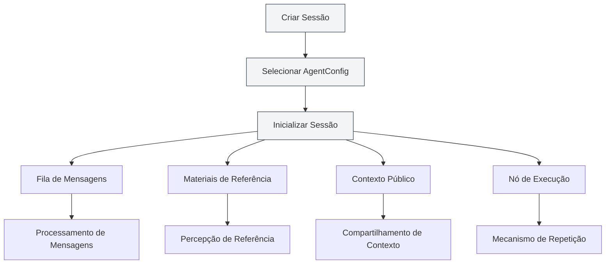
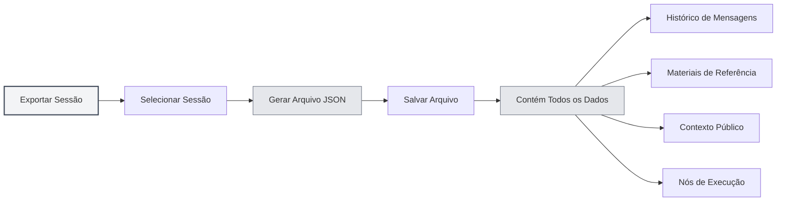
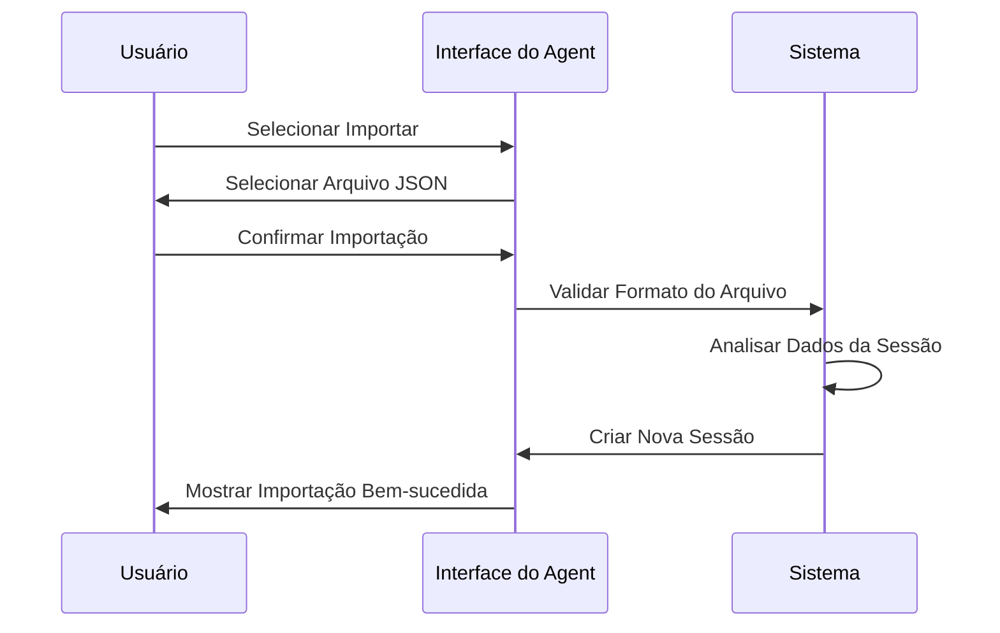
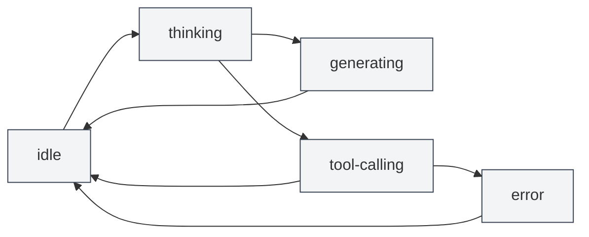

# Gerenciamento de Sessões do Agent

## Visão Geral

A sessão do Agent é um componente central do framework Agent, representando um ambiente de execução independente e contextualizado do Agent. Cada sessão mantém seu próprio histórico de mensagens, materiais de referência, espaço de contexto público e suporta funcionalidades avançadas como fila de mensagens, repetição (retry) e duplicação (duplicate).

<AgentView mode="demo" />

A sessão do Agent é criada com base em um AgentConfig, herdando seu conjunto de ferramentas e escopo de capacidades, mas cada sessão possui um estado de execução e histórico independentes.

## Criar Sessão

### Criar Nova Sessão

Passos para criar uma sessão do Agent:

<AgentView mode="demo" />

1.  **Abrir a Visualização do Agent**: Clique em "AI" → "Agent" na barra de menus para abrir a visualização do Agent.
2.  **Selecionar AgentConfig**: Selecione o AgentConfig a ser usado acima da lista de sessões.
3.  **Criar Sessão**: Clique no botão "Nova Sessão".
4.  **Inserir Título**: Opcionalmente, insira um título para a sessão (por padrão, a primeira mensagem será usada como título).
5.  **Iniciar Diálogo**: Digite a primeira mensagem para começar a interagir com o Agent.

### Inicialização da Sessão

Ao criar uma sessão, o sistema automaticamente:

<AgentSessionManager mode="demo" />

-   **Cria um ID de Sessão**: Gera um identificador único para a sessão.
-   **Associa o AgentConfig**: Vincula à configuração do Agent especificada.
-   **Inicializa a Fila de Mensagens**: Cria uma fila de mensagens vazia.
-   **Inicializa os Materiais de Referência**: Cria um armazenamento vazio para materiais de referência.
-   **Inicializa o Contexto Público**: Cria um espaço de contexto público, contendo informações como a hora atual.
-   **Cria Saudação**: Adiciona automaticamente uma mensagem de saudação do Agent.
-   **Habilita Referência Interna**: Por padrão, habilita a referência interna número 0 (obtém dinamicamente o conteúdo do documento atual).

## Renomear Sessão

### Operação de Renomeação

Para renomear uma sessão existente:

<AgentView mode="demo" />

1.  **Menu de Contexto**: Clique com o botão direito na sessão e selecione "Renomear".
2.  **Inserir Novo Nome**: Na caixa de diálogo que aparece, insira o novo nome para a sessão.
3.  **Confirmar e Salvar**: Clique em confirmar para salvar o novo nome.

O nome da sessão é usado para identificar e diferenciar diferentes sessões. Recomenda-se usar nomes descritivos.

## Excluir Sessão

### Operação de Exclusão

Para excluir sessões não necessárias:

<AgentSessionManager mode="demo" />

1.  **Menu de Contexto**: Clique com o botão direito na sessão e selecione "Excluir".
2.  **Confirmar Exclusão**: Confirme a exclusão na caixa de diálogo de confirmação.

**Atenção**: Excluir uma sessão também excluirá todo o seu histórico de mensagens, materiais de referência e nós de execução. Esta operação não pode ser desfeita.

### Exclusão em Massa

Atualmente, a exclusão em massa não é suportada. É necessário excluir as sessões uma por uma.

## Duplicar Sessão

### Operação de Duplicação

Para duplicar uma sessão existente:

<AgentView mode="demo" />

1.  **Menu de Contexto**: Clique com o botão direito na sessão e selecione "Duplicar".
2.  **Criar Cópia**: O sistema criará uma nova cópia da sessão.

A duplicação da sessão copia:

-   **Histórico de Mensagens**: Todos os registros de mensagens.
-   **Materiais de Referência**: Todos os materiais de referência.
-   **Contexto Público**: O conteúdo do espaço de contexto público.
-   **Nós de Execução**: Todos os registros de nós de execução.

A sessão duplicada é independente; modificações nela não afetarão a sessão original.

### Cenários de Uso

A duplicação de sessão é útil para:

-   **Discussões em Ramificações**: Continuar discutindo tópicos diferentes com base em um diálogo existente.
-   **Testes Experimentais**: Testar diferentes configurações do Agent ou conjuntos de ferramentas.
-   **Backup e Preservação**: Salvar o estado de sessões importantes.

## Exportar/Importar Sessão

### Exportar Sessão

<AgentView mode="demo" />

Para exportar uma sessão para um arquivo JSON:

<AgentView mode="demo" />

1.  **Menu de Contexto**: Clique com o botão direito na sessão e selecione "Exportar".
2.  **Selecionar Local**: Escolha o local e o nome do arquivo para salvar.
3.  **Salvar Arquivo**: Clique em salvar para exportar a sessão.

O arquivo JSON exportado contém:

-   Informações básicas da sessão (ID, título, descrição, etc.)
-   Histórico de mensagens
-   Materiais de referência
-   Contexto público
-   Nós de execução

### Importar Sessão

<AgentSessionManager mode="demo" />

Para importar uma sessão de um arquivo JSON:

1.  **Abrir Importação**: Encontre a funcionalidade de importação na visualização do Agent.
2.  **Selecionar Arquivo**: Selecione o arquivo JSON a ser importado.
3.  **Validar Dados**: O sistema valida o formato e o conteúdo do arquivo.
4.  **Importar Sessão**: Após a validação bem-sucedida, uma nova sessão é criada.

A sessão importada recebe um novo ID de sessão e não substitui sessões existentes.

## Repetir Sessão (Retry)

### Funcionalidade de Repetição

A repetição de sessão permite reexecutar tarefas do Agent que falharam:

1.  **Visualizar Nós de Execução**: Veja a lista de nós de execução dentro da sessão.
2.  **Selecionar Nó**: Selecione o nó de execução que deseja repetir.
3.  **Repetir Execução**: Clique no botão "Repetir" para reexecutar.

A repetição recomeça a execução a partir do nó de execução selecionado, preservando o histórico de mensagens anterior.

### Nós de Execução

Os nós de execução registram cada etapa do processo de execução do Agent:

-   **Nó de Mensagem**: Mensagem do usuário ou resposta da IA.
-   **Nó de Chamada de Ferramenta**: Chamada e resultado da execução de uma ferramenta.
-   **Nó de Chamada de Fluxo de Trabalho**: Processo de execução de um fluxo de trabalho.
-   **Nó de Chamada LLM**: Chamada e resposta do LLM.

Cada nó possui um estado (pendente, em execução, bem-sucedido, falhou, cancelado) e um resultado.

## Gerenciamento de Mensagens da Sessão

### Operações com Mensagens

As seguintes operações podem ser realizadas nas mensagens da sessão:

-   **Editar Mensagem**: Editar uma mensagem do usuário e reenviá-la.
-   **Regenerar**: Regenerar a resposta da IA.
-   **Copiar Mensagem**: Copiar o conteúdo da mensagem.
-   **Excluir Mensagem**: Excluir uma mensagem (isso excluirá todas as mensagens subsequentes a ela).

### Fila de Mensagens

<AgentView mode="demo" />

A fila de mensagens permite inserir mensagens durante o processo de execução do Agent:

1.  **Momento da Inserção**: Quando o Agent está gerando uma resposta ou chamando uma ferramenta, as mensagens são temporariamente armazenadas na fila.
2.  **Momento do Processamento**: Após a conclusão da tarefa atual e antes da próxima etapa, as mensagens na fila são processadas.
3.  **Informações de Anotação**: As mensagens na fila são anotadas com o carimbo de data/hora da inserção e o ID da mensagem no momento da inserção, ajudando o Agent a entender o contexto.

A funcionalidade de fila de mensagens permite que você forneça informações ou instruções adicionais durante a execução do Agent.

## Gerenciamento de Materiais de Referência

### Adicionar Referência

<ReferenceManager mode="demo" />

Para adicionar materiais de referência a uma sessão:

1.  **Abrir Gerenciador de Referências**: Clique na aba "Referências" na sessão.
2.  **Adicionar Referência**: Clique no botão "Adicionar Referência".
3.  **Selecionar Tipo**: Escolha o tipo de referência (arquivo, URL, texto, etc.).
4.  **Selecionar Conteúdo**: Selecione o conteúdo a ser referenciado.

Consulte [[agent.references|Gerenciamento de Materiais de Referência]] para mais detalhes.

### Tipos de Referência

São suportados os seguintes tipos de referência:

-   **Referência de Arquivo**: Referencia arquivos locais (Markdown, LaTeX, PDF, Word, imagens, etc.).
-   **Referência de URL**: Referencia URLs da web.
-   **Referência de Texto**: Referencia conteúdo de texto personalizado.
-   **Referência de Base de Conhecimento**: Referencia conteúdo de uma base de conhecimento.
-   **Referência Interna**: Obtém dinamicamente o conteúdo do documento atual (habilitada por padrão).

### Ativar Referência

<ReferenceManager mode="demo" />

Os materiais de referência podem ser ativados ou desativados:

-   **Ativar Referência**: Referências ativadas serão usadas durante a execução do Agent.
-   **Desativar Referência**: Referências desativadas não afetarão a execução do Agent.

O Agent pode perceber o conteúdo dos materiais de referência e raciocinar/operar com base neles.

## Contexto Público

### Espaço de Contexto

O contexto público é um espaço de contexto compartilhado no nível da sessão, contendo:

<AgentView mode="demo" />

-   **Hora Atual**: Carimbo de data/hora atualizado automaticamente.
-   **Informações do Documento**: Informações sobre o documento atualmente aberto (se habilitado).
-   **Dados Personalizados**: Dados de contexto definidos pelo usuário.

### Cenários de Uso

O contexto público é adequado para:

-   **Percepção de Tempo**: Permitir que o Agent saiba a hora atual.
-   **Percepção de Documento**: Permitir que o Agent saiba qual documento está aberto.
-   **Compartilhamento de Estado**: Compartilhar informações de estado entre fluxos de trabalho.

## Estado da Sessão

<AgentSessionManager mode="demo" />

### Tipos de Estado

Uma sessão pode ter os seguintes estados:

-   **idle**: Estado ocioso, aguardando entrada do usuário.
-   **thinking**: O Agent está pensando.
-   **generating**: O Agent está gerando uma resposta.
-   **tool-calling**: O Agent está chamando uma ferramenta.
-   **waiting-input**: Aguardando entrada do usuário.
-   **error**: Ocorreu um erro.

### Transição de Estados

## Dicas de Uso

<AgentView mode="demo" />

### Organização de Sessões

1.  **Gerenciamento por Categoria**: Crie sessões diferentes para tópicos diferentes.
2.  **Padrão de Nomenclatura**: Use nomes de sessão claros e descritivos.
3.  **Limpeza Regular**: Exclua sessões não necessárias periodicamente.

### Gerenciamento de Mensagens

1.  **Editar Mensagens**: Se a resposta da IA não for ideal, edite a mensagem do usuário e reenvie.
2.  **Usar Referências**: Adicione materiais de referência para fornecer mais contexto.
3.  **Fila de Mensagens**: Use a fila de mensagens para inserir informações adicionais durante a execução do Agent.

### Mecanismo de Repetição

1.  **Visualizar Nós**: Veja os nós de execução para entender o processo do Agent.
2.  **Selecionar Repetição**: Selecione nós que falharam para repetir a execução.
3.  **Ajustar Configuração**: Se houver falhas frequentes, considere ajustar o AgentConfig ou o conjunto de ferramentas.

## Perguntas Frequentes

<AgentView mode="demo" />

### P: Como criar uma nova sessão?

R: Na visualização do Agent, selecione um AgentConfig e clique no botão "Nova Sessão". Após criar a sessão, digite a primeira mensagem para iniciar o diálogo.

### P: O histórico de mensagens da sessão é salvo?

R: Sim, o histórico de mensagens da sessão é salvo automaticamente nos metadados do documento. Todas as sessões serão restauradas ao reabrir o documento.

### P: Como excluir uma sessão?

R: Clique com o botão direito na sessão, selecione "Excluir" e confirme na caixa de diálogo. A exclusão não pode ser desfeita.

### P: O que é copiado ao duplicar uma sessão?

R: A duplicação copia o histórico de mensagens, materiais de referência, contexto público e nós de execução. A sessão duplicada é independente.

### P: Como exportar uma sessão?

R: Clique com o botão direito na sessão, selecione "Exportar" e escolha o local para salvar. O arquivo JSON exportado contém todas as informações da sessão.

### P: O que é a fila de mensagens?

R: A fila de mensagens permite inserir mensagens durante a execução do Agent. As mensagens na fila são processadas após a conclusão da tarefa atual.

### P: Como repetir uma execução que falhou?

R: Na sessão, visualize a lista de nós de execução, selecione o nó que falhou e clique no botão "Repetir".

### P: Como os materiais de referência afetam o Agent?

R: O Agent pode perceber o conteúdo dos materiais de referência e raciocinar/operar com base neles. Referências at