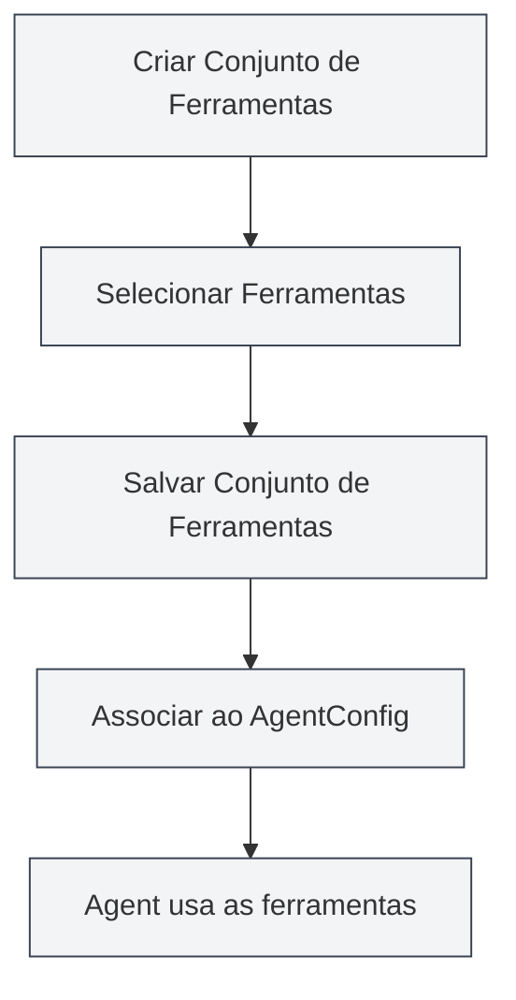

# Gerenciamento de Conjuntos de Ferramentas

## Visão Geral

Um Conjunto de Ferramentas (ToolCollection) é uma coleção no framework Agent usada para organizar e gerenciar as ferramentas do Agent. O conjunto de ferramentas organiza ferramentas relacionadas, facilitando o gerenciamento e a reutilização. O AgentConfig determina quais ferramentas um Agent pode usar associando-se a um ou mais conjuntos de ferramentas.

Os conjuntos de ferramentas suportam a adição e remoção dinâmica de ferramentas. É possível criar conjuntos para propósitos específicos ou combinar vários conjuntos para uso.

## Conceitos Centrais

### Estrutura do Conjunto de Ferramentas

<AgentView mode="demo" />

Um conjunto de ferramentas contém as seguintes partes principais:

- **Informações Básicas**: ID, nome, descrição, número da versão
- **Lista de Ferramentas**: Lista de IDs das ferramentas incluídas (incluindo ferramentas internas e externas)
- **Status de Ativação**: Se o conjunto de ferramentas está ativado ou não
- **Tags**: Tags para categorização e busca
- **Identificador de Integrado**: Se é um conjunto de ferramentas integrado (não pode ser excluído)

### Tipos de Ferramentas

<GrepDisplay mode="demo" />

Um conjunto de ferramentas pode conter os seguintes tipos de ferramentas:

- **Ferramentas Internas**: Ferramentas de Agent integradas ao MetaDoc (como edit-tool, proofread-tool, etc.)
- **Ferramentas Externas**: Ferramentas externas personalizadas pelo usuário

### Conjunto de Ferramentas Padrão

O sistema fornece um conjunto de ferramentas padrão (`default-tool-set`), que contém todas as ferramentas de Agent integradas. Ele não pode ser excluído, mas pode ser copiado.

## Criando um Conjunto de Ferramentas

<AgentView mode="demo" />

### Criar um Novo Conjunto de Ferramentas

Passos para criar um conjunto de ferramentas:

1.  **Abrir o Gerenciamento de Conjuntos**: Na visualização do Agent, clique em "Gerenciar" → "Conjuntos de Ferramentas"
2.  **Criar Conjunto de Ferramentas**: Clique no botão "Novo Conjunto de Ferramentas"
3.  **Preencher Informações Básicas**:
    - Nome: Nome do conjunto de ferramentas (suporte a múltiplos idiomas)
    - Descrição: Descrição do conjunto de ferramentas (suporte a múltiplos idiomas)
4.  **Selecionar Ferramentas**: Selecione uma ou mais ferramentas na lista suspensa
    - É possível buscar pelo nome da ferramenta
    - Suporta seleção múltipla
    - Mostra o tipo e a descrição da ferramenta
5.  **Salvar Conjunto de Ferramentas**: Clique no botão "Salvar"

Você pode acessar a visualização do Agent através da barra lateral:

### Interface de Conjuntos de Ferramentas do Agent

A figura abaixo mostra as principais funcionalidades da interface de gerenciamento de conjuntos de ferramentas:

<AgentView mode="demo" />

### Seleção de Ferramentas

Ao selecionar ferramentas, o sistema exibe:

- **Nome da Ferramenta**: Nome de exibição da ferramenta
- **ID da Ferramenta**: Identificador único da ferramenta
- **Tipo da Ferramenta**: Ferramenta interna, externa ou de fluxo de trabalho
- **Descrição da Ferramenta**: Breve descrição da ferramenta

<DialogDemo mode="demo" dialogType="tool-select" />

## Editando um Conjunto de Ferramentas

<AgentView mode="demo" />

### Operação de Edição

Para editar um conjunto de ferramentas existente:

1.  **Abrir a Interface de Gerenciamento**: Encontre o conjunto de ferramentas que deseja editar na interface de gerenciamento
2.  **Clicar em Editar**: Clique no botão "Editar" no cartão do conjunto de ferramentas
3.  **Modificar Informações**: Altere o nome, descrição ou lista de ferramentas
4.  **Salvar Alterações**: Clique no botão "Salvar"

**Atenção**: O conjunto de ferramentas padrão (`default-tool-set`) não pode ser editado, mas pode ser copiado e a cópia editada.

### Adicionar Ferramentas

Para adicionar ferramentas a um conjunto:

1.  **Abrir a Interface de Edição**: Edite o conjunto de ferramentas
2.  **Selecionar Ferramentas**: Selecione as ferramentas a serem adicionadas na lista suspensa de ferramentas
3.  **Salvar Alterações**: Clique no botão "Salvar"

### Remover Ferramentas

Para remover ferramentas de um conjunto:

1.  **Abrir a Interface de Edição**: Edite o conjunto de ferramentas
2.  **Desselecionar**: Desselecione as ferramentas a serem removidas na lista de ferramentas
3.  **Salvar Alterações**: Clique no botão "Salvar"

## Excluindo um Conjunto de Ferramentas

<AgentView mode="demo" />

### Operação de Exclusão

Para excluir um conjunto de ferramentas não necessário:

1.  **Abrir a Interface de Gerenciamento**: Encontre o conjunto de ferramentas a ser excluído na interface de gerenciamento
2.  **Clicar em Excluir**: Clique no botão "Excluir" no cartão do conjunto de ferramentas
3.  **Confirmar Exclusão**: Confirme a exclusão na caixa de diálogo de confirmação que aparece

**Atenção**:

- O conjunto de ferramentas padrão (`default-tool-set`) não pode ser excluído.
- Excluir um conjunto de ferramentas não afeta os AgentConfigs já criados, mas os AgentConfigs associados a esse conjunto não poderão mais usá-lo.
- Se o conjunto de ferramentas estiver em uso por um AgentConfig, um aviso será exibido antes da exclusão.

## Copiando um Conjunto de Ferramentas

### Operação de Cópia

<OutlineTreeDisplay mode="demo" />

Para copiar um conjunto de ferramentas existente:

1.  **Abrir a Interface de Gerenciamento**: Encontre o conjunto de ferramentas a ser copiado na interface de gerenciamento
2.  **Clicar em Copiar**: Clique no botão "Copiar" no cartão do conjunto de ferramentas
3.  **Editar a Cópia**: O sistema criará uma cópia, com o nome automaticamente recebendo o sufixo " (cópia)"
4.  **Salvar Modificações**: Modifique a cópia conforme necessário e salve

Copiar um conjunto de ferramentas copia todas as ferramentas, incluindo a lista de ferramentas e configurações.

## Importando/Exportando Conjuntos de Ferramentas

### Exportar Conjunto de Ferramentas

Para exportar um conjunto de ferramentas como um arquivo JSON:

1.  **Abrir a Interface de Gerenciamento**: Encontre o conjunto de ferramentas a ser exportado na interface de gerenciamento
2.  **Clicar em Exportar**: Clique no botão "Exportar" no cartão do conjunto de ferramentas
3.  **Escolher Local**: Selecione o local e o nome do arquivo para salvar
4.  **Salvar Arquivo**: Clique em salvar para exportar o conjunto de ferramentas

<DialogDemo mode="demo" dialogType="export-config" />

O arquivo JSON exportado contém todas as informações do conjunto de ferramentas e pode ser usado para backup ou compartilhamento.

### Importar Conjunto de Ferramentas

<DataAnalysisDisplay mode="demo" />

Para importar um conjunto de ferramentas de um arquivo JSON:

1.  **Abrir a Interface de Gerenciamento**: Na interface de gerenciamento de conjuntos de ferramentas
2.  **Clicar em Importar**: Clique no botão "Importar Conjunto de Ferramentas"
3.  **Selecionar Arquivo**: Selecione o arquivo JSON a ser importado
4.  **Validar Dados**: O sistema valida o formato e o conteúdo do arquivo
5.  **Importar Conjunto de Ferramentas**: Após o sucesso da validação, um novo conjunto de ferramentas é criado

<DialogDemo mode="demo" dialogType="import-config" />

O conjunto de ferramentas importado recebe um novo ID e não sobrescreve conjuntos existentes (a menos que o modo de sobrescrita seja usado).

## Conjuntos de Ferramentas e AgentConfig

### Associar Conjunto de Ferramentas

O AgentConfig determina as ferramentas disponíveis associando-se a conjuntos de ferramentas:

1.  **Criar AgentConfig**: Crie um novo AgentConfig
2.  **Selecionar Conjunto(s) de Ferramentas**: No AgentConfig, selecione um ou mais conjuntos de ferramentas
3.  **Interseção de Ferramentas**: Se múltiplos conjuntos forem selecionados, as ferramentas disponíveis serão a interseção de todos os conjuntos selecionados

### Interseção de Conjuntos de Ferramentas

<DiffDisplay mode="demo" />

Quando um AgentConfig está associado a múltiplos conjuntos de ferramentas:

- Conjunto A contém: `[tool1, tool2, tool3]`
- Conjunto B contém: `[tool2, tool3, tool4]`
- As ferramentas disponíveis para o AgentConfig são: `[tool2, tool3]` (interseção)

Este mecanismo permite controlar com precisão o escopo de capacidades do Agent.

## Dicas de Uso

### Organização de Conjuntos

1.  **Classificar por Função**: Crie conjuntos classificados por função, como "Conjunto de Ferramentas de Edição de Documentos", "Conjunto de Ferramentas de Análise de Dados"
2.  **Classificar por Cenário**: Crie conjuntos classificados por cenário de uso, como "Conjunto de Ferramentas para Redação Acadêmica", "Conjunto de Ferramentas para Análise de Código"
3.  **Padronização de Nomes**: Use nomes claros para facilitar a identificação e o gerenciamento

### Design de Conjuntos

1.  **Responsabilidade Única**: Cada conjunto de ferramentas deve focar em uma função ou cenário específico
2.  **Combinação de Ferramentas**: Combine ferramentas relacionadas de forma adequada, evitando conjuntos muito grandes
3.  **Reutilização**: Projete conjuntos reutilizáveis para facilitar o uso em diferentes AgentConfigs

### Gerenciamento de Conjuntos

1.  **Limpeza Periódica**: Exclua conjuntos de ferramentas que não são mais usados
2.  **Controle de Versão**: Faça backup de conjuntos importantes usando a função de exportação
3.  **Documentação**: Descreva a finalidade e os cenários de uso na descrição do conjunto de ferramentas

## Perguntas Frequentes

### P: Como criar um conjunto de ferramentas especializado?

R: Crie um novo conjunto de ferramentas, selecione as ferramentas relacionadas e defina um nome e descrição claros. Por exemplo, crie um "Conjunto de Ferramentas de Análise de Dados" selecionando ferramentas relacionadas à análise de dados.

### P: Qual a relação entre Conjunto de Ferramentas e AgentConfig?

R: O AgentConfig determina as ferramentas disponíveis associando-se a conjuntos de ferramentas. Um AgentConfig pode estar associado a vários conjuntos; as ferramentas disponíveis são a interseção de todos os conjuntos associados.

### P: Posso modificar o conjunto de ferramentas padrão?

R: O conjunto de ferramentas padrão (`default-tool-set`) não pode ser editado, mas pode ser copiado e a cópia editada. Copie o conjunto padrão e então modifique a cópia.

### P: Como adicionar uma ferramenta personalizada a um conjunto?

R: Primeiro, é necessário registrar a ferramenta personalizada. Depois, ao criar ou editar um conjunto de ferramentas, selecione essa ferramenta. Ferramentas personalizadas precisam estar em conformidade com a especificação de ferramentas do Agent.

### P: Excluir um conjunto de ferramentas afeta o AgentConfig?

R: Excluir um conjunto de ferramentas não afeta os AgentConfigs já criados, mas os AgentConfigs associados a esse conjunto não poderão mais usá-lo. Se o conjunto estiver em uso, um aviso será exibido antes da exclusão.

## Documentação Relacionada

- [[agent.introduction|Visão Geral do Framework Agent]]
- [[agent.introduction|Gerenciamento de Configuração do Agent]]
- [[agent.session|Gerenciamento de Sessão do Agent]]
