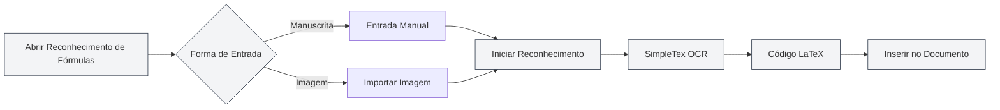

# Funcionalidades do Assistente de IA

## Visão Geral

A funcionalidade do Assistente de IA oferece diversas ferramentas de assistência inteligente para ajudá-lo em tarefas como criação de documentos, reconhecimento de fórmulas, geração de gráficos, análise de dados e mais. Com o Assistente de IA, você pode realizar diversos trabalhos de processamento de documentos com eficiência.

As funcionalidades do Assistente de IA incluem: Chat com IA, Reconhecimento de Fórmulas Manuscritas, Assistente de Desenho Inteligente, Ferramentas de Análise de Dados, Reconhecimento de Texto por OCR, Ferramenta de Análise de Anexos, Detecção de AIGC, entre outras.

<AgentView mode="demo" />

## Chat com IA

### Funcionalidade

A funcionalidade de Chat com IA fornece um assistente de conversação inteligente que pode dialogar com base no conteúdo do documento atual:

- **Compreensão de Contexto**: Compreende o conteúdo e o contexto do documento atual.
- **Respostas Inteligentes**: Responde a perguntas relacionadas com base no conteúdo do documento.
- **Análise de Documento**: Analisa a estrutura, conteúdo, estilo, etc., do documento.

Você pode acessar a funcionalidade de Chat com IA através do menu do Assistente de IA:

<MenuItemsDemo mode="demo" :items='[{"id": "ai-assistant", "items": ["ai-chat"]}]' />

### Prévia da Interface

A interface do Chat com IA inclui uma lista de conversas e uma área de diálogo, suportando gerenciamento de múltiplas conversas e referência a materiais:

<AIChat mode="demo" />

Consulte [[ai.chat|Chat com IA]] para mais detalhes.

## Reconhecimento de Fórmulas Manuscritas

### Funcionalidade

A funcionalidade de Reconhecimento de Fórmulas Manuscritas converte fórmulas matemáticas escritas à mão em código LaTeX:

<FormulaRecognition mode="demo" />

- **Entrada Manual**: Suporte para entrada manuscrita com mouse/tela sensível ao toque.
- **Importação de Imagem**: Suporte para importar imagens de fórmulas para reconhecimento.
- **Reconhecimento em Tempo Real**: Utiliza a API SimpleTex OCR para reconhecimento.
- **Saída LaTeX**: Converte automaticamente para o formato LaTeX padrão.

### Como Usar

1.  **Abrir Reconhecimento de Fórmulas**: Abra a janela de reconhecimento de fórmulas a partir do menu do Assistente de IA.
2.  **Entrada Manual**: Escreva a fórmula matemática à mão na tela.
3.  **Ou Importe uma Imagem**: Clique no botão de importar e selecione a imagem da fórmula.
4.  **Iniciar Reconhecimento**: Clique no botão de reconhecer.
5.  **Ver Resultado**: Veja o código LaTeX reconhecido.
6.  **Inserir no Documento**: Insira o código LaTeX no documento.

Você pode acessar a funcionalidade de Reconhecimento de Fórmulas Manuscritas através do menu do Assistente de IA:

<MenuItemsDemo mode="demo" :items='[{"id": "ai-assistant", "items": ["formula-recognition"]}]' />

### Precisão do Reconhecimento

- **Alta Precisão**: A API SimpleTex OCR oferece reconhecimento de fórmulas matemáticas de alta precisão.
- **Suporte a Fórmulas Complexas**: Suporta fórmulas complexas como frações, raízes, integrais, somatórios, etc.
- **Correção Automática**: O resultado do reconhecimento pode ser editado e corrigido manualmente.

## Assistente de Desenho Inteligente

### Funcionalidade

O Assistente de Desenho Inteligente usa IA para gerar código de gráficos, suportando vários formatos:

- **Gráficos Mermaid**: Fluxogramas, diagramas de sequência, diagramas de classes, diagramas de estado, etc.
- **Gráficos PlantUML**: Diagramas UML, diagramas de sequência, diagramas de atividade, etc.
- **Gráficos ECharts**: Gráficos de linha, de barras, de pizza, de dispersão, etc.
- **Inserção Direta**: Os gráficos gerados podem ser inseridos diretamente no documento.

### Prévia da Interface

O Assistente de Desenho Inteligente suporta gerenciamento de múltiplas conversas, seleção automática do mecanismo de gráficos e geração de visualizações:

<GraphWindow mode="demo" />

<MenuItemsDemo mode="demo" :items='[{"id": "ai-assistant"}]' />

### Como Usar

1.  **Abrir Assistente de Desenho**: Abra o assistente de desenho a partir do menu ou barra de ferramentas.
2.  **Descrever a Necessidade**: Descreva em linguagem natural o gráfico que deseja gerar.
3.  **Escolher o Tipo**: Selecione o tipo de gráfico (Mermaid, PlantUML, ECharts, etc.).
4.  **Gerar Gráfico**: A IA gera o código do gráfico com base na descrição.
5.  **Pré-visualizar Gráfico**: Veja uma prévia do gráfico gerado.
6.  **Inserir no Documento**: Insira o gráfico no documento.

### Tipos de Gráficos Suportados

- **Mermaid**: Fluxogramas, diagramas de sequência, diagramas de classes, diagramas de estado, diagramas ER, diagramas de Gantt, gráficos de pizza, gráficos Git, mapas de jornada, mapas mentais, linhas do tempo, etc.
- **PlantUML**: Diagramas UML, diagramas de sequência, diagramas de atividade, diagramas de componentes, diagramas de implantação, etc.
- **ECharts**: Gráficos de linha, de barras, de pizza, de dispersão, de radar, de calor, de árvore, de árvore retangular, de sol, etc.

Consulte [[charts.introduction|Funcionalidades de Gráficos]] para mais detalhes.

## Ferramentas de Análise de Dados

### Funcionalidade

As Ferramentas de Análise de Dados podem analisar tabelas de dados em documentos e gerar gráficos visuais:

- **Reconhecimento de Tabelas**: Identifica automaticamente dados tabulares no documento.
- **Análise de Dados**: Analisa informações estatísticas dos dados da tabela.
- **Geração de Gráficos**: Gera gráficos visuais com base nos dados.
- **Inserção de Gráficos**: Insere os gráficos gerados no documento.

<DataAnalysisWindow mode="demo" />

### Como Usar

1.  **Abrir Análise de Dados**: Abra a janela de análise de dados a partir do menu ou barra de ferramentas.
2.  **Selecionar Tabela**: Selecione a tabela no documento que deseja analisar.
3.  **Analisar Dados**: Clique no botão analisar; a IA analisará os dados da tabela.
4.  **Gerar Gráfico**: Gera um gráfico visual com base no resultado da análise.
5.  **Inserir no Documento**: Insira o gráfico no documento.

## Reconhecimento de Texto por OCR

### Funcionalidade

A funcionalidade de Reconhecimento de Texto por OCR (OCR) pode identificar texto em imagens e extrair seu conteúdo:

- **Reconhecimento de Imagem**: Identifica o conteúdo textual em imagens.
- **Suporte Multilíngue**: Suporta vários idiomas, como chinês, inglês, etc.
- **Extração de Texto**: Extrai o conteúdo textual reconhecido.
- **Inserção no Documento**: Insere o texto extraído no documento.

### Prévia da Interface

A janela de Reconhecimento por OCR suporta gerenciamento de múltiplas imagens, ajuste de parâmetros de pré-processamento e edição dos resultados:

<OcrWindow mode="demo" />

<MenuItemsDemo mode="demo" :items='[{"id": "ai-assistant", "items": ["proofread"]}]' />

### Como Usar

1.  **Abrir Reconhecimento OCR**: Abra a janela de reconhecimento OCR a partir do menu ou barra de ferramentas.
2.  **Importar Imagem**: Importe a imagem que deseja reconhecer.
3.  **Iniciar Reconhecimento**: Clique no botão de reconhecer.
4.  **Ver Resultado**: Veja o conteúdo textual reconhecido.
5.  **Inserir no Documento**: Insira o texto no documento.

## Ferramenta de Análise de Anexos

### Funcionalidade

A Ferramenta de Análise de Anexos pode analisar arquivos anexos como PDF, Word, etc., e extrair seu conteúdo:

- **Análise de Arquivo**: Analisa formatos como PDF, Word, etc.
- **Extração de Conteúdo**: Extrai texto e imagens do arquivo.
- **Adicionar à Base de Conhecimento**: Adiciona o conteúdo extraído à base de conhecimento.
- **Referência no Documento**: Faz referência ao conteúdo do anexo no documento.

<KnowledgeBase mode="demo" />

### Como Usar

1.  **Abrir Análise de Anexos**: Abra a janela de análise de anexos a partir do menu ou barra de ferramentas.
2.  **Selecionar Arquivo**: Selecione o arquivo PDF ou Word que deseja analisar.
3.  **Iniciar Análise**: Clique no botão de analisar.
4.  **Ver Resultado**: Veja o conteúdo extraído da análise.
5.  **Adicionar à Base de Conhecimento**: Adicione o conteúdo à base de conhecimento (opcional).

## Detecção de AIGC

### Funcionalidade

A funcionalidade de Detecção de AIGC pode detectar se um texto foi gerado por IA:

- **Detecção de Texto**: Detecta se o texto foi gerado por IA.
- **Pontuação de Confiança**: Fornece uma pontuação de probabilidade de geração por IA.
- **Relatório de Detecção**: Gera um relatório de detecção detalhado.

<AigcDetectionWindow mode="demo" />

### Como Usar

1.  **Abrir Detecção AIGC**: Abra a janela de detecção AIGC a partir do menu ou barra de ferramentas.
2.  **Selecionar Texto**: Selecione o texto que deseja detectar.
3.  **Iniciar Detecção**: Clique no botão de detectar.
4.  **Ver Resultado**: Veja o resultado da detecção e a pontuação de confiança.

## Dicas de Uso

### Usando o Assistente de IA com Eficiência

1.  **Seja Específico**: Descreva suas necessidades de forma clara para obter melhores resultados.
2.  **Forneça Contexto**: Forneça informações contextuais suficientes.
3.  **Otimize Iterativamente**: Refine suas necessidades iterativamente com base nos resultados.

### Dicas para Reconhecimento de Fórmulas

1.  **Escreva com Clareza**: Mantenha a escrita legível, evite letra muito cursiva.
2.  **Use Formato Correto**: Use o formato correto para símbolos matemáticos.
3.  **Verifique o Resultado**: Após o reconhecimento, verifique o resultado e corrija manualmente se necessário.

### Dicas para Geração de Gráficos

1.  **Descreva em Detalhe**: Descreva detalhadamente a necessidade do gráfico, incluindo tipo de dados, estilo, etc.
2.  **Escolha o Tipo**: Escolha o tipo de gráfico apropriado para sua necessidade.
3.  **Ajuste após Prévia**: Após pré-visualizar o gráfico, faça ajustes conforme necessário.

## Perguntas Frequentes

### P: O reconhecimento de fórmulas não está preciso?

R: O reconhecimento de fórmulas é baseado na API SimpleTex OCR e pode não ser preciso. Recomenda-se escrever com clareza ou usar a importação por imagem.

### P: O gráfico gerado não atende às expectativas?

R: Você pode descrever sua necessidade com mais detalhes ou editar manualmente o código do gráfico gerado para ajustá-lo.

### P: Quais idiomas o reconhecimento OCR suporta?

R: O reconhecimento OCR suporta vários idiomas, como chinês, inglês, etc., dependendo do serviço OCR utilizado.

### P: Quais formatos a análise de anexos suporta?

R: A análise de anexos suporta formatos comuns como PDF, Word, etc., dependendo da capacidade do serviço de análise.

<AgentView mode="demo" />

## Documentação Relacionada

- [[ai.chat|Chat com IA]]
- [[charts.introduction|Funcionalidades de Gráficos]]
- [[knowledge-base.usage|Uso da Base de Conhecimento]]