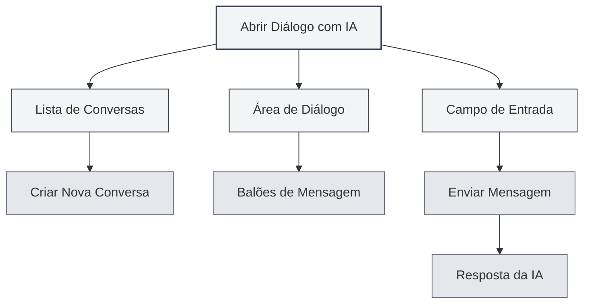
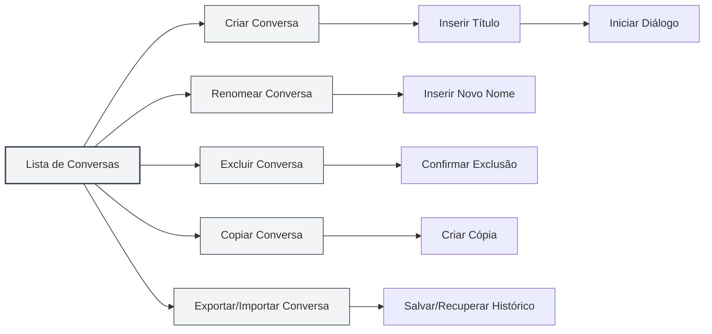
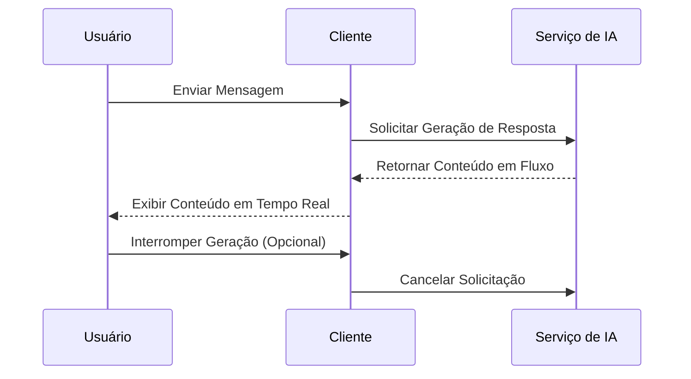
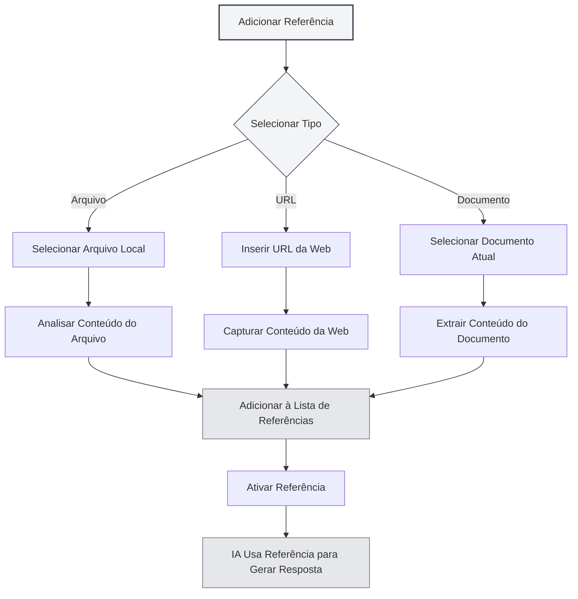

# Diálogo com IA

## Visão Geral

A funcionalidade de Diálogo com IA fornece um assistente de conversa inteligente que pode ajudá-lo a responder perguntas, gerar conteúdo, analisar documentos, entre outras tarefas. Através do Diálogo com IA, você pode interagir com a IA em linguagem natural, obtendo ajuda e sugestões inteligentes.

O Diálogo com IA suporta gerenciamento de múltiplas conversas, referência a materiais, integração com base de conhecimento e outras funcionalidades, permitindo que você use a IA de forma eficiente para auxiliar na conclusão de diversas tarefas.

## Abrir Diálogo com IA

### Formas de Abrir

Existem várias maneiras de abrir o Diálogo com IA:

- **Barra de Menu**: Clique no menu "IA" e selecione "Diálogo com IA"
- **Atalho de Teclado**: Use o atalho de teclado para abrir rapidamente (se configurado)
- **Barra Lateral**: Abra o painel de Diálogo com IA a partir da barra lateral

Você pode acessar a funcionalidade de Diálogo com IA através do menu Assistente de IA na barra de menu superior:

<MenuItemsDemo mode="demo" :items='[{"id": "ai-assistant", "items": ["ai-chat"]}]' />

### Introdução à Interface

A interface do Diálogo com IA contém as seguintes partes:

<AIChat mode="demo" />

- **Lista de Conversas**: Exibe todas as conversas no lado esquerdo
- **Área de Diálogo**: Exibe as mensagens da conversa no centro
- **Campo de Entrada**: Para inserir mensagens na parte inferior
- **Gerenciamento de Referências**: Gerencia materiais de referência

## Gerenciamento de Conversas

O Diálogo com IA suporta gerenciamento de múltiplas conversas. Você pode criar, renomear, excluir e copiar conversas.

<AIChat mode="demo" />

### Criar Conversa

Criar uma nova conversa de Diálogo com IA:

1. **Clique em Novo**: Clique no botão "Nova Conversa" acima da lista de conversas
2. **Insira um Título**: Opcionalmente, insira um título para a conversa (por padrão, usa a primeira mensagem)
3. **Inicie o Diálogo**: Digite a primeira mensagem para iniciar a conversa

### Operações na Conversa

### Renomear Conversa

Renomear uma conversa existente:

1. **Menu de Contexto**: Clique com o botão direito na conversa e selecione "Renomear"
2. **Insira o Novo Nome**: Digite o novo nome para a conversa
3. **Confirme para Salvar**: Após confirmar, salve o novo nome

### Excluir Conversa

Excluir conversas desnecessárias:

1. **Menu de Contexto**: Clique com o botão direito na conversa e selecione "Excluir"
2. **Confirme a Exclusão**: Após confirmar, a conversa será excluída

Excluir uma conversa também exclui todo o histórico de mensagens dessa conversa.

### Copiar Conversa

Copiar uma conversa existente:

1. **Menu de Contexto**: Clique com o botão direito na conversa e selecione "Copiar"
2. **Criar Cópia**: O sistema criará uma nova cópia da conversa

Copiar uma conversa copia todo o histórico de mensagens, facilitando a continuação da discussão com base em um diálogo existente.

### Exportar/Importar Conversa

Exportar e importar conversas:

- **Exportar Conversa**: Clique com o botão direito na conversa, selecione "Exportar" e salve como um arquivo JSON
- **Importar Conversa**: Importe uma conversa a partir de um arquivo para restaurar o histórico de mensagens

A funcionalidade de exportar/importar facilita o backup e o compartilhamento do conteúdo das conversas.

<MenuItemsDemo mode="demo" :items='[{"id": "file", "items": ["save", "open"]}]' />

## Enviar Mensagens

O Diálogo com IA fornece funcionalidades ricas para envio de mensagens.

<AIChat mode="demo" />

### Inserir Mensagem

Inserir uma mensagem no campo de entrada:

1. **Insira Texto**: Digite sua pergunta ou solicitação no campo de entrada
2. **Formatação**: Suporta formatação Markdown para estilizar o texto
3. **Enviar Mensagem**: Clique no botão enviar ou pressione `Enter` para enviar

### Tipos de Mensagem

São suportados os seguintes tipos de mensagem:

- **Mensagem de Texto**: Mensagem de texto comum
- **Mensagem Markdown**: Mensagem que suporta formatação Markdown
- **Mensagem com Código**: Mensagem contendo código

### Atalhos de Teclado

Atalhos de teclado para enviar mensagens:

- **Enter**: Enviar mensagem
- **Shift+Enter**: Quebra de linha (não envia)
- **Ctrl+Enter**: Enviar mensagem (em algumas configurações)

## Resposta da IA

A funcionalidade de resposta da IA fornece saída em fluxo contínuo e operações nas mensagens.

<AIChat mode="demo" />

<AIChat mode="demo" />

### Saída em Fluxo Contínuo

A resposta da IA utiliza saída em fluxo contínuo:

- **Exibição em Tempo Real**: O conteúdo gerado pela IA é exibido em tempo real
- **Geração Gradual**: O conteúdo é gerado gradualmente, sem necessidade de aguardar a conclusão
- **Pode ser Interrompida**: A geração pela IA pode ser interrompida a qualquer momento

### Operações na Mensagem

As seguintes operações podem ser realizadas na resposta da IA:

- **Copiar**: Copiar o conteúdo da resposta da IA
- **Regenerar**: Regenerar a resposta da IA
- **Editar**: Editar a resposta da IA (se suportado)
- **Excluir**: Excluir a resposta da IA

### Edição de Mensagem

Editar uma mensagem do usuário:

1. **Clique em Editar**: Clique no botão de edição ao lado da mensagem
2. **Modifique o Conteúdo**: Modifique o conteúdo da mensagem
3. **Reenvie**: Reenvie a mensagem modificada

Editar uma mensagem exclui todas as mensagens subsequentes a ela, reiniciando a conversa.

## Referenciar Materiais

Você pode adicionar materiais de referência ao Diálogo com IA para ajudar a IA a entender melhor o contexto.

<AIChat mode="demo" />

### Adicionar Referência

Adicionar materiais de referência a uma conversa:

1. **Abra o Gerenciamento de Referências**: Clique na aba de referências acima da área de diálogo
2. **Adicione Referência**: Clique no botão "Adicionar Referência"
3. **Selecione o Tipo**: Selecione o tipo de referência (arquivo, URL, etc.)
4. **Selecione o Conteúdo**: Selecione o conteúdo a ser referenciado

### Tipos de Referência

São suportados os seguintes tipos de referência:

- **Referência de Arquivo**: Referenciar um arquivo local
- **Referência de URL**: Referenciar uma URL da web
- **Referência de Documento**: Referenciar o documento atualmente aberto

### Ativar Referência

Ativar e desativar referências:

- **Ativar Referência**: Clique na aba da referência para ativá-la
- **Desativar Referência**: Clique novamente para desativá-la
- **Status de Ativação**: Referências ativadas serão usadas pela IA ao gerar respostas

Após ativar uma referência, a IA levará em consideração o conteúdo referenciado ao gerar a resposta.

### Visualizar Referência

Visualizar o conteúdo da referência:

- **Clique para Visualizar**: Clique na aba da referência para ver seu conteúdo
- **Ver Detalhes**: Ver o conteúdo detalhado da referência
- **Editar Referência**: Editar ou excluir a referência

## Integração com Base de Conhecimento

O Diálogo com IA pode ser integrado a uma base de conhecimento para recuperar automaticamente informações relevantes.

<KnowledgeBase mode="demo" />

<AIChat mode="demo" />

### Habilitar Base de Conhecimento

Habilitar consulta à base de conhecimento:

1. **Abra as Configurações**: Encontre o interruptor da base de conhecimento abaixo do campo de entrada
2. **Habilite a Consulta**: Alterne o interruptor para habilitar a consulta à base de conhecimento
3. **Recuperação Automática**: A IA recuperará automaticamente informações da base de conhecimento ao responder

### Recuperação da Base de Conhecimento

Funcionalidade de recuperação da base de conhecimento:

- **Recuperação Automática**: Recupera automaticamente informações relevantes ao enviar uma mensagem
- **Compreensão de Contexto**: Recupera conteúdo relacionado com base no contexto da conversa
- **Integração de Resultados**: Integra os resultados da recuperação na resposta da IA

### Configurações de Recuperação

Configurações de recuperação da base de conhecimento:

- **Limiar de Confiança**: Definir o limiar de confiança para a recuperação
- **Quantidade de Recuperação**: Definir o número de resultados da recuperação
- **Escopo da Recuperação**: Definir o escopo da recuperação

Consulte [[knowledge-base.config|Configuração da Base de Conhecimento]] para mais detalhes.

## Gerenciamento de Mensagens

Gerenciar mensagens no Diálogo com IA.

<AIChat mode="demo" />

### Operações na Mensagem

As seguintes operações podem ser realizadas nas mensagens:

- **Copiar Mensagem**: Copiar o conteúdo da mensagem
- **Editar Mensagem**: Editar uma mensagem do usuário
- **Excluir Mensagem**: Excluir uma mensagem
- **Regenerar**: Regenerar a resposta da IA

### Histórico de Mensagens

Gerenciamento do histórico de mensagens:

- **Salvamento Automático**: O histórico de mensagens é salvo automaticamente
- **Isolamento por Conversa**: O histórico de mensagens de cada conversa é independente
- **Recuperação do Histórico**: Restaura o histórico ao reabrir uma conversa

### Formato da Mensagem

As mensagens suportam os seguintes formatos:

<AIChat mode="demo" />

- **Markdown**: Suporta formatação Markdown
- **Bloco de Código**: Suporta realce de sintaxe em blocos de código
- **Fórmula Matemática**: Suporta fórmulas matemáticas em LaTeX
- **Tabela**: Suporta exibição de tabelas

## Dicas de Uso

Você pode usar a funcionalidade de Diálogo com IA de forma mais eficiente através das seguintes dicas.

<AIChat mode="demo" />

### Diálogo Eficiente

1. **Seja Específico**: Faça perguntas claras para obter melhores respostas
2. **Forneça Contexto**: Forneça informações contextuais suficientes
3. **Use Referências**: Use materiais de referência para fornecer mais informações

### Organização das Conversas

1. **Gerenciamento por Categoria**: Crie conversas separadas para diferentes tópicos
2. **Padronização de Nomes**: Use nomes claros para as conversas
3. **Limpeza Regular**: Exclua regularmente conversas desnecessárias

### Uso da Base de Conhecimento

1. **Adicione Documentos Relevantes**: Adicione documentos relevantes à base de conhecimento
2. **Habilite a Consulta**: Habilite a consulta à base de conhecimento para obter melhores respostas
3. **Ajuste as Configurações**: Ajuste as configurações de recuperação conforme necessário

## Perguntas Frequentes

<AIChat mode="demo" />

<MenuItemsDemo mode="demo" :items='[{"id": "ai-assistant"}]' />

### P: A resposta da IA está imprecisa?

R: As respostas da IA são baseadas em dados de treinamento e podem ser imprecisas. Fornecer mais informações contextuais ou usar materiais de referência pode melhorar a precisão.

### P: Como interromper a geração da IA?

R: Clique no botão "Cancelar" para interromper a geração da IA. O conteúdo já gerado não será perdido.

### P: O histórico de mensagens foi perdido?

R: O histórico de mensagens é salvo automaticamente. Se estiver perdido, verifique se a conversa foi excluída ou se os dados foram limpos.

### P: Como melhorar a qualidade das respostas?

R: Fornecer contexto claro, usar materiais de referência e habilitar a consulta à base de conhecimento podem melhorar a qualidade das respostas.

### P: Quais LLMs são suportados?

R: São suportados vários LLMs, incluindo OpenAI, Ollama, DeepSeek, entre outros. Consulte [[ai.llm-config|Configuração de LLM]] para mais detalhes.

## Documentação Relacionada

- [[ai.proofread|Revisão por IA]]
- [[ai.completion|Preenchimento Automático por IA]]
- [[knowledge-base.config|Configuração da Base de Conhecimento]]
- [[ai.llm-config|Configuração de LLM]]
