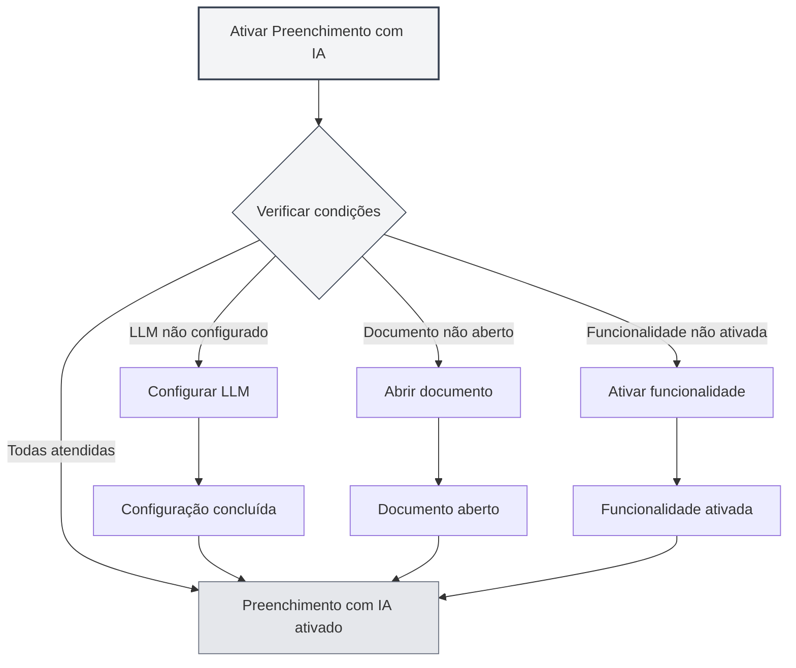
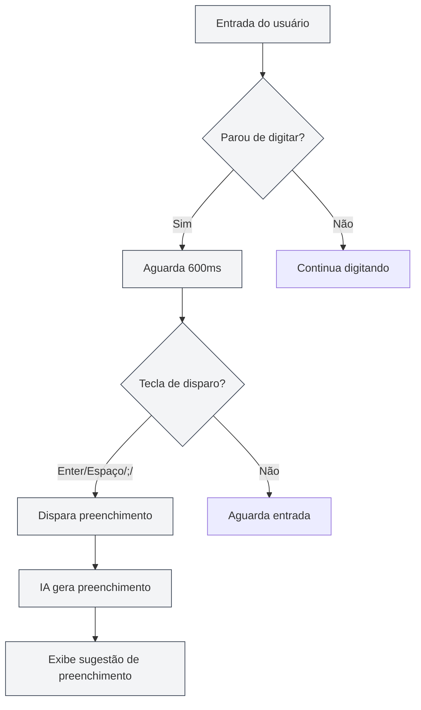
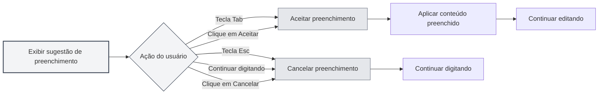

# Preenchimento Automático com IA

## Visão Geral

A funcionalidade de Preenchimento Automático com IA utiliza tecnologia de IA para completar automaticamente o conteúdo que você está digitando. Quando você para de digitar, a IA gera automaticamente sugestões de preenchimento com base no contexto, ajudando você a concluir rapidamente a redação de documentos.

O Preenchimento Automático com IA suporta vários formatos de documento (Markdown, LaTeX, texto simples), podendo compreender inteligentemente o contexto e gerar sugestões de preenchimento que se adequam ao estilo e conteúdo do documento.

## Ativar Preenchimento com IA

### Métodos de Ativação

Existem várias maneiras de ativar o Preenchimento Automático com IA:

- **Menu de contexto (botão direito)**: Clique com o botão direito no editor e selecione "Ativar Preenchimento Automático com IA"
- **Página de configurações**: Ative a funcionalidade de Preenchimento Automático com IA nas configurações
- **Atalho de teclado**: Use um atalho de teclado para alternar rapidamente (se configurado)

Você pode acessar as configurações através da barra de menus superior:

<MenuItemsDemo mode="demo" :items='[{"id": "settings"}]' />

<CompletionSettingsPanel mode="demo" />

### Condições para Ativação

Para ativar o Preenchimento Automático com IA, as seguintes condições devem ser atendidas:

- **LLM configurado**: É necessário configurar um serviço LLM
- **Documento aberto**: É necessário ter um documento aberto no editor
- **Funcionalidade ativada**: É necessário ativar a funcionalidade de Preenchimento com IA nas configurações

Consulte [[ai.llm-config|Configuração do LLM]] para mais detalhes.

<CompletionSettingsPanel mode="demo" />

## Disparo Automático

<AISuggestionGhost mode="demo" />

### Condições de Disparo

O Preenchimento Automático com IA será disparado automaticamente nas seguintes situações:

- **Parada de digitação**: Disparado automaticamente após 600ms sem digitação
- **Teclas de disparo**: Disparado após a entrada de teclas específicas (Enter, Espaço, `;`, `,`, etc.)

### Atraso de Disparo

Configurações do atraso de disparo:

- **Atraso padrão**: 600ms (0.6 segundos)
- **Configurável**: O tempo de atraso pode ser ajustado nas configurações
- **Equilíbrio**: Um atraso muito curto dispara com muita frequência, um atraso muito longo prejudica a experiência

<CompletionSettingsPanel mode="demo" />

### Teclas de Disparo

Teclas de disparo suportadas:

- **Enter**: Tecla Enter dispara
- **Espaço**: Tecla de Espaço dispara
- **;**: Ponto e vírgula dispara
- **,**: Vírgula dispara

As teclas de disparo podem ser configuradas nas configurações, suportando a ativação simultânea de várias teclas.

## Disparo Manual

<AISuggestionGhost mode="demo" />

### Métodos de Disparo

Maneiras de disparar o preenchimento manualmente:

- **Atalho de teclado**: Pressione `Shift+Tab` para disparar o preenchimento manualmente
- **Menu de contexto (botão direito)**: Clique com o botão direito e selecione "Disparar Preenchimento Manualmente"

O disparo manual inicia o preenchimento imediatamente, ignorando o atraso do disparo automático.

<CompletionSettingsPanel mode="demo" />

### Cenários de Uso

Cenários adequados para disparo manual:

- **Necessidade imediata de preenchimento**: Quando é necessário obter sugestões de preenchimento imediatamente
- **Falha no disparo automático**: Quando o disparo automático não funcionou
- **Posição específica**: Quando é necessário preenchimento em uma posição específica

## Conteúdo do Preenchimento

<AISuggestionGhost mode="demo" />

### Compreensão do Contexto

O preenchimento com IA compreende o seguinte contexto:

- **Parágrafo atual**: Compreende o conteúdo do parágrafo atual
- **Estrutura do documento**: Compreende a estrutura geral do documento
- **Estilo do documento**: Compreende o estilo de escrita do documento
- **Tema do documento**: Compreende o tema e conteúdo do documento

### Modos de Preenchimento

O preenchimento com IA suporta dois modos:

- **Geração completa**: Gera o conteúdo de preenchimento completo
- **Geração parcial**: Gera apenas parte do conteúdo (conforme configuração)

O modo de preenchimento pode ser configurado nas configurações.

<CompletionSettingsPanel mode="demo" />

### Comprimento do Preenchimento

Controle do comprimento do conteúdo de preenchimento:

- **Número máximo de Tokens**: É possível definir o número máximo de Tokens para o preenchimento
- **Valor padrão**: 50 Tokens
- **Intervalo**: De 20 Tokens até ilimitado (0 significa ilimitado)

Quanto maior o número de Tokens, mais conteúdo é preenchido, mas o tempo de geração também será maior.

<CompletionSettingsPanel mode="demo" />

## Aceitar Preenchimento

<AISuggestionGhost mode="demo" />

### Métodos de Aceitação

Maneiras de aceitar uma sugestão de preenchimento:

- **Tecla Tab**: Pressione a tecla `Tab` para aceitar a sugestão de preenchimento
- **Clique em Aceitar**: Clique no botão "Aceitar" na sugestão de preenchimento

### Cancelar Preenchimento

Maneiras de cancelar uma sugestão de preenchimento:

- **Tecla Esc**: Pressione a tecla `Esc` para cancelar a sugestão de preenchimento
- **Continuar digitando**: Continuar a digitar cancela automaticamente o preenchimento
- **Clique em Cancelar**: Clique no botão "Cancelar" na sugestão de preenchimento

### Editar Preenchimento

Após aceitar o preenchimento, é possível continuar editando:

- **Edição direta**: Após aceitar, o conteúdo preenchido pode ser editado diretamente
- **Aceitação parcial**: É possível aceitar apenas parte do conteúdo preenchido
- **Modificação do preenchimento**: O conteúdo preenchido pode ser modificado antes de ser usado

## Integração com Base de Conhecimento

### Ativar Base de Conhecimento

Para ativar a integração com a base de conhecimento:

1. **Abrir configurações**: Ative a integração com a base de conhecimento nas configurações
2. **Configurar base de conhecimento**: Configure as definições relacionadas à base de conhecimento
3. **Busca automática**: Durante o preenchimento, a base de conhecimento será automaticamente consultada

Consulte [[knowledge-base.config|Configuração da Base de Conhecimento]] para mais detalhes.

### Busca Contextual

Funcionalidade de busca na base de conhecimento:

- **Busca automática**: Busca automaticamente conhecimento relevante durante o preenchimento
- **Correspondência semântica**: Corresponde conteúdo relacionado com base na similaridade semântica
- **Integração de resultados**: Integra os resultados da busca nas sugestões de preenchimento

### Configurações de Busca

Configurações de busca na base de conhecimento:

- **Limiar de confiança**: Define o limiar de confiança para a busca
- **Quantidade de resultados**: Define o número de resultados da busca
- **Escopo da busca**: Define o escopo da busca

## Configurações de Preenchimento

### Configurações Básicas

Configurações básicas do Preenchimento com IA:

- **Ativar/Desativar**: Ativa ou desativa a funcionalidade de Preenchimento com IA
- **Atraso de disparo**: Define o tempo de atraso para o disparo automático
- **Teclas de disparo**: Configura as teclas de disparo
- **Número máximo de Tokens**: Define o número máximo de Tokens para o preenchimento

<CompletionSettingsPanel mode="demo" />

### Configurações Avançadas

Configurações avançadas do Preenchimento com IA:

- **Modo de preenchimento**: Seleciona o modo de preenchimento (geração completa/parcial)
- **Comprimento do contexto**: Define o comprimento do contexto usado para o preenchimento
- **Configuração de temperatura**: Define o parâmetro de temperatura para a geração pela IA
- **Integração com base de conhecimento**: Configura as opções de integração com a base de conhecimento

<CompletionSettingsPanel mode="demo" />

### Configurações de Formato

Configurações de preenchimento para diferentes formatos:

- **Markdown**: Configurações de preenchimento para formato Markdown
- **LaTeX**: Configurações de preenchimento para formato LaTeX
- **Texto simples**: Configurações de preenchimento para formato de texto simples

Diferentes formatos podem ter estratégias e configurações de preenchimento diferentes.

## Dicas de Uso

### Melhorar a Qualidade do Preenchimento

1. **Fornecer contexto**: Forneça informações contextuais suficientes no documento
2. **Ativar base de conhecimento**: Ativar a integração com a base de conhecimento pode melhorar a qualidade do preenchimento
3. **Ajustar configurações**: Ajuste as configurações de preenchimento conforme a necessidade

### Uso Eficiente

1. **Uso adequado**: Não dependa excessivamente do preenchimento com IA
2. **Verificar conteúdo**: Após aceitar o preenchimento, verifique se o conteúdo está correto
3. **Ajustes manuais**: Faça ajustes manuais no conteúdo preenchido quando necessário

### Evitar Problemas

1. **Evitar disparos frequentes**: Evite disparar o preenchimento com muita frequência, o que pode prejudicar a experiência de entrada
2. **Verificar precisão**: Verifique a precisão do conteúdo preenchido
3. **Cancelar prontamente**: Cancele preenchimentos desnecessários prontamente

## Perguntas Frequentes

### P: O preenchimento não é preciso?

R: O preenchimento com IA é baseado em contexto e dados de treinamento, podendo não ser preciso. Forneça mais informações contextuais ou ative a integração com a base de conhecimento para melhorar a precisão.

### P: O preenchimento é muito lento?

R: A velocidade do preenchimento depende da velocidade de resposta do serviço de IA. É possível ajustar as configurações de preenchimento ou usar um serviço LLM mais rápido.

### P: Como desativar o preenchimento automático?

R: Desative a funcionalidade de Preenchimento Automático com IA nas configurações, ou use o menu de contexto para desativar.

### P: Posso personalizar as teclas de disparo?

R: Sim. Configure as teclas de disparo nas configurações, suportando a ativação simultânea de várias teclas.

### P: O conteúdo preenchido é muito longo?

R: É possível ajustar o número máximo de Tokens para o preenchimento nas configurações, limitando o comprimento do conteúdo preenchido.

## Documentação Relacionada

- [[ai.chat|Conversa com IA]]
- [[ai.proofread|Revisão com IA]]
- [[knowledge-base.config|Configuração da Base de Conhecimento]]
- [[ai.llm-config|Configuração do LLM]]
