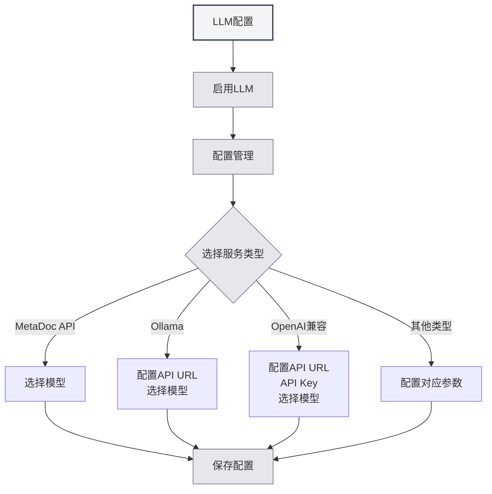

# Guia de Configuração de LLM

## Visão Geral

O LLM (Modelo de Linguagem Grande) é a base comum para funções como conversa com IA, revisão, conclusão, assistentes e Agent no MetaDoc. Este documento explica por que é necessário configurar o LLM, quais funcionalidades são afetadas pela configuração e como acessar a interface de configuração específica.

**Canal de distribuição**: se você usa o MetaDoc pelo **Steam**, leia primeiro a seção **Steam / MetaDoc Cloud** em **[[settings.llm|Configuração de LLM]]** (recarga, saldo, troca de modelo). Somente se precisar de uma **API de terceiros própria**, ative a **conectividade experimental** em **Opções experimentais** e continue abaixo; veja também **[[settings.llm-types|Tipos de provedor LLM]]**.

<Demo component="SettingLlmSection" mode="demo" />

## Por que Configurar o LLM

- **Chamadas de API**: Conversas, conclusões, revisões, etc., solicitam a interface do LLM selecionado, exigindo a configuração correta do endereço e da chave.
- **Diferenças entre Modelos**: Diferentes modelos variam significativamente em qualidade, velocidade e custo. Escolher o modelo adequado para cada cenário pode melhorar a experiência e controlar os custos.
- **Ponto Único de Configuração**: Gerencie centralmente o status de ativação, temperatura, tags de raciocínio, etc., em [[settings.llm|Configuração de LLM]]. Uma única configuração afeta todas as funcionalidades de IA.

## Quais Funcionalidades são Afetadas pela Configuração

Após configurar e ativar o LLM, as seguintes capacidades serão afetadas:

| Funcionalidade | Descrição |
| ----------- | -------------------- | ---------------------------------------------- |
| **Conversa com IA** | [[ai.chat | Funcionalidade de Conversa com IA]]: Diálogo multi-turno com IA, respostas baseadas em contexto |
| **Revisão com IA** | [[ai.proofread | Funcionalidade de Revisão com IA]]: Verificação de gramática e ortografia, sugestões de modificação |
| **Conclusão com IA** | [[ai.completion | Conclusão Automática com IA]]: Continuação e conclusão inteligente durante a escrita |
| **Assistentes de IA** | [[ai.assistants | Funcionalidade de Assistentes de IA]]: Reconhecimento de fórmulas, assistente de desenho, análise de dados, etc. |
| **Agent**   | [[agent.introduction | Framework Agent]]: Sessões, chamadas de ferramentas, execução de fluxos de trabalho |

Se o LLM estiver desativado ou se nenhum serviço utilizável estiver configurado, as funcionalidades acima ficarão indisponíveis ou solicitarão a conclusão da configuração primeiro.

## Como Configurar o LLM

### Acessar a Página de Configuração

1.  Abra **Configurações** → **Configuração de LLM** (ou a entrada equivalente no aplicativo).
2.  Na página **[[settings.llm|Configuração de LLM]]**, você pode:
    -   Ativar/Desativar o LLM
    -   Definir opções globais como temperatura, remoção automática de tags de raciocínio, etc.
    -   Gerenciar múltiplas configurações de LLM (criar, editar, excluir, ordenar)

Você pode acessar as configurações de LLM pela barra de menu superior:

<MenuItemsDemo mode="demo" :items='[{"id": "settings"}]' />

<MenuItemsDemo mode="demo" :items='[{"id": "ai"}]' />

### Configurar um Serviço Específico

Em **Gerenciamento de Configuração de LLM**, selecione ou crie uma nova configuração e preencha de acordo com o tipo de serviço:

-   **MetaDoc API / Ollama / OpenAI Compatível / OpenAI Oficial / DeepSeek / Gemini**, etc.  
    Consulte [[settings.llm-types|Configuração de Tipos de LLM]] para campos detalhados e etapas (Endereço da API, Chave da API, Nome do Modelo, Token máximo, etc.).

### Sugestões de Uso

-   **Primeiro Uso**: Primeiro complete e salve uma configuração de LLM utilizável, depois ative a opção **"Ativar LLM"**.
-   **Múltiplas Configurações**: Você pode criar várias configurações para diferentes cenários (ex.: "Conversa Diária", "Revisão Dedicada") e selecionar qual usar na funcionalidade correspondente ou na configuração do Agent.
-   **Custo e Privacidade**: O uso de APIs na nuvem gera custos e pode envolver o envio de conteúdo. Para necessidades locais e de privacidade, considere primeiro opções de implantação local como Ollama (veja [[settings.llm-types|Configuração de Tipos de LLM]]).

## Documentação Relacionada

- [[settings.llm|Configuração de LLM]]
- [[settings.llm-types|Configuração de Tipos de LLM]]
- [[settings.llm-management|Gerenciamento de Configuração de LLM]]
- [[ai.chat|Funcionalidade de Conversa com IA]]
- [[agent.introduction|Visão Geral do Framework Agent]]

<AIChat mode="demo" />
