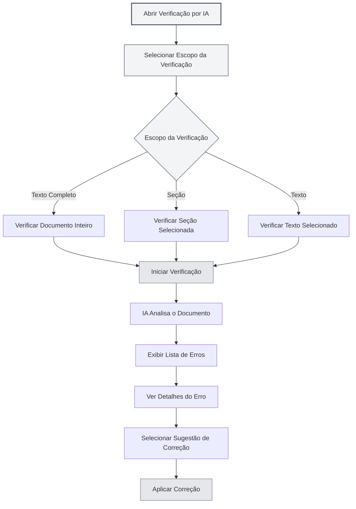
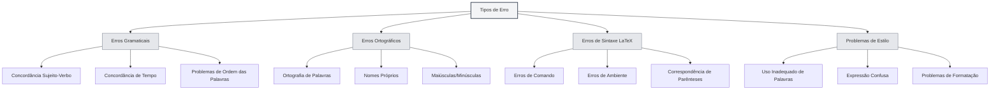
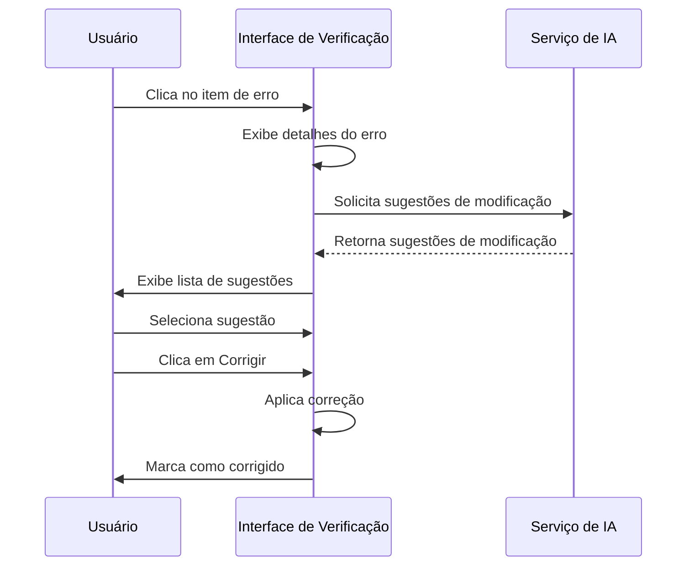

# Verificação Ortográfica por IA

## Visão Geral

A função de verificação ortográfica por IA utiliza tecnologia de inteligência artificial para verificar automaticamente erros gramaticais, ortográficos, erros de sintaxe LaTeX e outros problemas em documentos, fornecendo sugestões de correção. Com a verificação por IA, você pode identificar e corrigir rapidamente erros em seus documentos, melhorando a qualidade do conteúdo.

A verificação por IA suporta múltiplos formatos de documento (Markdown, LaTeX, texto simples), pode verificar o texto completo ou seções específicas, e fornece informações detalhadas sobre os erros e sugestões de modificação.

## Abrir a Verificação por IA

### Formas de Abertura

Existem várias maneiras de abrir a verificação por IA:

- **Barra de Menu**: Clique no menu "IA" e selecione "Verificação por IA"
- **Atalho de Teclado**: Use um atalho de teclado para abrir rapidamente (se configurado)
- **Barra Lateral**: Abra o painel de verificação por IA a partir da barra lateral

Você pode acessar a função de verificação por IA através do menu Assistente de IA na barra de menu superior:

<MenuItemsDemo mode="demo" :items='[{"id": "ai-assistant", "items": ["proofread"]}]' />

### Descrição da Interface

A interface de verificação por IA contém as seguintes partes:

- **Lista de Erros**: Exibe todos os erros no lado esquerdo
- **Pré-visualização do Documento**: Exibe o conteúdo do documento no lado direito
- **Estatísticas de Erros**: Exibe informações estatísticas sobre os erros na parte superior
- **Botões de Ação**: Fornece botões de ação na parte superior

<ProofreadView mode="demo" />

<ProofreadDisplay mode="demo" />

## Escopo da Verificação

### Verificar Texto Completo

Verificar todo o documento:

1. **Abrir Verificação**: Abra o painel de verificação por IA
2. **Clicar em Iniciar**: Clique no botão "Iniciar Verificação"
3. **Aguardar Conclusão**: Aguarde a IA concluir a verificação

A verificação do texto completo verifica automaticamente todo o conteúdo do documento.

<ProofreadView mode="demo" />

<ProofreadDisplay mode="demo" />

### Verificar Seção Específica

Verificar uma seção específica do documento:

1. **Selecionar Seção**: Selecione a seção a ser verificada na visualização de estrutura
2. **Abrir Verificação**: Abra o painel de verificação por IA
3. **Especificar Seção**: Especifique o caminho da seção nas configurações de verificação
4. **Iniciar Verificação**: Clique no botão "Iniciar Verificação"

A verificação de uma seção específica verifica apenas o conteúdo da seção selecionada e suas subseções.

<ProofreadView mode="demo" />

<ProofreadDisplay mode="demo" />

### Verificar Texto Especificado

Verificar um conteúdo de texto específico:

1. **Selecionar Texto**: Selecione o texto a ser verificado no editor
2. **Abrir Verificação**: Abra o painel de verificação por IA
3. **Colar Texto**: Cole o texto na caixa de entrada da verificação
4. **Iniciar Verificação**: Clique no botão "Iniciar Verificação"

<ProofreadDisplay mode="demo" />

## Tipos de Erro

A verificação por IA pode detectar os seguintes tipos de erro:

### Erros Gramaticais

Verifica erros gramaticais no documento:

<ProofreadDisplay mode="demo" />

- **Concordância Sujeito-Verbo**: Verifica problemas de concordância sujeito-verbo
- **Concordância de Tempo**: Verifica problemas de concordância de tempo verbal
- **Problemas de Ordem das Palavras**: Verifica problemas na ordem das palavras
- **Outros Erros Gramaticais**: Verifica outros problemas gramaticais

### Erros Ortográficos

Verifica erros ortográficos no documento:

- **Ortografia de Palavras**: Verifica erros de ortografia em palavras
- **Nomes Próprios**: Verifica a ortografia de nomes próprios
- **Maiúsculas/Minúsculas**: Verifica problemas de uso de maiúsculas e minúsculas

### Erros de Sintaxe LaTeX

Verifica erros de sintaxe em documentos LaTeX:

- **Erros de Comando**: Verifica erros em comandos LaTeX
- **Erros de Ambiente**: Verifica erros em ambientes LaTeX
- **Correspondência de Parênteses**: Verifica problemas de correspondência de parênteses, colchetes, chaves
- **Outros Erros de Sintaxe**: Verifica outros problemas de sintaxe LaTeX

### Problemas de Estilo

Verifica problemas de estilo no documento:

- **Uso Inadequado de Palavras**: Verifica se o uso das palavras é apropriado
- **Expressão Confusa**: Verifica se a expressão é clara
- **Problemas de Formatação**: Verifica problemas de formatação

## Informações do Erro

### Exibição do Erro

As informações do erro contêm o seguinte:

<ProofreadDisplay mode="demo" />

- **Tipo de Erro**: Exibe o tipo de erro (gramatical, ortográfico, LaTeX, etc.)
- **Localização do Erro**: Exibe o número da linha e coluna onde o erro ocorre
- **Texto do Erro**: Exibe o conteúdo do texto com erro
- **Sugestão de Modificação**: Exibe sugestões de correção
- **Gravidade**: Exibe o nível de gravidade do erro

### Níveis de Gravidade

Os erros são classificados por nível de gravidade:

- **Erro (Error)**: Erro que deve ser corrigido
- **Aviso (Warning)**: Problema cuja correção é recomendada
- **Informação (Info)**: Informação apenas para referência

### Localização do Erro

Localize rapidamente a posição do erro:

1. **Clique no Erro**: Clique no item de erro na lista de erros
2. **Localização Automática**: O editor rola automaticamente para a posição do erro
3. **Destaque**: A posição do erro será destacada

## Sugestões de Modificação

### Visualizar Sugestões

Visualize as sugestões de modificação fornecidas pela IA:

<ProofreadDisplay mode="demo" />

- **Sugestão Única**: Se houver apenas uma sugestão, ela é exibida diretamente
- **Múltiplas Sugestões**: Se houver múltiplas sugestões, elas são exibidas como etiquetas
- **Selecionar Sugestão**: Clique na etiqueta da sugestão para selecioná-la

### Aplicar Correção

Aplique uma sugestão de modificação:

<ProofreadDisplay mode="demo" />

1. **Selecionar Sugestão**: Clique na etiqueta da sugestão para selecioná-la
2. **Clicar em Corrigir**: Clique no botão "Corrigir"
3. **Confirmar Correção**: Após confirmação, a correção é aplicada

Após a correção, o erro será marcado como "corrigido".

### Correção com Um Clique

Corrija todos os erros com um clique:

1. **Clique em Corrigir Tudo**: Clique no botão "Corrigir Tudo com Um Clique"
2. **Confirmar Correção**: Após confirmação, todos os erros são corrigidos

A correção com um clique usará a primeira sugestão para corrigir todos os erros.

## Gerenciamento de Erros

### Ignorar Erro

Ignore erros que não precisam ser corrigidos:

1. **Selecionar Erro**: Selecione o erro a ser ignorado
2. **Clicar em Ignorar**: Clique no botão "Ignorar"
3. **Confirmar Ignorar**: Após confirmação, o erro é ignorado

Os erros ignorados serão removidos da lista de erros.

### Adicionar ao Dicionário

Adicione uma palavra ao dicionário:

1. **Selecionar Erro**: Selecione um erro ortográfico
2. **Adicionar ao Dicionário**: Clique no botão "Adicionar ao Dicionário"
3. **Confirmar Adição**: Após confirmação, a palavra é adicionada ao dicionário

Após ser adicionada ao dicionário, a palavra não será mais marcada como erro ortográfico.

### Limpar Corrigidos

Limpe os erros já corrigidos:

1. **Clique em Limpar**: Clique no botão "Limpar Corrigidos"
2. **Confirmar Limpeza**: Após confirmação, os erros corrigidos são limpos

Limpar os erros corrigidos deixa a lista de erros mais clara.

## Dicas de Uso

<ProofreadView mode="demo" />

### Verificação Eficiente

1. **Verifique Primeiro o Texto Completo**: Verifique o texto completo primeiro para entender a situação geral
2. **Depois Verifique Seções**: Faça uma verificação detalhada nas seções problemáticas
3. **Correção em Lote**: Use a correção com um clique para corrigir rapidamente erros comuns

### Tratamento de Erros

1. **Priorize Erros Graves**: Trate primeiro os erros mais graves
2. **Verifique Sugestões**: Examine cuidadosamente as sugestões de modificação
3. **Ajuste Manualmente**: Ajuste manualmente o conteúdo da modificação quando necessário

### Gerenciamento do Dicionário

1. **Adicione Termos Técnicos**: Adicione termos técnicos ao dicionário
2. **Atualize Regularmente**: Atualize regularmente o conteúdo do dicionário
3. **Exporte o Dicionário**: Exporte o dicionário para backup

## Perguntas Frequentes

### P: Os resultados da verificação não são precisos?

R: A verificação por IA é baseada em modelos de IA e pode não ser precisa. Recomenda-se verificar manualmente os resultados, especialmente termos técnicos e expressões especiais.

### P: Como verificar uma seção específica?

R: Especifique o caminho da seção nas configurações de verificação (ex: "1.1"), ou use a visualização de estrutura para selecionar a seção.

### P: Posso ignorar alguns erros?

R: Sim. Clicando no botão "Ignorar", você pode ignorar erros que não precisam ser corrigidos.

### P: Como adicionar ao dicionário?

R: Selecione um erro ortográfico e clique no botão "Adicionar ao Dicionário" para adicionar a palavra ao dicionário.

### P: A verificação está lenta?

R: A velocidade da verificação depende do tamanho do documento e da velocidade de resposta do serviço de IA. Para documentos grandes, recomenda-se verificar por partes.

## Documentação Relacionada

- [[ai.chat|Conversa com IA]]
- [[ai.completion|Auto-completar por IA]]
- [[outline.basics|Função de Visualização de Estrutura]]
