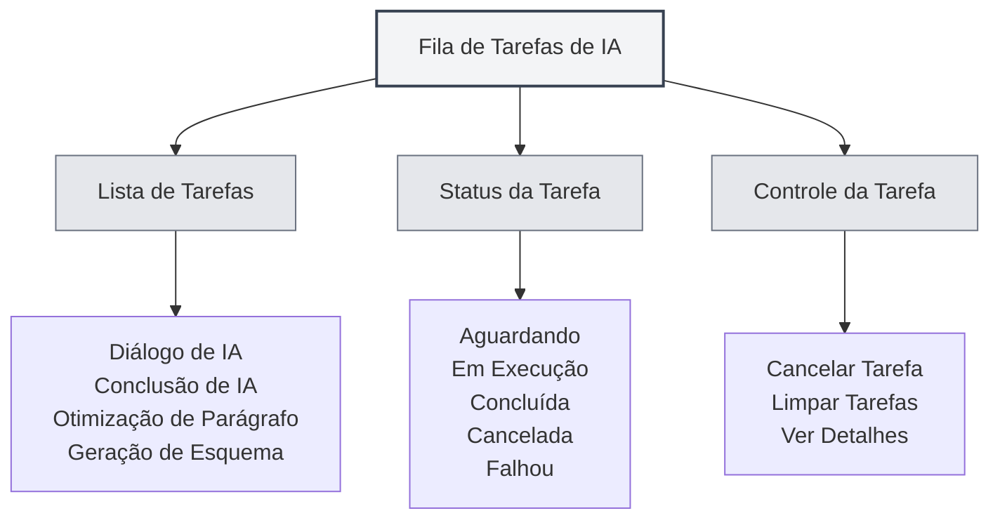

# Fila de Tarefas de IA

## Visão Geral

A fila de tarefas de IA é usada para gerenciar e monitorar todas as tarefas de IA em execução. Através da fila de tarefas, você pode visualizar o status das tarefas, cancelar tarefas, ver o progresso das tarefas, garantindo a operação eficiente das funcionalidades de IA.

## Introdução à Fila de Tarefas

<AITaskQueue mode="demo" />

### O que é a Fila de Tarefas

A fila de tarefas de IA é uma interface de gerenciamento que exibe todas as tarefas de IA em execução ou aguardando execução:

- **Lista de Tarefas**: Exibe todas as tarefas e seus status
- **Status da Tarefa**: Exibe o status de execução da tarefa
- **Progresso da Tarefa**: Exibe o progresso de execução da tarefa
- **Controle da Tarefa**: Permite cancelar ou gerenciar tarefas

### Tipos de Tarefas

A fila de tarefas pode conter os seguintes tipos de tarefas:

- **Diálogo de IA**: Tarefas de diálogo com IA
- **Conclusão de IA**: Tarefas de preenchimento automático por IA
- **Otimização de Parágrafo**: Tarefas de otimização de parágrafos
- **Geração de Esquema**: Tarefas de geração de esquema/estrutura
- **Outras Tarefas de IA**: Outras tarefas relacionadas à IA

## Abrindo a Fila de Tarefas

### Formas de Acesso

Você pode abrir a fila de tarefas das seguintes maneiras:

- **Barra Lateral**: Pode haver uma entrada para a fila de tarefas na barra lateral
- **Opções de Menu**: Alguns menus podem ter a opção de fila de tarefas
- **Atalho de Teclado**: Em alguns casos, pode haver um atalho (suporte futuro possível)

### Painel da Fila de Tarefas

<AITaskQueue mode="demo" />

A fila de tarefas geralmente é exibida como um painel lateral:

- **Lista de Tarefas**: Exibe todas as tarefas
- **Detalhes da Tarefa**: Exibe informações detalhadas da tarefa selecionada
- **Botões de Controle**: Fornece funcionalidades de controle de tarefas

## Visualização de Tarefas

<AITaskQueue mode="demo" />

### Lista de Tarefas

A lista de tarefas exibe todas as tarefas:

- **Nome da Tarefa**: Exibe o nome da tarefa
- **Status da Tarefa**: Exibe o status atual da tarefa
- **Progresso da Tarefa**: Exibe o progresso de execução da tarefa
- **Horário da Tarefa**: Exibe a hora de criação da tarefa

### Status da Tarefa

Uma tarefa pode estar nos seguintes estados:

- **Aguardando**: Tarefa criada, aguardando execução
- **Em Execução**: Tarefa está sendo executada
- **Concluída**: Tarefa finalizada com sucesso
- **Cancelada**: Tarefa foi cancelada
- **Falhou**: A execução da tarefa falhou

### Detalhes da Tarefa

É possível visualizar informações detalhadas da tarefa:

- **Nome da Tarefa**: O nome da tarefa
- **Tipo da Tarefa**: O tipo da tarefa
- **Parâmetros da Tarefa**: Os parâmetros da tarefa
- **Resultado da Tarefa**: O resultado da tarefa (se concluída)
- **Mensagem de Erro**: A mensagem de erro da tarefa (se falhou)

## Controle de Tarefas

<AITaskQueue mode="demo" />

### Cancelar Tarefa

É possível cancelar uma tarefa em execução:

1. **Selecionar Tarefa**: Selecione a tarefa a ser cancelada na lista de tarefas
2. **Clicar em Cancelar**: Clique no botão "Cancelar"
3. **Confirmar Cancelamento**: Confirme a operação de cancelamento
4. **Tarefa Cancelada**: A tarefa será cancelada e removida

<AITaskQueue mode="demo" />

### Limpar Tarefas

É possível limpar todas as tarefas:

1. **Abrir Fila de Tarefas**: Abra o painel da fila de tarefas
2. **Clicar em Limpar**: Clique no botão "Limpar"
3. **Confirmar Limpeza**: Confirme a operação de limpeza
4. **Tarefas Limpas**: Todas as tarefas serão canceladas e removidas

### Prioridade da Tarefa

Algumas tarefas podem ter prioridade:

- **Alta Prioridade**: Tarefas importantes executadas primeiro
- **Prioridade Normal**: Tarefas comuns executadas em ordem
- **Baixa Prioridade**: Tarefas de baixa prioridade executadas por último

## Exibição do Progresso da Tarefa

<AITaskQueue mode="demo" />

### Barra de Progresso

O progresso da tarefa é exibido através de uma barra de progresso:

- **Porcentagem de Progresso**: Exibe a porcentagem de conclusão da tarefa
- **Barra de Progresso**: Exibe visualmente o progresso da tarefa
- **Atualização de Progresso**: O progresso é atualizado em tempo real

### Informações de Progresso

É possível visualizar informações de progresso da tarefa:

- **Etapa Atual**: Exibe a etapa atualmente em execução
- **Etapas Concluídas**: Exibe as etapas já concluídas
- **Número Total de Etapas**: Exibe o número total de etapas
- **Tempo Estimado**: Exibe o tempo estimado para conclusão

<AITaskQueue mode="demo" />

## Atraso de Tarefas

<AITaskQueue mode="demo" />

### Atraso de Conclusão

É possível atrasar tarefas de conclusão de IA:

1. **Abrir Fila de Tarefas**: Abra o painel da fila de tarefas
2. **Selecionar Tempo de Atraso**: Selecione o tempo de atraso (minutos)
3. **Aplicar Atraso**: Aplique a configuração de atraso
4. **Tarefa Atrasada**: A tarefa de conclusão será executada com atraso

### Exibição do Atraso

O tempo de atraso será exibido na fila de tarefas:

- **Tempo Restante**: Exibe o tempo de atraso restante
- **Contagem Regressiva**: Exibição em contagem regressiva em tempo real
- **Execução Automática**: Executa automaticamente após o término do tempo de atraso

## Histórico de Tarefas

<AITaskQueue mode="demo" />

### Registro de Histórico

A fila de tarefas pode salvar o histórico de tarefas:

- **Tarefas Concluídas**: Exibe tarefas que foram concluídas
- **Tarefas com Falha**: Exibe tarefas que falharam
- **Tarefas Canceladas**: Exibe tarefas que foram canceladas

### Visualização do Histórico

É possível visualizar o histórico de tarefas:

- **Lista de Histórico**: Exibe a lista de tarefas históricas
- **Detalhes da Tarefa**: Visualiza informações detalhadas de tarefas históricas
- **Visualização de Resultado**: Visualiza o resultado da tarefa

## Melhores Práticas

<AITaskQueue mode="demo" />

1. **Verificar Regularmente**: Verifique a fila de tarefas regularmente para entender a situação de execução
2. **Cancelar Imediatamente**: Cancele tarefas desnecessárias prontamente para liberar recursos
3. **Monitorar Progresso**: Acompanhe o progresso das tarefas para garantir execução normal
4. **Tratar Erros**: Lide com tarefas com falha rapidamente para evitar impacto em tarefas subsequentes
5. **Gerenciar Recursos**: Gerencie tarefas de forma adequada para evitar desperdício de recursos

## Considerações

1. **Número de Tarefas**: Muitas tarefas podem afetar o desempenho
2. **Cancelamento de Tarefa**: Cancelar uma tarefa pode afetar operações em execução
3. **Status da Tarefa**: O status da tarefa pode mudar em tempo real
4. **Uso de Recursos**: Tarefas consomem recursos do sistema
5. **Dependência de Rede**: Algumas tarefas requerem conexão com a internet

## Documentação Relacionada

- [[ai.chat|Funcionalidade de Diálogo com IA]]
- [[ai.completion|Preenchimento Automático por IA]]
- [[features.paragraph-optimization|Funcionalidade de Otimização de Parágrafo]]