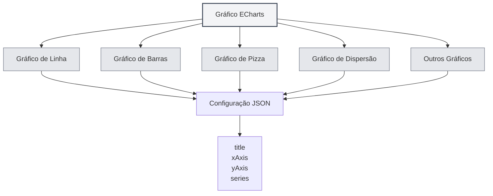

# Gráficos ECharts

## Visão Geral

ECharts é uma poderosa biblioteca de visualização de dados que suporta diversos tipos de gráficos. O MetaDoc oferece suporte a gráficos ECharts, permitindo a criação de várias visualizações de dados em documentos Markdown usando configurações do ECharts.

<DataAnalysisWindow mode="demo" />

## Sintaxe do ECharts

<ChartGenerationDisplay mode="demo" />

### Sintaxe Básica

O ECharts utiliza um formato de configuração JSON:

````markdown
```echarts
{
  "title": {
    "text": "Exemplo de Gráfico"
  },
  "xAxis": {
    "type": "category",
    "data": ["A", "B", "C"]
  },
  "yAxis": {
    "type": "value"
  },
  "series": [{
    "data": [10, 20, 30],
    "type": "bar"
  }]
}
```
````

### Formato da Configuração

A configuração do ECharts deve ser um JSON válido:

- **Formato JSON**: Use o formato JSON padrão.
- **Pontuação em Inglês**: Use vírgulas, dois-pontos e aspas em inglês.
- **Configuração Completa**: Inclua os itens de configuração necessários.



## Tipos de Gráficos Suportados

<DataAnalysisDisplay mode="demo" />

### Gráfico de Linha

Criar um gráfico de linha:

````markdown
```echarts
{
  "xAxis": {
    "type": "category",
    "data": ["Seg", "Ter", "Qua"]
  },
  "yAxis": {
    "type": "value"
  },
  "series": [{
    "data": [120, 200, 150],
    "type": "line"
  }]
}
```
````

### Gráfico de Barras

<ChartGenerationDisplay mode="demo" />

Criar um gráfico de barras:

````markdown
```echarts
{
  "xAxis": {
    "type": "category",
    "data": ["A", "B", "C"]
  },
  "yAxis": {
    "type": "value"
  },
  "series": [{
    "data": [10, 20, 30],
    "type": "bar"
  }]
}
```
````

### Gráfico de Pizza

<DataAnalysisDisplay mode="demo" />

Criar um gráfico de pizza:

````markdown
```echarts
{
  "series": [{
    "type": "pie",
    "data": [
      {"value": 335, "name": "Categoria A"},
      {"value": 310, "name": "Categoria B"},
      {"value": 234, "name": "Categoria C"}
    ]
  }]
}
```
````

### Gráfico de Dispersão

<ChartGenerationDisplay mode="demo" />

Criar um gráfico de dispersão:

````markdown
```echarts
{
  "xAxis": {
    "type": "value"
  },
  "yAxis": {
    "type": "value"
  },
  "series": [{
    "type": "scatter",
    "data": [[10, 20], [15, 25], [20, 30]]
  }]
}
```
````

### Gráfico de Radar

<OutlineTreeDisplay mode="demo" />

Criar um gráfico de radar:

````markdown
```echarts
{
  "radar": {
    "indicator": [
      {"name": "Indicador 1", "max": 100},
      {"name": "Indicador 2", "max": 100}
    ]
  },
  "series": [{
    "type": "radar",
    "data": [{
      "value": [80, 90]
    }]
  }]
}
```
````

### Mapa de Calor

<DataAnalysisDisplay mode="demo" />

Criar um mapa de calor:

````markdown
```echarts
{
  "xAxis": {
    "type": "category",
    "data": ["A", "B", "C"]
  },
  "yAxis": {
    "type": "category",
    "data": ["X", "Y", "Z"]
  },
  "series": [{
    "type": "heatmap",
    "data": [[0, 0, 10], [0, 1, 20], [1, 0, 30]]
  }]
}
```
````

## Configuração do Gráfico

<OutlineTreeDisplay mode="demo" />

### Configuração do Título

Definir o título do gráfico:

```json
{
  "title": {
    "text": "Título do Gráfico",
    "subtext": "Subtítulo"
  }
}
```

### Configuração dos Eixos

Configurar os eixos:

```json
{
  "xAxis": {
    "type": "category",
    "data": ["A", "B", "C"]
  },
  "yAxis": {
    "type": "value"
  }
}
```

### Configuração da Série

Configurar a série de dados:

```json
{
  "series": [
    {
      "name": "Nome da Série",
      "type": "bar",
      "data": [10, 20, 30]
    }
  ]
}
```

### Configuração da Legenda

Configurar a legenda:

```json
{
  "legend": {
    "data": ["Série 1", "Série 2"]
  }
}
```

### Configuração da Dica de Ferramenta

Configurar a dica de ferramenta:

```json
{
  "tooltip": {
    "trigger": "axis"
  }
}
```

## Funcionalidades Avançadas

<ChartGenerationDisplay mode="demo" />

### Gráfico com Múltiplas Séries

Criar um gráfico com múltiplas séries:

````markdown
```echarts
{
  "xAxis": {
    "type": "category",
    "data": ["Seg", "Ter", "Qua"]
  },
  "yAxis": {
    "type": "value"
  },
  "series": [
    {
      "name": "Série 1",
      "type": "bar",
      "data": [10, 20, 30]
    },
    {
      "name": "Série 2",
      "type": "line",
      "data": [15, 25, 35]
    }
  ]
}
```
````

### Zoom de Dados

Adicionar zoom de dados:

```json
{
  "dataZoom": [
    {
      "type": "slider",
      "start": 0,
      "end": 100
    }
  ]
}
```

### Mapeamento Visual

Adicionar mapeamento visual:

```json
{
  "visualMap": {
    "min": 0,
    "max": 100,
    "inRange": {
      "color": ["#50a3ba", "#eac736", "#d94e5d"]
    }
  }
}
```

## Modo de Renderização

### Renderização no Processo Principal

O ECharts utiliza renderização no processo principal:

- **Renderização no Lado do Servidor**: Renderiza o gráfico no processo principal.
- **Formato SVG**: Renderiza como SVG por padrão.
- **Formato PNG**: Pode ser convertido para o formato PNG.

### Desempenho da Renderização

Características da renderização do ECharts:

- **Velocidade de Renderização**: A renderização no processo principal é mais rápida.
- **Uso de Recursos**: Consome recursos do processo principal durante a renderização.
- **Tratamento de Erros**: Erros de renderização são exibidos no console.

## Considerações

### Considerações de Sintaxe

1.  **Formato JSON**: É obrigatório usar um formato JSON válido.
2.  **Pontuação em Inglês**: Use vírgulas, dois-pontos e aspas em inglês.
3.  **Configuração Completa**: Inclua os itens de configuração necessários.
4.  **Sintaxe Correta**: Garanta que a sintaxe JSON esteja correta, caso contrário, a renderização falhará.

### Considerações de Renderização

1.  **Validação da Configuração**: O formato da configuração é validado antes da renderização.
2.  **Erros de Sintaxe**: O gráfico não será renderizado se houver erros de sintaxe JSON.
3.  **Gráficos Complexos**: Gráficos excessivamente complexos podem afetar o desempenho da renderização.
4.  **Compatibilidade na Exportação**: Ao exportar, certifique-se de que o gráfico seja exibido corretamente no formato de destino.

## Melhores Práticas

1.  **Padrão de Configuração**: Siga as especificações oficiais de configuração do ECharts.
2.  **Formato JSON**: Garanta que o formato JSON esteja correto.
3.  **Código Claro**: Mantenha o código de configuração claro e legível.
4.  **Teste de Renderização**: Após editar, teste o efeito de renderização do gráfico.
5.  **Documentação de Referência**: Consulte a documentação oficial e os exemplos do ECharts.

## Documentação Relacionada

- [[charts.introduction|Introdução aos Gráficos]]
- [[charts.mermaid|Gráficos Mermaid]]
- [[charts.plantuml|Gráficos PlantUML]]