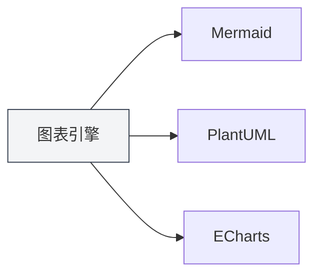
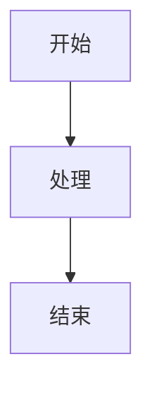

# Funcionalidades de Gráficos

## Visão Geral

O MetaDoc suporta múltiplos motores de desenho de gráficos, permitindo inserir e renderizar vários tipos de gráficos em documentos Markdown. A funcionalidade de gráficos permite criar fluxogramas, diagramas UML, gráficos de visualização de dados e mais, enriquecendo o conteúdo do documento.

<GraphWindow mode="demo" />

## Motores de Gráficos Suportados

<ChartGenerationDisplay mode="demo" />

### Tipos de Gráficos

O MetaDoc suporta os seguintes motores de gráficos:

- **Mermaid**: Fluxogramas, diagramas UML, gráficos de Gantt, etc.
- **PlantUML**: Diagramas de modelagem UML profissionais
- **ECharts**: Gráficos de visualização de dados
- **Flowchart**: Fluxogramas básicos
- **Graphviz**: Visualização de gráficos
- **Mindmap**: Mapas mentais
- **Markmap**: Mapas mentais em Markdown
- **SMILES**: Estruturas químicas
- **ABC**: Partituras musicais

### Comparação de Motores

<DataAnalysisDisplay mode="demo" />

| Motor     | Cenário de Aplicação                     | Método de Renderização |
| --------- | ---------------------------------------- | ---------------------- |
| Mermaid   | Fluxogramas, diagramas de sequência, diagramas de classe, gráficos de Gantt | Renderização no navegador |
| PlantUML  | Modelagem UML profissional               | Renderização no processo principal |
| ECharts   | Visualização de dados (gráficos de linha, barras, etc.) | Renderização no processo principal |
| Flowchart | Fluxogramas básicos                      | Renderização Vditor    |
| Graphviz  | Visualização de gráficos                 | Renderização Vditor    |
| Mindmap   | Mapas mentais                            | Renderização Vditor    |

### Gráfico de Comparação de Motores

<OutlineTreeDisplay mode="demo" />



## Inserir Gráficos

<DataAnalysisWindow mode="demo" />

### Sintaxe de Bloco de Código

Use blocos de código em documentos Markdown para inserir gráficos:

````markdown

````

### Identificadores de Tipo de Gráfico

Diferentes tipos de gráficos usam diferentes identificadores de bloco de código:

- **Mermaid**: ` ```mermaid `
- **PlantUML**: ` ```plantuml `
- **ECharts**: ` ```echarts `
- **Flowchart**: ` ```flowchart `
- **Graphviz**: ` ```graphviz `
- **Mindmap**: ` ```mindmap `

## Renderização de Gráficos

<ChartGenerationDisplay mode="demo" />

### Renderização em Tempo Real

Os gráficos são renderizados em tempo real no editor:

- **Renderização Automática**: Renderiza automaticamente após inserir o código do gráfico
- **Pré-visualização em Tempo Real**: Exibe o gráfico em tempo real na janela de pré-visualização
- **Indicação de Erro**: Exibe uma indicação de erro quando há erro de sintaxe

### Métodos de Renderização

Diferentes gráficos usam diferentes métodos de renderização:

- **Renderização no Navegador**: Mermaid, etc., usam a API do navegador para renderizar
- **Renderização no Processo Principal**: PlantUML, ECharts usam renderização no processo principal
- **Renderização Vditor**: Flowchart, etc., usam renderização Vditor

### Formatos de Renderização

Os gráficos podem ser renderizados em diferentes formatos:

- **SVG**: Formato de imagem vetorial (padrão)
- **PNG**: Formato de imagem bitmap (conversível)

## Exportar Gráficos

<OutlineTreeDisplay mode="demo" />

### Suporte à Exportação

Os gráficos suportam exportação para vários formatos:

- **Exportação para PDF**: O gráfico será incluído no PDF
- **Exportação para HTML**: O gráfico será incluído no HTML
- **Exportação de Imagem**: O gráfico pode ser exportado separadamente como imagem

### Qualidade da Exportação

Mantém a qualidade do gráfico durante a exportação:

- **Imagem Vetorial**: O formato SVG mantém a nitidez
- **Imagem Bitmap**: O formato PNG é adequado para impressão
- **Resolução**: Ajusta a resolução de acordo com o formato de exportação

## Editar Gráficos

<DataAnalysisDisplay mode="demo" />

### Edição de Código

É possível editar diretamente o código do gráfico:

- **Realce de Sintaxe**: O bloco de código suporta realce de sintaxe
- **Auto-completar**: Alguns editores suportam auto-completar
- **Verificação de Erros**: Verifica erros de sintaxe em tempo real

### Atualização da Pré-visualização

A pré-visualização é atualizada automaticamente após editar o código:

- **Atualização em Tempo Real**: A pré-visualização é atualizada imediatamente após modificar o código
- **Exibição de Erros**: Exibe informações de erro quando há erro de sintaxe
- **Status da Renderização**: Exibe o status de renderização do gráfico

## Suporte a Múltiplos Idiomas

<DataAnalysisWindow mode="demo" />

### Código de Gráfico Multilíngue

O código do gráfico suporta múltiplos idiomas:

- **Suporte a Chinês**: É possível usar rótulos e textos em chinês
- **Suporte a Inglês**: É possível usar rótulos e textos em inglês
- **Uso Misto**: É possível misturar chinês e inglês

### Internacionalização

A funcionalidade de gráficos suporta internacionalização:

- **Idioma da Interface**: A interface relacionada a gráficos segue o idioma do sistema
- **Indicação de Erro**: As indicações de erro usam o idioma atual
- **Documentação de Ajuda**: A documentação de ajuda suporta múltiplos idiomas

## Melhores Práticas

1. **Escolha o Motor Adequado**: Selecione o motor de gráficos apropriado de acordo com a necessidade
2. **Padrão de Sintaxe**: Siga as especificações de sintaxe de cada motor
3. **Código Claro**: Mantenha o código do gráfico claro e legível
4. **Teste de Renderização**: Teste o efeito de renderização do gráfico após a edição
5. **Teste de Exportação**: Teste o efeito de exibição do gráfico no formato de destino antes de exportar

## Considerações

1. **Sintaxe Correta**: Certifique-se de que o código do gráfico está sintaticamente correto, caso contrário não será renderizado
2. **Desempenho da Renderização**: Gráficos complexos podem afetar o desempenho da renderização
3. **Compatibilidade de Exportação**: Alguns formatos de gráfico podem ser incompatíveis com certos formatos de exportação
4. **Segurança do Código**: Atenção à segurança do código do gráfico, evite código malicioso
5. **Compatibilidade de Versão**: Diferentes versões do motor de gráficos podem ter diferenças de sintaxe

## Documentação Relacionada

- [[charts.mermaid|Gráficos Mermaid]]
- [[charts.plantuml|Gráficos PlantUML]]
- [[charts.echarts|Gráficos ECharts]]
- [[markdown.features|Funcionalidades do Editor Markdown]]