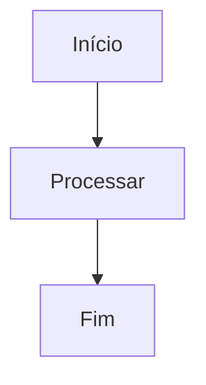
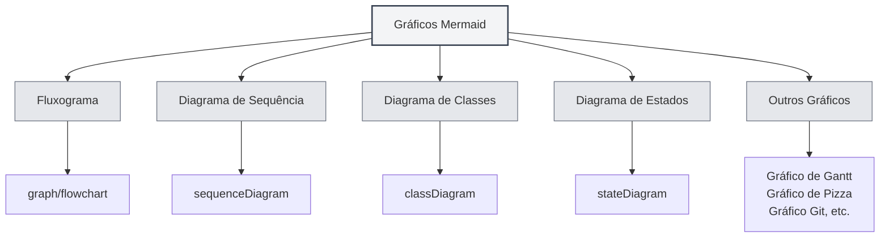
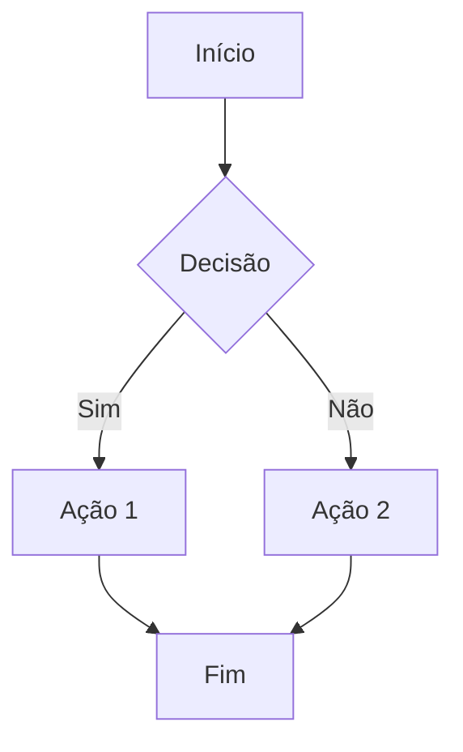
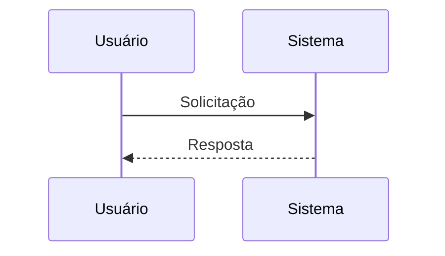
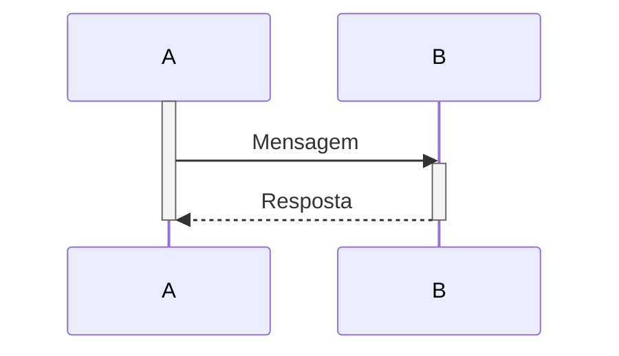
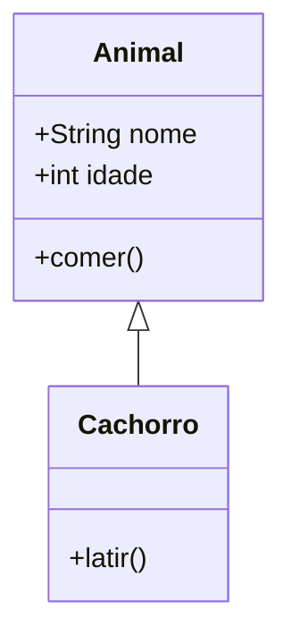
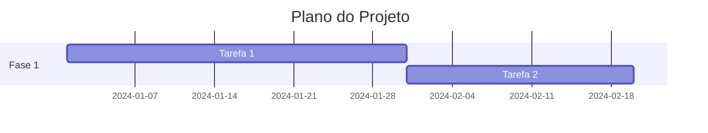
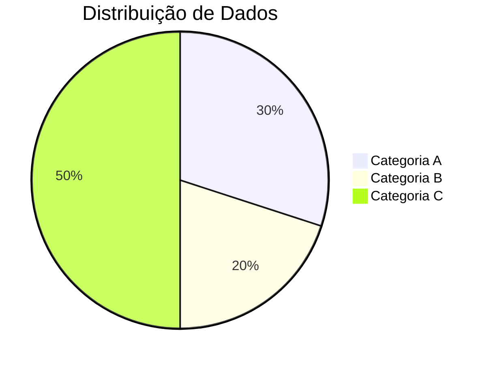
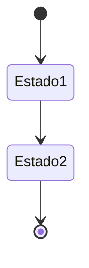
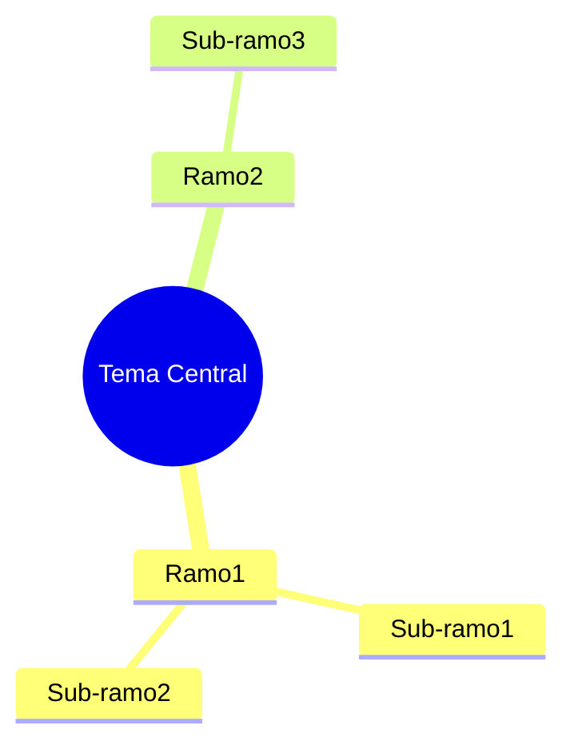

# Gráficos Mermaid

## Visão Geral

Mermaid é uma ferramenta popular para criação de diagramas, adequada para desenhar rapidamente fluxogramas, diagramas de sequência, diagramas de classes, gráficos de Gantt, entre outros. O MetaDoc suporta gráficos Mermaid, permitindo criar vários tipos de diagramas diretamente em documentos Markdown usando a sintaxe Mermaid.

<GraphWindow mode="demo" initialTool="mermaid" />

## Sintaxe Mermaid

<OutlineTreeDisplay mode="demo" />

### Sintaxe Básica

O Mermaid usa uma sintaxe de texto simples para descrever diagramas:

````markdown

````

### Tipos de Gráficos

<ChartGenerationDisplay mode="demo" />

O Mermaid suporta vários tipos de gráficos:

- **Fluxograma** (graph/flowchart)
- **Diagrama de Sequência** (sequenceDiagram)
- **Diagrama de Classes** (classDiagram)
- **Diagrama de Estados** (stateDiagram)
- **Diagrama de Entidade-Relacionamento** (erDiagram)
- **Gráfico de Gantt** (gantt)
- **Gráfico de Pizza** (pie)
- **Gráfico Git** (gitgraph)
- **Mapa de Jornada do Usuário** (journey)
- **Mapa Mental** (mindmap)
- **Linha do Tempo** (timeline)



## Fluxograma

<OutlineTreeDisplay mode="demo" />

### Fluxograma Básico

Criar um fluxograma básico:

````markdown

````

### Direção do Fluxograma

É possível definir a direção do fluxograma:

- **TD**: De cima para baixo (Top Down)
- **BT**: De baixo para cima (Bottom Top)
- **LR**: Da esquerda para a direita (Left Right)
- **RL**: Da direita para a esquerda (Right Left)

### Formas dos Nós

É possível usar diferentes formas de nós:

- **Retângulo**: `[texto]`
- **Retângulo Arredondado**: `(texto)`
- **Losango**: `{texto}`
- **Círculo**: `((texto))`
- **Hexágono**: `{{texto}}`
- **Trapézio**: `[/texto\]`
- **Trapézio Invertido**: `[\texto/]`

## Diagrama de Sequência

<DataAnalysisDisplay mode="demo" />

### Diagrama de Sequência Básico

Criar um diagrama de sequência:

````markdown

````

### Tipos de Mensagem

É possível usar diferentes tipos de mensagem:

- **Seta de linha sólida**: `->>` Mensagem síncrona
- **Seta de linha tracejada**: `-->>` Mensagem assíncrona
- **Linha sólida**: `->` Mensagem síncrona (sem retorno)
- **Linha tracejada**: `-->` Mensagem assíncrona (sem retorno)

### Caixa de Ativação

É possível adicionar caixas de ativação para representar a atividade do objeto:

````markdown

````

## Diagrama de Classes

<ChartGenerationDisplay mode="demo" />

### Diagrama de Classes Básico

Criar um diagrama de classes:

````markdown

````

### Relações de Classe

É possível representar diferentes relações de classe:

- **Herança**: `<|--` ou `--|>`
- **Implementação**: `<|..` ou `..|>`
- **Composição**: `*--` ou `--*`
- **Agregação**: `o--` ou `--o`
- **Associação**: `-->` ou `<--`
- **Dependência**: `..>` ou `<..`

### Membros da Classe

É possível definir os membros da classe:

- **Atributos**: `+nome: String` (público), `-nome: String` (privado)
- **Métodos**: `+metodo()` (público), `-metodo()` (privado)

## Gráfico de Gantt

<OutlineTreeDisplay mode="demo" />

### Gráfico de Gantt Básico

Criar um gráfico de Gantt:

````markdown

````

### Formato de Data

É possível definir o formato da data:

- **YYYY-MM-DD**: Ano-Mês-Dia
- **MM/DD/YYYY**: Mês/Dia/Ano
- **Outros formatos**: Suporta vários formatos de data

### Relações de Tarefas

É possível definir relações entre tarefas:

- **after**: Após uma determinada tarefa
- **Marco**: Use `milestone` para marcar um marco

## Gráfico de Pizza

<DataAnalysisDisplay mode="demo" />

### Gráfico de Pizza Básico

Criar um gráfico de pizza:

````markdown

````

## Diagrama de Estados

<ChartGenerationDisplay mode="demo" />

### Diagrama de Estados Básico

Criar um diagrama de estados:

````markdown

````

## Mapa Mental

<OutlineTreeDisplay mode="demo" />

### Mapa Mental Básico

Criar um mapa mental:

````markdown

````

## Considerações

<DataAnalysisDisplay mode="demo" />

### Considerações de Sintaxe

1.  **Delimitação de Strings**: Recomenda-se usar `["..."]` para delimitar strings e evitar erros de escape
2.  **Identificadores**: Em diagramas de classes, evite identificadores com espaços ou caracteres especiais
3.  **Suporte a Chinês**: É possível usar chinês, mas recomenda-se usar identificadores em inglês
4.  **Versão da Sintaxe**: Atenção à versão da sintaxe Mermaid, diferentes versões podem ter diferenças

### Considerações de Renderização

1.  **Erros de Sintaxe**: Se houver erro de sintaxe, o gráfico não será renderizado
2.  **Gráficos Complexos**: Gráficos muito complexos podem afetar o desempenho da renderização
3.  **Compatibilidade do Navegador**: Alguns navegadores podem não suportar certos recursos do Mermaid
4.  **Compatibilidade de Exportação**: Ao exportar, certifique-se de que o gráfico seja exibido corretamente no formato de destino

## Melhores Práticas

1.  **Padrão de Sintaxe**: Siga as especificações oficiais de sintaxe do Mermaid
2.  **Código Claro**: Mantenha o código do diagrama claro e legível
3.  **Testar Renderização**: Após editar, teste o efeito de renderização do gráfico
4.  **Usar Exemplos**: Consulte os exemplos da documentação oficial do Mermaid
5.  **Compatibilidade de Versão**: Atenção à compatibilidade da versão do Mermaid

## Documentação Relacionada

- [[charts.introduction|Introdução aos Gráficos]]
- [[charts.plantuml|Gráficos PlantUML]]
- [[charts.echarts|Gráficos ECharts]]
