# Diagramas PlantUML

## Visão Geral

PlantUML é uma ferramenta profissional de modelagem UML que suporta vários tipos de diagramas UML. O MetaDoc suporta diagramas PlantUML, permitindo a criação de diagramas UML profissionais usando a sintaxe PlantUML em documentos Markdown.

<GraphWindow mode="demo" initialTool="plantuml" />

## Sintaxe PlantUML

<OutlineTreeDisplay mode="demo" />

### Sintaxe Básica

O PlantUML usa marcações e sintaxe específicas:

````markdown
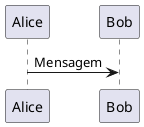
````

### Marcadores Obrigatórios

<ChartGenerationDisplay mode="demo" />

Os diagramas PlantUML devem conter:

- **@startuml**: Marcador de início do diagrama
- **@enduml**: Marcador de fim do diagrama

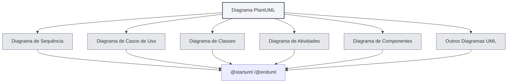

## Tipos de Diagramas Suportados

<DataAnalysisDisplay mode="demo" />

### Diagrama de Sequência

Criar diagrama de sequência:

````markdown
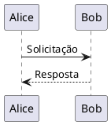
````

### Diagrama de Casos de Uso

<OutlineTreeDisplay mode="demo" />

Criar diagrama de casos de uso:

````markdown
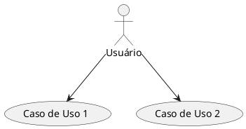
````

### Diagrama de Classes

<ChartGenerationDisplay mode="demo" />

Criar diagrama de classes:

````markdown
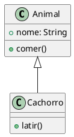
````

### Diagrama de Atividades

<DataAnalysisDisplay mode="demo" />

Criar diagrama de atividades:

````markdown
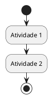
````

### Diagrama de Componentes

<OutlineTreeDisplay mode="demo" />

Criar diagrama de componentes:

````markdown
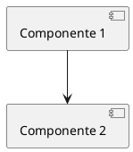
````

### Diagrama de Implantação

<ChartGenerationDisplay mode="demo" />

Criar diagrama de implantação:

````markdown
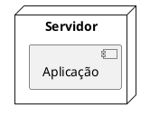
````

### Diagrama de Estados

<DataAnalysisDisplay mode="demo" />

Criar diagrama de estados:

````markdown
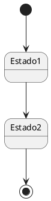
````

## Detalhes do Diagrama de Sequência

<OutlineTreeDisplay mode="demo" />

### Participantes

Definir participantes:

````markdown
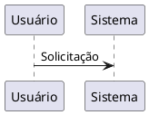
````

### Tipos de Mensagem

É possível usar diferentes tipos de mensagem:

- **Mensagem síncrona**: `->`
- **Mensagem assíncrona**: `-->`
- **Mensagem de retorno**: `<-` ou `<--`
- **Auto-chamada**: `->` apontando para si mesmo

### Caixa de Ativação

Adicionar caixa de ativação:

````markdown
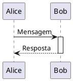
````

## Detalhes do Diagrama de Classes

<ChartGenerationDisplay mode="demo" />

### Definição de Classe

Definir classe:

````markdown
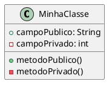
````

### Relacionamentos de Classe

Representar relacionamentos de classe:

- **Herança**: `<|--` ou `--|>`
- **Implementação**: `<|..` ou `..|>`
- **Composição**: `*--` ou `--*`
- **Agregação**: `o--` ou `--o`
- **Associação**: `-->` ou `<--`
- **Dependência**: `..>` ou `<..`

### Interfaces e Classes Abstratas

Definir interfaces e classes abstratas:

````markdown
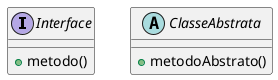
````

## Detalhes do Diagrama de Atividades

### Atividades Básicas

Definir atividades:

````markdown

````

### Nó de Decisão

Adicionar decisão:

````markdown
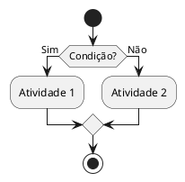
````

### Loop

Adicionar loop:

````markdown
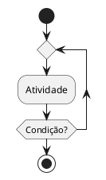
````

## Estilos e Temas

### Configuração de Tema

É possível configurar o tema:

````markdown
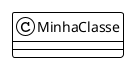
````

### Configuração de Cores

É possível configurar cores:

````markdown
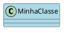
````

## Métodos de Renderização

### Renderização no Processo Principal

O PlantUML usa renderização no processo principal:

- **Renderização no servidor**: Renderiza o diagrama no processo principal
- **Formato SVG**: Renderizado como SVG por padrão
- **Formato PNG**: Pode ser convertido para formato PNG

### Desempenho de Renderização

Características da renderização PlantUML:

- **Velocidade de renderização**: Renderização no processo principal é mais rápida
- **Uso de recursos**: Consome recursos do processo principal durante a renderização
- **Tratamento de erros**: Erros de renderização são exibidos no console

## Observações

### Observações sobre a Sintaxe

1. **Marcadores obrigatórios**: Deve conter `@startuml` e `@enduml`
2. **Padrão de sintaxe**: Seguir a especificação de sintaxe oficial do PlantUML
3. **Suporte a chinês**: É possível usar chinês, mas recomenda-se usar identificadores em inglês
4. **Compatibilidade de versão**: Atenção à compatibilidade da versão do PlantUML

### Observações sobre a Renderização

1. **Extração de código**: Garantir que a extração do código esteja correta, evitando incluir tags XML
2. **Erros de sintaxe**: Diagramas com erros de sintaxe não serão renderizados
3. **Diagramas complexos**: Diagramas muito complexos podem afetar o desempenho da renderização
4. **Compatibilidade na exportação**: Garantir que o diagrama seja exibido corretamente no formato de destino ao exportar

## Melhores Práticas

1. **Padrão de sintaxe**: Seguir a especificação de sintaxe oficial do PlantUML
2. **Código claro**: Manter o código do diagrama claro e legível
3. **Usar marcadores**: Sempre usar os marcadores `@startuml` e `@enduml`
4. **Testar renderização**: Testar o efeito de renderização do diagrama após editar
5. **Documentação de referência**: Consultar a documentação oficial do PlantUML

## Documentação Relacionada

- [[charts.introduction|Introdução aos Recursos de Gráficos]]
- [[charts.mermaid|Diagramas Mermaid]]
- [[charts.echarts|Diagramas ECharts]]