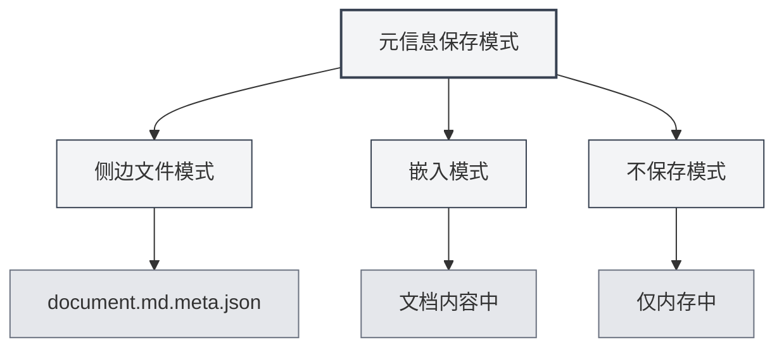

# Metadados do Documento

## Visão Geral

Os metadados do documento são dados que descrevem as propriedades básicas de um documento, incluindo título, autor, descrição, palavras-chave, etc. Configurar metadados de forma adequada auxilia na gestão e recuperação de documentos, e essas informações são automaticamente incluídas ao exportar o documento.

O MetaDoc suporta a configuração de metadados para cada documento. Essas informações podem ser salvas em um arquivo lateral, incorporadas ao conteúdo do documento ou não salvas. Você também pode usar IA para gerar metadados automaticamente.

<MetaInfoPanel mode="demo" :meta='{"title": "", "author": "", "description": "", "keywords": []}' :outlineJson='""' />

## Introdução aos Metadados

### Título (Title)

O título do documento, normalmente exibido no topo do documento e na aba do navegador.

- **Finalidade**: Identificar o conteúdo principal do documento.
- **Local de Exibição**: Título da aba, página de título do documento exportado.
- **Exemplo**: `"Manual do Usuário do MetaDoc"`

<MetaInfoPanel mode="demo" :meta='{"title": "MetaDoc用户手册", "author": "", "description": "", "keywords": []}' :outlineJson='""' />

### Autor (Author)

O autor ou criador do documento.

- **Finalidade**: Identificar o criador do documento.
- **Local de Exibição**: Informações do autor no documento exportado.
- **Exemplo**: `"João Silva"`

<MetaInfoPanel mode="demo" :meta='{"title": "示例文档", "author": "张三", "description": "", "keywords": []}' :outlineJson='""' />

### Descrição (Description)

Uma breve descrição ou resumo do documento.

- **Finalidade**: Resumir o conteúdo principal do documento.
- **Local de Exibição**: Seção de resumo do documento exportado.
- **Exemplo**: `"Este documento descreve os métodos básicos de uso do MetaDoc."`

<MetaInfoPanel mode="demo" :meta='{"title": "示例文档", "author": "作者名", "description": "本文档介绍MetaDoc的基本使用方法", "keywords": []}' :outlineJson='""' />

### Palavras-chave (Keywords)

Uma lista de palavras-chave do documento, usada para recuperação e classificação de documentos.

- **Finalidade**: Auxiliar na recuperação e classificação de documentos.
- **Formato**: Array de strings.
- **Exemplo**: `["MetaDoc", "Manual do Usuário", "Edição de Documentos"]`

<MetaInfoPanel mode="demo" :meta='{"title": "示例文档", "author": "作者名", "description": "文档描述", "keywords": ["MetaDoc", "用户手册", "文档编辑"]}' :outlineJson='""' />

## Configurando Metadados

### Configuração Manual

1. **Abra o Painel de Metadados**:
   - Clique no botão "Metadados" na barra de ferramentas do editor.
   - Ou use o atalho de teclado (se configurado).

2. **Preencha os Metadados**:
   - **Título**: Insira o título do documento.
   - **Autor**: Insira o nome do autor.
   - **Descrição**: Insira a descrição do documento (suporta múltiplas linhas).
   - **Palavras-chave**: Insira as palavras-chave, separando múltiplas palavras-chave com vírgulas.

3. **Salvar**: Clique no botão "Salvar" para salvar os metadados.

A interface do painel de metadados é a seguinte:

<MetaInfoPanel mode="demo" :meta='{"title": "示例文档", "author": "作者名", "description": "文档描述", "keywords": ["关键词1", "关键词2"]}' :outlineJson='""' />

### Configuração em Lote

Você pode configurar todos os campos de metadados de uma só vez:

1. Abra o painel de metadados.
2. Preencha todos os campos.
3. Clique no botão "Salvar".

<MetaInfoPanel mode="demo" :meta='{"title": "批量设置示例", "author": "管理员", "description": "批量设置所有元信息字段的示例", "keywords": ["批量", "设置", "元信息"]}' :outlineJson='""' />

### Editando Metadados

Os metadados já configurados podem ser modificados a qualquer momento:

1. Abra o painel de metadados.
2. Modifique os campos que deseja alterar.
3. Clique no botão "Salvar".

Os metadados modificados entram em vigor imediatamente e são salvos na próxima vez que o documento for salvo.

## Modos de Salvamento de Metadados

O MetaDoc suporta três modos de salvamento de metadados, configuráveis em [[settings.basic|Configurações Básicas]]:



### Modo Arquivo Lateral

Os metadados são salvos em um arquivo lateral com o mesmo nome do documento (`.meta.json`).

<MetaInfoPanel mode="demo" :meta='{"title": "侧边文件模式示例", "author": "系统", "description": "元信息保存在.meta.json文件中", "keywords": ["侧边文件", "元数据"]}' :outlineJson='""' />

**Vantagens**:
- Não modifica o conteúdo original do documento.
- O arquivo lateral pode ser excluído a qualquer momento para restaurar o documento original.
- Adequado para controle de versão.

**Desvantagens**:
- Gera um arquivo adicional.
- Ao mover o documento, o arquivo lateral precisa ser movido junto.

**Exemplo**:
- Documento: `document.md`
- Arquivo de metadados: `document.md.meta.json`

### Modo Incorporado

Os metadados são incorporados ao conteúdo do documento (front matter do Markdown ou comentários do LaTeX).

<MetaInfoPanel mode="demo" :meta='{"title": "嵌入模式示例", "author": "嵌入作者", "description": "元信息嵌入在文档中", "keywords": ["嵌入", "front matter"]}' :outlineJson='""' />

**Vantagens**:
- Documento e metadados ficam juntos, facilitando o gerenciamento.
- Não requer arquivos adicionais.

**Desvantagens**:
- Modifica o conteúdo original do documento.
- Alguns formatos podem não suportar incorporação.

**Exemplo** (Markdown):

```markdown
---
title: Título do Documento
author: Nome do Autor
description: Descrição do Documento
keywords: [Palavra-chave1, Palavra-chave2]
---

Conteúdo do documento...
```

### Modo Não Salvar

Os metadados são usados apenas durante a edição e não são salvos em arquivo.

<MetaInfoPanel mode="demo" :meta='{"title": "不保存模式", "author": "临时", "description": "仅在内存中保存元信息", "keywords": ["临时", "不保存"]}' :outlineJson='""' />

**Vantagens**:
- Não afeta o documento original.
- Não gera arquivos adicionais.

**Desvantagens**:
- Os metadados são perdidos após fechar o documento.
- Não é possível usar os metadados na exportação.

## Geração de Metadados por IA

O MetaDoc suporta a geração automática de metadados de documentos usando IA, gerando inteligentemente com base no conteúdo do documento e na estrutura do esboço.

### Gerar um Campo Específico

Gere metadados para um campo específico:

1. Abra o painel de metadados.
2. Clique no botão "Gerar com IA" ao lado do campo.
3. Aguarde o resultado da geração pela IA.
4. Revise o conteúdo gerado; você pode aceitar ou gerar novamente.

### Gerar Todos os Campos

Gere todos os campos de metadados de uma só vez:

1. Abra o painel de metadados.
2. Clique no botão "Gerar Tudo com IA".
3. Aguarde o resultado da geração pela IA.
4. Revise o conteúdo gerado; você pode aceitar, modificar ou gerar novamente.

<MetaInfoPanel mode="demo" :meta='{"title": "AI生成示例", "author": "AI助手", "description": "使用AI自动生成的元信息", "keywords": ["AI", "自动生成", "智能"]}' :outlineJson='""' />

### Princípio de Geração

A geração de metadados por IA é baseada em:
- **Esboço do Documento**: Analisa a estrutura de títulos do documento.
- **Conteúdo do Documento**: Analisa o conteúdo principal do documento.
- **Compreensão de Contexto**: Compreende o tema e o propósito do documento.

Os resultados gerados são ajustados automaticamente de acordo com o conteúdo do documento, garantindo que os metadados reflitam com precisão o conteúdo do documento.

## Aplicação dos Metadados na Exportação

Os documentos exportados incluem automaticamente os metadados:

### Exportação para PDF
- **Título**: Exibido nas propriedades do documento PDF.
- **Autor**: Exibido nas propriedades do documento PDF.
- **Descrição**: Usada como Assunto (Subject) do PDF.
- **Palavras-chave**: Exibidas nas propriedades do documento PDF.

### Exportação para DOCX
- **Título**: Exibido nas propriedades do documento Word.
- **Autor**: Exibido nas propriedades do documento Word.
- **Descrição**: Usada como Resumo do Word.
- **Palavras-chave**: Exibidas nas propriedades do documento Word.

### Exportação para HTML
- **Título**: Exibido na tag `<title>` do HTML.
- **Autor**: Exibido na tag `<meta>` do HTML.
- **Descrição**: Exibido na tag `<meta>` do HTML.
- **Palavras-chave**: Exibido na tag `<meta>` do HTML.

## Dicas de Uso

### Configurar o Título Adequadamente
- **Claro e Conciso**: O título deve resumir o conteúdo do documento de forma concisa.
- **Evitar Muito Longo**: Títulos muito longos podem afetar a exibição.
- **Usar Palavras-chave**: Inclua palavras-chave importantes no título.

### Configurar Palavras-chave
- **Quantidade Moderada**: Recomenda-se definir de 3 a 10 palavras-chave.
- **Alta Relevância**: As palavras-chave devem estar altamente relacionadas ao conteúdo do documento.
- **Evitar Repetições**: Evite definir palavras-chave repetidas ou muito similares.

### Otimizar a Geração por IA
- **Verificar Após Gerar**: O conteúdo gerado pela IA precisa ser verificado manualmente.
- **Modificar Conforme Necessário**: Modifique o conteúdo gerado de acordo com as necessidades reais.
- **Gerar Várias Vezes**: Se não estiver satisfeito, pode gerar várias vezes e escolher o melhor resultado.

<MetaInfoPanel mode="demo" :meta='{"title": "元信息完整示例", "author": "演示用户", "description": "展示完整的元信息配置示例", "keywords": ["元信息", "配置", "示例"]}' :outlineJson='""' />

## Perguntas Frequentes

### Q: Onde os metadados são salvos?
R: Dependendo do modo de salvamento, os metadados podem ser salvos em um arquivo lateral, incorporados ao conteúdo do documento ou não salvos. O modo de salvamento pode ser configurado nas configurações.

### Q: Como excluir os metadados?
R: No painel de metadados, limpe todos os campos e salve para excluir os metadados.

### Q: E se o conteúdo gerado pela IA não for preciso?
R: O conteúdo gerado pela IA é apenas para referência. Você pode modificar manualmente ou gerar novamente. Recomenda-se verificar e ajustar após a geração.

### Q: Os metadados afetam o conteúdo do documento?
R: Se o modo incorporado for usado, os metadados serão incorporados ao conteúdo do documento. Se os modos arquivo lateral ou não salvar forem usados, o conteúdo original do documento não será afetado.

### Q: Os metadados são perdidos na exportação?
R: Não. Os metadados são automaticamente incluídos na exportação e exibidos nas propriedades do documento exportado.

## Documentos Relacionados

- [[core.file-operations|Operações com Arquivos]]
- [[core.export|Funcionalidade de Exportação]]
- [[settings.basic|Configurações Básicas]]
- [[ai.assistants|Funcionalidade de Assistente de IA]]