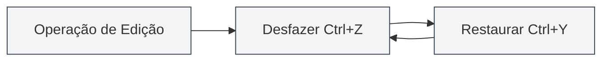
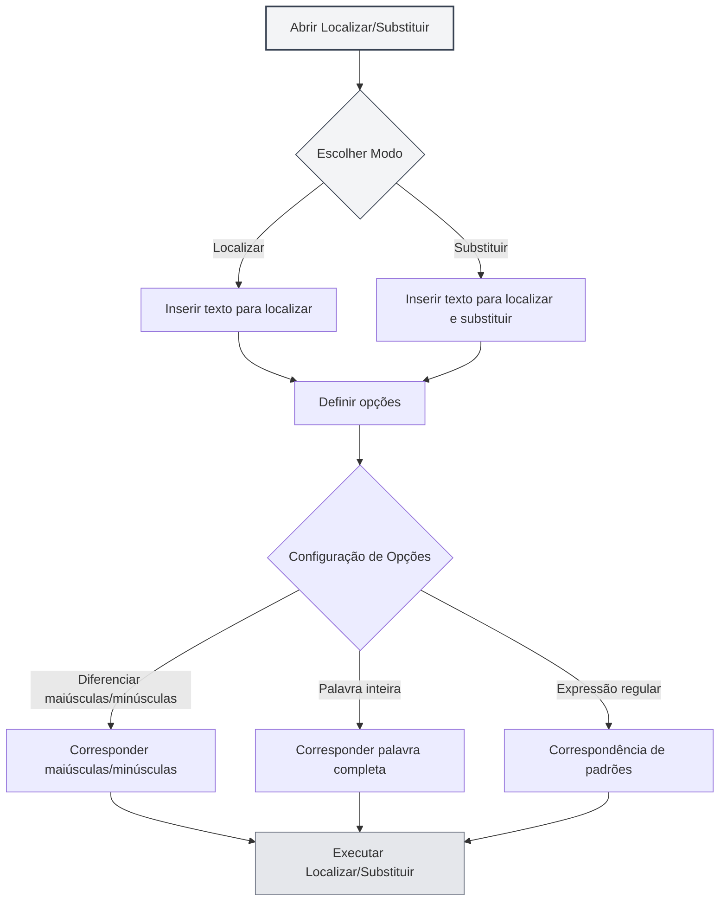

# Operações Básicas do Editor

## Visão Geral

As operações básicas do editor são habilidades fundamentais para editar documentos no MetaDoc. Dominar essas operações pode melhorar significativamente sua eficiência de edição.

O editor do MetaDoc suporta operações padrão de edição de texto, incluindo funções como desfazer, refazer, copiar, colar, recortar, selecionar tudo e localizar e substituir.

<SearchReplaceMenu mode="demo" :position='{"top": 100, "left": 200}' :adapter='null' />

<MenuItemsDemo mode="demo" :items='[{"id": "edit"}]' />

## Desfazer e Refazer

### Operação Desfazer

Desfazer a última operação de edição:

- **Atalho**: `Ctrl+Z` (Windows/Linux) ou `Cmd+Z` (macOS)
- **Menu**: Clique em "Editar" → "Desfazer"

É possível desfazer várias operações consecutivamente, até restaurar o estado inicial do documento.

### Operação Refazer

<MenuItemsDemo mode="demo" :items='[{"id": "edit"}]' />

Restaurar uma operação que foi desfeita:

- **Atalho**: `Ctrl+Y` ou `Ctrl+Shift+Z` (Windows/Linux) ou `Cmd+Shift+Z` (macOS)
- **Menu**: Clique em "Editar" → "Refazer"

A operação de refazer restaurará as ações na ordem inversa em que foram desfeitas.

## Copiar, Colar, Recortar

<MenuItemsDemo mode="demo" :items='[{"id": "edit"}]' />

### Copiar

Copiar o texto selecionado para a área de transferência:

- **Atalho**: `Ctrl+C` (Windows/Linux) ou `Cmd+C` (macOS)
- **Menu**: Clique em "Editar" → "Copiar"
- **Menu de contexto**: Selecione o texto, clique com o botão direito e escolha "Copiar"

### Colar

<MenuItemsDemo mode="demo" :items='[{"id": "edit"}]' />

Colar o conteúdo da área de transferência na posição atual:

- **Atalho**: `Ctrl+V` (Windows/Linux) ou `Cmd+V` (macOS)
- **Menu**: Clique em "Editar" → "Colar"
- **Menu de contexto**: Clique com o botão direito e escolha "Colar"

A operação de colar insere o conteúdo na posição do cursor. Se houver texto selecionado, ele será substituído.

### Recortar

<MenuItemsDemo mode="demo" :items='[{"id": "edit"}]' />

Recortar o texto selecionado para a área de transferência (removendo o conteúdo da posição original):

- **Atalho**: `Ctrl+X` (Windows/Linux) ou `Cmd+X` (macOS)
- **Menu**: Clique em "Editar" → "Recortar"
- **Menu de contexto**: Selecione o texto, clique com o botão direito e escolha "Recortar"

A operação de recortar remove o texto da posição original e o salva na área de transferência, podendo ser colado em outro local posteriormente.

## Selecionar Tudo

<MenuItemsDemo mode="demo" :items='[{"id": "edit"}]' />

Selecionar todo o conteúdo do documento:

- **Atalho**: `Ctrl+A` (Windows/Linux) ou `Cmd+A` (macOS)
- **Menu**: Clique em "Editar" → "Selecionar Tudo"

Após selecionar tudo, você pode:

- Copiar todo o conteúdo do documento
- Deletar todo o conteúdo do documento
- Aplicar formatação uniforme a todo o texto

## Localizar e Substituir

### Localizar

<SearchReplaceMenu mode="demo" :position='{"top": 100, "left": 200}' :adapter='null' />

Localizar um texto específico no documento:

- **Atalho**: `Ctrl+F` (Windows/Linux) ou `Cmd+F` (macOS)
- **Menu**: Clique em "Editar" → "Localizar"

A função de localizar suporta:

- **Correspondência de maiúsculas/minúsculas**: Localizar diferenciando maiúsculas de minúsculas
- **Correspondência de palavra inteira**: Corresponder apenas palavras completas
- **Expressões regulares**: Usar expressões regulares para buscas avançadas
- **Realce**: Os resultados da busca são realçados no documento

### Substituir

<SearchReplaceMenu mode="demo" :position='{"top": 100, "left": 200}' :adapter='null' />

Localizar e substituir texto:

- **Atalho**: `Ctrl+H` (Windows/Linux) ou `Cmd+H` (macOS)
- **Menu**: Clique em "Editar" → "Localizar e Substituir"

A função de substituir suporta:

- **Substituir individualmente**: Substituir cada correspondência de texto uma por uma
- **Substituir tudo**: Substituir todas as correspondências de uma vez
- **Pré-visualizar substituição**: Visualizar o resultado antes de substituir

### Opções de Localizar e Substituir

A caixa de diálogo Localizar e Substituir oferece as seguintes opções:

- **Diferenciar maiúsculas/minúsculas**: Corresponder apenas textos com exatamente as mesmas maiúsculas/minúsculas
- **Palavra inteira**: Corresponder apenas palavras completas (não partes de palavras)
- **Expressão regular**: Usar expressões regulares para correspondência de padrões
- **Busca circular**: Reiniciar automaticamente a busca do início ao chegar ao final do documento

A interface do menu Localizar e Substituir é a seguinte:

<SearchReplaceMenu mode="demo" :position='{"top": 100, "left": 200}' :adapter='null' />

## Seleção de Texto

### Seleção Básica

- **Clique único**: Posiciona o cursor no local clicado
- **Arrastar**: Seleciona o texto do ponto inicial ao ponto final
- **Duplo clique**: Seleciona a palavra inteira
- **Triplo clique**: Seleciona a linha inteira

### Seleção Estendida

- **Shift+Clique**: Estende a seleção até o local clicado
- **Ctrl+Clique**: Adiciona múltiplas áreas de seleção não contíguas (se suportado pelo editor)
- **Alt+Arrastar**: Modo de seleção em coluna (se suportado pelo editor)

## Movimentação do Cursor

### Movimentação Básica

- **Teclas de seta**: Move o cursor para cima, baixo, esquerda, direita
- **Home/End**: Move para o início/fim da linha
- **Ctrl+Home/End**: Move para o início/fim do documento
- **Page Up/Page Down**: Rola a página para cima/para baixo

### Movimentação por Palavras

- **Ctrl+Seta esquerda/direita**: Move o cursor palavra por palavra
- **Ctrl+Seta cima/baixo**: Move para o parágrafo acima/abaixo

## Operações de Exclusão

### Exclusão Básica

- **Backspace**: Exclui o caractere antes do cursor
- **Delete**: Exclui o caractere após o cursor
- **Ctrl+Backspace**: Exclui a palavra inteira antes do cursor
- **Ctrl+Delete**: Exclui a palavra inteira após do cursor

## Diferenças entre Editores

O MetaDoc oferece dois editores principais:

### Editor Markdown (Vditor)

- Suporte a pré-visualização em tempo real
- Fornece barra de ferramentas de formatação
- Suporta múltiplos modos de edição (IR/WYSIWYG/SV)
- Consulte [[markdown.editor|Guia de Uso do Editor Markdown]] para mais detalhes

### Editor LaTeX (Monaco)

- Experiência profissional de edição de código
- Realce de sintaxe e auto-completar
- Suporte a recolhimento de código (folding)
- Consulte [[latex.editor|Guia de Uso do Editor LaTeX]] para mais detalhes

As operações básicas são essencialmente as mesmas nos dois editores, mas há diferenças em funcionalidades avançadas.

## Referência de Atalhos

### Atalhos Universais

| Operação     | Windows/Linux              | macOS         |
| ------------ | -------------------------- | ------------- |
| Desfazer     | `Ctrl+Z`                   | `Cmd+Z`       |
| Refazer      | `Ctrl+Y` ou `Ctrl+Shift+Z` | `Cmd+Shift+Z` |
| Copiar       | `Ctrl+C`                   | `Cmd+C`       |
| Colar        | `Ctrl+V`                   | `Cmd+V`       |
| Recortar     | `Ctrl+X`                   | `Cmd+X`       |
| Selecionar Tudo | `Ctrl+A`                | `Cmd+A`       |
| Localizar    | `Ctrl+F`                   | `Cmd+F`       |
| Localizar e Substituir | `Ctrl+H`           | `Cmd+H`       |

## Observações Importantes

1. **Histórico de Desfazer**: O histórico de desfazer é limpo após fechar o documento. Recomenda-se salvar o documento regularmente.
2. **Área de Transferência**: O conteúdo copiado ou recortado é salvo na área de transferência do sistema e pode ser perdido após fechar o aplicativo.
3. **Localizar e Substituir**: Ao usar expressões regulares, atenção aos caracteres especiais que precisam de escape.
4. **Documentos Grandes**: Ao processar documentos grandes, as operações de localizar e substituir podem levar algum tempo.

## Documentação Relacionada

- [[core.file-operations|Operações com Arquivos]]
- [[core.editor-settings|Configurações do Editor]]
- [[markdown.editor|Guia de Uso do Editor Markdown]]
- [[latex.editor|Guia de Uso do Editor LaTeX]]
