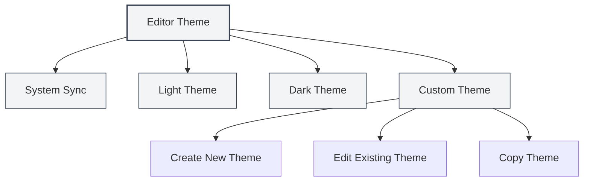
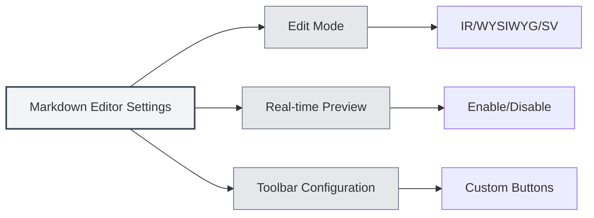

# Configurações do Editor

## Visão Geral

As configurações do editor permitem personalizar a aparência e o comportamento do editor, incluindo tema, fonte, exibição de números de linha, entre outros. Configurações adequadas podem melhorar sua experiência de edição e produtividade.

As configurações do editor são divididas em configurações globais e configurações específicas do editor. As configurações globais afetam todos os editores, enquanto algumas configurações podem se aplicar apenas a tipos específicos de editores (como editores Markdown ou editores LaTeX).

<MenuItemsDemo mode="demo" :items='[{"id": "settings"}]' />

## Tema do Editor

<MenuItemsDemo mode="demo" :items='[{"id": "settings"}]' />

### Tipos de Tema

O MetaDoc suporta vários modos de tema:

- **Sincronizar com o Sistema**: Segue automaticamente o tema do sistema (claro/escuro)
- **Tema Claro**: Usa sempre o tema claro
- **Tema Escuro**: Usa sempre o tema escuro
- **Tema Personalizado**: Usa configurações de cores personalizadas

### Configurar Tema

<SettingThemeSection mode="demo" />

1.  Abra a página de configurações (clique no menu "Configurações" ou use o atalho de teclado)
2.  Acesse a seção "Configurações de Tema"
3.  Selecione o tema de sua preferência

Você pode acessar as configurações através da barra de menu superior:

Clicar no menu "Configurações" na barra de menu superior abre o painel de configurações, onde você pode configurar opções como tema do editor, tema do conteúdo, tema de código, entre outras.

<MenuItemsDemo mode="demo" :items='[{"id": "settings"}]' />

As configurações de tema entram em vigor imediatamente, sem necessidade de reiniciar o aplicativo.

### Tema Personalizado

<SettingThemeSection mode="demo" />

Você pode criar e editar temas personalizados:

1.  Clique em "Novo Tema" na página de configurações de tema
2.  Defina o nome do tema e as cores do tema
3.  Após salvar, o tema estará disponível para uso

Temas personalizados suportam:

- **Editar**: Modificar o nome e as cores do tema
- **Copiar**: Copiar um tema existente como ponto de partida para um novo tema
- **Excluir**: Remover temas personalizados desnecessários

## Tema do Conteúdo

<SettingThemeSection mode="demo" />

O tema do conteúdo controla o estilo de exibição da área de visualização do documento:

- **Automático**: Seleciona automaticamente com base no tema global
- **Claro**: Usa sempre o estilo de visualização claro
- **Escuro**: Usa sempre o estilo de visualização escuro

O tema do conteúdo afeta principalmente a exibição da visualização Markdown e da visualização PDF.

## Tema de Código

<SettingThemeSection mode="demo" />

O tema de código controla o estilo de realce de sintaxe dos blocos de código:

- **Automático**: Seleciona automaticamente com base no tema global
- **Temas Pré-definidos**: Escolha entre temas de código pré-definidos (como GitHub, Monokai, Solarized, etc.)

O tema de código afeta:

- O realce de sintaxe dos blocos de código Markdown
- O realce de sintaxe do editor LaTeX
- O estilo de exibição da saída do console

## Configurações de Fonte

<SettingBasicSection mode="demo" />

### Fonte do Editor

A fonte usada pelo editor pode ser configurada nas configurações do sistema. Por padrão, são usadas fontes monoespacadas, como:

- JetBrains Mono
- Consolas
- Courier New
- Microsoft YaHei Mono

### Tamanho da Fonte

- **Aumentar**: Use `Ctrl+=` ou `Ctrl+Roda do mouse para cima`
- **Diminuir**: Use `Ctrl+-` ou `Ctrl+Roda do mouse para baixo`
- **Redefinir**: Use `Ctrl+0` para redefinir para o tamanho padrão

O ajuste do tamanho da fonte entra em vigor imediatamente, mas não é salvo nas configurações.

## Exibição de Números de Linha

<SettingBasicSection mode="demo" />

### Mostrar/Ocultar Números de Linha

A configuração de exibição de números de linha controla se o editor exibe ou não os números de linha:

- **Habilitar**: Mostra números de linha, facilitando a localização no código
- **Desabilitar**: Oculta números de linha, proporcionando uma área de edição maior

### Configurar Exibição de Números de Linha

1.  Abra a página de configurações
2.  Encontre "Exibição de Números de Linha" na seção "Configurações do Editor"
3.  Alterne o interruptor para habilitar ou desabilitar os números de linha

A configuração de números de linha afeta:

- O editor LaTeX
- O editor de texto simples
- A área de visualização de código

Observação: A exibição de números de linha no editor Markdown (Vditor) é controlada por sua própria configuração.

## Exibição do Minimapa

O minimapa é uma miniatura do código localizada à direita do editor, ajudando você a navegar e localizar rapidamente o conteúdo do documento.

### Mostrar/Ocultar Minimapa

Configuração de exibição do minimapa:

- **Habilitar**: Mostra o minimapa, facilitando a navegação em documentos longos
- **Desabilitar**: Oculta o minimapa, proporcionando uma área de edição maior

### Configurar Minimapa

A configuração do minimapa geralmente está no menu de contexto (botão direito) ou na barra de ferramentas do editor:

1.  Clique com o botão direito no editor
2.  Procure a opção "Minimapa" ou "Minimap"
3.  Alterne o estado de exibição

A funcionalidade do minimapa é aplicável principalmente a:

- Editor LaTeX (Monaco)
- Editor de texto simples (Monaco)

## Configurações Específicas do Editor

### Configurações do Editor Markdown

Configurações específicas do editor Markdown (Vditor):

- **Modo de Edição**: Modo IR, Modo WYSIWYG, Modo SV
- **Visualização em Tempo Real**: Habilitar/desabilitar a visualização em tempo real
- **Configuração da Barra de Ferramentas**: Personalizar os botões da barra de ferramentas

Consulte [[markdown.editor|Guia de Uso do Editor Markdown]] para mais detalhes.

### Configurações do Editor LaTeX

Configurações específicas do editor LaTeX (Monaco):

- **Recolhimento de Código (Folding)**: Habilitar/desabilitar o recolhimento de código
- **Quebra de Linha Automática**: Controla como linhas longas são exibidas
- **Verificação de Sintaxe**: Habilitar/desabilitar a verificação de sintaxe LaTeX

Consulte [[latex.editor|Guia de Uso do Editor LaTeX]] para mais detalhes.

## Sincronização de Configurações

As configurações do editor são salvas na configuração local, incluindo:

- Seleção de tema
- Preferência de exibição de números de linha
- Tamanho da fonte (sessão atual)
- Estado de exibição do minimapa

As configurações são restauradas automaticamente após reiniciar o aplicativo.

## Referência de Atalhos de Teclado

### Ajuste de Fonte

| Operação               | Windows/Linux | macOS        |
| ---------------------- | ------------- | ------------ |
| Aumentar fonte         | `Ctrl+=`      | `Cmd+=`      |
| Diminuir fonte         | `Ctrl+-`      | `Cmd+-`      |
| Redefinir fonte        | `Ctrl+0`      | `Cmd+0`      |
| Zoom com roda do mouse | `Ctrl+Roda`   | `Cmd+Roda`   |

## Melhores Práticas

1.  **Seleção de Tema**:

    - Para edição prolongada, recomenda-se usar tema escuro para reduzir a fadiga ocular
    - Para visualização de impressão, use tema claro para obter melhores resultados de impressão

2.  **Exibição de Números de Linha**:

    - Ao escrever código, recomenda-se habilitar números de linha para facilitar a localização de erros
    - Ao editar texto simples, você pode desativar os números de linha para obter uma área de edição maior

3.  **Minimapa**:

    - Ao editar documentos longos, habilite o minimapa para navegar rapidamente pela estrutura do documento
    - Ao editar documentos curtos, você pode desativar o minimapa

4.  **Tamanho da Fonte**:
    - Ajuste o tamanho da fonte de acordo com o tamanho da tela e seu hábito pessoal
    - Recomenda-se usar tamanho de fonte entre 14-16px para equilibrar legibilidade e espaço na tela

## Observações Importantes

1.  **Sincronização de Tema**: Ao selecionar "Sincronizar com o Sistema", o tema alternará automaticamente seguindo as configurações do sistema
2.  **Escopo das Configurações**: Algumas configurações afetam apenas editores específicos e não outros editores
3.  **Impacto no Desempenho**: Habilitar certas funcionalidades (como visualização em tempo real) pode afetar o desempenho da edição
4.  **Tema Personalizado**: As cores de um tema personalizado afetam o esquema de cores de todo o aplicativo

## Documentação Relacionada

- [[core.editor-basics|Operações Básicas do Editor]]
- [[settings.basic|Configurações Básicas]]
- [[settings.theme|Configurações de Tema]]
- [[markdown.editor|Guia de Uso do Editor Markdown]]
- [[latex.editor|Guia de Uso do Editor LaTeX]]