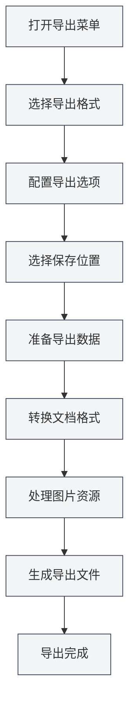

# Funcionalidade de Exportação

## Visão Geral

O MetaDoc suporta a exportação de documentos para vários formatos, incluindo PDF, HTML, DOCX, LaTeX, Markdown, JSON, entre outros. A funcionalidade de exportação oferece diferentes opções dependendo do formato do documento, garantindo que o documento exportado mantenha a formatação e o estilo originais.

A funcionalidade de exportação inclui automaticamente as metainformações do documento (título, autor, descrição, palavras-chave) e processa elementos como imagens, tabelas, fórmulas matemáticas, etc., durante o processo de exportação.

<MenuItemsDemo mode="demo" :items='[{"id": "file", "items": ["export"]}]' />

<MetaInfoPanel mode="demo" :meta='{"title": "导出示例", "author": "作者", "description": "文档描述", "keywords": ["导出", "PDF"]}' :outlineJson='""' />

<MenuItemsDemo mode="demo" :items='[{"id": "file", "items": ["export"]}]' />

<MetaInfoPanel mode="demo" :meta='{"title": "导出格式", "author": "MetaDoc", "description": "支持的导出格式介绍", "keywords": ["导出", "格式"]}' :outlineJson='""' />

## Formatos de Exportação Suportados

<MenuItemsDemo mode="demo" :items='[{"id": "file", "items": ["export"]}]' />

### Exportação de Documentos Markdown

Documentos Markdown (`.md`) podem ser exportados para os seguintes formatos:

- **PDF**: Adequado para impressão e compartilhamento
- **HTML**: Adequado para exibição na web
- **DOCX**: Adequado para edição no Word
- **LaTeX**: Adequado para artigos acadêmicos
- **JSON**: Adequado para processamento por programas

<MetaInfoPanel mode="demo" :meta='{"title": "LaTeX导出", "author": "系统", "description": "LaTeX文档导出选项", "keywords": ["LaTeX", "导出"]}' :outlineJson='""' /

### Exportação de Documentos LaTeX

Documentos LaTeX (`.tex`) podem ser exportados para os seguintes formatos:

- **PDF**: Gerado através da compilação LaTeX
- **Markdown**: Convertido para o formato Markdown
- **HTML**: Convertido para o formato HTML
- **DOCX**: Convertido para o formato Word

<MenuItemsDemo mode="demo" :items='[{"id": "file", "items": ["export"]}]' /

### Exportação de Documentos JSON

Documentos JSON (`.json`) podem ser exportados como:

- **JSON**: Mantém o formato JSON

## Operações de Exportação

### Exportação Básica

1. **Abra o menu de exportação**:
   - Clique em "Arquivo" → "Exportar" na barra de menus
   - Ou use o atalho de teclado (se configurado)

As opções de exportação no menu Arquivo são as seguintes:

<MenuItemsDemo mode="demo" :items='[{"id": "file", "items": ["export"]}]' />

2. **Selecione o formato de exportação**:

   - No menu de exportação, escolha o formato de destino
   - O sistema exibirá as opções de exportação disponíveis com base no formato do documento atual

3. **Selecione o local de salvamento**:

   - No diálogo de salvamento de arquivo, escolha o local de salvamento
   - Digite o nome do arquivo (o sistema adicionará automaticamente a extensão correta)

4. **Aguarde a conclusão da exportação**:
   - Uma barra de progresso será exibida durante a exportação
   - Uma mensagem de sucesso será exibida após a conclusão da exportação

### Exportação Rápida

Para formatos comuns, você pode usar atalhos de teclado para exportar rapidamente:

- **Exportar para PDF**: `Ctrl+Shift+E` (se configurado)
- **Exportar para HTML**: Através da seleção no menu

## Detalhes da Exportação Markdown

<MenuItemsDemo mode="demo" :items='[{"id": "file", "items": ["export"]}]' />

### Exportar para PDF

A exportação para PDF converte Markdown para o formato PDF:

- **Conteúdo incluído**: Corpo do documento, imagens, tabelas, fórmulas matemáticas
- **Metainformações incluídas**: Título, autor, descrição, palavras-chave
- **Estilo**: Usa estilos específicos para PDF, adequados para impressão
- **Processamento de imagens**: As imagens são redimensionadas automaticamente para se ajustarem à página

**Cenários de uso**:

- Imprimir documentos
- Compartilhar documentos com outras pessoas
- Arquivo e preservação

### Exportar para HTML

<MetaInfoPanel mode="demo" :meta='{"title": "HTML导出", "author": "系统", "description": "HTML导出设置和选项", "keywords": ["HTML", "导出"]}' :outlineJson='""' />

A exportação para HTML converte Markdown para o formato de página web:

- **Conteúdo incluído**: Corpo do documento, imagens, tabelas, fórmulas matemáticas
- **Metainformações incluídas**: Título, autor, descrição, palavras-chave (nas tags meta do HTML)
- **Estilo**: Usa estilos HTML, adequados para exibição na web
- **Processamento de imagens**: Você pode escolher manter a URL original, converter para base64 ou salvar em uma pasta

**Cenários de uso**:

- Publicar em um site
- Visualizar no navegador
- Compartilhar com outras pessoas

### Exportar para DOCX

<MenuItemsDemo mode="demo" :items='[{"id": "file", "items": ["export"]}]' />

A exportação para DOCX converte Markdown para o formato Word:

- **Conteúdo incluído**: Corpo do documento, imagens, tabelas, fórmulas matemáticas
- **Metainformações incluídas**: Título, autor, descrição, palavras-chave (nas propriedades do documento Word)
- **Estilo**: Usa estilos do Word, permitindo edição posterior no Word
- **Processamento de imagens**: As imagens são incorporadas ao documento Word

**Cenários de uso**:

- Edição posterior no Word
- Colaboração e edição com outras pessoas
- Submissão de documentos

### Exportar para LaTeX

<MetaInfoPanel mode="demo" :meta='{"title": "LaTeX导出", "author": "学术", "description": "Markdown转LaTeX导出", "keywords": ["LaTeX", "学术"]}' :outlineJson='""' />

A exportação para LaTeX converte Markdown para o formato LaTeX:

- **Conteúdo incluído**: Corpo do documento, imagens, tabelas, fórmulas matemáticas
- **Metainformações incluídas**: Título, autor, descrição, palavras-chave (no documento LaTeX)
- **Conversão de formato**: A sintaxe Markdown é convertida para os comandos LaTeX correspondentes
- **Fórmulas matemáticas**: Mantém o formato LaTeX para fórmulas matemáticas

**Cenários de uso**:

- Redação de artigos acadêmicos
- Cenários que requerem o formato LaTeX
- Edição posterior de documentos LaTeX

### Exportar para JSON

<MenuItemsDemo mode="demo" :items='[{"id": "file", "items": ["export"]}]' />

A exportação para JSON salva o documento no formato JSON:

- **Conteúdo incluído**: Todos os dados do documento (conteúdo, metainformações, estrutura, etc.)
- **Formato**: Dados JSON estruturados
- **Finalidade**: Processamento por programas, backup de dados

## Detalhes da Exportação LaTeX

<MetaInfoPanel mode="demo" :meta='{"title": "LaTeX导出详解", "author": "系统", "description": "LaTeX文档导出详细说明", "keywords": ["LaTeX", "PDF", "导出"]}' :outlineJson='""' />

### Exportar para PDF

A exportação de documentos LaTeX para PDF requer compilação LaTeX:

1. **Compilar LaTeX**: O sistema compila automaticamente o documento LaTeX
2. **Gerar PDF**: Após a compilação bem-sucedida, o arquivo PDF é gerado
3. **Incluir metainformações**: As propriedades do documento PDF incluem as metainformações

**Atenção**:

- É necessário instalar uma distribuição LaTeX (como TeX Live)
- A compilação pode levar algum tempo
- Se a compilação falhar, informações de erro serão exibidas

### Exportar para Markdown

Documentos LaTeX podem ser convertidos para o formato Markdown:

- **Conversão de formato**: Comandos LaTeX são convertidos para a sintaxe Markdown
- **Fórmulas matemáticas**: Fórmulas LaTeX são convertidas para o formato de fórmulas matemáticas do Markdown
- **Tabelas**: Tabelas LaTeX são convertidas para tabelas Markdown

### Exportar para HTML

Documentos LaTeX podem ser convertidos para o formato HTML:

- **Conversão de formato**: Comandos LaTeX são convertidos para tags HTML
- **Fórmulas matemáticas**: Renderizadas usando MathJax ou KaTeX
- **Estilo**: Exibido usando estilos HTML

### Exportar para DOCX

Documentos LaTeX podem ser convertidos para o formato Word:

- **Conversão de formato**: Comandos LaTeX são convertidos para o formato Word
- **Fórmulas matemáticas**: Convertidas para o formato de fórmulas matemáticas do Word
- **Tabelas**: Convertidas para o formato de tabelas do Word

## Configuração das Opções de Exportação

### Opções de Processamento de Imagens

Durante a exportação, você pode configurar como as imagens são processadas:

- **Manter URL original**: Mantém a URL original da imagem (adequado para exportação HTML)
- **Converter para Base64**: Incorpora a imagem no documento (adequado para exportação HTML, DOCX)
- **Salvar em pasta**: Salva a imagem em uma pasta especificada (adequado para exportação HTML)

### Opções de Exportação PDF

A exportação para PDF suporta as seguintes opções:

- **Tamanho da página**: A4, Letter, etc.
- **Margens**: Margens personalizadas
- **Fonte**: Selecionar fonte e tamanho da fonte
- **Qualidade da imagem**: Ajustar a qualidade da imagem

### Opções de Exportação HTML

A exportação para HTML suporta as seguintes opções:

- **Estilo**: Escolher um tema de estilo HTML
- **Renderização de fórmulas matemáticas**: Escolher MathJax ou KaTeX
- **Realce de sintaxe**: Habilitar ou desabilitar o realce de sintaxe para código

## Progresso da Exportação

Uma barra de progresso é exibida durante o processo de exportação:

- **Fase de preparação**: Preparar os dados para exportação
- **Fase de conversão**: Converter o formato do documento
- **Processamento de imagens**: Processar as imagens no documento
- **Geração do arquivo**: Gerar o arquivo final

Se a exportação demorar muito, você pode:

- **Verificar o progresso**: Ver o progresso atual na barra de progresso
- **Cancelar a exportação**: Clicar no botão "Cancelar" para interromper a operação de exportação

## Nomeação dos Arquivos Exportados

Os arquivos exportados são nomeados automaticamente:

- **Nome padrão**: Usa o título do documento ou o nome do arquivo
- **Extensão automática**: A extensão correta é adicionada automaticamente de acordo com o formato de exportação
- **Nome personalizado**: Você pode escolher um nome personalizado no diálogo de salvamento

## Dicas de Uso

### Escolher o Formato Adequado

- **PDF**: Adequado para impressão e compartilhamento formal
- **HTML**: Adequado para exibição na web e visualização online
- **DOCX**: Adequado para cenários que requerem edição posterior
- **LaTeX**: Adequado para redação acadêmica e cenários que requerem o formato LaTeX

### Recomendações para Processamento de Imagens

- **Exportação HTML**: Se for exibir na web, recomenda-se usar Base64 ou salvar em uma pasta
- **Exportação DOCX**: As imagens são incorporadas automaticamente, não requer processamento adicional
- **Exportação PDF**: As imagens são redimensionadas automaticamente para garantir que se ajustem à página

### Exportação em Lote

Se precisar exportar vários documentos:

1. Abra cada documento individualmente
2. Exporte cada um para o formato desejado
3. Ou use scripts para processamento em lote (usuários avançados)

## Perguntas Frequentes

### P: O que fazer se a exportação falhar?

R: Verifique se o documento contém erros e certifique-se de que todas as imagens e recursos estão acessíveis. Se a exportação para PDF falhar, verifique se há erros na compilação LaTeX.

### P: O formato do PDF exportado está incorreto?

R: Verifique as configurações das opções de exportação PDF, ajuste o tamanho da página e as margens. Certifique-se de que o conteúdo do documento está formatado corretamente.

### P: As imagens não são exibidas após a exportação?

R: Verifique se o caminho das imagens está correto e se os arquivos de imagem existem. Para exportação HTML, escolha o método de processamento de imagens adequado.

### P: Posso personalizar o estilo de exportação?

R: Alguns formatos suportam personalização de estilo, que pode ser configurada nas opções de exportação. As exportações para PDF e HTML suportam personalização de estilo.

### P: A exportação inclui as metainformações?

R: Sim, as metainformações do documento (título, autor, descrição, palavras-chave) são incluídas automaticamente durante a exportação e exibidas nas propriedades do documento exportado.

## Documentação Relacionada

- [[core.file-operations|Operações de Arquivo]]
- [[core.document-metadata|Metainformações do Documento]]
- [[markdown.basics|Sintaxe Markdown]]
- [[latex.basics|Sintaxe LaTeX]]
- [[latex.compilation|Compilação e Visualização LaTeX]]