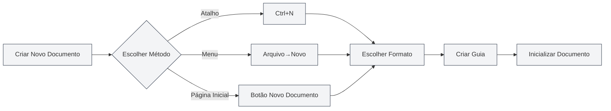
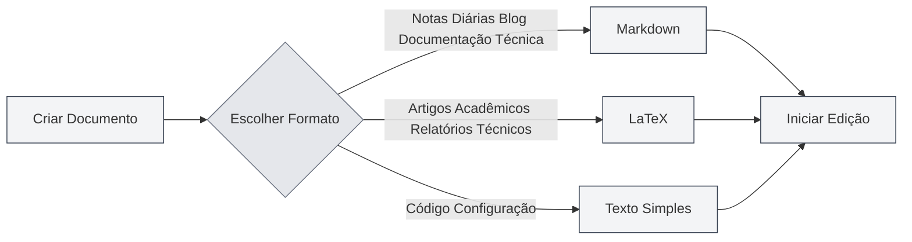
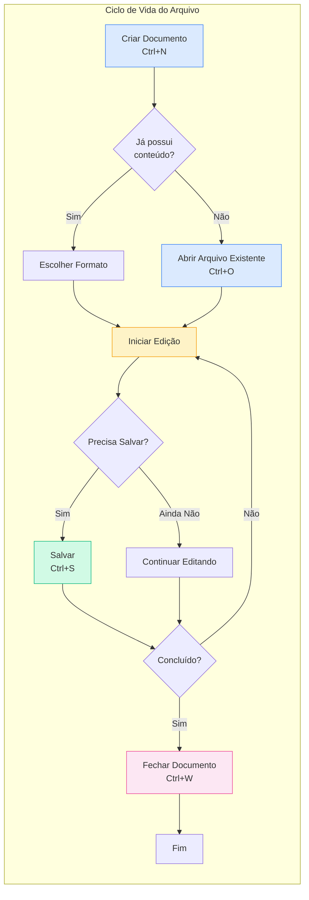

# Operações com Arquivos

## Visão Geral

A operação de arquivos é uma função fundamental do MetaDoc. Seja você redigindo documentação técnica, artigos acadêmicos ou anotando notas diárias, dominar as operações com arquivos pode tornar o processo de criação mais suave. Este artigo detalha como criar, abrir, salvar e gerenciar documentos.

## Criar Novo Documento

<MainTabs mode="demo" />

<MenuItemsDemo mode="demo" :items='[{"id": "file", "items": ["new"]}]' />

### Criar Documento em Branco

O MetaDoc oferece várias maneiras convenientes de criar um novo documento. Você pode escolher o método mais adequado de acordo com seus hábitos atuais:

**Método 1: Atalho de Teclado (Mais Rápido)**

- Pressione `Ctrl+N` para criar um novo documento imediatamente.
- Ideal para criar rapidamente um novo documento durante a edição.

**Método 2: Menu Arquivo**

- Clique no ícone "Arquivo" na barra de menu à esquerda.
- Selecione "Novo" no menu expandido.

**Método 3: Entrada na Página Inicial**

- Clique no botão "Novo Documento" na página inicial.
- Ideal para começar a criar logo após abrir o aplicativo.

Abaixo está a interface do menu Arquivo, que inclui operações comuns como Novo, Abrir, Salvar, etc.:

<MenuItemsDemo mode="demo" :items='[{"id": "file", "items": ["new", "open", "save", "save-as", "save-all", "close"]}]' />

<MainTabs mode="demo" />

**Estado Após a Criação do Documento**:

Após criar um novo documento, você verá:

- Uma nova guia aparecerá no topo, com o título mostrando "Sem título".
- O sistema solicitará que você escolha o formato do documento (Markdown, LaTeX ou Texto Simples).
- Neste momento, o documento está apenas na memória; é necessário salvá-lo para mantê-lo no disco.

### Escolher o Formato do Documento

Ao criar um documento, você precisa escolher seu formato. Diferentes formatos são adequados para diferentes cenários:

**Markdown (.md)** — O formato leve mais comum

- Adequado para: Notas diárias, posts de blog, documentação técnica, documentação de projetos.
- Vantagens: Sintaxe simples, fácil leitura, rica variedade de formatos de exportação.
- Exemplo de uso: Registrar pontos de reunião, escrever blog técnico, organizar anotações de estudo.

**LaTeX (.tex)** — Formato profissional para editoração acadêmica

- Adequado para: Artigos acadêmicos, teses, relatórios técnicos, documentos matemáticos.
- Vantagens: Diagramação refinada, suporte completo a fórmulas, geração automática de sumário e citações.
- Exemplo de uso: Redigir artigos de pesquisa, escrever livros didáticos de matemática, preparar apresentações acadêmicas.

**Texto Simples (.txt)** — O formato de texto mais simples

- Adequado para: Trechos de código, arquivos de configuração, notas temporárias.
- Vantagens: Alta compatibilidade, pode ser aberto por qualquer editor.
- Exemplo de uso: Salvar trechos de código, registrar informações temporárias.

## Abrir Documento

<MenuItemsDemo mode="demo" :items='[{"id": "file", "items": ["open"]}]' />

### Abrir Arquivo Existente

1.  **Método por Atalho**: Pressione `Ctrl+O` para abrir a caixa de diálogo de seleção de arquivo.
2.  **Método por Menu**: Clique em "Arquivo" → "Abrir".
3.  **Método pela Página Inicial**: Clique no botão "Abrir Arquivo" na página inicial.

### Formatos de Arquivo Suportados

O MetaDoc suporta a abertura dos seguintes formatos de arquivo:

-   `.md` - Documentos Markdown
-   `.tex` - Documentos LaTeX
-   `.txt` - Arquivos de texto simples
-   `.json` - Arquivos no formato JSON

### Lista de Arquivos Recentes

A página inicial exibe uma lista dos documentos abertos recentemente, facilitando o acesso rápido:

-   Clique no cartão de um documento recente para abri-lo rapidamente.
-   Clique com o botão direito para excluir um registro de documento recente.
-   Exibe no máximo 12 documentos recentes.

### Associação de Arquivos

O MetaDoc suporta a associação de arquivos:

-   Clicar duas vezes em um arquivo `.md` ou `.tex` no sistema o abrirá automaticamente com o MetaDoc.
-   Se o arquivo já estiver aberto em outra janela, você será notificado de que o arquivo já está aberto em outra janela.

## Salvar Documento

<MenuItemsDemo mode="demo" :items='[{"id": "file", "items": ["save", "save-as", "save-all"]}]' />

### Salvar Documento Atual

Cultivar o bom hábito de salvar frequentemente pode evitar a perda do trabalho devido a imprevistos.

**Métodos de Salvamento**:

-   **Atalho** (Recomendado): `Ctrl+S` — O método de salvamento mais comum, sem tirar as mãos do teclado.
-   **Operação por Menu**: Clique no menu "Arquivo" → "Salvar".

**Primeiro Salvamento**:
Se o documento for novo, na primeira vez que salvar, a caixa de diálogo "Salvar Como" será exibida. Você precisará:

1.  Escolher o local de salvamento (por exemplo, pasta "Documentos").
2.  Inserir o nome do arquivo (por exemplo, "plano-do-projeto.md").
3.  Clicar no botão "Salvar".

**Salvamento de Atualização para Documento Já Salvo**:
Se o documento já foi salvo anteriormente, pressionar `Ctrl+S` substituirá diretamente o arquivo original, sem exibir uma caixa de diálogo.

### Salvar Como — Criar uma Cópia do Documento

Use a função "Salvar Como" quando precisar manter o documento original enquanto cria uma nova versão.

**Cenários de Uso**:

-   Criar uma cópia de backup antes de modificar um documento.
-   Salvar o documento em um local diferente.
-   Salvar diferentes versões do documento com nomes diferentes.

**Métodos de Operação**:

-   **Atalho**: `Ctrl+Shift+S`
-   **Menu**: Clique em "Arquivo" → "Salvar Como"

**Exemplo**:
Você está editando "relatorio-v1.md" e deseja salvar um backup antes de fazer grandes alterações:

1.  Pressione `Ctrl+Shift+S`
2.  Insira o novo nome de arquivo "relatorio-v1_backup.md"
3.  Clique em Salvar
4.  Continue editando o documento original e faça as alterações com tranquilidade.

### Salvar Tudo — Salvar Todos os Documentos de Uma Vez

Quando você tem vários documentos abertos simultaneamente, pode usar a função "Salvar Tudo" para salvar todos os documentos de uma vez.

**Métodos de Operação**:

-   **Atalho**: `Ctrl+K S` (Pressione `Ctrl+K` primeiro, depois `S`)
-   **Menu**: Clique em "Arquivo" → "Salvar Tudo"

**Cenários de Uso**:

-   Salvar rapidamente todos os documentos abertos ao final do trabalho.
-   Garantir que todas as alterações sejam salvas.

### Salvamento Automático — Deixe o Sistema Salvar para Você

O MetaDoc suporta a função de salvamento automático, que pode salvar documentos automaticamente enquanto você se concentra na criação.

**Método de Configuração**:
Acesse [[settings.basic|Configurações Básicas]], encontre a opção "Salvamento Automático" e escolha um intervalo de tempo adequado:

-   **Desativado**: Controle manual do momento de salvamento.
-   **1 minuto**: Mais seguro, mas aumenta a escrita no disco.
-   **5 minutos**: Solução equilibrada (Recomendado).
-   **10 minutos/30 minutos/1 hora**: Adequado para documentos longos, reduz a frequência de salvamento.

**Princípio de Funcionamento**:

-   O salvamento automático ocorre silenciosamente em segundo plano, sem interromper sua edição.
-   Durante o salvamento automático, o indicador "Não salvo" na guia desaparece.
-   Você pode salvar manualmente a qualquer momento (`Ctrl+S`), sem ser afetado pelo salvamento automático.

**Recomendações**:

-   Para documentos importantes, recomenda-se ativar o salvamento automático de 5 minutos.
-   Mesmo com o salvamento automático ativado, ainda é recomendável salvar manualmente em pontos-chave (como ao concluir um capítulo).

## Fechar Arquivo

<MainTabs mode="demo" />

### Fechar Guia Atual

-   **Atalho**: `Ctrl+W`
-   **Clicar no Botão de Fechar da Guia**: Clique no botão × à direita da guia.

### Aviso Antes de Fechar

Se o documento tiver alterações não salvas, você será avisado ao tentar fechá-lo:

-   **Salvar**: Salva as alterações e fecha.
-   **Não Salvar**: Descarta as alterações e fecha diretamente.
-   **Cancelar**: Cancela a operação de fechamento.

### Reabrir Guia Fechada

-   **Atalho**: `Ctrl+Shift+T`

Permite restaurar guias fechadas recentemente (até 20 guias podem ser restauradas).

## Gerenciamento de Múltiplas Guias

<MainTabs mode="demo" />

O MetaDoc suporta a abertura simultânea de vários documentos, cada um exibido em uma guia independente:

A barra de guias exibe todos os documentos abertos e suporta operações como alternar, fechar, arrastar, etc.:

<MainTabs mode="demo" />

-   **Alternar Guias**: Use `Ctrl+Tab` para ir para a próxima guia, `Ctrl+Shift+Tab` para a anterior.
-   **Reordenar por Arrastar**: Arraste uma guia para reordená-la.
-   **Fixar Guia**: Clique com o botão direito na guia e selecione "Fixar". Guias fixadas são sempre exibidas à esquerda e não podem ser fechadas.

Para mais operações com guias, consulte [[core.multi-tab|Gerenciamento de Múltiplas Guias]].

## Indicador de Status do Arquivo

A guia exibe o status do documento:

-   **Não Salvo**: Um ponto (●) é exibido ao lado do título da guia, indicando alterações não salvas.
-   **Salvo**: Nenhuma marcação especial.
-   **Somente Leitura**: Exibe um ícone de cadeado, indicando que o arquivo está no modo somente leitura.

## Considerações Importantes

1.  **Caminho do Arquivo**: Ao salvar um arquivo, certifique-se de ter espaço suficiente em disco e permissões de gravação.
2.  **Formato do Arquivo**: Ao salvar, preste atenção na escolha do formato de arquivo adequado para evitar incompatibilidades.
3.  **Backup**: Para documentos importantes, recomenda-se fazer backups periódicos. Você pode usar a função "Salvar Como" para criar cópias.
4.  **Conflito de Arquivos**: Se um arquivo for modificado externamente, o MetaDoc detectará e solicitará que você resolva o conflito.

## Documentação Relacionada

-   [[core.editor-basics|Operações Básicas do Editor]]
-   [[core.multi-tab|Gerenciamento de Múltiplas Guias]]
-   [[core.document-metadata|Metadados do Documento]]
-   [[core.export|Funcionalidade de Exportação]]
-   [[settings.basic|Configurações Básicas]]