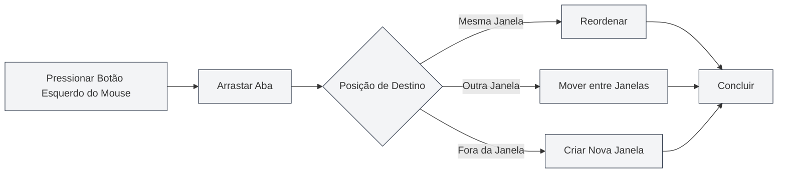

# Gerenciamento de Múltiplas Abas

## Visão Geral

O MetaDoc suporta o gerenciamento de múltiplas abas, permitindo que você abra vários documentos simultaneamente, cada um exibido em uma aba independente. Dominar as operações de abas pode melhorar significativamente sua produtividade.

O gerenciamento de abas inclui funções como criar, alternar, fechar, ordenar por arrastar, fixar e mais, permitindo que você organize e gerencie vários documentos de forma flexível.

<MainTabs mode="demo" />

<AIChat mode="demo" />

<KnowledgeBase mode="demo" />

<ProofreadView mode="demo" />

<GraphWindow mode="demo" />

<OcrWindow mode="demo" />

<DataAnalysisWindow mode="demo" />

<AgentView mode="demo" />

<MenuItemsDemo mode="demo" :items='[{"id": "file", "items": ["new", "open", "save"]}]' />

<ViewMenuItemsDemo mode="demo" :items='["editor", "outline"]' />

<Outline mode="demo" />

<ResizableDivider mode="demo" />

<TitleMenu mode="demo" title="Exemplo de Aba" :position='{"top": 100, "left": 200}' path="1" :tree='{}' />

## Criar Nova Aba

### Criar uma Nova Aba

Existem várias maneiras de criar uma nova aba:

1.  **Atalho de Teclado**: Pressione `Ctrl+T` para criar rapidamente uma nova aba.
2.  **Botão de Clique**: Clique no botão "+" no lado direito da barra de abas.
3.  **Menu**: Clique em "Arquivo" → "Novo".

A barra de abas exibe todos os documentos abertos e suporta operações como criar, alternar e fechar:

<MainTabs mode="demo" />

A nova aba abrirá um documento em branco, onde você pode escolher o formato do documento (Markdown/LaTeX/Texto Simples).

### Criar Aba a partir de um Arquivo

Abrir um arquivo criará automaticamente uma nova aba:

1.  **Atalho de Teclado**: Pressione `Ctrl+O` para abrir a caixa de diálogo de seleção de arquivo.
2.  **Menu**: Clique em "Arquivo" → "Abrir".
3.  **Página Inicial**: Clique no botão "Abrir Arquivo" na página inicial.

O arquivo aberto será exibido em uma nova aba.

## Alternar entre Abas

### Alternar com Atalhos de Teclado

-   **Próxima Aba**: `Ctrl+Tab` alterna para a próxima aba.
-   **Aba Anterior**: `Ctrl+Shift+Tab` alterna para a aba anterior.

A alternância é cíclica; ao chegar na última aba, retorna automaticamente para a primeira.

### Alternar com o Mouse

-   **Clicar na Aba**: Clique diretamente no título da aba para alternar para ela.
-   **Roda do Mouse**: Role a roda do mouse sobre a barra de abas para alternar entre elas.
    -   **Rolar para Baixo**: Alterna para a próxima aba.
    -   **Rolar para Cima**: Alterna para a aba anterior.

### Indicador de Alternância de Abas

Ao usar atalhos de teclado para alternar abas, um indicador de alternância é exibido, mostrando a aba atualmente selecionada, facilitando a localização rápida.

## Fechar Abas

### Fechar a Aba Atual

-   **Atalho de Teclado**: `Ctrl+W` fecha a aba ativa no momento.
-   **Botão de Fechar**: Clique no botão × no lado direito da aba.
-   **Clique com Botão do Meio**: Clique com o botão do meio do mouse na aba para fechá-la.

### Aviso Antes de Fechar

Se o documento em uma aba tiver alterações não salvas, um aviso será exibido ao tentar fechá-la:

-   **Salvar**: Salva as alterações e fecha a aba.
-   **Não Salvar**: Descarta as alterações e fecha a aba diretamente.
-   **Cancelar**: Cancela a operação de fechamento e continua a edição.

### Reabrir Abas Fechadas

-   **Atalho de Teclado**: `Ctrl+Shift+T` reabre a aba fechada mais recentemente.

O sistema salva as últimas 20 abas fechadas, e você pode restaurá-las na ordem inversa em que foram fechadas.

## Arrastar Abas

### Reordenar

Você pode arrastar abas para alterar sua ordem:

1.  **Pressionar Botão Esquerdo do Mouse**: Pressione e segure o botão esquerdo do mouse no título da aba.
2.  **Arrastar**: Arraste a aba para a posição desejada.
3.  **Soltar**: Solte o botão esquerdo do mouse para concluir a ordenação.

Durante o arrasto, haverá um feedback visual mostrando a posição de destino da aba.

### Arrastar entre Janelas

As abas podem ser arrastadas para outras janelas:

1.  **Arrastar a Aba**: Pressione e segure o botão esquerdo do mouse e arraste a aba.
2.  **Mover para Outra Janela**: Arraste a aba para outra janela do MetaDoc.
3.  **Soltar**: Solte o mouse na janela de destino; a aba será movida para essa janela.

Arrastar entre janelas permite organizar documentos de forma flexível entre várias janelas.

### Criar Nova Janela

Arrastar uma aba para fora de uma janela cria uma nova janela:

1.  **Arrastar a Aba**: Pressione e segure o botão esquerdo do mouse e arraste a aba.
2.  **Mover para Fora da Janela**: Arraste a aba para fora da janela atual.
3.  **Soltar**: Solte o mouse; o sistema criará uma nova janela e abrirá a aba nela.

## Fixar Abas

### Fixar uma Aba

Fixar uma aba a mantém sempre visível no extremo esquerdo da barra de abas e impede seu fechamento:

-   **Duplo Clique na Aba**: Dê um duplo clique no título da aba para fixá-la.
-   **Menu de Contexto**: Clique com o botão direito na aba e selecione "Fixar".

Uma aba fixada:

-   É exibida no extremo esquerdo da barra de abas.
-   Mostra um ícone de cadeado.
-   Não pode ser fechada pelos métodos normais.
-   Não pode ser movida por arrasto.

### Desfixar uma Aba

-   **Menu de Contexto**: Clique com o botão direito na aba fixada e selecione "Desfixar".

Após desfixar, a aba retorna ao estado normal, podendo ser fechada e arrastada novamente.

## Status da Aba

### Status Não Salvo

A aba exibe o status de salvamento do documento:

-   **Não Salvo**: Um ponto (●) é exibido ao lado do título da aba, indicando alterações não salvas.
-   **Salvo**: Nenhuma marcação especial.

### Status Somente Leitura

Se um documento for somente leitura, a aba exibirá um ícone de cadeado:

-   **Documento Somente Leitura**: Exibe um ícone de cadeado, indicando que o documento não pode ser editado.
-   **Documento Editável**: Nenhuma marcação especial.

### Status de Visualização

Abas em status de visualização:

-   **Modo de Visualização**: Arquivos abertos com um clique são exibidos no modo de visualização.
-   **Duplo Clique para Ativar**: Dê um duplo clique na aba de visualização para ativá-la como uma aba regular.
-   **Ativação Automática**: É ativada automaticamente após edição ou mudança de visualização.

## Menu de Contexto da Aba

Clicar com o botão direito em uma aba exibe um menu de contexto com as seguintes operações:

-   **Fechar**: Fecha a aba atual.
-   **Fechar Outras**: Fecha todas as abas exceto a atual.
-   **Fechar à Direita**: Fecha todas as abas à direita da aba atual.
-   **Fixar/Desfixar**: Fixa ou desfixa a aba.
-   **Mover para Nova Janela**: Move a aba para uma nova janela.
-   **Copiar Caminho**: Copia o caminho do documento para a área de transferência.

## Limite de Número de Abas

O MetaDoc não impõe um limite estrito ao número de abas abertas simultaneamente, mas recomenda-se:

-   **Número Razoável**: Manter entre 10 e 20 abas abertas é razoável.
-   **Impacto no Desempenho**: Abrir muitas abas pode afetar o desempenho do aplicativo.
-   **Uso de Memória**: Cada aba consome uma certa quantidade de memória.

Se houver muitas abas, é recomendável fechar as que não são necessárias.

## Referência de Atalhos de Teclado

### Atalhos para Operações de Abas

| Operação               | Windows/Linux    | macOS           |
| ---------------------- | ---------------- | --------------- |
| Nova Aba               | `Ctrl+T`         | `Cmd+T`         |
| Fechar Aba             | `Ctrl+W`         | `Cmd+W`         |
| Alternar para Próxima  | `Ctrl+Tab`       | `Cmd+Tab`       |
| Alternar para Anterior | `Ctrl+Shift+Tab` | `Cmd+Shift+Tab` |
| Reabrir Fechada        | `Ctrl+Shift+T`   | `Cmd+Shift+T`   |

### Operações com Mouse

| Operação         | Método                           |
| ---------------- | -------------------------------- |
| Alternar Aba     | Clicar no título da aba          |
| Fechar Aba       | Clicar no botão × ou clique meio |
| Fixar Aba        | Duplo clique no título da aba    |
| Ordenar por Arrasto | Pressionar e arrastar com botão esquerdo |
| Alternar com Roda | Rolar a roda do mouse na barra de abas |

## Dicas de Uso

### Organizar Abas

1.  **Fixar Documentos Frequentes**: Fixe documentos usados com frequência para acesso rápido.
2.  **Agrupar por Projeto**: Mantenha documentos relacionados juntos, usando arrasto para organizá-los.
3.  **Usar Múltiplas Janelas**: Coloque documentos de projetos diferentes em janelas separadas.

### Alternação Rápida

1.  **Usar Atalhos de Teclado**: Domine o uso de `Ctrl+Tab` para alternar abas rapidamente.
2.  **Usar a Roda do Mouse**: Role a roda do mouse na barra de abas para navegar rapidamente.
3.  **Usar o Indicador de Alternância**: O indicador é exibido ao usar atalhos, facilitando a localização.

### Operações em Lote

1.  **Fechar Várias Abas**: Use as funções "Fechar Outras" ou "Fechar à Direita" no menu de contexto.
2.  **Salvar Todas as Abas**: Use `Ctrl+K S` para salvar todos os documentos abertos.
3.  **Reabrir**: Use `Ctrl+Shift+T` para restaurar rapidamente abas fechadas.

## Perguntas Frequentes

### P: Como encontrar rapidamente uma aba específica?

R: Use o atalho `Ctrl+Tab`. O indicador de alternância será exibido, mostrando todas as abas. Você pode continuar pressionando Tab para selecionar ou clicar diretamente.

### P: O que fazer se houver muitas abas?

R: Você pode fixar as abas mais usadas, fechar as desnecessárias ou usar múltiplas janelas para agrupar os documentos.

### P: Como recuperar uma aba fechada por engano?

R: Use o atalho `Ctrl+Shift+T` para reabrir a aba fechada mais recentemente.

### P: É possível fechar uma aba fixada?

R: Abas fixadas não podem ser fechadas pelos métodos normais; primeiro é necessário desfixá-las. Clique com o botão direito na aba fixada e selecione "Desfixar".

### P: É possível arrastar abas entre janelas?

R: Sim. Basta arrastar a aba para outra janela do MetaDoc para movê-la para aquela janela.

## Documentos Relacionados

-   [[core.file-operations|Operações com Arquivos]]
-   [[core.multi-window|Gerenciamento de Múltiplas Janelas]]
-   [[core.editor-basics|Operações Básicas do Editor]]
