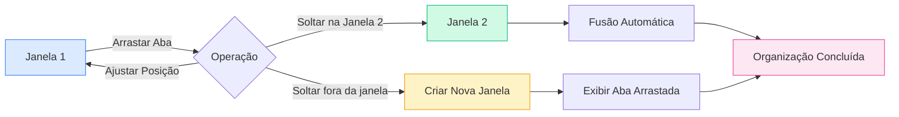

# Gerenciamento de Múltiplas Janelas

## Visão Geral

O MetaDoc suporta gerenciamento de múltiplas janelas, permitindo que você abra diferentes documentos em janelas separadas. Com o gerenciamento de múltiplas janelas, você pode visualizar e editar vários documentos simultaneamente, aumentando a produtividade.

## Suporte a Múltiplas Janelas

### Tipos de Janela

O MetaDoc suporta dois tipos de janelas:

- **Janela Principal**: Contém as funções principais como edição de documentos, página inicial, e suporta gerenciamento de múltiplas abas.
- **Janela Auxiliar**: Janelas de ferramentas como configurações, chat de IA, OCR, são janelas de instância única.

### Características das Janelas

Características da Janela Principal:

- **Múltiplas Abas**: Cada janela tem sua própria lista de abas independente.
- **Estado Independente**: Cada janela mantém seu próprio estado de documento.
- **Suporte a Arrastar e Soltar**: Suporta divisão e fusão de abas através de arrastar e soltar.
- **Pool de Janelas**: Janelas ociosas são pré-criadas para permitir exibição rápida.

## Criar uma Nova Janela

### Criação por Arrastar e Soltar

É possível criar uma nova janela arrastando uma aba:

1. **Arraste a Aba**: Arraste a aba para fora dos limites da janela atual.
2. **Criação da Janela**: O sistema criará automaticamente uma nova janela.
3. **Exibir Conteúdo**: A nova janela exibirá o conteúdo da aba arrastada.

A barra de abas suporta operações de arrastar e soltar, permitindo criar uma nova janela ao arrastar uma aba para fora da janela:

<MainTabs mode="demo" />

**Atenção**:

- Janelas com apenas uma aba não podem criar novas janelas por arrastar e soltar.
- Ao arrastar, uma janela pré-carregada do pool de janelas é usada automaticamente para exibição rápida.

### Criação pelo Menu de Contexto

É possível criar uma nova janela através do menu de contexto:

1. **Clique com o Botão Direito na Aba**: Clique com o botão direito na aba que deseja mover.
2. **Selecione a Opção**: Selecione "Abrir em nova janela".
3. **Criação da Janela**: O sistema criará uma nova janela e moverá a aba para ela.

### Mecanismo de Pool de Janelas

O MetaDoc usa um mecanismo de pool de janelas para otimizar a criação:

- **Janelas Pré-carregadas**: O sistema pré-cria 2 janelas ociosas.
- **Exibição Rápida**: Usar uma janela pré-carregada permite exibição instantânea (<100ms).
- **Reabastecimento Automático**: Após o uso, uma nova janela é automaticamente adicionada ao pool.

## Arrastar e Soltar Abas entre Janelas

### Fusão por Arrastar e Soltar

Você pode arrastar uma aba de uma janela para outra, permitindo uma organização flexível das janelas:

**Passos da Operação**:

1. **Arraste a Aba**: Arraste a aba na janela de origem.
2. **Soltar na Janela de Destino**: Solte a aba na barra de abas da janela de destino.
3. **Fusão Automática**: A aba será automaticamente adicionada à janela de destino.

### Posição ao Arrastar e Soltar

É possível especificar a posição de inserção ao arrastar:

- **Posicionamento Automático**: A posição de inserção é determinada automaticamente pela posição do cursor do mouse.
- **Posição Específica**: É possível arrastar e soltar em uma posição específica para inserir.
- **Inserir no Final**: Arrastar para o final da barra insere a aba na última posição.

### Fusão de Janelas com Uma Única Aba

Se a janela de origem tiver apenas uma aba:

- **Fusão Automática**: Ao ser arrastada para outra janela, a fusão ocorre automaticamente.
- **Fechamento da Janela**: Após a fusão, a janela de origem é fechada automaticamente.
- **Evitar Janelas Vazias**: Impede que janelas sem abas fiquem abertas.

## Gerenciamento de Janelas

### Alternar entre Janelas

É possível alternar entre janelas usando atalhos do sistema:

- **Alt+Tab** (Windows/Linux): Alternar entre janelas.
- **Cmd+Tab** (macOS): Alternar entre janelas.

### Estado da Janela

Cada janela tem um estado independente:

- **Lista de Abas**: Cada janela tem sua própria lista de abas.
- **Estado do Documento**: Cada janela mantém o estado do documento de forma independente.
- **Estado da Visualização**: Cada janela tem seu próprio estado de visualização.

### Fechar Janelas

Formas de fechar uma janela:

- **Botão Fechar**: Clique no botão de fechar da janela.
- **Atalho de Teclado**: Use o atalho do sistema para fechar a janela.
- **Opção do Menu**: Feche a janela através do menu.

**Atenção**:

- Será solicitada a confirmação para salvar documentos não salvos antes de fechar a janela.
- Janelas auxiliares são ocultadas, não fechadas completamente, ao serem "fechadas".

## Sincronização entre Janelas

### Sincronização de Estado

Alguns estados são sincronizados entre as janelas:

- **Configurações de Idioma**: A alteração do idioma é sincronizada para todas as janelas.
- **Configurações de Tema**: A alteração do tema é sincronizada para todas as janelas.
- **Configurações do Sistema**: As configurações do sistema são sincronizadas para todas as janelas.

### Associação de Arquivos

Funcionalidade de associação de arquivos:

- **Prevenir Duplicação**: O mesmo arquivo não pode ser aberto simultaneamente em várias janelas.
- **Localização da Janela**: Se um arquivo já estiver aberto em outra janela, o usuário será notificado e direcionado para aquela janela.
- **Bloqueio de Arquivo**: O arquivo é temporariamente bloqueado durante a transferência para evitar conflitos.

## Melhores Práticas

1. **Dividir a Tela Adequadamente**: Use múltiplas janelas para edição em tela dividida e aumente a eficiência.
2. **Organizar Janelas**: Mantenha documentos relacionados na mesma janela e separe os não relacionados.
3. **Gerenciar Abas**: Use o arrastar e soltar de abas de forma inteligente para organizar o layout das janelas.
4. **Alternar entre Janelas**: Domine o uso de Alt+Tab para alternar rapidamente entre janelas.
5. **Salvar Estado**: Certifique-se de salvar documentos importantes antes de fechar uma janela.

## Atenção

1. **Número de Janelas**: Muitas janelas abertas podem afetar o desempenho; é recomendável controlar a quantidade.
2. **Bloqueio de Arquivo**: Arquivos são temporariamente bloqueados durante a transferência para evitar conflitos.
3. **Estado Independente**: O estado de cada janela é independente e não afeta as outras.
4. **Pool de Janelas**: O mecanismo de pool de janelas é gerenciado automaticamente, não requer intervenção manual.
5. **Janelas Auxiliares**: Janelas auxiliares são de instância única e são ocultadas, não fechadas, ao serem "fechadas".

## Documentos Relacionados

- [[core.multi-tab|Gerenciamento de Múltiplas Abas]]
- [[core.file-operations|Operações com Arquivos]]

<ViewMenuItemsDemo mode="demo" :items='["home", "outline"]' />

<ViewMenuItemsDemo mode="demo" :items='["chat", "agent"]' />

<MenuItemsDemo mode="demo" :items='[{"id": "file"}]' />

<MenuItemsDemo mode="demo" :items='[{"id": "edit"}]' />

<MenuItemsDemo mode="demo" :items='[{"id": "view"}]' />

<LeftMenu mode="demo" />
