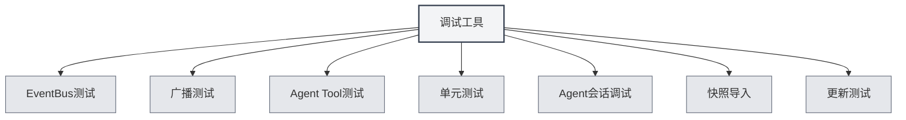

# Ferramentas de Depuração

## Visão Geral

As ferramentas de depuração são funcionalidades do ambiente de desenvolvimento fornecidas pelo MetaDoc, usadas para testar e depurar as funcionalidades do aplicativo. Essas ferramentas estão disponíveis apenas no ambiente de desenvolvimento, ajudando os desenvolvedores a testar e depurar o código rapidamente.

<SettingDebugSection mode="demo" />

## Introdução às Ferramentas de Depuração

<SettingDebugSection mode="demo" />

<ConsoleTerminal mode="demo" consoleKey="debug" :history='[]' />

### Acessando as Ferramentas de Depuração

As ferramentas de depuração estão disponíveis apenas no ambiente de desenvolvimento:

1.  **Ambiente de Desenvolvimento**: Certifique-se de estar executando no ambiente de desenvolvimento
2.  **Página de Configurações**: Abra a página de configurações
3.  **Ferramentas de Depuração**: Encontre a opção "Ferramentas de Depuração" na página de configurações
4.  **Abrir Ferramentas**: Clique para abrir a interface das ferramentas de depuração

Você pode acessar as ferramentas de depuração através da barra de menu superior (apenas no ambiente de desenvolvimento):

<MenuItemsDemo mode="demo" :items='[{"id": "settings"}]' />

### Tipos de Ferramentas

As ferramentas de depuração incluem os seguintes módulos de funcionalidade:

-   **Teste EventBus**: Testar eventos do EventBus
-   **Teste de Transmissão (Broadcast)**: Testar eventos de transmissão
-   **Teste de Ferramenta do Agente**: Testar ferramentas do Agente
-   **Testes Unitários**: Executar testes unitários
-   **Depuração de Sessão do Agente**: Depurar sessões do Agente
-   **Importação de Instantâneo (Snapshot)**: Importar instantâneos de documentos
-   **Teste de Atualização**: Testar a funcionalidade de atualização

<SettingDebugSection mode="demo" />

## Teste EventBus

### Enviar Evento

É possível enviar eventos do EventBus para teste:

1.  **Nome do Evento**: Insira o nome do evento a ser enviado
2.  **Dados do Evento**: Opcional, insira os dados do evento no formato JSON
3.  **Enviar Evento**: Clique no botão "Enviar Evento"
4.  **Ver Resultado**: Veja o resultado do envio do evento

<ConsoleTerminal mode="demo" consoleKey="debug" :history='[]' />

### Ouvir Eventos

É possível ouvir eventos do EventBus:

-   **Lista de Eventos**: Exibe todos os eventos enviados
-   **Detalhes do Evento**: Visualiza informações detalhadas do evento
-   **Dados do Evento**: Visualiza o conteúdo dos dados do evento

## Teste de Transmissão (Broadcast)

### Enviar Transmissão

É possível enviar eventos de transmissão para teste:

1.  **Janela de Destino**: Selecione o alvo da transmissão (all/home/ai-chat, etc.)
2.  **Nome do Evento**: Insira o nome do evento a ser transmitido
3.  **Dados do Evento**: Opcional, insira os dados do evento no formato JSON
4.  **Enviar Transmissão**: Clique no botão "Enviar Transmissão"
5.  **Ver Resultado**: Veja o resultado do envio da transmissão

<ConsoleTerminal mode="demo" consoleKey="debug" :history='[]' />

### Ouvir Transmissões

É possível ouvir eventos de transmissão:

-   **Lista de Transmissões**: Exibe todas as transmissões enviadas
-   **Detalhes da Transmissão**: Visualiza informações detalhadas da transmissão
-   **Janela de Destino**: Visualiza a janela de destino da transmissão

## Teste de Ferramenta do Agente

### Testar Ferramenta

É possível testar ferramentas do Agente:

1.  **Selecionar Ferramenta**: Selecione a ferramenta do Agente a ser testada
2.  **Inserir Parâmetros**: Insira os parâmetros de teste da ferramenta (formato JSON)
3.  **Selecionar Contexto**: Selecione o ID da Tab de contexto para o teste
4.  **Executar Teste**: Clique no botão "Executar Teste"
5.  **Ver Resultado**: Veja o resultado do teste

### Histórico de Testes

É possível visualizar o histórico de testes:

-   **Lista de Histórico**: Exibe todo o histórico de testes
-   **Resultado do Teste**: Visualiza o resultado de cada teste
-   **Informações de Erro**: Visualiza as mensagens de erro dos testes

## Testes Unitários

### Teste Individual

É possível executar um teste unitário individual:

1.  **Selecionar Módulo**: Selecione o módulo a ser testado
2.  **Selecionar Teste**: Selecione a função de teste a ser executada
3.  **Editar Parâmetros**: Edite os parâmetros da função de teste
4.  **Executar Teste**: Clique no botão "Executar Teste"
5.  **Ver Resultado**: Veja o resultado do teste

<ConsoleTerminal mode="demo" consoleKey="debug" :history='[]' />

### Teste em Lote

É possível executar testes unitários em lote:

1.  **Selecionar Módulo**: Selecione um ou mais módulos
2.  **Selecionar Contexto**: Selecione o ID da Tab de contexto para o teste
3.  **Iniciar Teste**: Clique no botão "Iniciar Teste em Lote"
4.  **Ver Progresso**: Acompanhe o progresso do teste
5.  **Ver Resultado**: Veja todos os resultados dos testes

### Resultados do Teste

Os resultados do teste incluem:

-   **Status do Teste**: Indica se o teste foi aprovado ou não
-   **Saída do Teste**: Exibe as informações de saída do teste
-   **Informações de Erro**: Exibe as mensagens de erro do teste (se houver)
-   **Tempo de Execução**: Exibe o tempo de execução do teste

## Depuração de Sessão do Agente

### Depurar Sessão

É possível depurar sessões do Agente:

1.  **Selecionar Sessão**: Selecione a sessão do Agente a ser depurada
2.  **Ver Mensagens**: Visualize o histórico de mensagens da sessão
3.  **Enviar Mensagem**: Envie uma mensagem de teste
4.  **Ver Resposta**: Veja a resposta do Agente

<ConsoleTerminal mode="demo" consoleKey="debug" :history='[]' />

### Informações de Depuração

É possível visualizar informações de depuração:

-   **Status da Sessão**: Exibe o estado atual da sessão
-   **Chamadas de Ferramenta**: Visualiza o histórico de chamadas de ferramentas
-   **Informações de Erro**: Visualiza mensagens de erro

## Importação de Instantâneo (Snapshot)

### Importar Instantâneo

É possível importar instantâneos de documentos:

1.  **Selecionar Instantâneo**: Selecione o arquivo de instantâneo a ser importado
2.  **Importar Instantâneo**: Clique no botão "Importar Instantâneo"
3.  **Ver Resultado**: Veja o resultado da importação

<ConsoleTerminal mode="demo" consoleKey="debug" :history='[]' />

### Formato do Instantâneo

Formato do arquivo de instantâneo:

-   **Formato JSON**: O arquivo de instantâneo está no formato JSON
-   **Conteúdo do Documento**: Contém o conteúdo completo do documento
-   **Estado do Documento**: Contém informações sobre o estado do documento

## Teste de Atualização

### Testar Atualização

É possível testar a funcionalidade de atualização:

1.  **Selecionar Canal de Atualização**: Selecione o canal de atualização (release/dev)
2.  **Verificar Atualizações**: Clique no botão "Verificar Atualizações"
3.  **Ver Resultado**: Veja o resultado da verificação de atualizações

<SettingDebugSection mode="demo" />

## Melhores Práticas

1.  **Ambiente de Desenvolvimento**: Use as ferramentas de depuração apenas no ambiente de desenvolvimento
2.  **Isolamento de Testes**: Use dados de teste independentes durante os testes
3.  **Tratamento de Erros**: Preste atenção ao tratamento de erros durante os testes
4.  **Registro de Resultados**: Registre os resultados de testes importantes
5.  **Uso das Ferramentas**: Use as ferramentas de depuração de forma adequada para aumentar a eficiência do desenvolvimento

## Observações Importantes

1.  **Ambiente de Desenvolvimento**: As ferramentas de depuração estão disponíveis apenas no ambiente de desenvolvimento
2.  **Segurança dos Dados**: Durante os testes, preste atenção à segurança dos dados para evitar impactos nos dados de produção
3.  **Impacto no Desempenho**: Alguns testes podem afetar o desempenho do aplicativo
4.  **Tratamento de Erros**: Erros durante os testes precisam ser tratados corretamente
5.  **Limitações das Ferramentas**: Algumas ferramentas podem ter limitações de uso

## Documentação Relacionada

-   [[agent.session|Gerenciamento de Sessões do Agente]]
-   [[agent.tools|Gerenciamento do Conjunto de Ferramentas]]
-   [[settings.basic|Configurações Básicas]]
